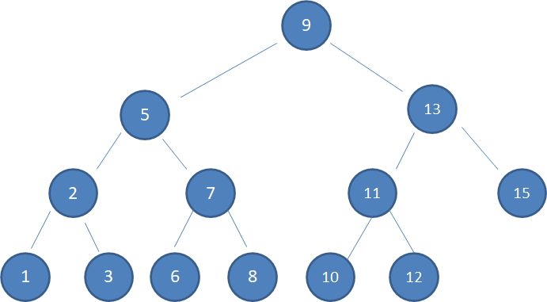
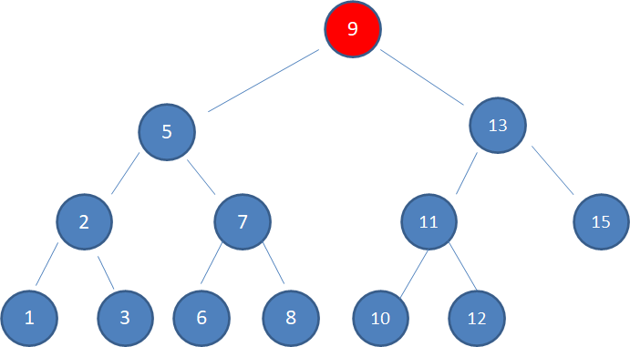
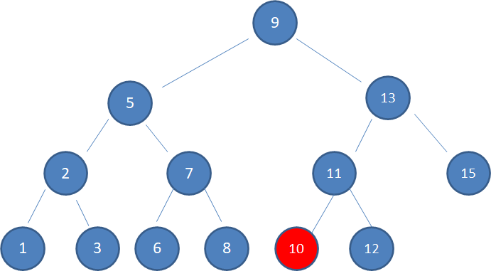
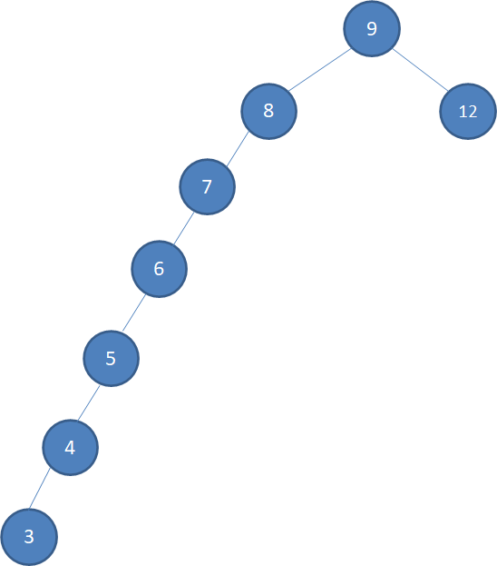

## 二叉查找树(BST:binary search tree)

特点

a. 左子树上所有结点的值均**小于或等于**它的根结点的值

b. 右子树上所有结点的值均**大于或等于**它的根结点的值

c. 左、右子树也分别称为二叉排序树

### 优点
运用二分查找思想，查找所需最大次数等于二叉查找树的高度

* 查找值为9的结点：
    * 查看根结点：值为9，返回

* 查找值为10的结点
    * 查看根结点：值为9，10 > 9，查找右子树
    * 查看右子树结点：值为13，10 < 13，查找左子树
    * 查看左子树结点：值为11，10 < 11，查找左子树
    * 查看左子树结点：值为10，返回

      
### 缺陷

当新插入结点始终处在一侧子树(左/右)时，查找性能极差，几乎变成了线性查找

