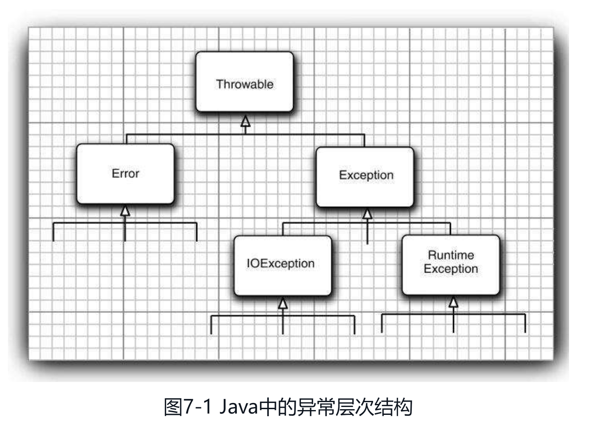
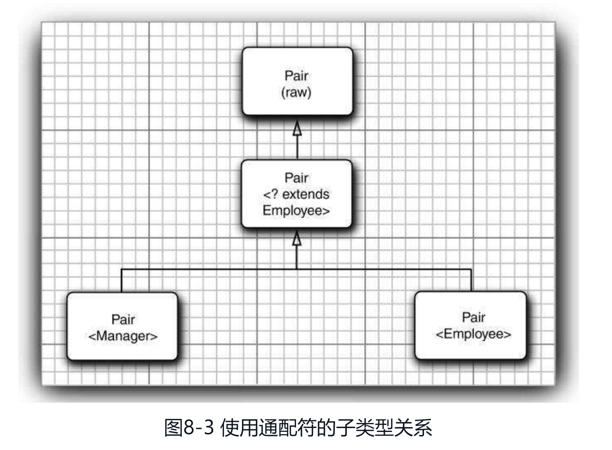
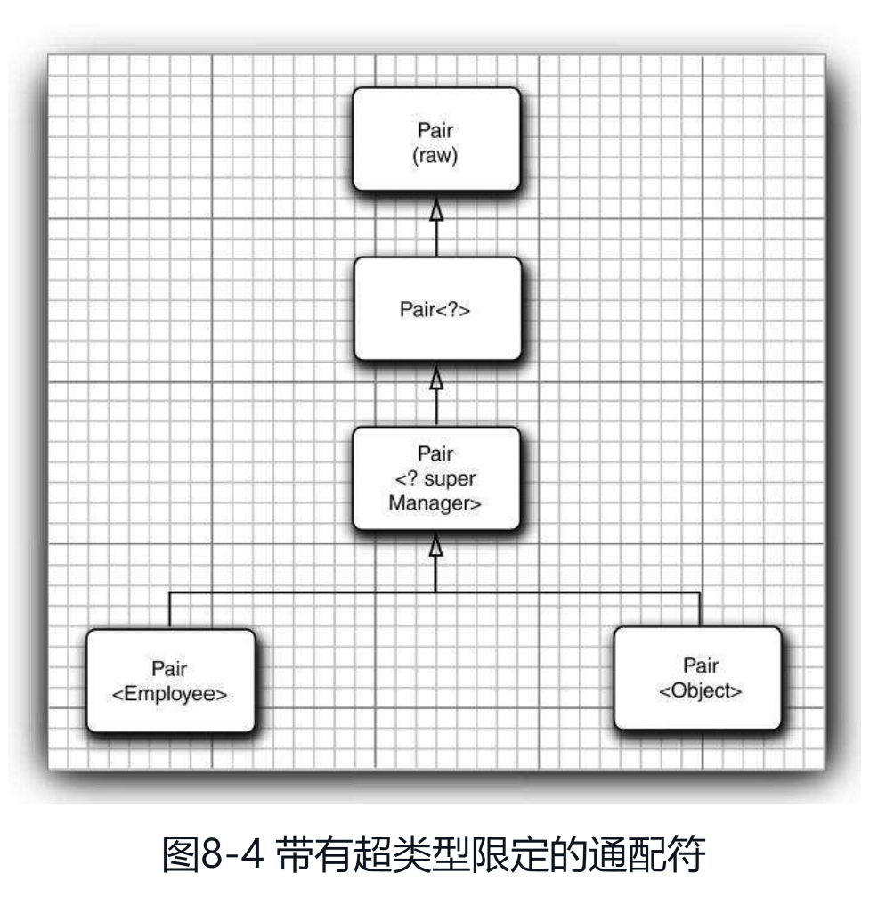
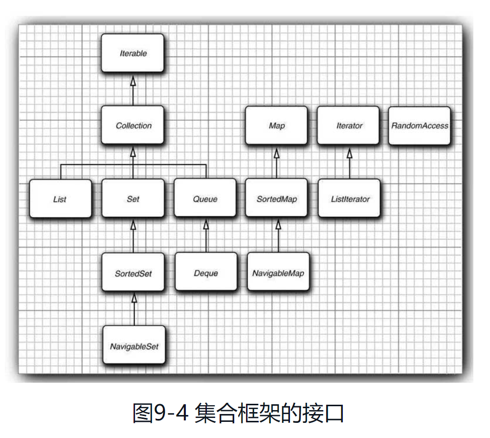
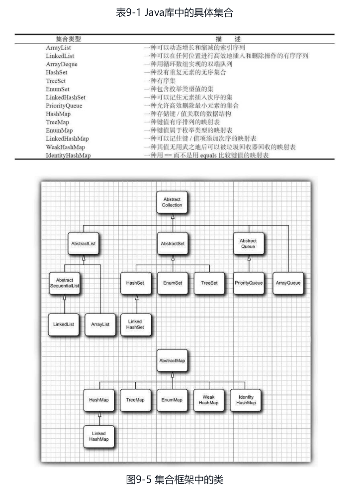
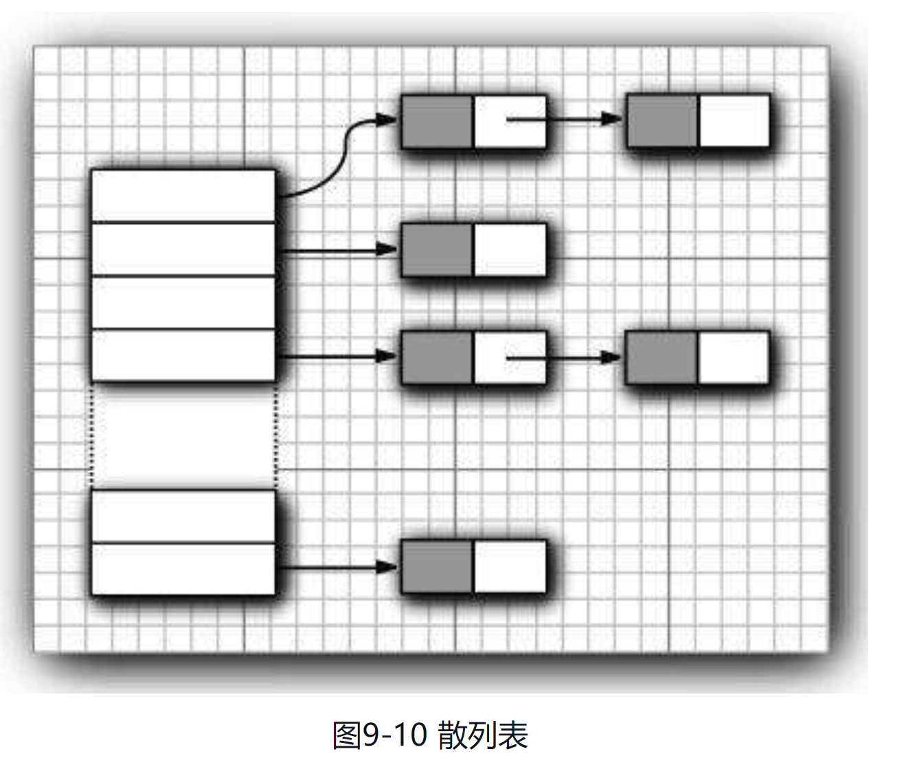

### 基本类型(值类型)：

8种基本类型：4种整形，2种浮点型，1种字符类型char，1种布尔类型

*1. 整形*

* byte：1字节
* short：2字节
* int：4字节
* long：8字节

*2. 浮点型*

* float：4字节
* double：8字节

*3. 字符类型*

* char：2字节（16bit）

*4. 布尔类型：通常只用1位(1bit)即可表示，具体看实现*

* JVM中：boolean类型被编译为int类型，占4个字节
* Oracle JVM中：编码为byte数组(8bit)，占1个字节
* 非Oracle JVM中：不确定

### 浮点数

使用严格的浮点计算，浮点运算更加精确，不同的硬件平台执行结果一致。
未指定严格的浮点计算，计算结果与编译器以及运行环境相关。

* 可将类、接口及方法声明为strictfp类型

```java
// 接口声明为strictfp类型
strictfp interface StrictFPInterface {
}

// 类及类中方法声明为strictfp类型
public strictfp class Test() {
    public static strictfp void main(String[] args) {
        System.out.println("use strict float computable standard to evaluate");
    }
}
```
* 不可将接口中的方法以及构造函数声明为strictfp类型

```java
    interface A {
        // 错误使用：将接口中的方法声明为strictfp类型
        strictfp void f();
    }

    public class FpDemo2 {
        // 错误使用：将构造函数声明为strictfp类型
        strictfp FpDemo2() {
        }
    }
```

### 引用类型(复合数据类型)

* 类类型
* 数组
* 接口类型

### 访问级别修饰符：Access Level Modifiers

1. 在顶级
    * public

      类用public修饰，类对所有类均可见
    * package-private(no-modifiers)

      如果类没有修饰符(默认)，也称package-private，它只在自己的包中可见
2. 在成员级别(按行看容易理解:成员为public等修饰符时的访问权限)

    * public
      
      成员用public修饰，类对所有类均可见
    * protected

      对包和所有子类可见，即protected=no-modifiers+subclass
    * 默认(无修饰符，即package-private)

      它只在自己的包中可见
    * private
       
      仅对本类可见(子类也不能访问超类的私有域/方法)
    
        
        * 第一列：指示类本身是否有权访问由访问控制级别定义的成员。
        * 第二列：指示与该类相同的包(不管其父级)中的类是否具有对成员的访问权限
        * 第三列：指示在此包外部声明的该类的子类是否有权访问成员。
        * 第四列：指示是否所有类都具有对成员的访问权限。

    * 下表显示Alpha类的成员(成员变量，成员函数)对于应用于它们的每个访问修饰符的可见性
    
    
        * 当Alpha类成员为public时，Alpha、Beta、Alphasub、Gamma均可访问该成员
        * 当Alpha类成员为protected时，Alpha、Beta、Alphasub均可访问该成员
        * 当Alpha类成员为默认时，Alpha、Beta均可访问该成员
        * 当Alpha类成员为private时，Alpha可访问该成员

### 基础概念

* 隐式参数（implicit）：出现在方法名前的类对象，亦即方法调用的目标或者接收者
* 静态域（所有对象共有）：private static int nextId;
* 域常量（只能初始化一次）：private final int id;
* 静态常量：public static final double PI = 3.14;
* 静态方法：一种不能向对象实施操作的方法，也就是说没有隐藏参数(this参数)。如：Math.pow(x, a)
    * 静态方法不能访问实例域， 但是可以访问静态域。
* 静态方法适用：
    * 一个方法不需要访问对象状态，其所需参数都是通过显示参数提供（如Math.pow）
    * 一个方法只需要访问类的静态域
* 方法参数：
    * 一个方法不能修改一个基本数据类型的参数（即数值型或布尔型）
    * 一个方法可以改变一个对象参数的状态

### 空字符串check

1. 空串1

```java
public class Test() {
    public boolean strCompare(String str) {
        if (str.length() == 0) {
            return true;
        }
    }
}
```

2. 空串2

```java
public class Test() {
    public boolean strCompare(String str) {
        if ("".equals(str)) {
            return true;
        }
    }
}
```

3. 字符串null

```java
   public class Test() {
    public boolean strCompare(String str) {
        if (str == null) {
            return true;
        }
    }
}
```

4. 字符串既不是null也不是空串(null字符串上调用length会出错)

```java
 public class Test() {
    public boolean strCompare(String str) {
        if (str != null && str.length() != 0) {
            return true;
        }
    }
}
```

5. 使用StringUtils工具类

```java
import org.apache.commons.lang3;

public class Test() {
    public boolean strCompare(String str) {
        if (StringUtils.isNotBlank(str)) {
            return true;
        }
    }
}
```

#### 浅拷贝深拷贝

 * 浅拷贝
    * 在堆内存空间中开辟一块新地址来存储克隆/拷贝后的对象
    * 值类型(基本类型)成员变量：属性复制给克隆对象 --> 即修改拷贝不影响原对象
    * 引用类型(类、数组、接口)和String类型成员变量：引用地址复制给克隆对象 --> 即拷贝和原对象共享引用对象的地址，修改一个影响全部
      * 修改引用对象属性值会影响全部(因为引用指向相同)
      * 修改引用对象指向(如person[0] = new Person("test"))只影响修改对象(因为引用指向发生变化)
 * 深拷贝
    * 在堆内存空间中开辟一块新地址来存储克隆/拷贝后的对象
    * 值类型和引用类型及String类型：均复制给克隆对象  --> 修改拷贝不影响原对象
    
### 时间单位

* 秒second(s)
    * 1秒 = 100分秒
* 分秒(ds)
* 毫秒millisecond(ms)
    * 1秒 = 1000毫秒
* 微秒microsecond(μs)
    * 1秒 = 1000,000毫秒
    * 1毫秒 = 1000微秒
* 纳秒nanosecond(ns)
    * 1秒 = 1000,000,000纳秒
    * 1微秒 = 1000纳秒

### 辅助字符单元

遍历辅助字符单元

```java
int cp = sentence.codePointAt(i);
if (Character.isSupplementaryCodePoint(cp)) {
    i += 2;
} else {
    i++;
}
```

系统时间

```java
System.out.printf("%1$s %2$tB %2$td, %2$tY\n", "current date: ", new Date());
System.out.printf("%s %tB %<te, %<tY\n", "current date: ", new Date());
```

~~匿名数组~~静态初始化简写形式
```java
new int[] {1, 2, 3}
```

对象变量：

* 一个对象变量并没有包含一个对象，而仅仅引用一个对象(如超类对象变量)

* 任何对象变量的值都是对存储在另外一个地方对多对象的引用

**static变量**

* 属于类不属于对象，且类的所有实例共享该变量

**静态常量**

* static final

* 调用：类.静态常量

**静态常量:**

＊ final

＊ 每一个类对象都有一份该常量的拷贝

**静态方法**

* 属于类且不属于对象

* 不能在静态方法中访问实例域，但可访问自身类中的静态域

* 调用：

1. 类名.方法

2. 对象.方法(容易混淆)

    ```java
    Class Employee() {
        // static variable 
        private static int nextID = 1; private int ID;

        // set ID
        public void setID() {
            id = nextID;
            nextID++;
        }

        // get ID
        public static int getNextID() ｛
            return nextID;
        ｝

    }

   Employee harry = new Employee();
   
    // 访问静态变量 
    harry.setID();
    harry.ID = Employee.nextID; 
    Employee.nextID++;

    // 访问静态方法
    int n = Employee.getNextID();
    int n = harry.getNextID();
    ```

**使用范围**

* 方法不需要访问对象状态，所需参数可通过显式参数提供: Math.pow(a,b);

* 方法只需要访问类的静态域: Employee.getNextID();

**多态**

一个变量可以指示多种类型的现象(多用于继承后的子类方法)

**动态绑定**

在运行时能够自动地选择调用哪个方法的现象

**静态绑定**

如果是private方法，static方法，final方法或者构造器，编译器可以准确确定应该调用哪个方法，称静态绑定

与此对应的是,调用的方法依赖于隐式参数的实际类型，并且在运行时实现动态绑定

**内联**

    如果一个方法没有被覆盖且很短，边一起可以对其进行优化处理，这个过程称为内联

**散列码**

    由对象导出的一个整形数值

* (字符串)String类型的散列码由字符串内容导出
* StringBuilder(StringBuffer)类没有自定义的hashCode方法，其散列码由Object类的默认hashCode方法导出对象的存储地址

**关键字super**

* 当前对象父类的引用

* 调用父类的构造器

* 调用父类的方法

**关键字this**

* 当前对象的引用，指示隐式参数，也就是被构造的对象

        public Employee(String s, double n) {
            this.salary = n
            ...
        }

* 调用本类的另一个构造器

        public Employee(double n) {
            this("#Employee: " + nextID, n);
            nextID++;
            ...
        }

* 调用本类及父类的方法

**检测对象相等**

	public Employee(Object otherObject) {
		...
	}

1. 检测objects是否相等

   if (this == otherObject)

2. 检测显式参数是否为null

   if (otherObject == null) return false;

3. 检测class是否相等

    * 比较this于otherObject是否属于同一个类。如果equals的语义在每个子类中有所改变，用getClass检测
    
        ```java
        if (getClass != otherObject.getClass()) 
            return false;
        ```
    
    * 如果所有子类拥有统一的语义，使用instanceof检测
    
        ```java
        if (!(otherObject instanceof Employee)) 
            return false;
        ```

4. type conversion

   Employee other = (Employee)otherObject;

5. 检测域是否相等

    * 使用==比较基本类型，使用equals比较对象

    * == 比较引用类型时，比较的是地址，当且仅当两个应用变量对象指向同一个对象时才返回true

        ```java
        /**
         * 超类为Object的类对象用超类的equals
         * 基本类型直接用==
         * name.equals(other.name); <- 如果name为null则报空指针异常
         */
        return Objects.equals(name, other.name)
                && (salary == other.salary)
                && (Objects.equals(hireDay, other.hireDay)); 
        ```

6. 如果子类中重新定义equals，要在其中包含调用super.equals(other)

**子类定义equals方法**

* 先比较超类是否相等

* 类型转换

* 比较子类域是否相等

    ```java
    class Manger extends Employee {
        @Override
        public boolean equals(Object otherObject) {
            if (!super.equals(otherObject)) {
                return false;
            }
            // type conversion
            Manger other = (Manger)otherObject; 
            return bonus == other.bonus; 
        }
    }
    ```

* 只要对象与一个字符串操作符“＋”连接起来，Java编译就会自动地调用toString方法， 以获取这个对象的字符串描述

    ```java
    Point p = new Point(10,20);
    // automatically invokes p.toString()
    String message = "The current position is " + p;
    ```

* Object类定义的toString方法，用于发音输出对象所述的类名和散列码

    ```java
    // PrintStream，String类的设计者没有覆盖toString方法，调用的是Object类方法 
    // 数组继承了object类的toString方法，将按照旧格式打印
    // java.io.PrintStream@2f684
    System.out.println(System.out);  
    int[] arr = {1, 2, 4, 6};
    // I: integer
    String s = "" + arr; →[I@1a345e0]
    // 静态方法Arrays.toString
    // [1, 2, 4, 6]
    String s = Arrays.toString(arr); 
    ```

**Class类方法**

* 获取类提供的pubic域、方法和构造器（包括超类的公有成员）

        getFields
        getMethods
        getConstructors

* 获取类中声明的全部域、方法和构造器（包括私有和受保护成员，不包括超类成员）

        getDeclaredFields
        getDeclaredMethods
        getDeclaredConstructors

**泛型**

类型参数化

**接口**

描述类具有什么功能，而并不给出每个功能的具体实现。 Java语言是一种强类型（strongly typed）语言，在调用方法时编译器会检查这个方法是否存在。
比如sort方法中，编译器必须确认对象拥有/实现compareTo方法（因为sort可能调用该方法进行对象比较）。 并且每个类只能扩展于一个类（即超类只能有一个），使用接口可以提高类的扩展性

*特点*

* 接口方法自动属于public，声明接口方法时不用提供public关键字
* 接口没有实例和静态方法，即不能包含实例域，接口中的方法不能引用实例域(JDK8中允许静态方法)
* 接口中可以定义常量（该常量为public static final类型）
* 可看成没有实例域的抽象类
* 不能构造接口对象（即实例化接口），可以声明接口变量，且该变量必须引用实现了该接口的类对象。抽象类同理
* JDK8新特征
    * 允许定义静态static方法和默认default方法
      ```java
        public interface JDK8Interface {
      
            // static修饰符定义静态方法
            static void static Method() {
                System.out.println("接口中的静态方法");
            }

            // default修饰符定义默认方法
            default void default Method() { 
                System.out.println("接口中的默认方法"); 
            }
      }
      ```

*回调callback*
可以指出某个特定事件发生时应该采取的动作。

*闭包closure*
lambda表达式就是闭包

*lambda表达式适用场景*

* 在一个单独的线程中运行代码
* 多次运行代码
* 在算法的适当位置运行代码（例如，排序中的比较操作）
* 发生某种情况时执行代码（如，点击了一个按钮，数据到达，等等）
* 只在必要时才运行代码
  
  

**TODO：包装器类**

**异常**

*异常层次结构*


### JAVA三种处理系统错误的机制

1. 抛出异常
2. 使用断言
3. 日志

异常分类

* Error(Java内部错误)：系统内部错误和资源耗尽等，应用程序不应该抛出这类异常（底层系统抛出）。
* Exception：Error以外
    * RuntimeException：由程序错误导致的异常
        * 错误的类型转换
        * 数组访问越界
        * 访问null指针
    * 其他异常(IOException)：像由于I/O错误这类问题导致的异常
        * 读取文件尾部后面读取数据
        * 打开一个不存在的文件
        * 根据字符串查找不存在的Class对象
* 非受查异常（unchecked）：派生于Error类和RuntimeException的异常
* 受查异常（checked）：其他异常

抛出异常情况（不必将所有可能抛出的异常进行声明）

1. 调用一个抛出受查异常的方法，如FileInputStream构造器
2. 程序运行过程中发现错误并用throw语句抛出一个受查异常
3. 程序出现错误，如a[-1]将抛出一个ArrayIndexOutOfBoundsException非受查异常
4. Java虚拟机和运行时库出现的内部错误

* 不需要声明Java内部错误即Error继承的错误

* 不应该声明从RuntimeException继承的非受查异常（3和4）

* 即方法必须声明所有可能抛出的受查异常(通常编译器会检查是否提供了处理器)，非受查异常要么不可控制（Error），要么应该避免发生（RuntimeException）

如果系统不允许抛出的的受查异常，可以通过TODO：包装技术将其包装成运行时异常（非受查异常） 可通过xx.getCause()获取原始受查异常细节

带资源的try语句：

### 泛型

类型变量关键字

* E:表示集合的元素类型
* K、V:分别表示表(hashmap)的关键字与值的类型
* T、U、S:表示任意类型

### 省略参数

定义：形参类型(可为范类型)与参数名之间加上三个连续的"."

特点：

* 只有最后一个形参才能被定义成“能和不确定个实参相匹配”，即如果这个方法还有其它的形参，要把它们放到前面的位置上
* 一个方法里只能有一个这样的形参
* 不能在同一个类中定义一个和转化后的方法签名一致的方法
* 编译器看来，实参个数可变的方法是最后带了一个数组形参方法的特例

```java
private static int sumUp(int...values){
}
// 转化后的方法
private static int sumUp(int[]values){
}
```





### 集合框架接口


### 集合框架中的类

### 散列表




### JarOptions


81 042-311-7000

### 未捕获异常处理器

#### 线程异常捕获流程：

>+ 线程run方法不能抛出受查异常
>- 非受查异常（error和RunTimeException）导致线程终止->线程死亡
>* 不需要catch子句处理可以被传播的异常，即线程死亡前异常被传递到一个用于未捕获异常的处理器

#### 未捕获异常处理器特点：

>* 必须属于一个实现Thread.UncaughtExceptionHandler接口的类，即复写该类uncaughtException方法
>* Thread.setDefaultUncaughtExceptionHandler：为所有线程安装默认处理器
> > * 如果不调用(setDefaultUncaughtExceptionHandler)即不安装默认处理器，默认处理器为空
>* Thread对象.setUncaughtExceptionHandler：为线程安装处理器
> > * 不为线程独立安装处理器，
> > > * 有父线程组：调用父线程组的uncaughtException
> > > * 没有父线程组：
> > > > * 有默认处理器：调用默认处理器（非空）
> > > > * 没有默认处理器：输出轨迹到标准错误流
> > > > > * 异常为ThreadDeath对象(由stop产生，stop已过时)：由于轨迹栈被禁用，什么也不做
> > > > > * 异常上述以外：线程名字即Throwable的轨迹栈被输出到标准错误流即System.err上

#### 线程组(不推荐使用)

> 统一管理线程的集合

> 实现了Thread.UncaughtExceptionHandler接口

> 默认情况：创建的所有线程属于相同的线程组，也能建立其他的组

#### 多线程安全读取域：即保证原子性操作

* 使用锁
* 使用volatile修饰符
* 使用final修饰符
* java.util.concurrent.atomic保证操作的原子性

    ```java
    // 自增
    public static AtomicLong nextNumber = new AtomicLong();
    // in some thread
    // 获得值、增1并设置、生成新值的操作不会中断
    long in = nextNumber.incrementAndGet();
  
    // 更复杂的更新compareAndSet
    public static AtomicLong largest = new AtomicLong();
    do {
        oldValue = largest.get();
        newValue = Math.max(oldValue, newValue);
    // 另外线程也在更新largest时，本线程更新被阻止
    // -> 1. compareAndSet返回false，即不会设置新值
    //    2. **循环会再次尝试**，读取(另外线程)更新后的值，并尝试修改（尽管如此也比锁快）
    } while (!largest.compareAndSet(oldValue, newValue));
  
    // JDK8后，可使用lambda表达式完成更新（也包含重试过程）
    largest.updateAndGet(x -> Math.max(x, oberved));
    largest.accumulateAndGet(oberved, Math::max);
  
    // 大量线程访问相同原子值，因乐观更新需多次重试，性能会大幅下降
    // JDK8可用LongAdder、LongAccumulator类解决
    // LongAdder包含多个变量（加数），其总和为当前值
    final LongAdder adder = new LongAdder();
    for (...) {
        pool.submit(
            () -> {
                while (...) {
                    ...
                    if (...) {
                        // 每个线程会自动提供新的加数
                        adder.increment();
                    }
                }
            }
        );
    }
    ...
    // 求和
    long total = adder.sum();
  
    // LongAccumulator实现相同效果
    LongAccumulator adder = new LongAccumulator(Long::sum, 0);
    // in some thread
    add.accumulate(value);
    ```
  
#### 构造者builder风格接口

#### Unsafe

用于执行低级别、不安全操作的方法，如直接访问系统内存资源、自主管理内存资源等
特点：使Java具备底层操作能力，提升运行效率

