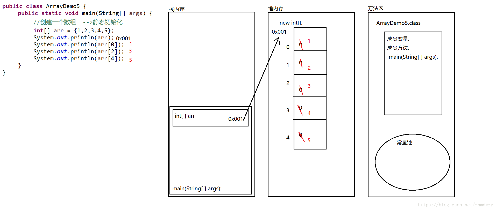

### JVM内存

#### 堆内存

* 特性：只保存new出来的对象实体
* 特点：
    * 每一个对象都有一个唯一的地址
    * 每一个对象的数据都有一个默认值(系统根据数据类型赋予不同值)
        * 基本数据类型
            * 整型(byte, short, int, long):0
            * 浮点型(float,double):0.0
            * 字符型(char):'\u0000'空字符
            * 布尔型:false
        * 引用类型(类，数组，接口，String):null
    * 数据使用完毕后不会被立即回收，在垃圾回收机制空闲时回收

#### 栈内存

* 特性：先进后出
* 特性：
    * 存放方法：调用时入栈，调用完毕后出栈(可看到程序的执行流程，即方法的执行和死亡)
    * 存放局部变量：使用完毕立即被垃圾回收机制回收
    
#### 方法区

* 保存字节码文件，也就是.class文件
* 常量池

  
  * 定义变量时，栈内存存放的是常量池中常量对应的地址

#### 本地方法区native method

* 存储java代码和windows系统交互的方法
* 本地方法
  * 一个java方法的实现由非java语言提供

#### 寄存器

* cpu相关

#### 数组动态初始化内存分布

#### 执行顺序
1. 代码载入内存，到方法区
2. 栈内存：执行到main方法，将main方法压栈，并分配一定空间
3. 堆内存：new int型数组时，堆内存分配空间并初始化该对象(默认值)
4. 栈内存：在main方法里分配一块空间(步骤2中分配的空间内分配)，用以存放数组名及new出来对象的堆内存地址

#### 数组静态初始化内存分布

