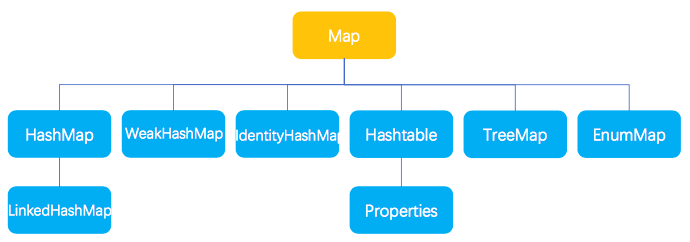

## 集合

数组、集合都是对多个数据进行存储操作的数据结构，简称Java容器

Java集合类型分为Collection和Map，它们是集合的根接口，这两个接口有包含一些子接口或实现类
    
    Collection集合保存数据多为了数据输出
    Map集合保存数据多为了Key的查找

### Collection

Collection基本结构


### Map

Map基本结构


### Java集合接口

接口名称|作用
---|---
Iterator接口|集合的输出接口，用于遍历Collection集合中的元素，Iterator对象称为迭代器。迭代器接口是集合Collection接口的父接口，实现类实现Collection接口时必须实现Iterator接口。
Collection接口|List、Set、Queue的父接口，单值数据操作的最大接口。单值指集合中的每个元素都是一个对象。
Queue接口|Java提供的队列实现，类似于List。
Dueue接口|Queue的子接口，双端队列。
List接口|~~有序~~重复集合。可精确控制每个元素的插入位置，用户可使用索引(类似数组下标)访问List中的元素。
Set接口|无重复元素。
Map接口|存放一对值的最大接口，以key-value形式保存。

### Java集合实现类

父接口|接口名称|作用
---|---|---
Set|HashSet|无序不重复，优化查询而设计的Set。底层使用HashMap实现。
Set|TreeSet|有序不重复，主要用于排序。
List|ArrayList|基于数组实现的List，快速随机访问，效率高且数组大小可变
List|LinkedList|基于链表实现的List，快速顺序访问，随机访问慢。方法：get/add/removeFirst/Last。
Queue|ArrayQueue|基于数组实现的双端队列，以"先进先出"方式操作集合元素
Map|HashMap|哈希算法存取键对象。
Map|TreeMap|可对键对象进行排序(Key排序)。

### List接口

List接口对Collection接口方法进行了以下扩充
```java
// 获取指定索引的数据
public E get(int index);
// 修改指定的索引数据
public E set(int index,E element);
// 返回listIterator接口
public ListIterator<E> listIterator;
```

### ArrayList和LinkedList区别

区别|ArrayList|LinkedList
---|---|---
实现|基于数组实现|基于链表实现
空间开辟|频繁进行空间开辟(数组扩容)|不需要
元素访问(按索引)|随机高效O(1)|顺序高效，随机O(n)
元素插入(按索引)|数组扩容&数组元素移动|相对高效
数据存储|小数据|大数据或频繁移动、删除元素时

### HashMap和HashTable区别

区别|HashMap|Hashtable
---|---|---
安全性|方法为异步操作，非线程安全|方法为同步操作，线程安全
数据|可为空(null)|不能为空(null)

### HashMap扩容

* 初始化容量(扩充)为16
* 当保存内容容量超过了域值(初始16)*0.75时，成倍(左移运算符1<<)地进行容量扩充

```java
static final int DEFAULT_INITIAL_CAPACITY = 1 << 4; // aka 16
```
