# IO基础

## 文件描述符

    Linux内核将所有外部设备都看做一个文件来操作，对文件的读写操作会调用内核提供的系统命令，返回一个文件描述符fd
    对一个socket的读写使用的描述符称为socket文件描述符(socket fd)
    fd是一个数字，指向内核中一个结构体(包含文件路径、数据区等属性)

## 套接字

```java
// 套接字socket=ip+端口，可理解为一个数据载体
data=socket.read()
```

## 用户空间和内核空间

## IO运行过程

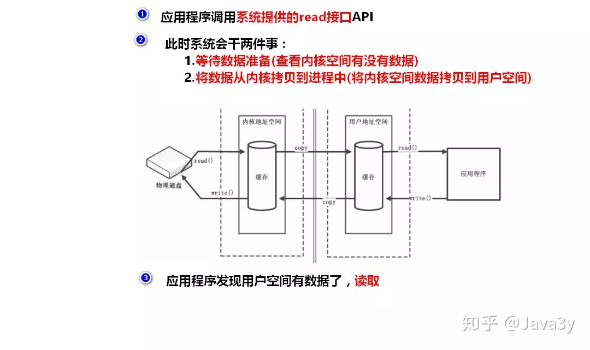

# 同步IO

## 阻塞IO(同步阻塞)

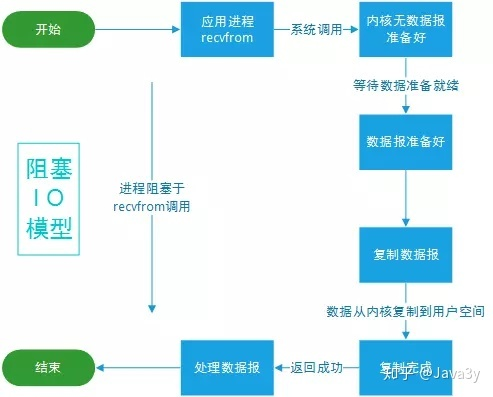

阻塞IO过程

1. 用户线程发起read操作
   
2. 如果内存数据未准备好，则用户线程被阻塞
   
3. 直到内存数据准备好并从内核缓冲区拷贝至用户空间后，read指令返回

## 非阻塞IO(同步非阻塞)

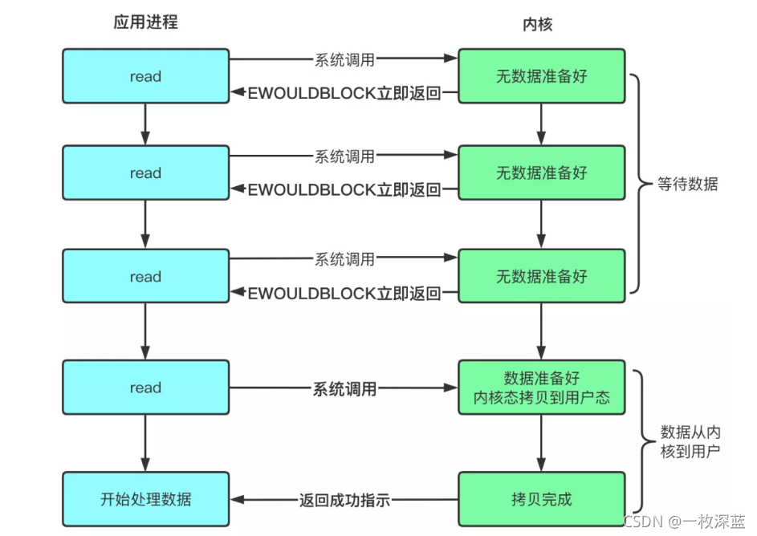

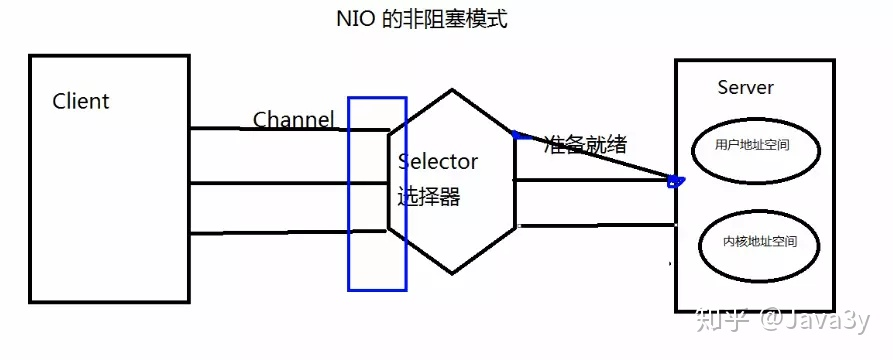

非阻塞IO过程

1. 用户线程发起read操作

2. 如果内存数据未准备好，内核返回EWOULDBLOCK错误，继续轮询polling内核数据状态(是否准备好)

3. 数据准备好，从内核缓冲区拷贝至用户空间后，read指令返回

※ 应用程序对内存轮询影响性能

※ NIO没有Selector选择器的时候是阻塞模式，即只使用Channel和Buffer

### NIO核心3组件

#### Buffer(缓冲区)

通过Channel管道运输着存储数据的Buffer缓冲区来实现数据处理

简单理解：

* Channel管道：运输，比作铁路

* Buffer缓冲区：数据，比作火车(运载着货物)

区别|传统IO流|新IO
---|---|---
数据传输方向|单向|双向(因为有Channel)

###### Buffer类核心变量

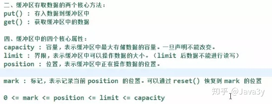

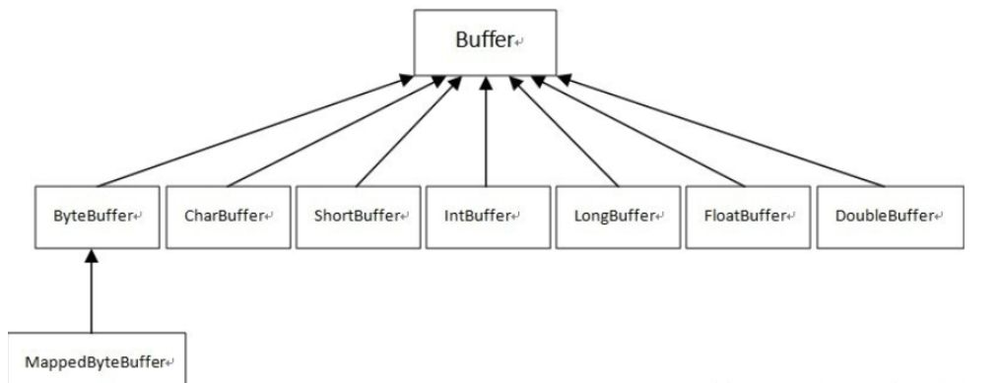

* 容量Capacity

    缓冲区能够容纳的数据元素的最大数量(底层数组，不能改变)

* 上界Limit

  (当前)缓冲区里的数据总数，limit为0时数据不能进行读写(即定义buffer后不能进行flip)

* 位置Position

    下一个要被读或写的元素的位置，由相应的get()和put()更新

    *  手动修改position方法
    
        1. rewind()将position置为0
        
        2. mark()可标记1个特定位置(之前write/read后的位置)，后续write/read后，通过reset()返回之前mark的位置 

* 标记Mark

    备忘位置，用于记录上一次读写的位置

##### flip()函数

又称"切换成读模式"，每当要从缓存区的时候读取数据时，就调用flip()"切换成读模式"

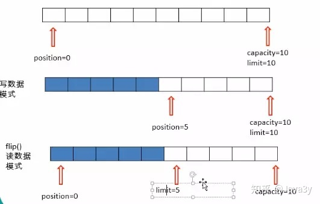

##### Buffer读写

1. 向Buffer写数据
   
    1. 从通道读数据到Buffer中

       while (inChannel.read(byteBuffer) > 0) {}
    
    2. 手动向Buffer写入字符
    
        charBuffer.putChar('C');
    
2. 从Buffer读数据
   
    1. 从Buffer中读取数据写入通道 
    
        outChannel.write(byteBuffer);
    
    2. 手动读取Buffer中字符
    
       byte b = charBuffer.get();

#### Channel(通道)

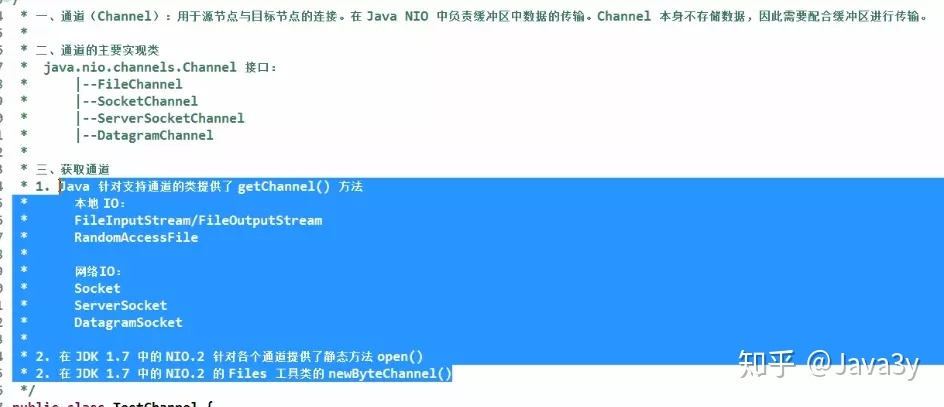

只负责数据传输，不负责数据操作

获取通道方式

* getChannel方法

    * 本地IO(FileChannel:阻塞式)
    
        * FileInputStream/FileOutputStream
    
        * RandomAccessFile
    
    * 网络IO
    
        * Socket
          
        * ServerSocket
          
        * DatagramSocket
    
* 静态方法open()

* Files工具类newByteChannel()方法 

#### 网络通道Channel

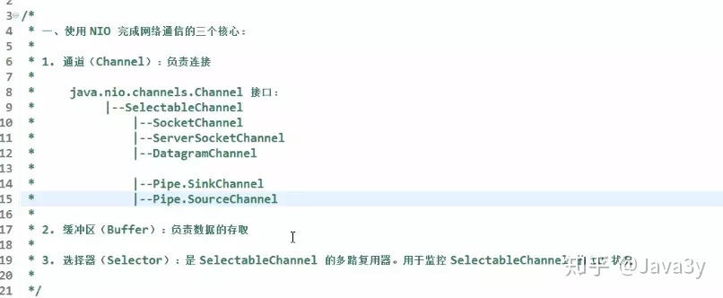

#### 管道

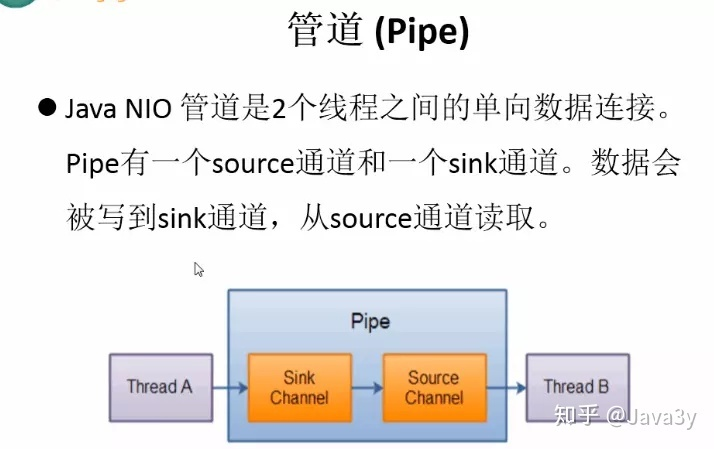

Java NIO管道是2个线程之间的单向数据连接

* sink通道

    数据写入sink通道

* source通道

    从source通道读取数据

#### Selector选择器

selector可用来在线程中关联多个通道，并进行时间监听

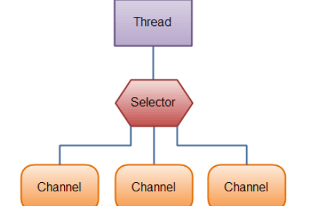

作用：

* 相比BIO，用更少线程管理各个通道

* 减少线程上下文切换的资源开销

##### selector支持注册通道类型

* 阻塞

    如Socket：channel.configureBlocking(false)

    FileChannel默认阻塞，无法注册

* 非阻塞

    如Socket:channel.configureBlocking(false)

##### selector监听事件

* Connect

    成功连接到1个服务器

* Accept

    准备好接收新进入的连接

* Read
  
    有数据可读
  
* Write

    接收到往里写的数据

##### selector维护的SelectionKey集合

* 已注册的所有键值的集合(Registered key set)

    所有与选择器关联的通道所生成的键的集合(有些可能失效)

* 已选择的键的集合(Selected key set)

    相关通道被选择器(前一个选择操作中)判断为已准备好的，且包含于键的interest集合中的操作

* 已取消的键的集合(Cancelled key set)

    包含cancel方法调用过的键(键无效化)，但还没被注销

##### selector监听事件流程

1. 选择器调用select()方法获取已就绪的通道(返回n个就绪通道)

2. 从selector中获取selectedKeys

3. 遍历selectedKeys

4. 查看各SelectionKey中是否有就绪事件

5. 获取就绪事件管道，做相应处理

※ 一般启动一个线程对应这个selector监听的处理

##### select()方法

    阻塞方法，调用时进入等待，直到把所有通道轮询完毕
    可通过以下方法提前结束：
      1. wakeup()，调用后select()立刻返回 
      2. close()，直接管理selector

    -> NIO非阻塞理解
      1. NIO非阻塞指的是IO不阻塞，即不会在read()处阻塞
      2. selector的select()方法查询通道的就绪状态，是阻塞的

### 直接缓冲区/非直接缓冲区

#### 非直接缓冲区

需要经历一个copy阶段(内核空间copy到用户空间)

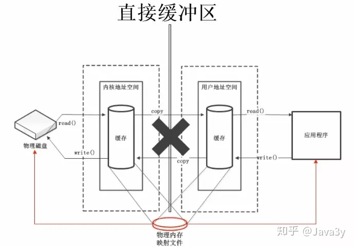

#### 直接缓冲区

不需要经过copy阶段，可理解成内存映射文件(零拷贝)

零拷贝：不需要将数据从一个存储区域复制到另一个存储区域

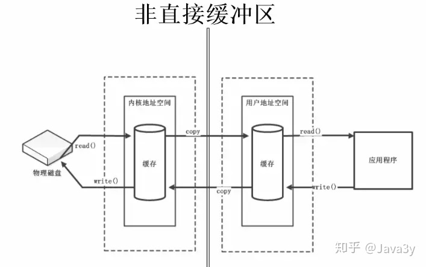

#### 直接缓冲区创建

* 缓冲区创建的时候分配的直接缓冲区(allocateDirect()方法)

* FileChannel上调用map()方法，将文件直接映射到内存中创建

* FileChannel的transferTo()/transferFrom()方法，直接缓存操作

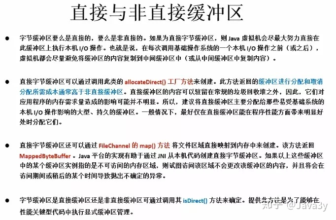

### scatter/gather和字符集

#### 分散读取scatter

将一个通道中的数据分散读取到多个缓冲区中

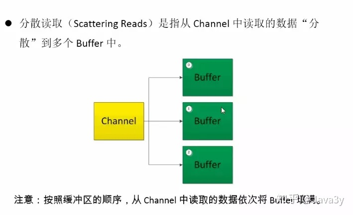

#### 聚集写入gather

将多个缓冲区的数据集中写入到一个通道中

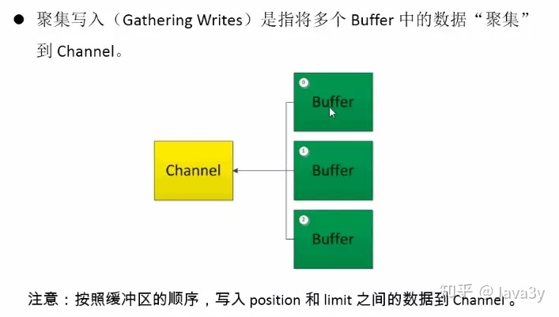

## 多路复用IO(同步非阻塞的一种)

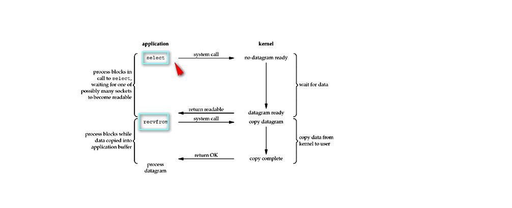


### 特点

    一个进程能同时等待多个文件描述符，这些文件描述符中的任意一个
    进入就绪状态，select()函数就可以返回
    select/epoll优势在于能处理更多连接

### 多路复用IO过程

1. 当用户进程调用select，那么整个进程会被block

2. kernel会"监视"所有select负责的socket
   
3. 当任何一个socket中的数据准备好了，select就会返回
   
4. 这个时候用户进程再调用read操作，将数据从kernel拷贝到用户进程(空间)

### NIO实现(通常指网络IO)

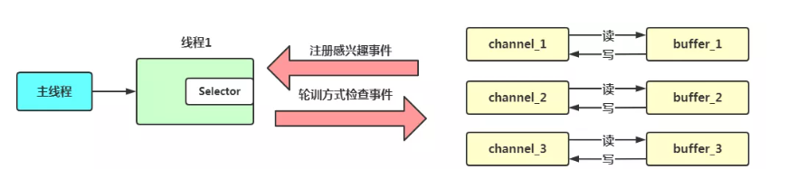

* 远程连接对应一个通道channel

* (文件/网络)数据读写通过buffer，且读写非阻塞

* selector：通道管理器

* 数据读写：buffer->channel

过程

1. 创建通道channel并注册到selector中

2. 注册事件到通道

    1. 客户端连接服务端事件

    2. 服务端接收客户端连接事件

    3. 读/写事件

3. selector轮询方式调用select/poll/epoll/pselect中的一个函数

    1. 有通道事件：返回，新建IO线程处理

    2. 无通道事件：阻塞继续轮询

# 异步IO(AIO) 

异步非阻塞
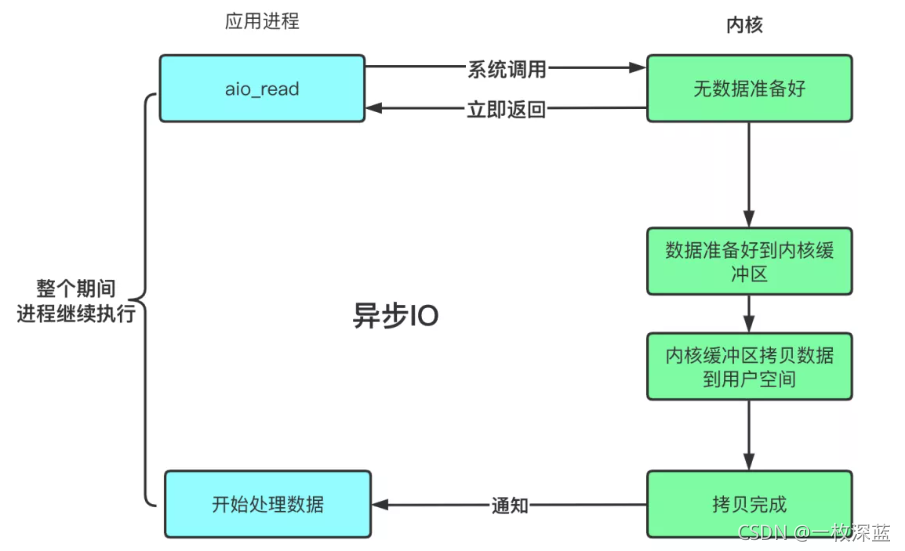

## 异步IO模型

1. 用户线程发起read操作，立即返回

2. 内核完成数据读取及拷贝
   
   数据准备完成后，内核将数据从内核缓冲区拷贝到用户空间

3. 通知用户(发送信号给用户线程)，用户对数据进行处理

# BIO/NIO/AIO区别

## 同步阻塞

一个线程维护一个连接，该线程从读请求到数据处理全部过程，线程被阻塞

## 同步非阻塞

非阻塞(期间)：用户线程发出的读请求不会阻塞当前用户线程(用户线程还是会去判断数据是否准备完毕)

阻塞期间：内核数据从内核缓冲区复制到用户空间时阻塞当前用户线程

## 区别

区别|BIO|NIO|AIO
---|---|---|---
读取方式|面向流(Stream Oriented)|面向缓冲区(Buffered Oriented)|面向缓冲区(Buffered Oriented)
读取主体※1|用户线程|用户线程|内核线程
阻塞有无|阻塞※2|阻塞+非阻塞※3|非阻塞
-|无|选择器(Selector)|-

※1 指从内核缓冲区读取到用户空间(外部文件读取到内核缓冲区由内核线程完成)   

※2 连接全程等待

※3 NIO称为no-blocking IO通常在网络中使用，在网络层次中理解是非阻塞的，对于FileChannel而言同样是阻塞的

### BIO

客户端Socket连接请求:服务端线程=1:1

未分配到处理线程的连接被阻塞或者拒绝，即一个连接一个线程

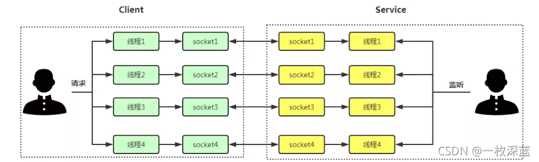

特点：

1. 一个独立线程维护一个socket连接，连接数量增多，虚拟机造成一定压力

2. 使用流读取数据(流是阻塞的)，当没有读/写数据时线程等待造成资源浪费

### NIO

服务器端保存一个Socket连接列表，对这个列表进行轮询

* Socket端口有数据可读：调用该socket连接的相应读操作
   
* Socket端口有数据可写：调用该socket连接的相应写操作
   
* Socket端口连接中断：关闭该端口

-> 进行IO操作(读/写)请求时，一个请求一个线程处理

### AIO

AIO是异步非阻塞IO，进程读取数据时只负责发送跟接收指令，数据的准备工作由操作系统完成

## 例子讲解

海底捞很好吃，但是经常要排队

* BIO
  
  A顾客去吃海底捞，就这样干坐着等了一小时，然后才开始吃火锅

* NIO
  
  B顾客去吃海底捞，他一看要等挺久，于是去逛商场，每次逛一会就跑回来看有没有排到他。于是他最后既购了物，又吃上海底捞了

* 多路复用IO

  C顾客去吃海底捞，他一看要等挺久，于是去逛商场，时不时注意听商场广播，等到广播复述C可以就餐了，然后回去吃火锅
  广播不是为C顾客一个人服务

* AIO

   D顾客去吃海底捞，由于他是高级会员，所以店长说，你去商场随便玩吧，等下有位置，我立马打电话给你。于是C顾客不用干坐着等，也不用每过一会儿就跑回来看有没有等到，最后也吃上了海底捞
