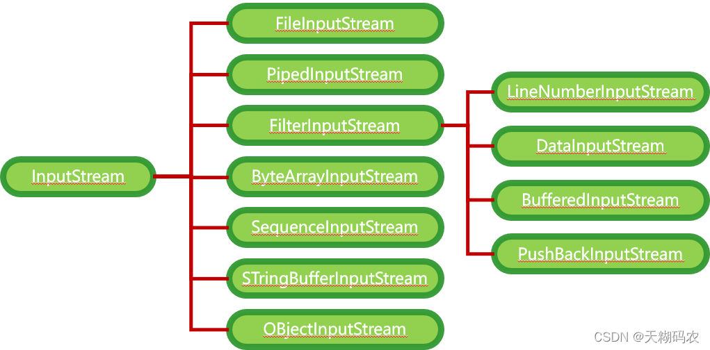
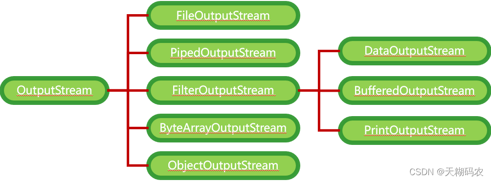
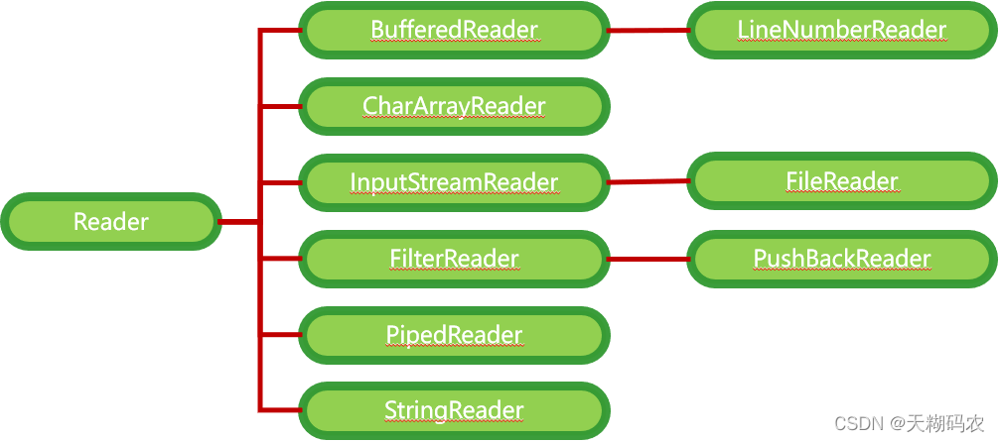

## Java IO

Input/Output：输入输出流(以内存为参照)

通过IO可以完成硬盘文件的读写


### 字节流/字符流区别

区别|字节流|字符流
---|---|---
读取方式|字节方式(1byte=8bit)|字符方式
读取类型|任意类型※1|文本文件
第一次读取※2|"a"|'a'
第二次读取※2|"中"的一半|'中'字符
第三次读取※2|"中"的另一半|-

※1 文本文件、图片、声音文件、视频文件

※2 读取文本：a中国bo张三fe

### 字节流





### 字符流




### 常用流

#### 文件专属

```java
java.io.FileInputStream   (用得最多)
java.io.FileOutputStream  (用得最多)
java.io.FileReader
java.io.FileWriter
```

#### 转换流：字节流转换成字符流

```java
java.io.InputStreamReader
java.io.OutputStreamWriter
```

#### 缓冲流专属

```java
java.io.BufferedInputStream
java.io.BufferedOutputStream
java.io.BufferedReader
java.io.BufferedWriter
```

#### 数据流专属

```java
java.io.DataInputStream
java.io.DataOutputStream
```

#### 标准输出流

```java
java.io.PrintStream
java.io.PrintWriter
```

#### 对象专属流：掌握

```java
java.io.ObjectInputStream
java.io.ObjectOutputStream
```