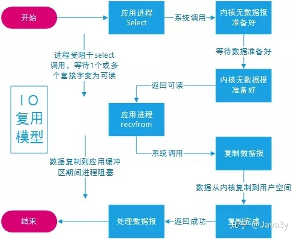

# 同步IO

## 阻塞IO(同步阻塞)

阻塞IO过程


1. 用户线程发起read操作
   
2. 如果内存数据未准备好，则用户线程被阻塞
   
3. 直到内存数据准备好并从内核缓冲区拷贝至用户空间后，read指令返回

## 非阻塞IO(同步非阻塞)


非阻塞IO过程

1. 用户线程发起read操作

2. 如果内存数据未准备好，内核返回EWOULDBLOCK错误，继续轮询polling内核数据状态(是否准备好)

3. 数据准备好，从内核缓冲区拷贝至用户空间后，read指令返回

※ 应用程序对内存轮询影响性能

### Buffer(缓冲区)

通过Channel管道运输着存储数据的Buffer缓冲区来实现数据处理

简单理解：

* Channel管道：运输，比作铁路

* Buffer缓冲区：数据，比作火车(运载着货物)

区别|传统IO流|新IO
---|---|---
数据传输方向|单向|双向(因为有Channel)

#### Buffer类核心变量


* 容量Capacity

    缓冲区能够容纳的数据元素的最大数量(底层数组，不能改变)

* 上界Limit

  (当前)缓冲区里的数据总数

* 位置Position

    下一个要被读或写的元素的位置，由相应的get()和put()更新

* 标记Mark

    备忘位置，用于记录上一次读写的位置

#### flip()函数

又称"切换成读模式"，每当要从缓存区的时候读取数据时，就调用flip()"切换成读模式"


### Channel(通道)


只负责数据传输，不负责数据操作

获取通道方式

* getChannel方法

    * 本地IO
    
        * FileInputStream/FileOutputStream
    
        * RandomAccessFile
    
    * 网络IO
    
        * Socket
          
        * ServerSocket
          
        * DatagramSocket
    
    
* 静态方法open()

* Files工具类newByteChannel()方法 

### 直接缓冲区/非直接缓冲区

#### 非直接缓冲区

需要经历一个copy阶段(内核空间copy到用户空间)


#### 直接缓冲区

不需要经过copy阶段，可理解成内存映射文件


#### 直接缓冲区创建

* 缓冲区创建的时候分配的直接缓冲区(allocateDirect()方法)

* FileChannel上调用map()方法，将文件直接映射到内存中创建


### scatter/gather和字符集

#### 分散读取scatter

将一个通道中的数据分散读取到多个缓冲区中


#### 聚集写入gather

将多个缓冲区的数据集中写入到一个通道中


## 多路复用IO(同步非阻塞的一种)




### 特点

    一个进程能同时等待多个文件描述符，这些文件描述符中的任意一个
    进入就绪状态，select()函数就可以返回
    select/epoll优势在于能处理更多连接

### 多路复用IO过程

1. 当用户进程调用select，那么整个进程会被block

2. kernel会"监视"所有select负责的socket
   
3. 当任何一个socket中的数据准备好了，select就会返回
   
4. 这个时候用户进程再调用read操作，将数据从kernel拷贝到用户进程(空间)

### select

### poll

### epoll

### pselect

## 同步非阻塞模型

不创建线程去IO，而发出请求给acceptor，acceptor轮询多个socket状态，当socket有读写事件时，才新建线程调用实际的IO读写操作。

多路复用IO模型中，一个线程可管理多个socket，系统无需建立新进程或线程，socket读写事件发生时才使用IO资源，减少资源占用率(select,poll,epoll)

```java
// 套接字socket=ip+端口，可理解为一个数据载体
data=socket.read()
```

# 异步IO(AIO) 

异步非阻塞


## 异步IO模型

1. 用户线程发起read操作，立即返回

2. 内核完成数据读取及拷贝
   
   数据准备完成后，内核将数据从内核缓冲区拷贝到用户空间

3. 通知用户(发送信号给用户线程)，用户对数据进行处理

# BIO/NIO/AIO区别

## 同步阻塞

一个线程维护一个连接，该线程从读请求到数据处理全部过程，线程被阻塞

## 同步非阻塞

非阻塞(期间)：用户线程发出的读请求不会阻塞当前用户线程(用户线程还是会去判断数据是否准备完毕)

阻塞期间：内核数据从内核缓冲区复制到用户空间时阻塞当前用户线程

## 区别

区别|BIO|NIO|AIO
---|---|---|---
读取方式|面向流(Stream Oriented)|面向缓冲区(Buffered Oriented)|面向缓冲区(Buffered Oriented)
读取主体※1|用户线程|用户线程|内核线程
阻塞有无|阻塞※2|阻塞+非阻塞|非阻塞
-|无|选择器(Selector)|-

※1 指从内核缓冲区读取到用户空间(外部文件读取到内核缓冲区由内核线程完成)   

※2 连接全程等待

### BIO

客户端Socket连接请求:服务端线程=1:1

未分配到处理线程的连接被阻塞或者拒绝，即一个连接一个线程


特点：

1. 一个独立线程维护一个socket连接，连接数量增多，虚拟机造成一定压力

2. 使用流读取数据(流是阻塞的)，当没有读/写数据时线程等待造成资源浪费

### NIO

服务器端保存一个Socket连接列表，对这个列表进行轮询

* Socket端口有数据可读：调用该socket连接的相应读操作
   
* Socket端口有数据可写：调用该socket连接的相应写操作
   
* Socket端口连接中断：关闭该端口

-> 进行IO操作(读/写)请求时，一个请求一个线程处理

#### NIO实现


* 远程连接对应一个通道channel

* (文件/网络)数据读写通过buffer，且读写非阻塞

* selector：通道管理器

* 数据读写：buffer->channel

过程

1. 创建通道channel并注册到selector中

2. 注册事件到通道

   1. 客户端连接服务端事件
   
   2. 服务端接收客户端连接事件
   
   3. 读/写事件
   
3. selector轮询方式调用select/poll/epoll/pselect中的一个函数

   1. 有通道事件：返回，新建IO线程处理
   
   2. 无通道事件：阻塞继续轮询

### AIO

AIO是异步非阻塞IO，进程读取数据时只负责发送跟接收指令，数据的准备工作由操作系统完成

## 例子讲解

海底捞很好吃，但是经常要排队

* BIO
  
  A顾客去吃海底捞，就这样干坐着等了一小时，然后才开始吃火锅

* NIO
  
  B顾客去吃海底捞，他一看要等挺久，于是去逛商场，每次逛一会就跑回来看有没有排到他。于是他最后既购了物，又吃上海底捞了

* AIO

   C顾客去吃海底捞，由于他是高级会员，所以店长说，你去商场随便玩吧，等下有位置，我立马打电话给你。于是C顾客不用干坐着等，也不用每过一会儿就跑回来看有没有等到，最后也吃上了海底捞

# IO基础

## 文件描述符

    Linux内核将所有外部设备都看做一个文件来操作，对文件的读写操作会调用内核提供的系统命令，返回一个文件描述符fd
    对一个socket的读写使用的描述符称为socket文件描述符(socket fd)
    fd是一个数字，指向内核中一个结构体(包含文件路径、数据区等属性)

## 用户空间和内核空间

## IO运行过程

