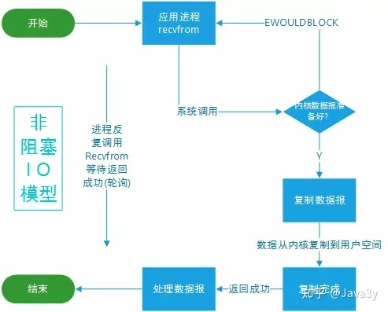

# 同步IO

## 阻塞IO(同步阻塞)

阻塞IO过程


1. 用户线程发起read操作
   
2. 如果内存数据未准备好，则用户线程被阻塞
   
3. 直到内存数据准备好并从内核缓冲区拷贝至用户空间后，read指令返回

## 非阻塞IO(同步非阻塞)



非阻塞IO过程

1. 用户线程发起read操作

2. 如果内存数据未准备好，内核返回EWOULDBLOCK错误，继续轮询polling内核数据状态(是否准备好)

3. 数据准备好，从内核缓冲区拷贝至用户空间后，read指令返回

※ 应用程序对内存轮询影响性能

## 多路复用IO(同步非阻塞的一种)


多路复用IO过程

1. 用户线程发起read操作

2. 内存数据未准备好，不对内存进行轮询，可做其他事情

3. 内核数据准备好，以事件机制通知应用程序

### select

### poll

### epoll

### Channel(通道)

### Buffer(缓冲区)

## 同步非阻塞模型

不创建线程去IO，而发出请求给acceptor，acceptor轮询多个socket状态，当socket有读写事件时，才新建线程调用实际的IO读写操作。

多路复用IO模型中，一个线程可管理多个socket，系统无需建立新进程或线程，socket读写事件发生时才使用IO资源，减少资源占用率(select,poll,epoll)

```java
// 套接字socket=ip+端口，可理解为一个数据载体
data=socket.read()
```

# 异步IO(AIO) 

异步非阻塞


## 异步IO模型

1. 用户线程发起read操作，立即返回

2. 内核完成数据读取及拷贝
   
   数据准备完成后，内核将数据从内核缓冲区拷贝到用户空间

3. 通知用户(发送信号给用户线程)，用户对数据进行处理

# BIO/newIO/AIO区别

## 同步阻塞

一个线程维护一个连接，该线程从读请求到数据处理全部过程，线程被阻塞

## 同步非阻塞

非阻塞(期间)：用户线程发出的读请求不会阻塞当前用户线程(用户线程还是会去判断数据是否准备完毕)

阻塞期间：内核数据从内核缓冲区复制到用户空间时阻塞当前用户线程

## 区别

区别|BIO|newIO|AIO
---|---|---|---
读取主体※1|用户线程|用户线程|内核线程
阻塞有无|阻塞※2|阻塞+非阻塞|非阻塞

※1 指从内核缓冲区读取到用户空间(外部文件读取到内核缓冲区由内核线程完成)   

※2 连接全程等待

### BIO

客户端Socket连接请求:服务端线程=1:1

未分配到处理线程的连接被阻塞或者拒绝，即一个连接一个线程


特点：

1. 一个独立线程维护一个socket连接，连接数量增多，虚拟机造成一定压力

2. 使用流读取数据(流是阻塞的)，当没有读/写数据时线程等待造成资源浪费

### NIO

服务器端保存一个Socket连接列表，对这个列表进行轮询

* Socket端口有数据可读：调用该socket连接的相应读操作
   
* Socket端口有数据可写：调用该socket连接的相应写操作
   
* Socket端口连接中断：关闭该端口

-> 进行IO操作(读/写)请求时，一个请求一个线程处理

#### NIO实现


* 远程连接对应一个通道channel

* (文件/网络)数据读写通过buffer，且读写非阻塞

* selector：通道管理器

* 数据读写：buffer->channel

过程

1. 创建通道channel并注册到selector中

2. 注册事件到通道

   1. 客户端连接服务端事件
   
   2. 服务端接收客户端连接事件
   
   3. 读/写事件
   
3. selector轮询方式调用select函数

   1. 有通道事件：返回，新建IO线程处理
   
   2. 无通道事件：阻塞继续轮询

### AIO

AIO是异步非阻塞IO，进程读取数据时只负责发送跟接收指令，数据的准备工作由操作系统完成

