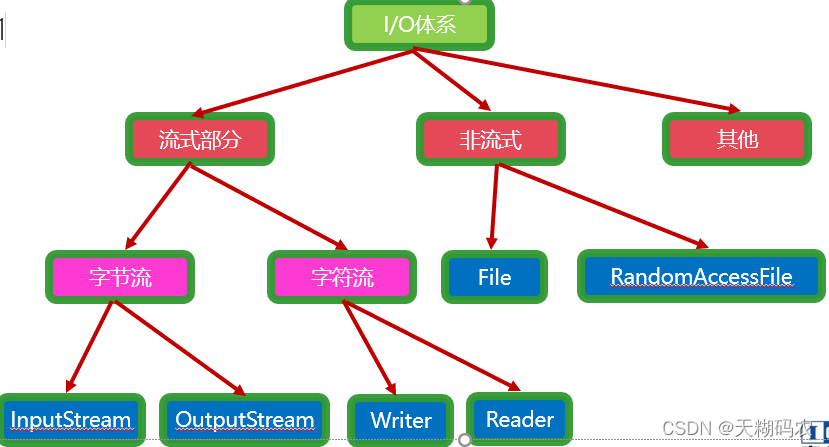
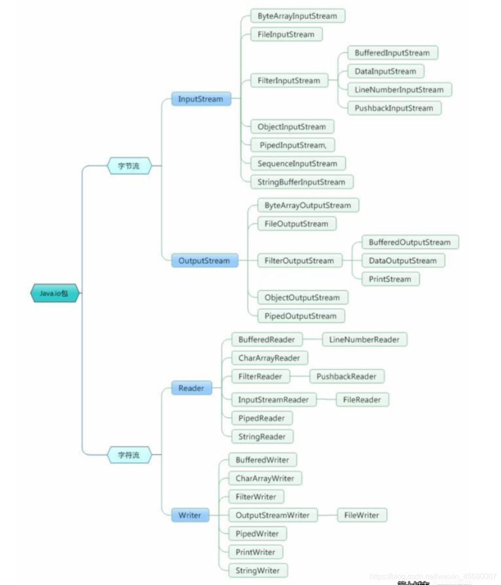
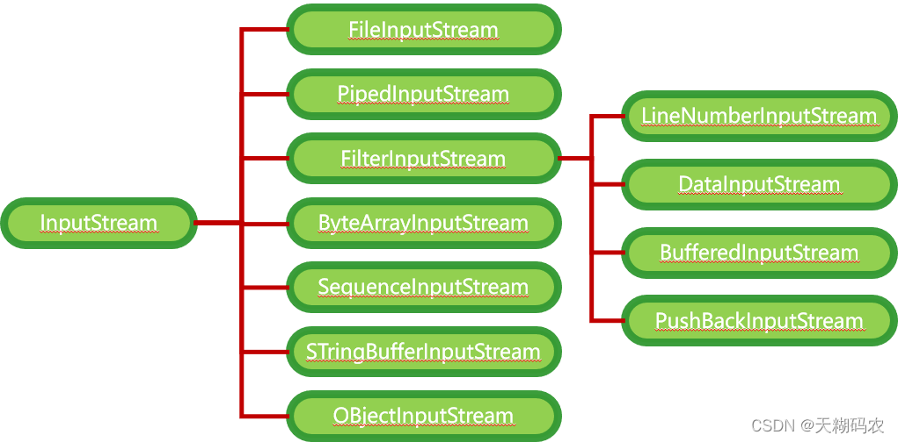
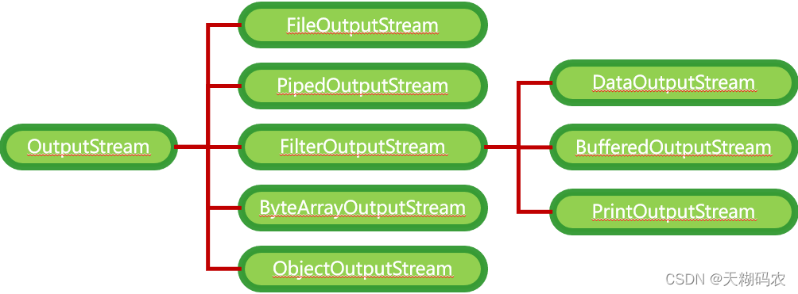
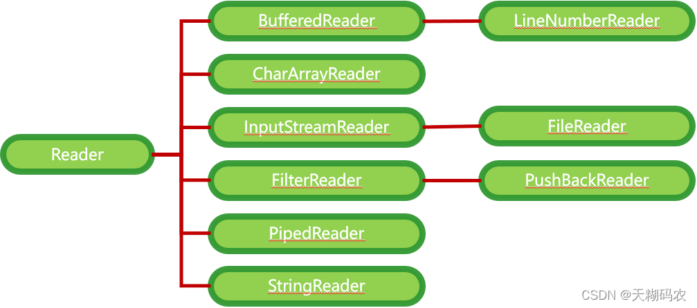
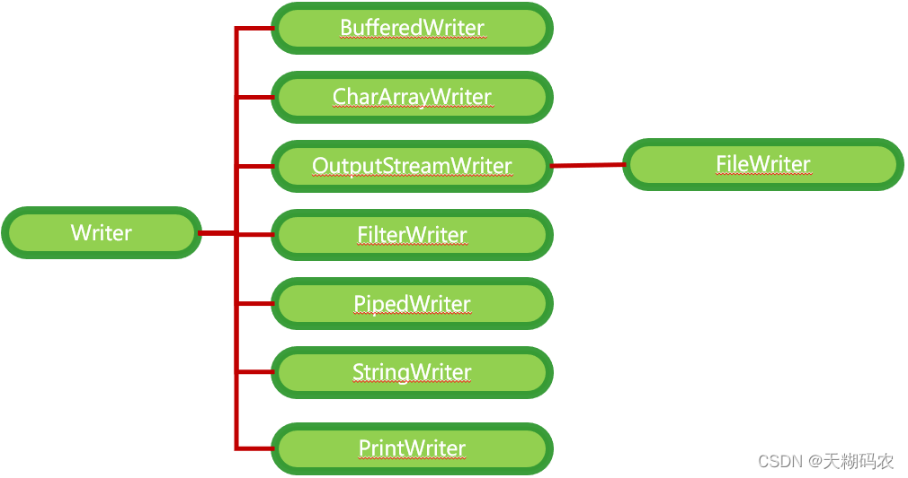
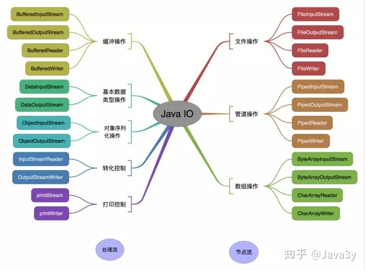

## JavaIO

IO指数据的输入输出Input/Output(通常以内存为参照)，通过IO可以完成文件/网络数据的读写

Java的基本IO(传统IO)都是阻塞IO

※ Java调用：同步调用、异步调用

※ 回调：A调用B的同时传入函数指针，B会调用A的函数指针(如Timer的ActionListener)





### 分类

#### 字节流/字符流区别

区别|字节流|字符流
---|---|---
读取方式|字节方式(1byte=8bit)|字符方式
读取类型|任意类型※1|文本文件
第一次读取※2|"a"|'a'
第二次读取※2|"中"的一半|'中'字符
第三次读取※2|"中"的另一半|-

※1 文本文件、图片、声音文件、视频文件

※2 读取文本：a中国bo张三fe

#### 字节流





#### 字符流





### 常用流



#### 文件专属

```java
java.io.FileInputStream   (用得最多)
java.io.FileOutputStream  (用得最多)
java.io.FileReader
java.io.FileWriter
```

#### 转换流：字节流转换成字符流

```java
java.io.InputStreamReader
java.io.OutputStreamWriter
```

#### 缓冲流专属

```java
java.io.BufferedInputStream
java.io.BufferedOutputStream
java.io.BufferedReader
java.io.BufferedWriter
```

#### 数据流专属

```java
java.io.DataInputStream
java.io.DataOutputStream
```

#### 标准输出流

```java
java.io.PrintStream
java.io.PrintWriter
```

#### 对象专属流：掌握

```java
java.io.ObjectInputStream
java.io.ObjectOutputStream
```

### 序列化/反序列化

序列化

    Java对象存储到文件中，将Java对象保存下来的过程

反序列化

    将硬盘上的数据重新恢复到内存当中，恢复成Java对象的过程

#### Java区分类

1. 类名：类名不一致，不是同一个类

2. 版本号：类名一致时，再通过版本号进行区分

   自动生成序列化版本号：代码修改，版本号发生变化

   -> 提供固定不变的序列化版本号
