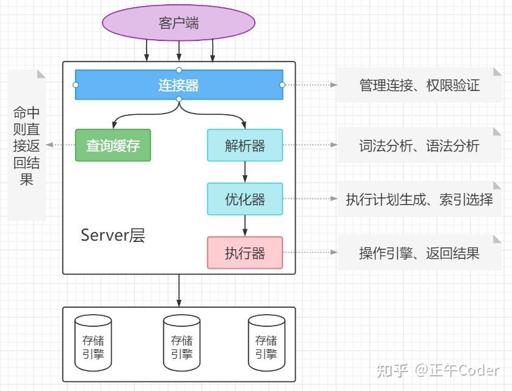
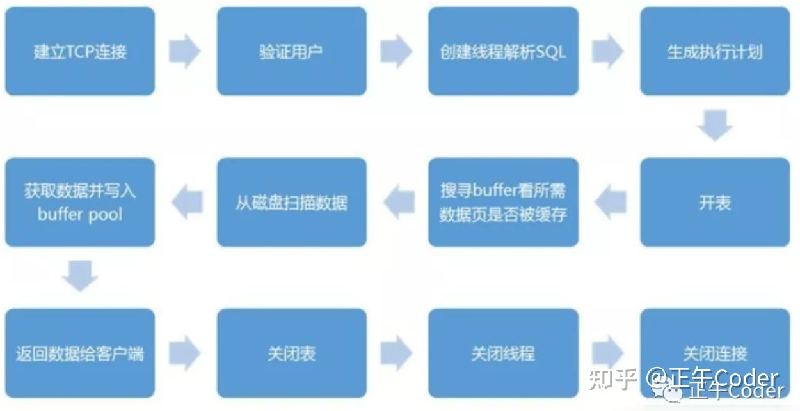
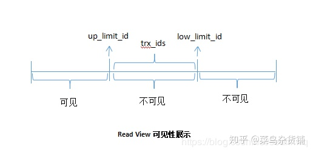
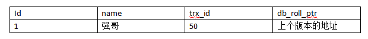
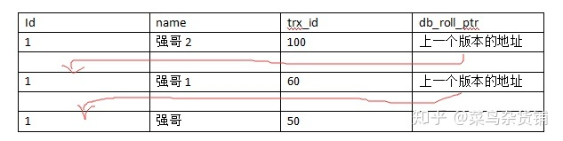
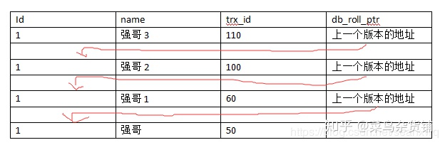
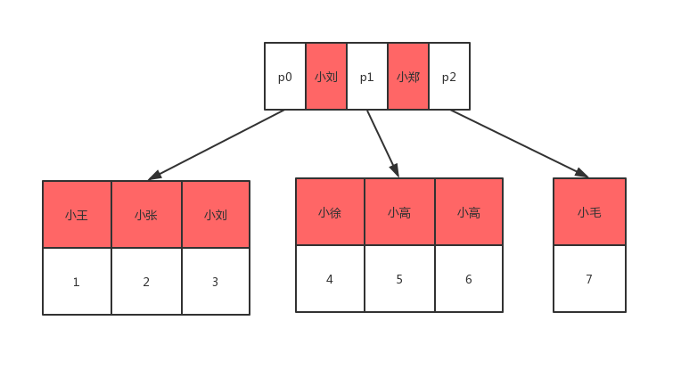
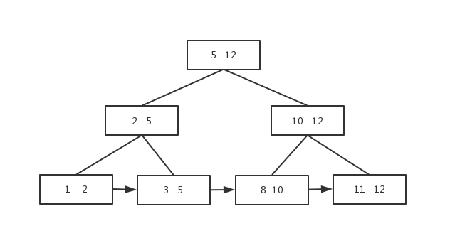
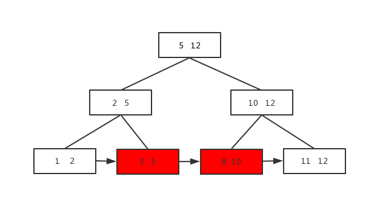

## MySQL

### MySQL逻辑架构



* **连接层**
  
    1. 主要工作：连接处理、授权认证、安全防护等
       * 每个客户端连接都会在服务器进程中拥有一个线程，服务器会缓存线程
    2. 为通过安全认证的接入用户提供线程，该层可以实现基于SSL的安全连接
* **服务层**
  
    1. 用于处理核心服务
    2. 标准SQL接口，查询解析，SQL优化和统计，全局的和引擎依赖的缓存与缓冲器等
    3. 所有的与存储引擎无关的工作，如过程、函数等
    4. SELECT 语句，服务器还会查询内部的缓存
* **引擎层**

    1. 负责实际数据的存储与提取。
    2. 服务器通过API与存储引擎进行通信

#### 长连接短连接

* 长连接
  
  连接成功后，如果客户端有持续请求，则一直使用同一个连接

* 短连接

  每次执行完很少的几次查询后就断开连接，下次查询重新建立一个连接

* 实际场景

  1. 定期断开长连接。
     使用一段时间或者程序里占用内存的大查询后断开连接，之后要查询再重连
  2. 大查询操作后，使用mysql_reset_connection重新初始化连接资源。
      无需重连和权限认证，恢复到刚创建连接时的状态
     
#### 查询缓存

  解析查询前，服务器会先检查查询缓存。
  不命中，再执行查询解析、优化、执行过程

  * 不推荐使用

    * 查询缓存失效频繁，更新操作会导致响应表查询缓存清空
    * 静态表(如系统配置)，可使用
    * select SQL_CACHE * from T where ID = 10;
  
#### 解析器

  * 词法分析
    关键字识别，表识别，字段识别等
  * 语法分析
    SQL语句是否满足语法规则
    
#### 优化器
  
  * 多索引
    使用哪个索引
  * 多表关联
    各个表的连接顺序
    
#### 执行器

  * 判查询权限
    使用查询缓存：缓存命中后返回结果时做权限查询
    不适用查询缓存：判断查询权限
  * 调用引擎接口进行查询或其他操作
    命中后，结果缓存到内存
    采用LRU(Least recently used，最近最少使用)算法，hash表数据结构
  * 查询结果返回客户端

#### MYSQL工作流程
1. 客户端请求查询
2. 服务器检查缓存，命中返回结果
3. 服务器端SQL解析，预处理及优化后生成执行计划
4. 调用存储引擎API执行
5. 返回结果
   

### MYSQL读写锁

处理并发读写时，通过实现由两种类型组成的锁系统规避问题。
* 共享锁/读锁
  共享，相互不阻塞->不影响其他客户读取统一资源
* 排他锁/写锁
  
  * 排他->写锁会阻塞其他的写锁和读锁
  * 写锁优先级高->写锁可插入读锁队列前面，反之则不行
  
### MYSQL锁策略

* 表锁：基本策略，开销最小
  
  * 获取写锁后，阻塞其他用户读写操作
  * 没有写锁后，其他用户才能进行读写操作
  
* 行锁：最大程度支持并发，开销大

  * 只在存储引擎实现
  * InnoDB和XtraDB及其他存储引擎实现了行锁
  
### 数据库死锁

多个事务在同一资源上相互占用并请求锁定对方占用的资源而导致的恶性循环

产生：

  * 多个事务以不同顺序锁定资源时
  * 多个事务同时锁定同一资源时

规避：

  * 死锁检测
  * 死锁超时

InnoDB处理死锁：将持有最少行级排它锁的事务进行回滚

### 事务

一组原子性的SQL查询，或者说一个独立的工作单元

MYSQL事务特点：事务内的语句要么全部执行成功，要么全部执行失败

特性ACID中的AID都是为了实现C即一致性：

  * 原子性atomicity：逻辑上不可分割，要么全部成功要么全部失败
  * 一致性consistency：数据库从一个一致性的状态转换为另一个一致性状态
    * 瓶装可乐倒入杯中，守恒
    * 建行转账农行，建行扣除余额后宕机，不守恒，即产生不一致性
  * 隔离性isolation：对并发而言，并发运行的多个事务相互不影响。即一个事务最终提交前对其他事务不可见
  * 持久性durability：事务提交后修改内容永久保存到数据库中

### MYSQL隔离级别

* 未提交读/脏读Read Uncommitted
  
  修改即使没有被提交，对其他事务也是可见。

  * 幻读
  
    某个事务在读取某个范围内的记录时，会产生幻行
  
* 提交读/不可重复读Read Committed

  * 多数数据库默认隔离级别，事务提交前相互不可见
  * 多次查询可能得到不同结果

* 可重复读Repeatable Read（MYSQL默认隔离级别）

  * 同一事物多次读取结果一致
  * 解决不可重复读
  
* 可串行化Serializable

  * 最高隔离级别，强制事务串行执行，避免幻读
  * 读取的每一行上加锁，导致大量的超时和锁争用问题
  * 非常需要确保数据一致性且没有并发情况下使用

### MVCC：Multi-Version Concurrency Control多版本并发控制

* 很多情况下避免加锁，大多实现非阻塞操作，写操作只锁定必要行
* 只能在不可重复读和可重复读隔离级别下工作
  * 未提交读：总是读取最新数据行，而不是符合当前事务版本的数据行(未提交部分)
  * 可串行化：对所有读取行都加锁
  
### MYSQL log

* undo log：实现MVCC，用于事务回滚

  * 记录了修改的反向操作，可实现事务回滚
  * 可根据undo log回滚到某个特定版本的数据，实现MVCC

* binlog：服务层生产日志

  * 数据恢复：mysql主从架构是通过slave同步到master的binlog来实现
    
  * 数据库复制:解析binlog

* redo log：记录数据操作在物理层面的修改

  * 脏页：mysql中使用大量缓存，该缓存存在于内存中，修改操作时会直接修改内存，而不是立刻修改磁盘，当内存和磁盘数据不一致时，称内存中数据为脏页
  * 为保证数据安全性，事务进行中会不断产生redo log，事务提交时进行一次flush操作，保存到磁盘中，redo log是按照顺序写入的(因为磁盘顺序读写速度远大于随机读写)
  * 当数据库重启时，根据redo log进行数据恢复，如果redo log有未提交事务则提交该事务
  * 以上操作实现了事务的原子性，一致性和持久性
  
* 数据修改产生redo log（用于修改提交），undo log（用于回滚）

* 事务ID：transaction id

* 版本链

    * row_id：聚簇索引id(通常使用主键或第一个非NULL列)
    * trx_id：最新修改的事务id,即事务ID
    * db_roll_ptr：指向undo segment中的undo log
    * trx_ids：活跃事务列表，ReadView初始化时当前未提交事务列表。对于本事务不可见
    * up_limit_id：当前**已提交**事务号+1
      * 当事务号<up_limit_id时，ReadView可见
      * 即创建Read View视图的时候，之前已经提交的事务对于该事务肯定是可见的
    * low_limit_id：当前**最大**事务号+1
      * 当事务号>=up_limit_id时，ReadView不可见
      * 即在创建Read View视图之后创建的事务对于该事务肯定是不可见的
    
    * 一致性视图Read View
      * 事务启动时创建的视图
    * 版本链操作
        1. 修改前
           
        2. 更新并提交事务
           ```mysql
           update user set name = '强哥1' where id = 1;
           ```
             
        3. 更新但不提交事务
           ```mysql
           update user set name = '强哥2' where id = 1;
           ```
            
           * select id = 1;
           * 新生成ReadView(事务初次开始时生成)
           * trx_ids=100，不可见
           * trx_id=60小于up_limit_id(61)，返回该条记录
        4. 提交上述事务
        5. 更新但不提交事务
             ```mysql
             update user set name = '强哥3' where id = 1;
             ```
            
            * 隔离级别：提交读/不可重复读Read Committed
                * select id = 1;
                * 重新生成ReadView(新事务)
                * trx_ids=110，不可见
                * trx_id=100小于up_limit_id(101)，返回该条记录
            * 隔离级别：可重复读Read Repeatable
                * select id = 1;
                * 使用3生成的ReadView
                * trx_ids=100，不可见
                * trx_id=60小于up_limit_id(61)，返回该条记录
                * 和第一次select结果一样，叫可重复读
### 数据库索引

为了使查询数据效率更高，小表通常采用全表扫描，无需索引
索引应避免NULL列

* 聚集索引/主键索引

  所有行数都会按照主键索引进行排序

* 非聚集索引：

  给普通字段加上索引
  
* 联合索引：多个字段组成的索引

  * 遵从最左前缀原则，即mysql内部转换(检索字段排序)后的sql语句第一个字段为联合索引的第一个字段
  * **!=不使用索引**
  * **范围字段后的索引字段不适用，即索引到范围字段まで**
  * sample：
  
    * 学生表联合索引key idx_age_name_sex(age, name, sex)
      
    ```mysql
    -- 遵从最左前缀原则，age在最左边，使用索引
    select * from student where age = 16 and name = '小张'
    -- 不遵从最左前缀原则，不适用索引  
    select * from student where name = '小张' and sex = '男'
    -- mysql内部转换后(age字段提前)遵从最左前缀原则，使用索引 
    select * from student where name = '小张' and sex = '男' and age = 18
    -- 范围字段，只使用age索引 
    select * from student where age > 20 and name = '小张'
    -- 遵从最左前缀原则，但!=表达式不使用索引
    select * from student where age != 15 and name = '小张'
    -- 只适用age索引，原因同上
    select * from student where age = 15 and name != '小张'
    ```
* 不使用索引场景

    ```mysql
    key 'idx_age'(age)
    key 'idx_name'(name)
  ``` 
  
  * like在前面的不走索引
    ```mysql
    -- 不使用索引
    select * from student where name like '%小';
    -- 使用索引
    select * from student where 'name' like '王%'
    ``` 
  * 用索引列进行计算的不走索引
    ```mysql
    -- 不使用索引
    select * from student where age + 8 = 18
    -- 使用索引
    select * from student where age = 10+8
    ```
  * 对索引列使用函数时不走索引
    ```mysql
    -- 不使用索引
    select * from student where  concat('name','哈') ='王哈哈';
    -- 使用索引
    select * from student where name = concat('王哈','哈');
    ```
  * 索引列使用!=不走索引
    ```mysql
    -- 不使用索引
    select * from student where age != 18
    ```
    
* 索引存储分布

* 表结构
    ```mysql
    CREATE TABLE `student` (
                               `id` int(11) NOT NULL AUTO_INCREMENT COMMENT '主键id',
                               `name` varchar(50) NOT NULL DEFAULT '' COMMENT '学生姓名',
                               `age` int(11) NOT NULL DEFAULT 0 COMMENT '学生年龄',
                               PRIMARY KEY (`id`),
                               KEY `idx_age` (`age`),
                               KEY `idx_name` (`name`)
    ) ENGINE = InnoDB CHARSET = utf8 COMMENT '学生信息';
    ```
*  表数据

    

    * 主键索引：id
    * 非聚集索引：name，age
    
* 聚集索引磁盘存储结构

    

    * 叶子结点：存储表里所有行数据
    * 每个数据页在不同磁盘上面
    * 数据查找（查找id=5）
        1. 磁盘0读入内存
        2. 二分查找法id=5在3和6中间
        3. 通过指针p1查找到磁盘2地址
        4. 磁盘2读入内存
        5. 二分查找法查到id=5的数据
    
* 非聚集索引

    

    * 叶子结点：存储聚集索引键
    * 数据查找（查找name=小徐）
        1. 磁盘0读入内存
        2. 二分查找法查到对象在p1所指地址上
        3. 通过指针p1查找到磁盘2地址
        4. 二分查找法查到小徐id=4
        5. 重复上面聚集索引步骤

### B+树

为了解决大量数据存放在外存储器时候，查找效率低下的问题

* 外存储器

    将数据存储到磁盘中，每次查找元素从磁盘中取出，再写入内存。
    
    特点：容量大，效率低。

* 内存储器

    将数据存储在内存中。

    特点：查询快，容量小。

* B+树特点

    * 中间元素不存储数据，只当索引用，所有数据保存在叶子结点
    * 所有中间节点在子节点中要么是最大元素，要么是最小元素
    * 叶子结点包含所有数据和指向这些数据的指针
    * 叶子结点形成了自小向大的链表
    
    

    * 一个节点可存放多个数据，查找一个节点时候可以有多个元素，提高查找效率
    * 数据库索引很大，通常以文件形式存储在磁盘中，查找数据有磁盘I/O消耗，B+树可以减少与磁盘交互(因为一次查找可以得到多个数据)，增大命中率
    
* B+树查找方法

    * 单元素查找
    
        从根结点一直查找到叶子结点，即使中间结点有相应元素也需要继续查找(因为数据存储在叶子结点)
        
        查找元素3：
        
    
    * 范围查找
    
        直接从链表查
        查找元素3到元素8
        
    

  
#### 联合主键

MySQL不能同时存在多个独立主键，但可以有多个unique

```mysql
CREATE TABLE `user` (

`userid` SMALLINT UNSIGNED AUTO_INCREMENT PRIMARY KEY,

`username` CHAR(16) NOT NULL,

`password` char(40) NOT NULL,
-- 联合主键
UNIQUE(`username`)

);
```
#### InnoDB
* MySQL默认事务型引擎，处理大量短期事务
* 数据存储在表空间，表空间由一系列数据文件组成
* 采用MVCC支持高并发
* 默认隔离级别可重复读，并通过间隙锁(锁定涉及行及索引中间隙进行锁定防止幻行插入)防止幻读
* 基于聚簇索引建立

#### MyISAM
* MySQL5.1之前默认引擎
* 不支持事务和行锁(对整张表加锁，读加共享锁，写加排它锁)

#### Memory
* 快速访问且数据不被修改
* 重启后数据丢失
* 表级锁
* 不支持BLOB和TEXT类型列，每行长度固定CHAR(VARCHAR会转换成CHAR)
* 场景：查找或映射表，保存数据分析中产生的中间数据等
* 如果MySQL查询时的临时表，内部使用Memory表，如果中间结果超出memory限制或BLOB/TEXT，则转换成MyISAM

#### MySQL数据类型
* 数据类型
  * 整形：(m)显示宽度，不影响存储范围，unsigned范围加倍
    * tinyint(m)：1byte
    * smallint(m)：2byte
    * mediumint(m)：3byte
    * int(m)：4byte
    * bigint(m)：8byte
    * zerofill：空格替换为0
      ```mysql
        CREATE TABLE zerofill_tests(
        id INT AUTO_INCREMENT PRIMARY KEY,
        v1 INT(2) ZEROFILL,
        v2 INT(3) ZEROFILL,
        v3 INT(5) ZEROFILL
        );
        -- 数据长度不足显示宽度时，空格补全
        INSERT into zerofill_tests(v1,v2,v3) VALUES(1, 6, 9);
        SELECT v1, v2, v3 from zerofill_tests
        -- Result
        -- v1:01
        -- v2:001
        -- v3:00009
      ```
  * 浮点型：存放近似值
    * float(m,d)：单精度浮点型，8位精度(4字节)，m个总数，d个小数
      * 精确到23位小数
    * double(m,d)：双精度浮点型，16位精度(8字节)
      * 24~54位小数
    * 特点：
      * 小数超过设定值，四舍五入
      * 小数位都是0，不保存
      * 小数位不足设定值，0补位
  * 定点数：存放精确值
    * 
  * 
  * 
  * 字符串
    * CHAR
      * 定长，删除末尾空格
      * 场景
        * 短字符串或所有值都接近同一长度
        * 列更新频繁->不产生碎片
    * VARCHAR
      * 可变，不删除末尾空格
      * 需额外1/2个额外字节记录数据长度
        * 最大长度不超过255用1个字节
      * 场景
        * 字符串最大长度比平均长度大很多
        * 列更新少->产生碎片
        * UTF8等复杂字符集
        * 每个字符都使用不同字节数存储
    * DATETIME
      * 保存大范围值1001~9999，精度秒
      * 8字节存储空间，日期和时间封装在整数中，与时区无关
    * TIMESTAMP
      * 保存小范围值1970~2038
      * 4字节存储空间，依赖于时区  
    
* 数据类型优化
  * 使用最小数据类型，如CHAR
  * 简单数据类型
    * 如整形替代字符串(字符串类型开销大，字符集和校对规则)
    * 整形IP存储
      * inet_aton('73.115.134.73'):字符串地址转换成网络地址(整形)
      * inet_ntoa(1232307785):网络地址(整形)转换成字符串地址
    * 内建类型如date，time，datetime而不使用字符串
  * 避免NULL
    * 数据库难于优化，尤其对于索引(还会使用更多存储空间)
  


