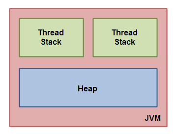
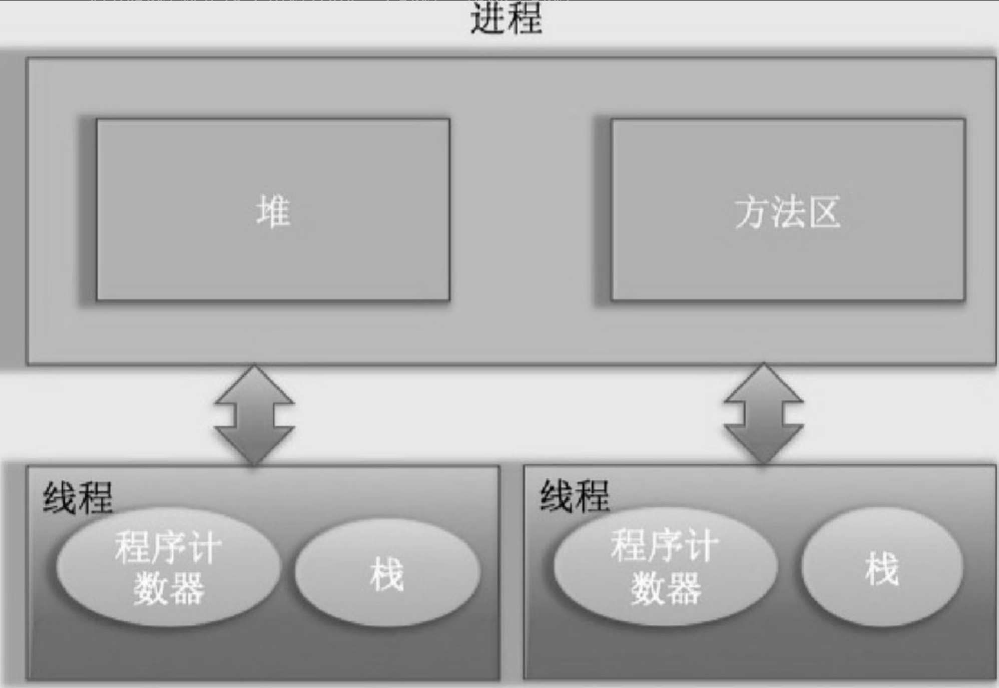
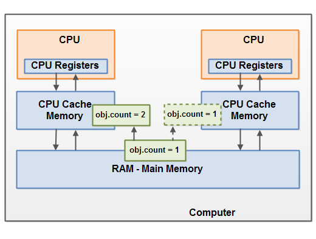
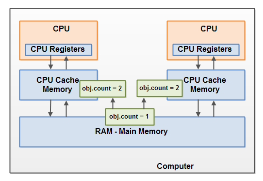
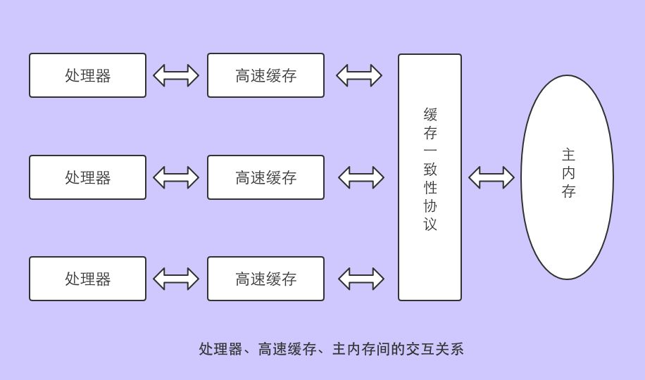
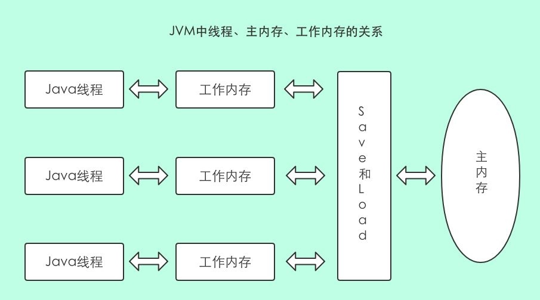
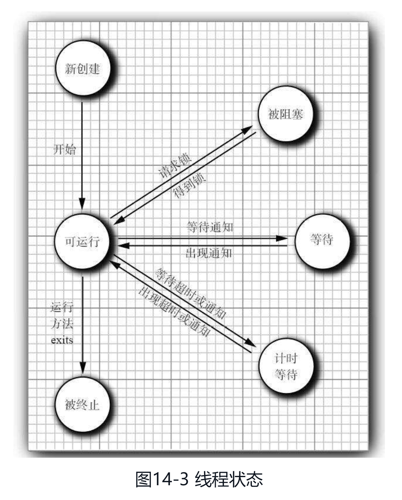
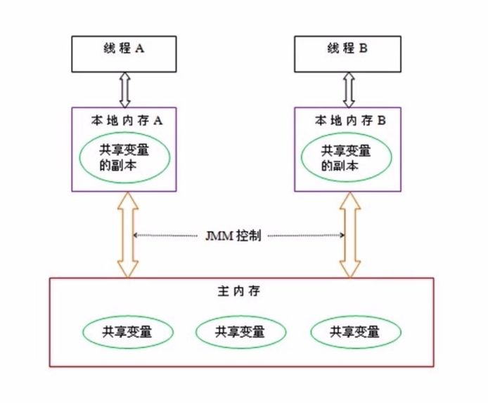
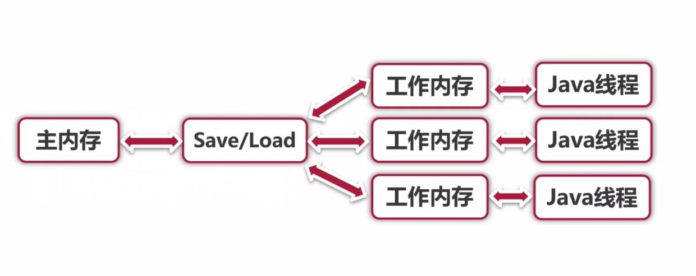

## Java内存模型(Java Memory Model:JMM)

### Java内存模型

* Java内存模型将Java虚拟机划分为线程栈和堆
* 主要内容
  1. JMM描述了线程如何与内存交互
  2. JMM描述了JVM如何与计算机内存进行交互
  3. JMM围绕原子性，有序性和可见性展开

#### Java内存模型逻辑视图




    线程栈：线程拥有自己的线程栈，线程栈包含线程调用方法当前执行点相关信息，称调用栈(call stack)。
    线程间互不可见，且拥有相互独立的本地变量。

* 栈：
  
  * 程序计数器
    
    内存区域，记录线程当前要执行的指令地址
* 线程栈上：调用栈和原始类型的本地变量(可向其他线程传递原始类型变量的拷贝)

    * 本地变量
        * 原始类型：存放于线程栈
        * 指向对象的引用(这个本地变量)：存放于线程栈
    * 对象内本地方法中变量：存放于线程栈上

* 堆：
    * (引用)对象：存放于堆上
    * 对象成员变量：存放于堆上
    * 静态成员变量：存放于堆上

* 方法区：
  * 存放JVM加载的类、常量及静态变量等信息


      
```java
public class MyRunnable implements Runnable() {
    public void run() {
        methodOne();
    }
    
    public void methodOne() {
        // 对象方法中本地变量 -> 线程栈上
        int localVariable1 = 45;

        // 引用类型本地变量 -> 线程栈上
        // 引用的对象(MySharedObject.sharedInstance) -> 堆上
        MySharedObject localVariable2 =  MySharedObject.sharedInstance;
        //... do more with local variables.

        methodTwo();
    }

    public void methodTwo() {
        // 对象方法引用类型变量 -> 线程栈上
        // 引用的对象(Integer对象) -> 堆上
        Integer localVariable1 = new Integer(99);

        //... do more with local variable.
    }
}

// MySharedObject -> Object3
public class MySharedObject {
    // 静态成员变量 -> 堆
    public static final MySharedObject sharedInstance = new MySharedObject();

    // 成员变量 -> 堆
    public Integer object2 = new Integer(22);
    public Integer object4 = new Integer(44);
    
    // 成员变量 -> 堆
    public long member1 = 12345;
    public long member1 = 67890;
}
```

#### Java内存模型和硬件内存架构之间的桥接


* 共享对象可见性

  如果两个或多个线程共享一个对象，而没有正确使用volatile声明或同步(synchronized)或final字段，那么一个线程对共享对象的更新可能对其他线程不可见。
    
  
        可使用volatile避免上述冲突，volatile关键字可保证直接从主存中读取一个变量，
        如果该变量被修改，总是会被写回主存中
        volatile适合对写操作较少且新值不依赖于旧值的应用，可减少线程间同步开销
        synchronized适合多线程对共享变量的并发访问
* race conditions(竞态条件)

  多个线程共享同一对象，且多个线程更新该共享对象中的变量时，可能出现竞态条件

    
  
        可使用Java同步块解决上述冲突
        Java同步块可保证同一时刻只有一个线程进入代码临界区，还可保证同步块中所有被访问的变量将会从主存中读入，
        当线程退出同步块代码时，所有被更新的变量会被刷新回主存中，不管该变量是否被声明为volatile

#### CPU、缓存、主存





#### long、double特殊规则

    64位类型数据long、double，虚拟机允许读写划分为两次32位的操作，
    即JVM实现可以不保证load、store、write、read操作的原子性，
    但JVM用手段保证long、double读写操作的原子性，几乎没有任何影响

### 线程调度

#### 协同式线程调度

    线程执行时间由线程本身控制，线程执行完后主动通知切换到另一线程，所以没有线程同步问题
    缺点是一个线程出现问题，会阻塞其他线程

#### 抢占式线程调度

    Java使用抢占式线程调度，Thread.yield()只可让出CPU执行时间，
    获取CPU执行时间只可通过设置线程优先级，优先级越高越容易被系统选择执行

### 线程状态

* 新创建New
* 可运行Runnable
* 被阻塞Blocked
* 等待Waiting
* 计时等待Timed waiting
* 被终止Terminated

#### 新创建线程

> 使用new操作符创建一个新线程时：该线程还没有开始运行，即它的状态时new

#### 可运行线程

> 调用start方法时，线程处于runnable状态。

> 可运行线程可能正在运行也可能没有运行。取决于操作系统给线程提供的运行时间。
> 即一个可运行线程不必始终保持运行。

#### 被阻塞线程

> （引用）线程获取内部对象锁（非java.util.concurrent库中的锁），且该锁被其他线程持有，则该线程进入阻塞状态

> 当该内部对象锁被释放且线程调度器允许本线程持有它的时候，该线程阻塞状态解除变成非阻塞状态

#### 等待线程

> 当线程等待另一个线程通知调度器一个条件时，它自己进入等待状态。
>* 调用Object.wait方法->未设置Timeout参数则无限等待
>* Thread.join：等待终止指定的线程（即被等待线程结束后，该线程才能进入runnable状态）
>   
>  ->未设置Timeout参数则无限等待
>* 等待java.util.concurrent库中的Lock或Condition时
> 
> ->LockSupport.park()使线程无限等待

#### 计时等待

> 调用带有超时参数的方法时，该线程进入计时等待（如下列方法设置超时参数时）
>* Thread.sleep
>* Object.wait
>* Thread.join：等待指定的线程死亡或者经过指定的毫秒数
>* Lock.tryLock
>* Condition.await

> 这一状态一直保持到期满或者接收到适当的通知

#### 被终止线程

> run方法正常退出而自然死亡

> 一个没有捕获的异常终止了run方法而意外死亡
>* stop方法可杀死一个线程，调用该方法抛出ThreadDeath错误对象。该方法已过时




#### 守护线程

> 用途：为其他线程提供服务，必须在线程启动前调用
> * 如计时线程：定时发送计时器嘀嗒信号给其他线程或清空过时的高速缓存项的线程。
>
> * 当只剩下守护线程时时，虚拟机退出。

#### 主存与JMM





#### 主内存与工作内存交互

JMM定义8种原子操作完成主存与工作内存的交互

* lock：作用于主存的变量，把变量标识为线程独占状态
* read：作用于主存的变量，把变量从主存传输到线程的工作内存，便于load
* load：作用于工作内存的变量，把read读取的变量放入工作内存副本
* use：作用于工作内存，把工作内存的变量值传递给执行引擎，当虚拟机需要使用到变量值的字节码指令时，执行该操作
* assign：作用于工作内存，把执行引擎收到的值赋给工作内存的变量，当虚拟机遇到需要赋值字节码时执行该操作
* store：作用于工作内存，把变量值传输到主存中，以便于write
* write：作用于主存，把store获取的值放入主存变量中
* unlock：把主存中处于锁定状态的变量释放出来，释放后的变量才可被其他线程锁定

  

操作规则

* read和load、store和write必须成对出现
* 线程assign后必须把变化同步回主存 -> 更改值
* 新变量只允许在主存中生成，不允许工作内存使用未初始化变量
* 只允许单线程一次或多次lock变量，对变量进行lock会清空工作内存中此变量的值
* unlock必须作用于lock对象，且必须先把更改同步回主存