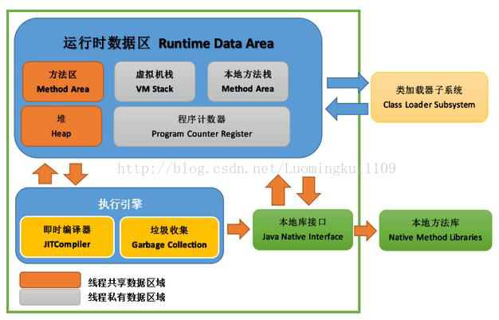
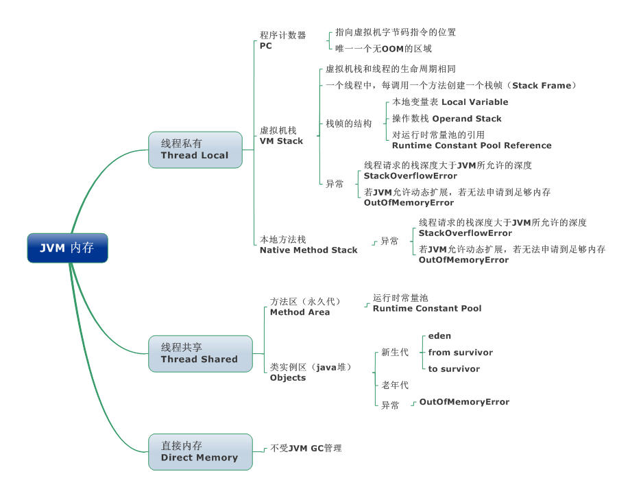
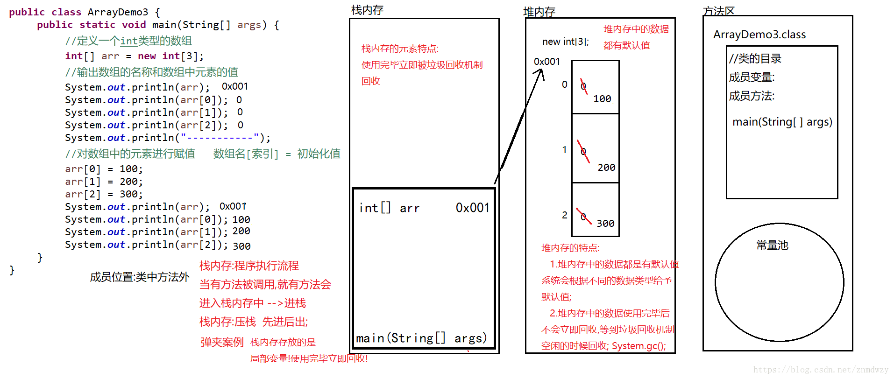
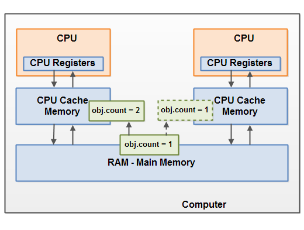
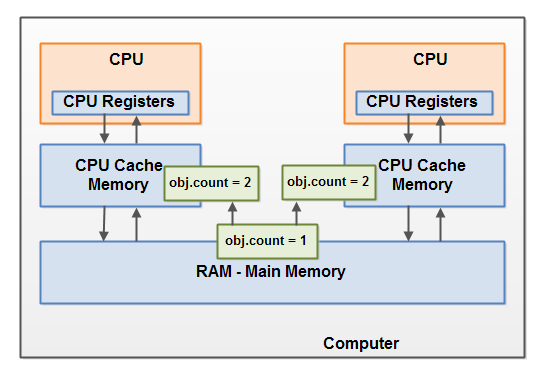
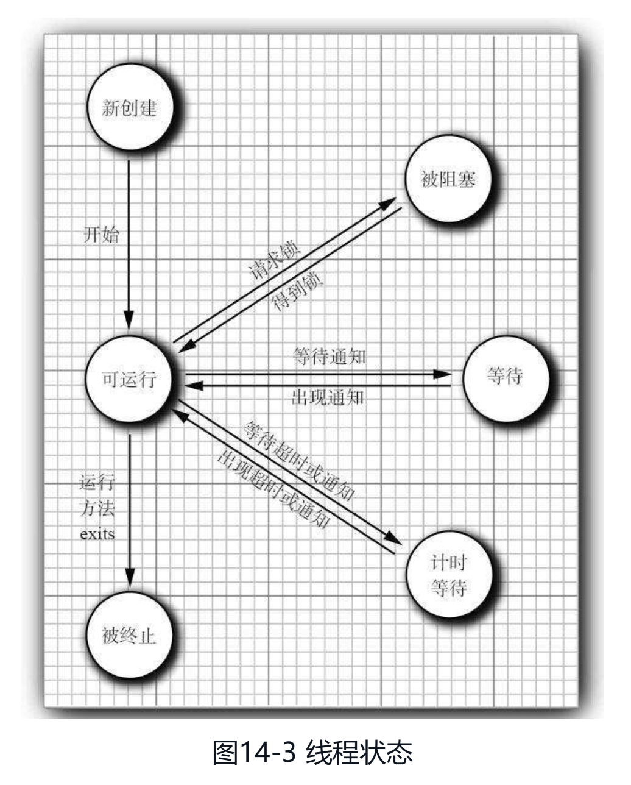
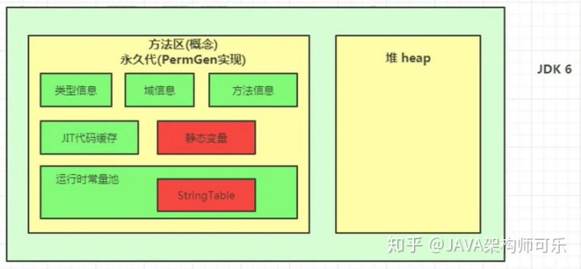
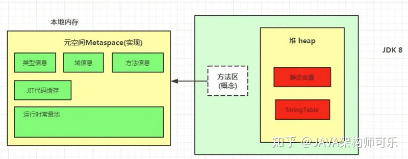

## Java内存模型(Java Memory Model:JMM)

### Java内存模型

* Java内存模型主要指JVM内存模型，JVM内存区域
  
  * 线程私有区域：程序计数器、虚拟机栈、本地方法区/栈
    
  * 线程共享区域：JAVA堆、方法区(运行时常量池)
    
  * 直接内存
  
* JMM主要作用范围
  
  1. JMM描述了线程如何与内存交互
     
  2. JMM描述了JVM如何与计算机内存进行交互
     
  3. JMM围绕原子性，有序性和可见性展开

#### Java内存模型逻辑视图


> 线程栈：线程拥有自己的线程栈，线程栈包含线程调用方法当前执行点相关信息，称调用栈(call stack)。
  线程间互不可见，且拥有相互独立的局部变量。

#### JVM内存






##### JVM内存分类

* 线程私有区域可略称为线程栈)

  * 虚拟机栈(先进后出)
  
      * 局部变量表(使用完毕被GC回收)
        
          * 原始类型：可向其他线程传递原始类型变量的拷贝
            
          * 对象内局部方法中变量
            
          * 指向对象的引用(这个局部变量)
     
      * 操作数栈
      
      * 动态链接
      
      * 方法出口
  
        * 调用时入栈，调用完毕出栈
  
  * 本地方法栈(Native Method Stack)
    
      * 为本地方法(C语言等)服务的栈

        ※ 虚拟机栈为Java方法服务  
    
  * 程序计数器

    内存区域，记录线程当前要执行的指令地址

* 线程共享区域

  * 方法区/永久代
  
    * 存放JVM加载的类、常量及静态变量、即时编译器编译后的代码(JIT代码缓存)等信息
  
    * 运行时常量池
  
      * 包含字面常量和符号引用
      
        * 符号引用：以一组符号(任何形式的字面量)描述索引用的目标
  
          * 编译时，java类不知道引用类的实际内存地址，用符号引用代替
  
          * 装载时，虚拟机可获取引用类的实际内存地址，此时将符号替换为实际内存地址，即直接引用地址
  
      * 定义变量时，栈内存存放的是常量池中常量对应的地址

        

  * 堆
    
    * new出来的对象实体(包含(静态)成员)
    
    * 成员默认值(如果没有赋值)

      * 基本数据类型
        
        * 整型(byte, short, int, long):0
          
        * 浮点型(float,double):0.0
          
        * 字符型(char):'\u0000'空字符
          
        * 布尔型:false
          
        * 引用类型(类，数组，接口，String):null
  
    * 数据使用完毕后不会被立即回收，在垃圾回收机制空闲时回收

* 直接内存

  直接内存不属于JVM(运行时数据区)，可使用基于NIO申请的堆外内存
  
  NIO实现方式
    
    * Channel
    
    * Buffer
  
  NIO可使用Native函数直接分配堆外内存，并使用DirectByteBuffer对象作为这块内存的引用进行操作

  优点：避免Java堆和Native堆中来回复制数据，提高性能

##### JVM内存范例

对象


```java
public class MyRunnable implements Runnable() {
    public void run() {
        methodOne();
    }
    
    public void methodOne() {
        // 对象方法中本地变量 -> 线程栈上
        int localVariable1 = 45;

        // 引用类型本地变量 -> 线程栈上
        // 引用的对象(MySharedObject.sharedInstance) -> 堆上
        MySharedObject localVariable2 =  MySharedObject.sharedInstance;
        //... do more with local variables.

        methodTwo();
    }

    public void methodTwo() {
        // 对象方法引用类型变量 -> 线程栈上
        // 引用的对象(Integer对象) -> 堆上
        Integer localVariable1 = new Integer(99);

        //... do more with local variable.
    }
} 

// MySharedObject -> Object3
public class MySharedObject {
    // 静态成员变量 -> 堆
    public static final MySharedObject sharedInstance = new MySharedObject();

    // 对象成员变量 -> 堆
    public Integer object2 = new Integer(22);
    public Integer object4 = new Integer(44);
    
    // 对象变量 -> 堆
    public long member1 = 12345;
    public long member1 = 67890;
}
```

数组



 执行顺序

1. 代码载入内存，到方法区
   
2. 栈内存：执行到main方法，将main方法压栈，并分配一定空间
   
3. 堆内存：new int型数组时，堆内存分配空间并初始化该对象(默认值)
   
4. 栈内存：在main方法里分配一块空间(步骤2中分配的空间内分配)，用以存放数组名及new出来对象的堆内存地址


数组静态初始化内存分布


#### 2. 线程/JVM和内存交互 

##### JMM和硬件


##### CPU、缓存、主存


#### 3. 原子性

原子性：逻辑上不可分割，要么全部成功要么全部失败(如for循环不是原子性操作)

##### 主(内)存RAM与JMM


##### 主内存与工作内存交互

JMM定义8种原子操作完成主存与工作内存的交互

* lock：作用于主存的变量，把变量标识为线程独占状态
  
* read：作用于主存的变量，把变量从主存传输到线程的工作内存，便于load
  
* load：作用于工作内存的变量，把read读取的变量放入工作内存副本
  
* use：作用于工作内存，把工作内存的变量值传递给执行引擎，当虚拟机需要使用到变量值的字节码指令时，执行该操作
  
* assign：作用于工作内存，把执行引擎收到的值赋给工作内存的变量，当虚拟机遇到需要赋值字节码时执行该操作
  
* store：作用于工作内存，把变量值传输到主存中，以便于write
  
* write：作用于主存，把store获取的值放入主存变量中
  
* unlock：把主存中处于锁定状态的变量释放出来，释放后的变量才可被其他线程锁定

    

操作规则

* read和load、store和write必须成对出现
* 线程assign后必须把变化同步回主存 -> 更改值
* 新变量只允许在主存中生成，不允许工作内存使用未初始化变量
* 只允许单线程一次或多次lock变量，对变量进行lock会清空工作内存中此变量的值
* unlock必须作用于lock对象，且必须先把更改同步回主存

##### long、double特殊规则

64位类型数据long、double，虚拟机允许读写划分为两次32位的操作，
即JVM实现可以不保证load、store、write、read操作的原子性，
但JVM用手段保证long、double读写操作的原子性，几乎没有任何影响

#### 3. 可见性

##### 共享对象可见性
  
如果两个或多个线程共享一个对象，而没有正确使用volatile声明或同步(synchronized)或final字段，那么一个线程对共享对象的更新可能对其他线程不可见
  


解决方案：
  
* 使用volatile：volatile关键字可保证直接从主存中读取一个变量，如果该变量被修改，总是会被写回主存中
      
  * 场景：对写操作较少且新值不依赖于旧值的应用，可减少线程间同步开销
      
* 使用synchronized
      
  * 场景：适合多线程对共享变量的并发访问

##### 竞态条件：race conditions

多个线程共享同一对象，且多个线程更新该共享对象中的变量时，可能出现竞态条件



解决方案：

* 使用Java同步块(同步阻塞synchronized包含的方法称为同步块)
        
  Java同步块可保证同一时刻只有一个线程进入代码临界区，还可保证同步块中所有被访问的变量将会从主存中读入，
  当线程退出同步块代码时，所有被更新的变量会被刷新回主存中，不管该变量是否被声明为volatile

## 线程

### 线程调度

#### 协同式线程调度(顺序执行)

    线程执行时间由线程本身控制，线程执行完后主动通知切换到另一线程，所以没有线程同步问题
    缺点是一个线程出现问题，会阻塞其他线程

#### 抢占式线程调度(抢时间执行)

    Java使用抢占式线程调度，Thread.yield()只可让出CPU执行时间，
    获取CPU执行时间只可通过设置线程优先级，优先级越高越容易被系统选择执行

### 线程状态

* 新创建New
* 可运行Runnable
* 被阻塞Blocked
* 等待Waiting
* 计时等待Timed waiting
* 被终止Terminated

#### 新创建线程

> 使用new操作符创建一个新线程时：该线程还没有开始运行，即它的状态时new

#### 可运行线程

> 调用start方法时，线程处于runnable状态。

> 可运行线程可能正在运行也可能没有运行。取决于操作系统给线程提供的运行时间。
> 即一个可运行线程不必始终保持运行。

#### 被阻塞线程

1. 简而言之请求一个其他线程持有的锁时，该线程被阻塞进入被阻塞状态，直到获取该锁时变成非阻塞(可运行)状态:synchronized()

    -> 获取中断锁

2. I/O

    -> I/O完成

> (引用)线程获取内部对象锁（非java.util.concurrent库中的锁），且该锁被其他线程持有，则该线程进入阻塞状态

> 当该内部对象锁被释放且线程调度器允许本线程持有它的时候，该线程阻塞状态解除变成非阻塞状态

#### 等待线程

简而言之等待另一个线程(可执行)通知

> 当线程等待另一个线程通知调度器一个条件时，它自己进入等待状态。
>* 调用Object.wait方法->未设置Timeout参数则无限等待
>* Thread.join：等待终止指定的线程（即被等待线程结束后，该线程才能进入runnable状态）
>   
>  ->未设置Timeout参数则无限等待
>* 等待java.util.concurrent库中的Lock或Condition时
> 
>* LockSupport.park()使线程无限等待
> 
> 解除
>* notify()
> 
>* notifyAll()

#### 计时等待

> 调用带有超时参数的方法时，该线程进入计时等待（如下列方法设置超时参数时）
> 
>* Thread.sleep
> 
>* Object.wait
> 
>* Thread.join：等待指定的线程死亡或者经过指定的毫秒数
> 
>* Lock.tryLock
> 
>* Condition.await
>
> 这一状态一直保持到期满或者接收到适当的通知

#### 被终止线程

> run方法正常退出而自然死亡
>
> 一个没有捕获的异常终止了run方法而意外死亡
> 
>* stop方法可杀死一个线程，调用该方法抛出ThreadDeath错误对象。该方法已过时




### 守护线程

> 用途：为其他线程提供服务，必须在线程启动前调用
> 
> * 如计时线程：定时发送计时器嘀嗒信号给其他线程或清空过时的高速缓存项的线程。
>
> * 当只剩下守护线程时，虚拟机退出。

## 垃圾回收


### 内存-线程共享

#### 方法区/永久代

主要针对常量池的回收和类型的卸载，收益一般较小

※ JDK8永久代被元数据区(元空间)取代，本质类似，但元空间不在虚拟机中，使用本地内存

HotSpot中方法的变化：

* jdk1.6及之前：有永久代（permanent generation） ，静态变量存放在 永久代上。
  
* jdk1.7：有永久代，但已经逐步“去永久代”，字符串常量池、静态变量移除，保存在堆中。
  
* jdk1.8及之后： 无永久代，类型信息、字段、方法、常量保存在本地内存的元空间，但字符串常量池、静态变量仍留在堆空间。

    

    

    

#### Java堆(从GC角度):类实例区


1. 新生代Young
   
    存放新生对象，由于创建对象频繁，新生代会频繁触发MinorGC进行垃圾回收
   
    1.  Eden区
  
        1. 存储Java新生对象(对象占内存过大则分配到老年代)
  
        2. Eden区内存不够触发MinorGC，对新生代进行一次垃圾回收
    
    2. Survivor From区
  
        上轮GC幸存者，本轮GC被扫描者
    
    3. Survivor To区
  
        保留了一次MinorGC过程中的幸存者

2.  老年代Old

    存放生命周期长的对象，老年对象稳定，MajorGC执行频率低

    Major触发条件

    1. 老年代空间不够(一般MinorGC后)
  
    2. 内存过大对象分配连续空间失败

### 堆垃圾回收算法

#### 新生代：MinorGC

MinorGC采用复制算法

过程：复制->清空->互换
 
1. eden、survivorFrom复制到survivorTo区，年龄+1

    Eden区、SurvivorFrom区中**存活**对象复制到SurvivorTo区并将对象年龄+1

    1. 对象年龄达到老年标准，则放到老年区
  
    2. SurvivorTo区域不够，则放到老年区

      ※ 回收非存活对象，筛选老年标准对象(长期存活且稳定)

2. 清空eden、survivorFrom

3. SurvivorTo和SurvivorFrom互换

    一次MinorGC后，年龄未达到老年标准的留在SurvivorFrom区

#### 老年代：MajorGC

MinorGC采用标记清除算法

1. 标出存活对象，回收没有标记的对象

    * 标记再回收，耗时长
    
    * 产生内存碎片，为减少内存损耗，一般先合并或标记方便下次直接分配
    
    * MajorGC后空间依然不够则抛出OOM(Out Of Memory)
    

