# JVM

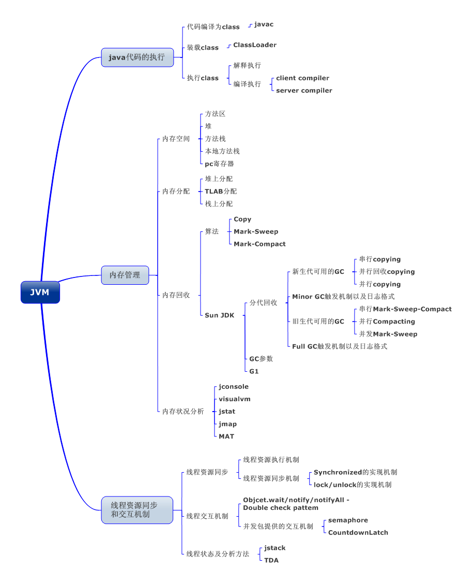

# Java代码的执行

## 代码编译

将源代码编译为字节码class文件

## 类加载

### 类加载机制

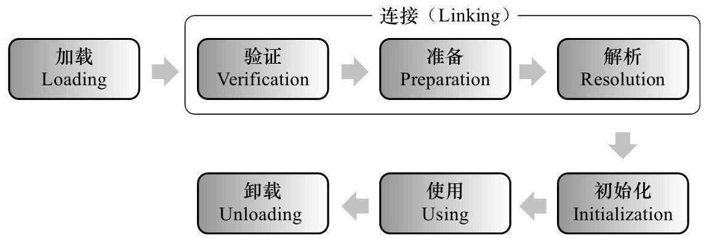

#### 加载Loading

根据指定的全限定名在内存中生成一个代表这个类的java.lang.Class对象，作为方法区中这个类的各种数据的入口

※ 可自定义类加载器

加载对象

1. Class文件

2. ZIP包(如jar包和war包)

3. 运行时计算生成(动态代理)

4. 其他文件生成(如将JSP文件转换成对应Class类)

#### 验证Verification

验证Class文件的字节流中包含的信息是否符合当前虚拟机的要求，且不会危害虚拟机自身安全

#### 准备Preparation

为类变量分配内存并设置初始值，即在方法区中分配变量所使用的的空间并设置初始值

> 初始值含义
> 
> (静态)常量：public static final v = 8080;
> 
> 静态变量：public static v = 8080;
> 
> 初始值|常量|静态变量
> ---|---|---
> 编译阶段|生成ConstantValue属性|※
> 准备阶段|ConstantValue赋给v(8080)|初始值0
> 
> ※ 程序编译后，赋值指令put static被存放于类构造器&lt;client&gt;方法中
> 
> ※ 即静态变量准备阶段不赋值

#### 解析Resolution

将常量池中的符号引用替换为直接引用

##### 符号引用

以一组符号(任何形式的字面量)描述所引用的目标

> 如(符合虚拟机规范)
> 1. CONSTANT_Class_info
> 
> 2. CONSTANT_Field_info
> 
> 3. CONSTANT_Method_info

* 编译时，java类不知道引用目标的实际内存地址，用符号引用代替

* 类装载的解析阶段，虚拟机可获取引用目标的实际内存地址，此时将符号引用替换为实际内存地址，即直接引用地址

##### 直接引用

一种能够确定目标位置的方式

* 指向目标的指针

* 相对偏移量

* 能间接定位到目标的句柄

#### 初始化

执行类构造器&lt;client&gt;方法的过程，此阶段虚拟机开始执行类中编写的程序代码，将主导权移交给应用程序

##### &lt;client&gt;方法

由编译器自动收集类中的类变量的赋值操作/静态变量和静态语句块中的语句合并而成

特点：

1. 子&lt;client&gt;方法执行前，父类&lt;client&gt;方法已经执行完毕

2. 如果类中静态变量没有赋值且没有静态语句块，编译器可不为这个类生成&lt;client&gt;方法

程序初始化时，父类和子类代码执行顺序：

1. 静态变量、代码块
   
    1. 父类的静态变量、静态代码块

        ```java
        static {
            System.out.println();
        }
        ```
       
    2. 子类的静态变量、静态代码块

        ```java
        static {
            System.out.println();
        }
        ```
    
2. 父类

    1. 父类的非静态变量、非静态代码块
    
        ```java
        {
            System.out.println();
        }
        ```
    
    2. 父类的构造函数

        ```java
        public HelloParent {
        }
        ```
    
3. 子类

    1. 子类的非静态变量、非静态代码块

        ```java
        {
            System.out.println();
        }
        ```

    2. 子类的构造函数

        ```java
        public HelloSon {
        }
        ```

##### 不执行初始化场景

1. 通过子类引用父类的静态字段，只会触发父类的初始化，而不会触发子类的初始化
   
2. 定义对象数组，不会触发该类的初始化
   
3. 常量在编译期间会存入调用类的常量池中，本质上并没有直接引用定义常量的类，不会触发定义常量所在的类。
   
4. 通过类名获取Class 对象，不会触发类的初始化
   
5. 通过Class.forName 加载指定类时，如果指定参数initialize 为false 时，也不会触发类初
   始化，其实这个参数是告诉虚拟机，是否要对类进行初始化
   
6. 通过ClassLoader 默认的loadClass 方法，也不会触发初始化动作

#### 使用

#### 卸载

### 类加载器ClassLoader

实现将类加载阶段中通过一个类的全限定名来获取描述该类的二进制字节流这个动作的代码称为类加载器

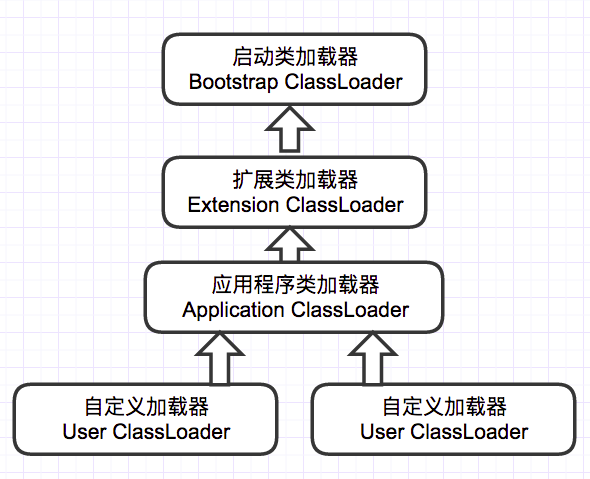

#### 启动类加载器(Bootstrap ClassLoader)

主要加载java的核心类库(到虚拟机内存中)，即加载lib目录下的所有class

* 加载JAVA_HOME/lib目录中的类，如String、System这些类

* 或通过-Xbootclasspath参数指定路径中的，且被虚拟机认可(按文件名识别，如rt.jar)的类

#### 扩展类加载器(Extension ClassLoader)

* 加载JAVA_HOME/lib/ext目录中的类

* 或通过java.ext.dirs系统变量指定路径中的类

#### 应用程序/系统类加载器(Application ClassLoader)

加载用户路径(classpath)上的类库

### 加载模式

JVM通过双亲委派模型进行类的加载，用户可通过java.lang.ClassLoader实现自定义类加载器

#### 双亲委派模型(1.8及以前)

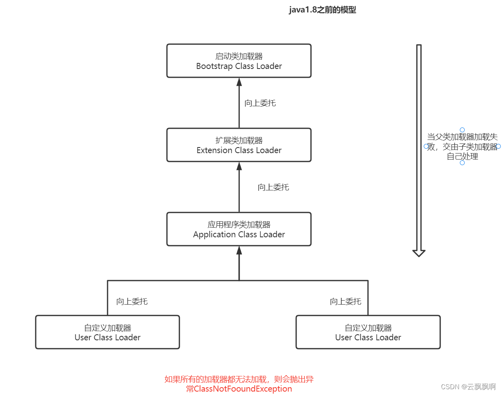

1. 一个类收到类加载请求，不自己加载，而将这个请求委派给父类去完成(每层类加载器都如此直到启动类)

2. 父类无法完成加载请求，子类尝试加载

优点：

* 避免类重复加载，父类加载后子类不必再去加载

* 保护程序安全性，防止核心API被修改

#### 模块下的类加载器(1.9及之后版本)

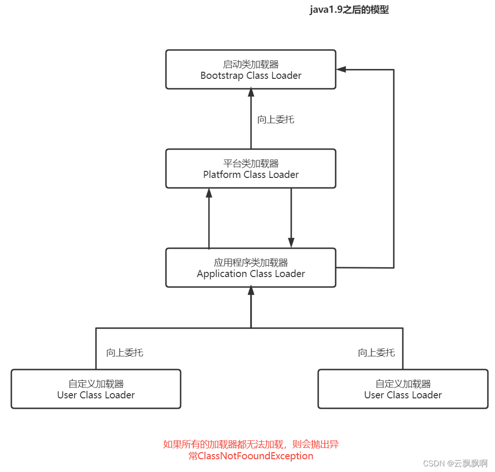

JDK9基于模块化的构建，JDK9之后扩展类加载器被平台类加载器取代

1. 平台类即应用程序类加载器收到加载请求，判断该类是否属于某一系统模块

2. 属于：优先委派给负责那个模块的加载器完成加载

3. 不属于：委派给父类加载器

##### 类加载器归属

1. 启动类加载器负责加载的模块

    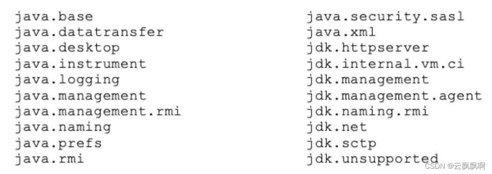

2. 平台类加载器负责加载的模块

    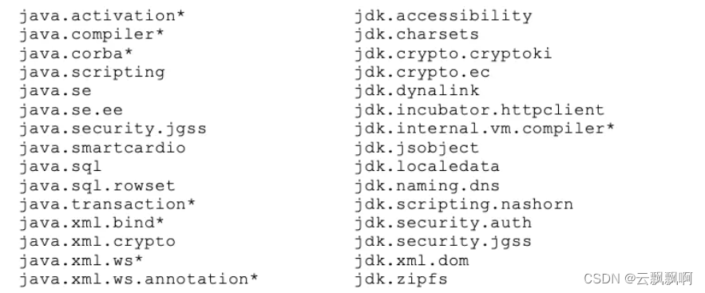

3. 应用程序类加载器负责加载的模块

    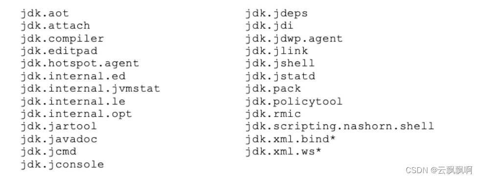

#### 动态模型系统OSGI

OSGI(Open Service Gateway Initiative)，面向Java的动态模型系统

##### 动态改变构造

OSGi 服务平台提供在多种网络设备上无需重启的动态改变构造的功能。为了最小化耦合度和促使
这些耦合度可管理，OSGi 技术提供一种面向服务的架构，它能使这些组件动态地发现对方

##### 模块化编程与热插拔

OSGi 旨在为实现Java 程序的模块化编程提供基础条件，基于OSGi 的程序很可能可以实现模块级
的热插拔功能，当程序升级更新时，可以只停用、重新安装然后启动程序的其中一部分

## 执行class

### 解释执行

### 编译执行(JIT即时编译器)

HotSpot相关

1. client compiler

2. server compiler

# 内存管理

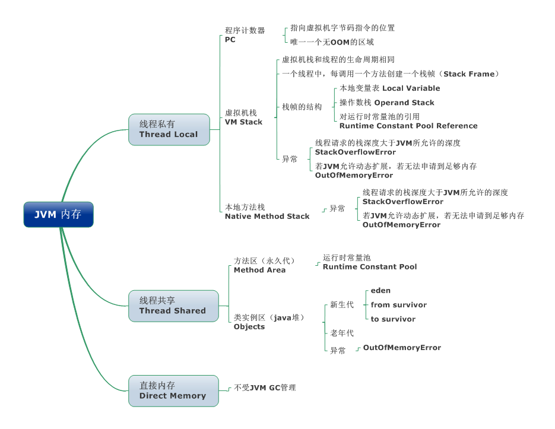

## Java内存模型(Java Memory Model:JMM)

## 内存空间

### JVM内存模型

JVM内存模型主要包含类加载器子系统、运行时数据区、执行引擎。运行时数据区主要由以下五部分组成

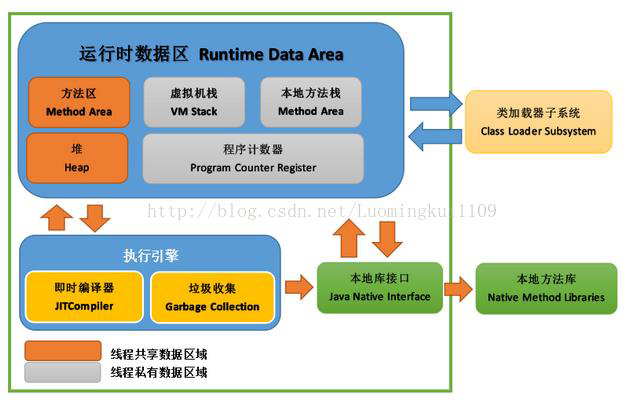

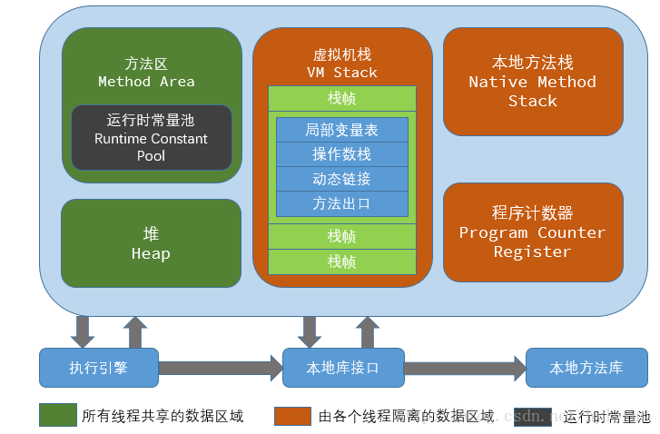

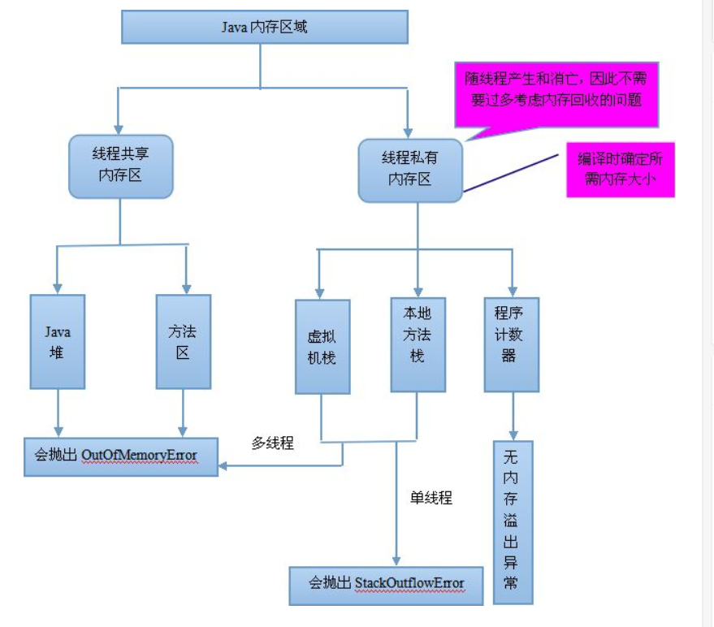

### 类加载器子系统

根据指定的全限定名(类或接口)在内存中生成一个代表这个类的java.lang.Class对象，作为方法区中这个类的各种数据的入口

### 执行引擎

负责执行载入类中方法的指令

### JVM内存模型

* 线程私有区域(可略称为线程栈)

    * 虚拟机栈(先进后出)

        * 局部变量表(使用完毕被GC回收)

            * 原始类型：可向其他线程传递原始类型变量的拷贝

            * 对象内局部方法中变量

            * 指向对象的引用(这个局部变量)

        * 操作数栈

        * 动态链接

        * 方法出口

            * 调用时入栈，调用完毕出栈

    * 本地方法栈(Native Method Stack)

        * 为本地方法(C语言等)服务的栈

          ※ 虚拟机栈为Java方法服务

    * 程序计数器

      内存区域，记录线程当前要执行的指令地址

* 线程共享区域

    * 方法区(概念)/永久代PermGem：JDK1.8前/元空间JDK1.8后

        * 存放JVM加载的类、常量及静态变量、即时编译器编译后的代码(JIT代码缓存)等信息

        * 运行时常量池

            * 包含字面常量和符号引用

            * 定义变量时，栈内存存放的是常量池中常量对应的地址

              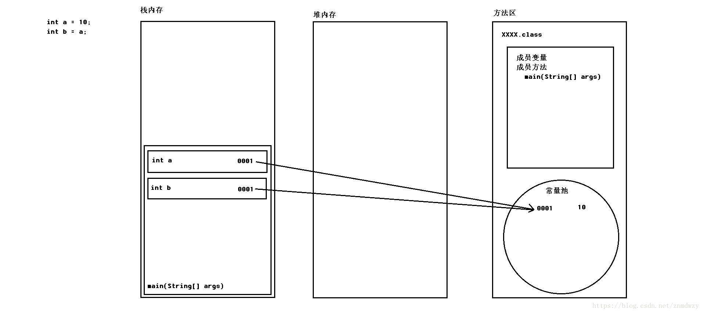

    * 堆

        * new出来的对象实体(包含(静态)成员)

        * 成员默认值(如果没有赋值)

            * 基本数据类型

                * 整型(byte, short, int, long):0

                * 浮点型(float,double):0.0

                * 字符型(char):'\u0000'空字符

                * 布尔型:false

                * 引用类型(类，数组，接口，String):null

        * 数据使用完毕后不会被立即回收，在垃圾回收机制空闲时回收

* 直接内存

  直接内存不属于JVM(运行时数据区)，可使用基于NIO申请的堆外内存

  NIO实现方式

    * Channel

    * Buffer

  NIO可使用Native函数直接分配堆外内存，并使用DirectByteBuffer对象作为这块内存的引用进行操作

  优点：避免Java堆和Native堆中来回复制数据，提高性能

### Java内存模式

Java内存模式指的是一种虚拟机规范，用于屏蔽掉硬件和操作系统的内存访问差异，以实现让Java程序在各种平台下都能达到一致的(并发)效果

Java内存模型JMM：调用栈和本地变量存放在线程栈上，对象存放在堆上

线程栈：线程拥有自己的线程栈，线程栈包含线程调用方法当前执行点相关信息，称调用栈(call stack)。线程间互不可见，且拥有相互独立的局部变量。

* 线程栈

    * 本地变量

        * 原始类型
        
        * 指向对象的引用
    
    * 对象内的方法的本地变量
          
* 堆

    * 对象
    
    * 成员变量
      
        * 类变量:静态成员变量
      
        * 实例变量:对象成员变量
      
#### JMM主要作用范围

1. JMM描述了线程如何与内存交互

2. JMM描述了JVM如何与计算机内存进行交互

3. JMM围绕原子性，有序性和可见性展开

#### JMM范例

* 对象

    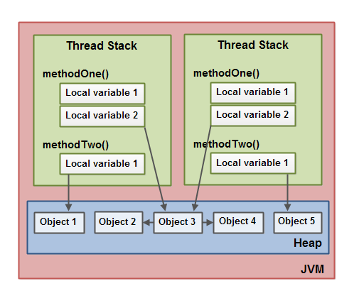

    ```java
    public class MyRunnable implements Runnable() {
        public void run() {
            methodOne();
        }
        
        public void methodOne() {
            // 对象方法中本地变量 -> 线程栈上
            int localVariable1 = 45;
    
            // 引用类型本地变量 -> 线程栈上
            // 引用的对象(MySharedObject.sharedInstance) -> 堆上
            MySharedObject localVariable2 =  MySharedObject.sharedInstance;
            //... do more with local variables.
    
            methodTwo();
        }
    
        public void methodTwo() {
            // 对象方法引用类型变量 -> 线程栈上
            // 引用的对象(Integer对象) -> 堆上
            Integer localVariable1 = new Integer(99);
    
            //... do more with local variable.
        }
    } 
    
    // MySharedObject -> Object3
    public class MySharedObject {
        // 静态成员变量 -> 堆
        public static final MySharedObject sharedInstance = new MySharedObject();
    
        // 对象成员变量 -> 堆
        public Integer object2 = new Integer(22);
        public Integer object4 = new Integer(44);
        
        // 对象变量 -> 堆
        public long member1 = 12345;
        public long member1 = 67890;
    }
    ```

* 数组(定义一维数组必须显示指明数组长度，多维数组必须时其一维数组长度必须首先指明)

    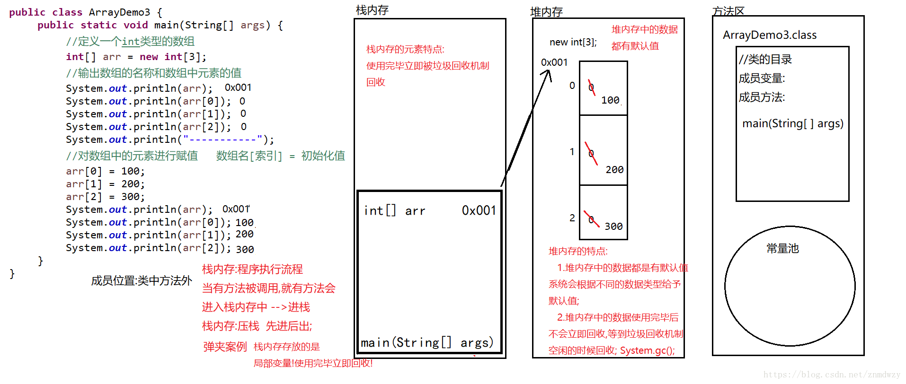
    
    执行顺序
    
    1. 代码载入内存，到方法区
    
    2. 栈内存：执行到main方法，将main方法压栈，并分配一定空间
    
    3. 堆内存：new int型数组时，堆内存分配空间并初始化该对象(默认值)
    
    4. 栈内存：在main方法里分配一块空间(步骤2中分配的空间内分配)，用以存放数组名及new出来对象的堆内存地址
    
        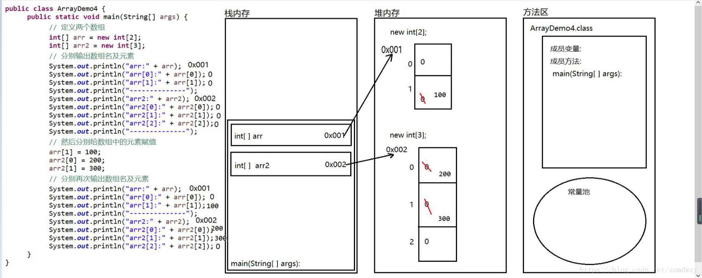
    
        数组静态初始化内存分布
    
        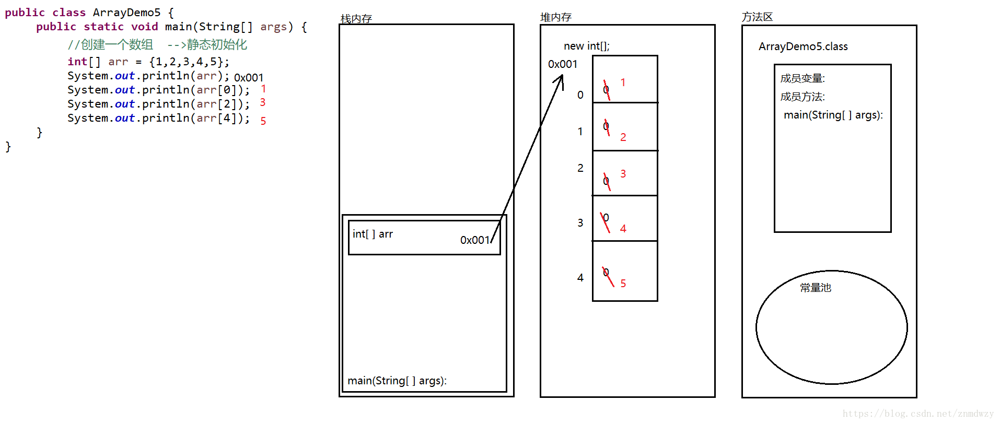

### Java内存模型逻辑视图


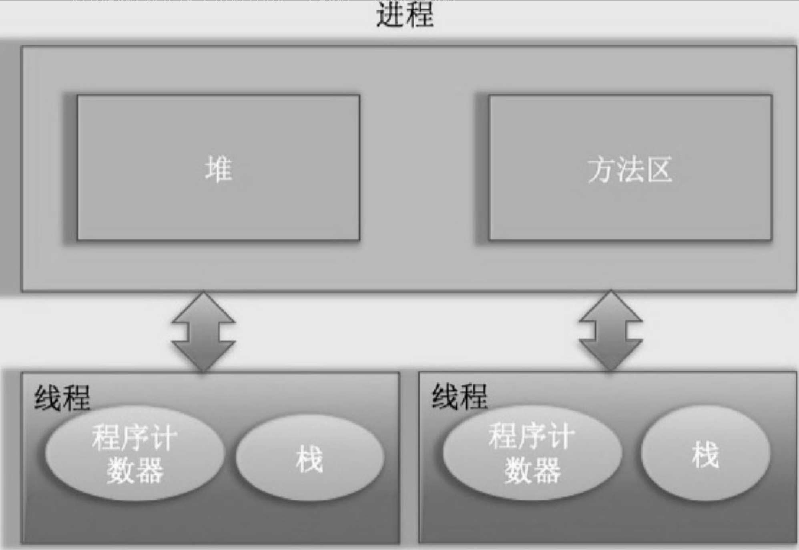

### 线程和内存交互

#### 硬件内存架构

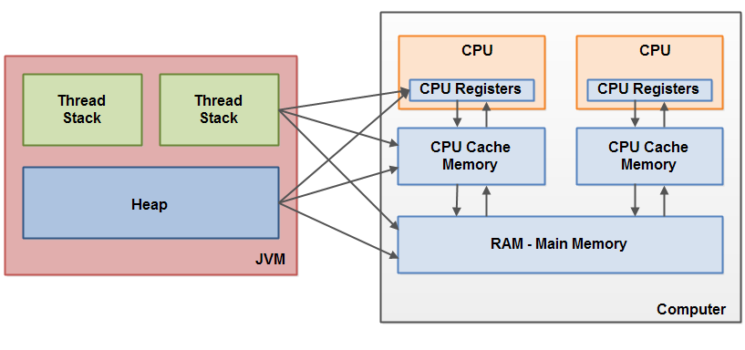

* 多CPU

    * 可并行执行多个线程
    
    * 多线程时，每个CPU上可并发执行多个线程(时间片)

* CPU寄存器

    CPU在寄存器上执行操作的速度远大于在主存上执行的速度

* 高速缓存cache

* 主内存

    * 硬件内存架构并不区分线程栈和堆

    * 对于硬件而言，所有的线程栈和堆都分布在主内存中
    
    * 部分线程栈和堆可能出现在CPU内部寄存器和CPU缓存中

#### CPU、缓存、主存

1. 运作原理

    * 读操作
      
        当CPU读取主存时，先将主存部分读到CPU缓存中，然后在寄存器中执行操作
    
    * 写操作
    
        当CPU需要将结果写回主存中时，它会将内部寄存器的值刷新到缓存中，然后在某个时间点将值刷新回主存
    
        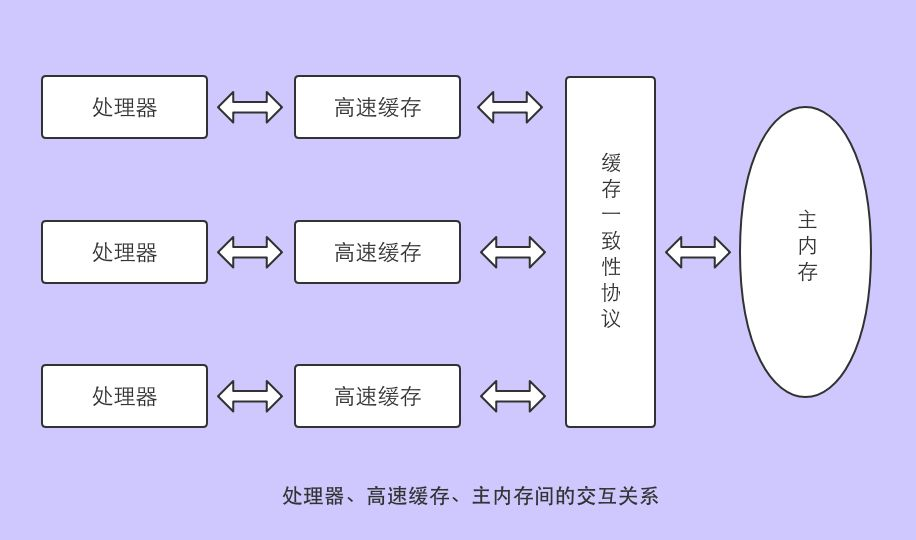
    
        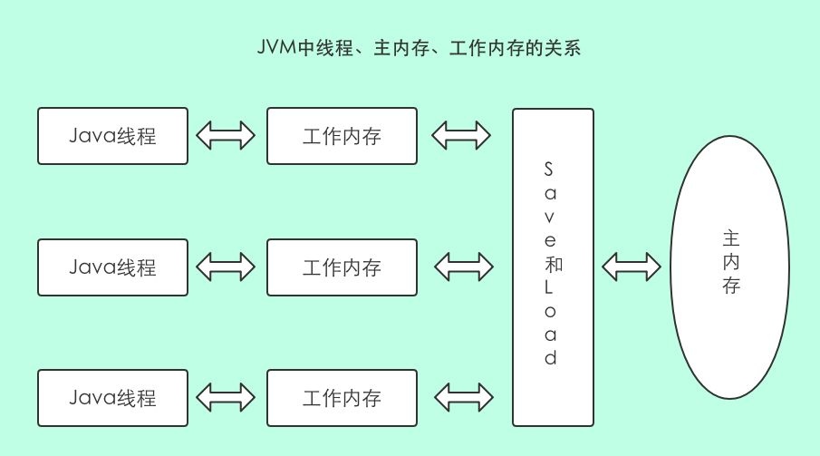
    
        工作内存：JVM使用的内存，通常理解为线程私有区域(虚拟机栈、本地方法栈、程序计数器)

2. 缓存一致性问题

    多处理器共享同一主存，当运算任务涉及到同一主存区域时可能导致各自的缓存数据不一致，通过缓存一致性协议解决

3. 指令重排序问题

    为了使处理器内部运算单元能尽量被充分利用，处理器对输入代码进行乱序执行优化，处理器在运算后将乱序执行结果重组以保证该结果与顺序执行的结果一致，
    但并不保证语句执行的先后顺序与代码中顺序一致。
    
    导致如果计算任务之间有依赖关系时，代码的先后顺序并不能达到预期结果，可通过禁止指令重排解决

#### 线程和内存交互

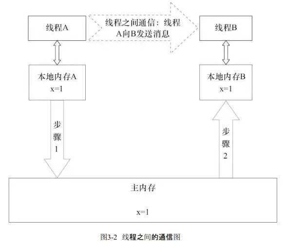

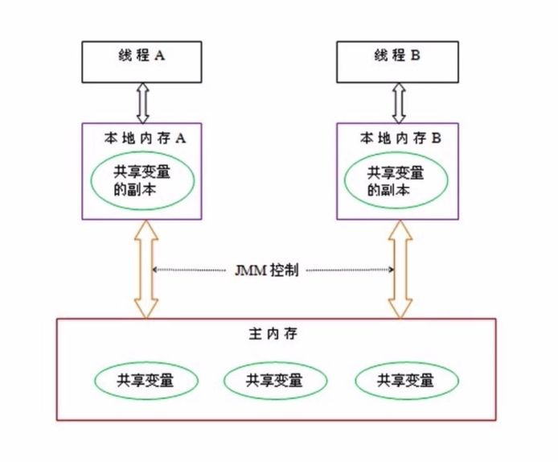

1. 线程A把本地内存A中更新过的共享变量刷新到主内存中

2. 线程B到主内存中去读取线程A更新过的共享变量

### 原子性

原子性：逻辑上不可分割，要么全部成功要么全部失败(如for循环不是原子性操作)

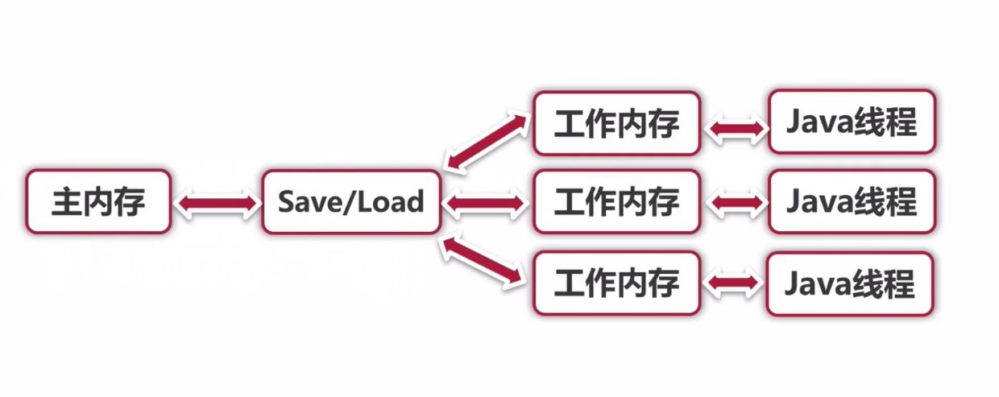

#### 主内存与工作内存交互

JMM定义8种原子操作完成主存与工作内存的交互

* lock锁定：作用于主存的变量，把变量标识为线程独占状态

* read读取：作用于主存的变量，把变量从主存传输到线程的工作内存，便于load

* load载入：作用于工作内存的变量，把read读取的变量放入工作内存副本

* use使用：作用于工作内存，把工作内存的变量值传递给执行引擎，当虚拟机需要使用到变量值的字节码指令时，执行该操作

* assign赋值：作用于工作内存，把执行引擎收到的值赋给工作内存的变量，当虚拟机遇到需要赋值字节码时执行该操作

* store存储：作用于工作内存，把变量值传输到主存中，以便于write

* write写入：作用于主存，把store获取的值放入主存变量中

* unlock解锁：把主存中处于锁定状态的变量释放出来，释放后的变量才可被其他线程锁定

  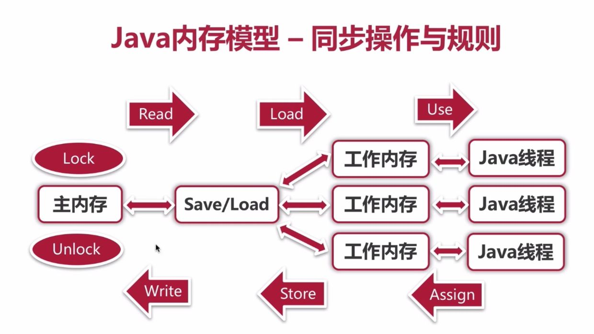

操作规则

* read和load、store和write必须成对出现
* 线程assign后必须把变化同步回主存 -> 更改值
* 新变量只允许在主存中生成，不允许工作内存使用未初始化变量
* 同一时刻只允许一个线程lock变量，对变量进行lock会清空工作内存中此变量的值
* unlock必须作用于lock对象，且必须先把更改同步回主存

#### long、double特殊规则

64位类型数据long、double，虚拟机允许读写划分为两次32位的操作，
即JVM实现可以不保证load、store、write、read操作的原子性，
但JVM用手段保证long、double读写操作的原子性，几乎没有任何影响

### 可见性

#### 共享对象可见性

如果两个或多个线程共享一个对象，而没有正确使用volatile声明或同步(synchronized)或final字段，那么一个线程对共享对象的更新可能对其他线程不可见


解决方案：

* 使用volatile：volatile关键字可保证直接从主存中读取一个变量，如果该变量被修改，总是会被写回主存中

    * 场景：对写操作较少且新值不依赖于旧值的应用，可减少线程间同步开销

* 使用synchronized

    * 场景：适合多线程对共享变量的并发访问
    
* final关键字

    final可以保证可见性，被final修饰的字段一旦被初始化完成，其他线程就可以看见final字段值

#### 竞态条件：race conditions

多个线程共享同一对象，且多个线程更新该共享对象中的变量时，可能出现竞态条件(以下例子原本想将count+2)


解决方案：

* 使用Java同步块(同步阻塞synchronized包含的方法称为同步块)

  Java同步块可保证同一时刻只有一个线程进入代码临界区，还可保证同步块中所有被访问的变量将会从主存中读入，
  当线程退出同步块代码时，所有被更新的变量会被刷新回主存中，不管该变量是否被声明为volatile

### 有序性

在本线程内观察所有的操作都是有序的，在一个线程内观察另一个线程，所有操作都是无序的

前半句指as-if-serial语义

后半句指指令重排序和工作内存与主内存延迟现象

Java提供volatile和synchronized保证有序性

### 指令序列的重排序

* 重排序分类
  
    * 编译器优化的重排序
    
        编译器在不改变单线程程序语义的前提下，可以重新安排语句的执行顺序
    
    * 指令级并行的重排序
    
        现代处理器采用了指令级并行技术来将多条指令重叠执行。
        如果不存在数据依赖(单个处理器中的依赖)，处理器可以改变语句对应机器指令的执行顺序
    
    * 内存系统的重排序
    
        由于处理器使用缓存和读/写缓冲区，使得加载和存储操作看上去是在乱序执行
    
        

* 重排序对内存可见性影响

    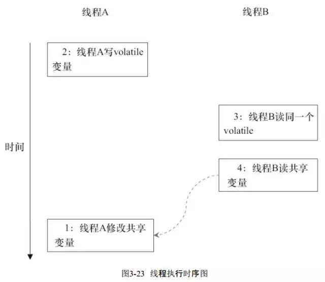

    * 语句1、2之间没有数据依赖关系，语句1、2可能被重排
      
    * 语句3、4之间没有数据依赖关系，语句3、4可能被重排
    
    * 读线程B执行4时，不一定能读取到线程A执行语句1对变量的修改
    
## 内存分配TODO

### 堆上分配

### TLAB分配

### 栈上分配

## 内存回收

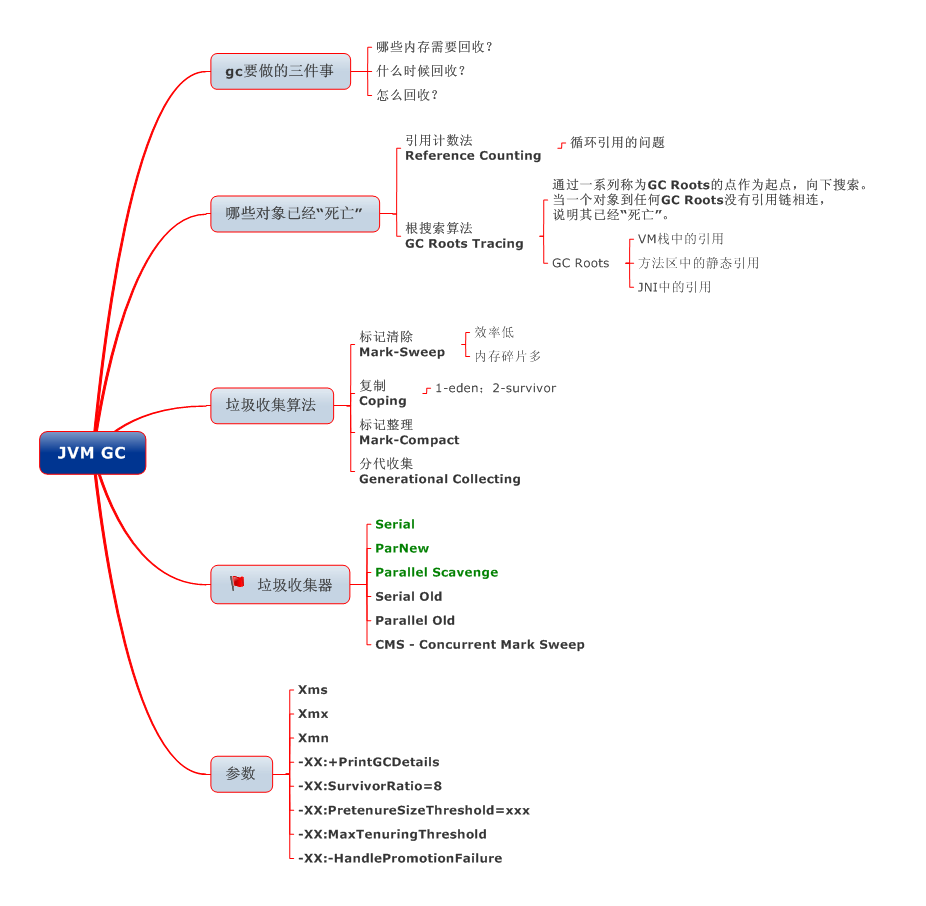

### 线程共享内存

#### 方法区/永久代

主要针对常量池的回收和类型的卸载，收益一般较小

※ JDK8永久代被元数据区(元空间)取代，本质类似，但元空间不在虚拟机中，使用本地内存

HotSpot中方法的变化：

* jdk1.6及之前：有永久代（permanent generation） ，静态变量存放在 永久代上。
  
* jdk1.7：有永久代，但已经逐步“去永久代”，字符串常量池、静态变量移除，保存在堆中。
  
* jdk1.8及之后： 无永久代，类型信息、字段、方法、常量保存在本地内存的元空间，但字符串常量池、静态变量仍留在堆空间。

    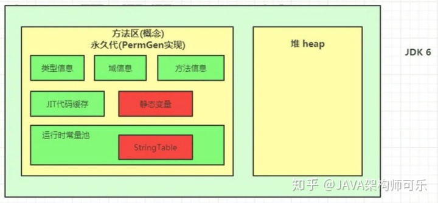

    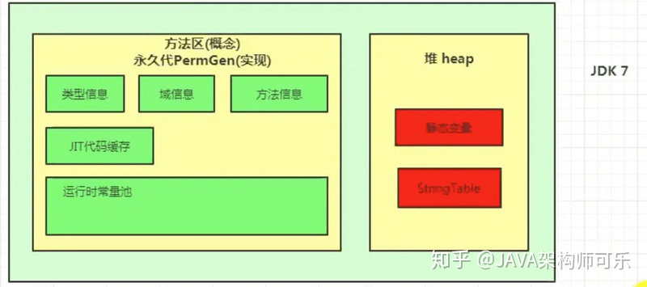

    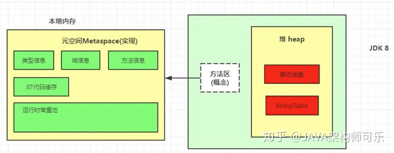

#### Java堆(从GC角度):类实例区

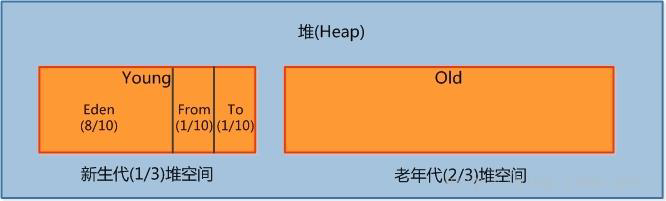

1. 新生代Young
   
    存放新生对象，由于创建对象频繁，新生代会频繁触发MinorGC进行垃圾回收
   
    1.  Eden区
  
        1. 存储Java新生对象(对象占内存过大则分配到老年代)
  
        2. Eden区内存不够触发MinorGC，对新生代进行一次垃圾回收
    
    2. Survivor From区
  
        上轮GC幸存者，本轮GC被扫描者
    
    3. Survivor To区
  
        保留了一次MinorGC过程中的幸存者

2.  老年代Old

    存放生命周期长的对象，老年对象稳定，MajorGC执行频率低

    Major触发条件

    1. 老年代空间不够(一般MinorGC后)
  
    2. 内存过大对象分配连续空间失败

### 确定垃圾

#### 引用计数法

对象如果没有任何与之关联的引用，即它们的引用计数都为0，则说明对象不太可能用到，那么这个对象就是可回收对象

不足：循环引用会导致内存泄漏

#### 根搜索算法/可达性分析(HotSpot虚拟机采用)

通过一系列GC roots对象作为起点向下搜索，当一个对象到GC roots之间没有可达路径，称对象不可达

※ 不可达对象不等价于可回收对象，还需至少经过两次标记过程，标记之后仍为可回收则对其进行回收

### 堆垃圾回收算法

#### 标记清除算法Mark-Sweep

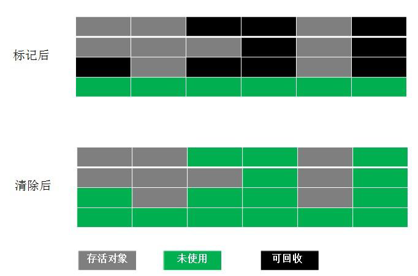

过程
1. 标注

    标出所有需要回收的对象

2. 清除

    回收被标记的对象所占用的空

缺点：内存碎片碎片话严重，后续可能分配不到连续可利用空间

#### 复制算法Copying

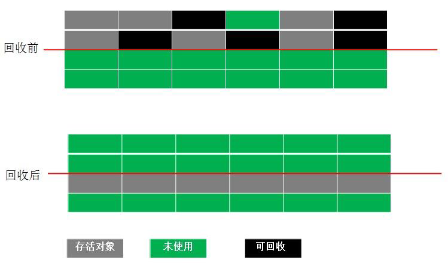

过程

1. 复制

    1. 内存容量分为大小相等的两块，每次使用其中一块

    2. 当这一块内存满后将存活对象复制到另一块
   
1. 清空

    把已使用的内存清除

优点：实现简单、内存效率高、不易产生碎片

缺点：可用内存小，存活对象增多，复制算法效率大大降低

#### 标记整理算法Mark-Compact

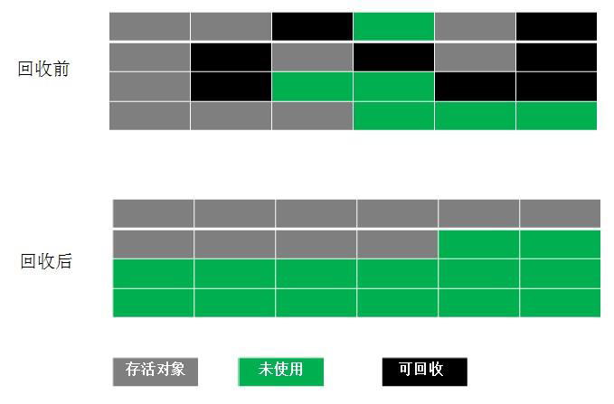

过程

1. 标记

   标出所有需要回收的对象

2. 整理

   将存活对象移向内存一端

3. 清除

   清除端边界外对象

#### 分代收集算法/垃圾回收机制

商业虚拟机的垃圾收集器主要采用分代收集

* 新生代收集、老年代收集、混合收集、整堆收集

混合收集：整个新生代和部分老年代的垃圾收集，G1

整堆收集：目标为整个堆和方法区的垃圾收集

* 方法区主要针对常量池的回收和类型的卸载，收益一般较小

##### 新生代垃圾回收(MinorGC)：复制算法


过程：复制->清空->互换

1. eden、survivorFrom复制到survivorTo区，年龄+1

    Eden区、SurvivorFrom区中**存活**对象复制到SurvivorTo区并将对象年龄+1

    1. 对象年龄达到老年标准(默认15)，则放到老年区
  
    2. SurvivorTo区域不够，则放到老年区

       ※ 回收非存活对象，筛选老年标准对象(长期存活且稳定)

2. 清空eden、survivorFrom

3. SurvivorTo和SurvivorFrom互换

    一次MinorGC后，年龄未达到老年标准的留在SurvivorFrom区

##### 老年代垃圾回收(MajorGC)：标记整理算法
 
MajorGC后空间依然不够则抛出OOM(Out Of Memory)，CMS

#### 分区收集算法

将整个堆空间划分为连续不同的小区间，每个小区间独立使用，独立回收

优点：可以控制一次回收多少个小区间，根据目标停顿时间，每次合理低回收若干个小区间(而不是整个堆)，从而减少一次GC所产生的停顿

### 垃圾收集器

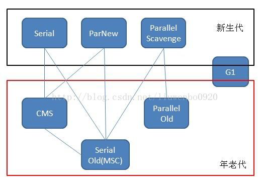

区别|Serial|ParNew|ParallelScavenge|SerialOld|CMS|ParallelOld|G1
---|---|---|---|---|---|---|---
分代|新生代|新生代|新生代|老年代|老年代|老年代|新生代+老年代|
HotSpot默认|客户端默认|服务端默认|-|客户端默认Old|
算法|复制|复制|多线程复制|标记整理|多线程标记清除|多线程标记整理|标记整理
特点|单线程、收集时暂停其他工作线程|单线程、收集时暂停其他工作线程|关注吞吐量|同Serial|初始(暂停线程)/并发(线程跟踪)/重新(暂停线程)标记，并发清除|-|混合收集，区域划分优先级列表收集
组合|客户端：Serial+SerialOld|服务端：ParNew+CMS|ParallelScavenge+ParallelOld:适用于后台运算而不需要太多交互的分析任务

#### finalize方法

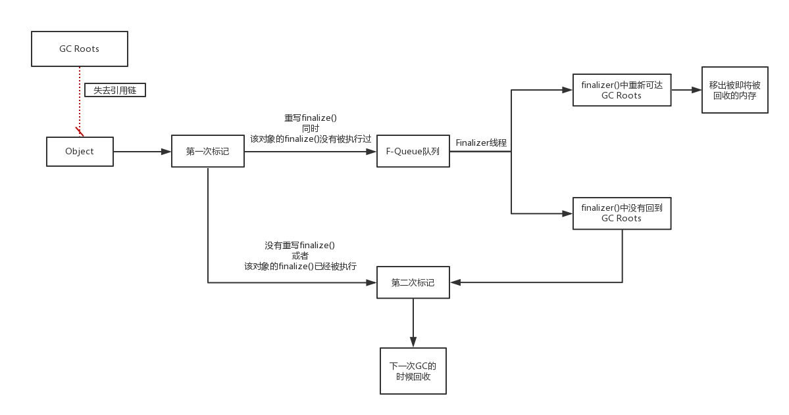

finalize方法

* 对象第一次进入回收队列：一个对象只能执行一次，只能在第一次进入被回收的队列，且对象所属于的类重写了该方法才会被执行

* 对象第二次进入回收队列：不再执行finalize方法，而是被二次标记，在下一次GC时候直接被GC

#### 新生代垃圾收集器

##### Serial收集器

特点：

1. 复制算法

2. 单线程收集器

    * 一个CPU或一条线程收集垃圾
    
    * 垃圾收集时需暂停其他工作线程
    
3. 简单高效，没有线程交互开销

4. JVM运行在Client模式下默认新生代垃圾收集器

##### ParNew收集器(Serial+多线程)

Serial收集器的多线程版本

特点：

1. 复制算法

2. 单线程收集器

    * 一个CPU或一条线程收集垃圾

    * 垃圾收集时需暂停其他工作线程
    
3. JVM运行在Server模式下默认新生代垃圾收集器

##### Parallel Scavenge收集器(多线程复制算法、高效)

特点：

1. 复制算法

2. 该算法关注程序达到一个可控制的吞吐量(自适应调节)，提高吞吐量

    * 吞吐量=运行用户代码时间/CPU总消耗时间
    
    * CPU总消耗时间=运行用户代码时间+垃圾收集时间

#### 老年代垃圾收集器

##### Serial Old收集器

特点：

1. 标记整理算法

2. 其他特点同Serial收集器

3. JVM运行在Client模式下默认老年代垃圾收集器


##### Parallel Old收集器(多线程标记整理算法)

特点：

1. 标记整理算法

2. 获取最短

##### CMS(Concurrent Mark Sweep)收集器(多线程标记清除算法)

特点：

1. 多线程标记清除算法

2. 获取最短垃圾回收停顿时间

过程

1. 初始标记：暂停工作线程

    标记GC Roots直接关联对象，速度快

2. 并发标记

    GC Roots跟踪，和用户线程一起工作

3. 重新标记：暂停工作线程

    修正并发标记期间，重新标记用户线程运行导致的标记变动

4. 并发清除

    清除目标对象

    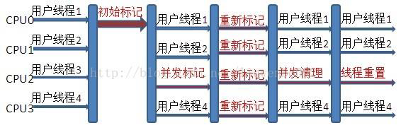

##### G1(Garbage first)收集器

特点：

1. 标记整理算法，不产生内存碎片

2. 精确控制停顿时间，保证吞吐量前提下，实现低停顿GC

3. 区域划分：堆内存划分为大小固定的几个独立区域

4. 优先级区域回收机制：后台维护一个优先级列表(包含区域垃圾收集进度)
    
### JAVA引用类型

#### 强引用

把一个对象赋值给一个引用变量，这个引用变量就是一个强引用

特点：

1. 当一个对象被强引用变量引用时，它处于可达状态，不会被GC回收，即使以后不会用到

2. 造成内存泄漏的主要原因之一

#### 软引用

需要SoftReference类实现

特点：

1. 只有软引用的对象来说，内存足够不被GC回收，内存不足被回收

2. 适用于内存敏感的程序

#### 弱引用

需要WeekReference类实现

特点：

1. 只有弱引用的对象来说，只要GC则被回收，不管内存充不充足

#### 虚引用

需要PhantomReference类实现

特点：

1. 不能单独使用，必须和引用队列联合使用

2. 主要用于跟踪对象被垃圾回收的状态

3. 如果一个对象仅持有虚引用，那么它就和没有任何引用一样，随时可能会被回收

## 内存状况分析

### jconsole

### visualvm

### jstat

虚拟机统计信息监视工具，用于监视虚拟机各种运行状态信息

### jmap

Java内存映像工具，用于生成堆转储快照

### jstack

堆栈跟踪工具，用于生成虚拟机当前时刻的线程快照

### MAT

# 线程资源同步和交互机制

## 线程

### 线程调度

#### 协同式线程调度(顺序执行)

    线程执行时间由线程本身控制，线程执行完后主动通知切换到另一线程，所以没有线程同步问题
    缺点是一个线程出现问题，会阻塞其他线程

#### 抢占式线程调度(抢时间执行)

    Java使用抢占式线程调度，Thread.yield()只可让出CPU执行时间，
    获取CPU执行时间只可通过设置线程优先级，优先级越高越容易被系统选择执行

### 线程状态

* 新创建New
* 可运行Runnable
* 被阻塞Blocked
* 等待Waiting
* 计时等待Timed waiting
* 被终止Terminated

#### 新创建线程

> 使用new操作符创建一个新线程时：该线程还没有开始运行，即它的状态时new

#### 可运行线程

> 调用start方法时，线程处于runnable状态。

> 可运行线程可能正在运行也可能没有运行。取决于操作系统给线程提供的运行时间。
> 即一个可运行线程不必始终保持运行。

#### 被阻塞线程

1. 简而言之请求一个其他线程持有的锁时，该线程被阻塞进入被阻塞状态，直到获取该锁时变成非阻塞(可运行)状态:synchronized()

   -> 获取中断锁

2. I/O

   -> I/O完成

> (引用)线程获取内部对象锁（非java.util.concurrent库中的锁），且该锁被其他线程持有，则该线程进入阻塞状态

> 当该内部对象锁被释放且线程调度器允许本线程持有它的时候，该线程阻塞状态解除变成非阻塞状态

#### 等待线程

简而言之等待另一个线程(的满足条件)通知

> 当线程等待另一个线程通知调度器一个条件时，它自己进入等待状态。
>* 调用Object.wait方法->未设置Timeout参数则无限等待
>* Thread.join：等待终止指定的线程（即被等待线程结束后，该线程才能进入runnable状态）
   >
   >  ->未设置Timeout参数则无限等待
>* 等待java.util.concurrent库中的Lock或Condition时
>
>* LockSupport.park()使线程无限等待
>
> 解除
>* notify()
>
>* notifyAll()

#### 计时等待

> 调用带有超时参数的方法时，该线程进入计时等待（如下列方法设置超时参数时）
>
>* Thread.sleep
>
>* Object.wait
>
>* Thread.join：等待指定的线程死亡或者经过指定的毫秒数
>
>* Lock.tryLock
>
>* Condition.await
>
> 这一状态一直保持到期满或者接收到适当的通知

#### 被终止线程

> run方法正常退出而自然死亡
>
> 一个没有捕获的异常终止了run方法而意外死亡
>
>* stop方法可杀死一个线程，调用该方法抛出ThreadDeath错误对象。该方法已过时

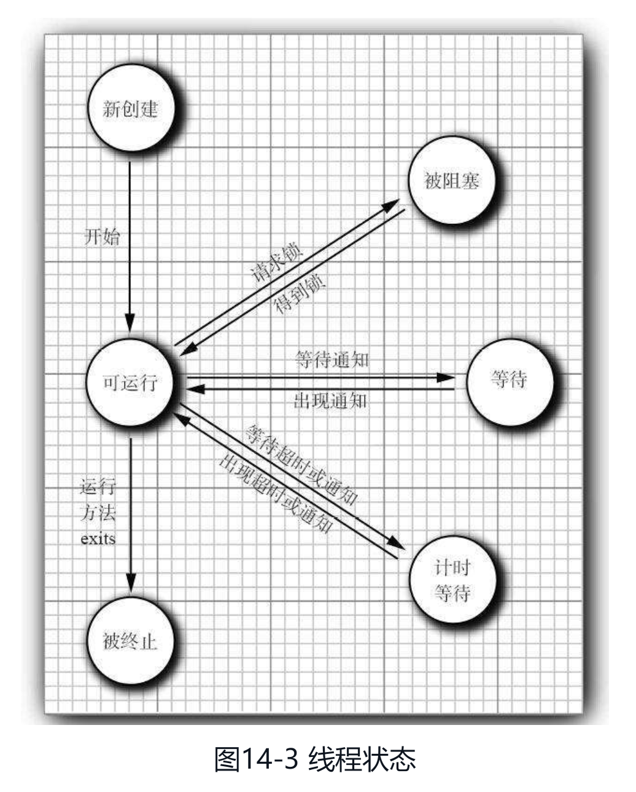

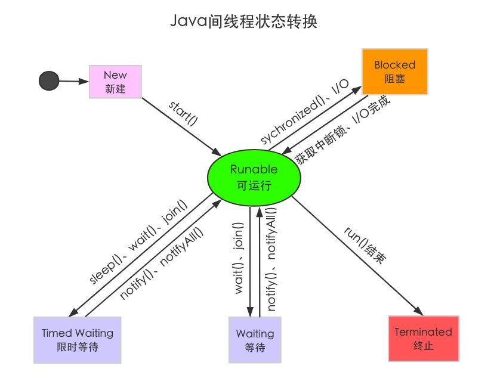

### 线程礼让

Thread.yield方法，不一定礼让成功

### 线程合并/插队

t1.join();其他线程阻塞让t1线程优先执行，执行完t1后再执行其他线程

### 守护线程

> 用途：为其他线程提供服务，必须在线程启动前调用
>
> * 如计时线程：定时发送计时器嘀嗒信号给其他线程或清空过时的高速缓存项的线程
>
> * 当只剩下守护线程时，虚拟机退出

### 内存溢出/内存泄漏

* 内存溢出

    程序申请内存时，没有足够的内存该空间供其使用

* 内存泄漏

    程序在申请内存后，无法释放已申请的内存空间的现象。内存泄漏最终将导致内存溢出
  
### 堆溢出原因

堆用于存储对象实例，不断创建对象并保证GC Roots到对象有可达路径即可避免垃圾回收，随着对象数量的增加，总容量初级最大堆容量后会OOM

堆OOM可通过内存映像分析工具堆Dump出的堆转储快照分析，确认内存中导致OOM的对象是否必要，判断是内存溢出还是内存泄漏

* 内存溢出(内存中对象都必须存活)

    * 检查JVM堆参数，是否有向上调整的空间

    * 检查代码：声明周期过长、持有状态时间过长、存储结构设计不合理等

* 内存泄漏

    通过工具查看泄漏对象到GC Roots的引用链，定位内存泄漏位置

### 栈溢出原因

HotSpot不区分虚拟机栈和本地方法栈，故设置本地方法栈大小的参数没有意义，栈容量只能由-Xss参数设置

栈溢出异常分类

* StackOverFlowError

    如果线程请求的栈深度大于虚拟机所允许的深度，抛出该错误。如递归调用不断调用自己，有明确的错误堆栈分析

* OutOfMemoryError

    * 如果JVM栈可以动态扩展，当扩展无法申请到足够内存时抛出该异常

    * HotSpot不支持虚拟机栈扩展，故线程运行时不会因为扩展而导致栈溢出，只会在创建线程申请内存时因无法获得足够内存而出现OOM

### 运行时常量池溢出原因

String的intern是一个本地方法(字符串拘留)

* JDK6及之前常量池分配在永久代，可通过-xx:PermSize和-xx:MaxPermSize限制永久代大小，间接限制常量池

* JDK6之后，常量池移至堆中，不会出现该问题

### 方法区溢出原因

方法区/永久代主要存放类型信息，如类名、访问修饰符、方法描述等，只要在运行时不断产生大量类，方法区就会溢出。如通过反射或CGLib操作字节码会在运行时生成大量类

JDK8元空间提供参数作为防御措施，如-xxMetaspaceSize指定元空间大小，达到该值会触发GC进行类型卸载

### 对象分配内存方式

对象所需内存大小在类加载完成后即可确定，分配空间的任务实际上等于把一块确定大小的内存块从Java堆中划分出来

* 指针碰撞

    Java堆内存规整，被使⽤过的内存放在以便，空闲的放在另一边，中间放着一个指针，作为分界指示器，分配内存就是把指针向空闲方向挪动一段与对象大小相等的距离

* 空闲列表

    Java堆内存不规整，虚拟机必须维护一个列表记录哪些内存可用，在分配时从列表中找到一块足够大的空间划分给对象并更新列表记录