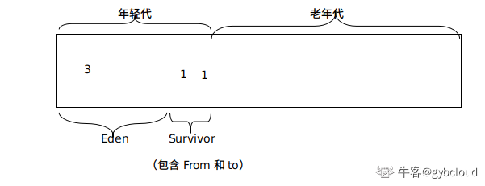

## 虚拟机参数

* Xms：初始内存(初始堆大小)
* Xmx：最大内存
* Xmn：新生代内存，新生代=Eden+Survivor(from/to)
* Xss：栈大小，即创建线程后，分配给每一个线程的内存大小
* -XX:MaxPermSize
  
    老年代/持久代最大值大小
  
* -XX:NewRatio=n
  
    设置老年代和新生代的比值，如3，则老年代3：新生代1
  
* -XX:SurvivorRatio=n

    设置新生代中Eden区和两个Survivor区(from=to)的比值，如3，则Eden：SurvivorFrom:SurvivorTo=3:1:1

收集器

* -XX:UseSerialGC：设置串行收集器
* -XX:UseParallelGC：设置并行收集器
* -XX:UseParallelOldGC：设置并行老年代收集器
* -XX:UseConcMarkSweepGC：设置并发收集器CMS
  
垃圾回收统计信息

* -XX:PrintGC
* -XX:PrintGCDetails
* -XX:PrintGCTimeStamps
  
并行收集器设置

* -XX:ParallelGCThreads=n

    设置并行收集器收集时使用的CPU数。并行收集线程数。
* -XX:MaxGCPauseMillis=n
  
    设置并行收集最大暂停时间

* -XX:GCTimeRatio=n
  
    设置垃圾回收时间占程序运行时间的百分比。公式为1/(1+n)

并发收集器设置

* -XX:+CMSIncrementalMode
  
    设置为增量模式。适用于单CPU情况。

* -XX:ParallelGCThreads=n
  
    设置并发收集器年轻代收集方式为并行收集时，使用的CPU数。并行收集线程数。

