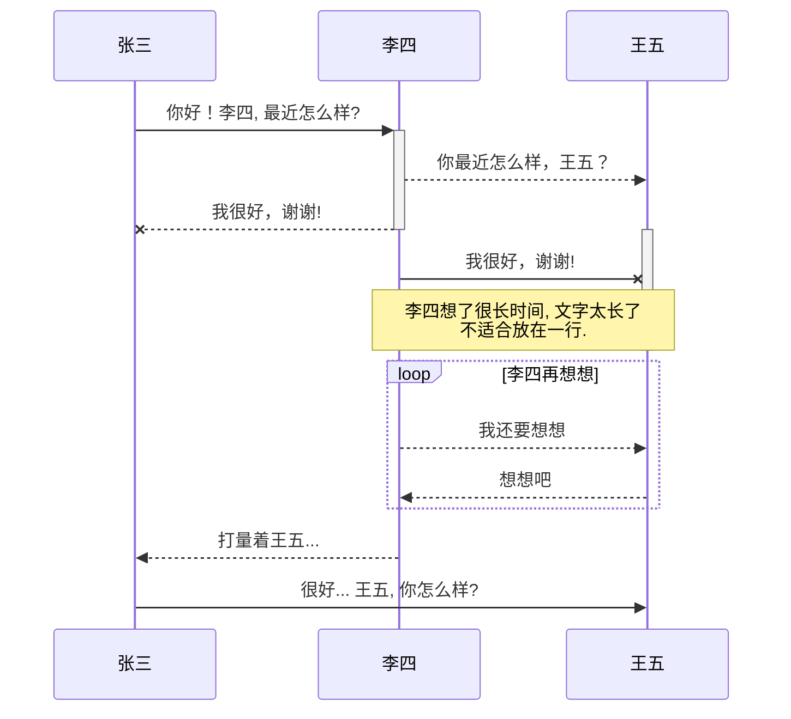

### 1.Mermaid流程图

```mermaid
	graph TB
	A[Apple]-->B{Boy}
	A---C(Cat)
	B.->D((Dog))
	C==喵==>D
	style A fill:#2ff,fill-opacity:0.1,stroke:#faa,stroke-width:4px
	style D stroke:#000,stroke-width:8px;
```

### 2.TODO:PUML

```puml
@startuml
    st=>start: 开始
    e=>end: 结束
    op1=>operation: 操作1 | past
    op2=>operation: 操作2 | current
    op3=>operation: 操作3 | future
    pa=>parallel: 多输出操作4 | approved
    cond=>condition: 确认？ | rejected
    st->op1->cond
    cond(true)->e	
    cond(no)->op2(right)->op3->pa(path1,right)->op1
    pa(path2,left) ->e
    st@>op1({"stroke":"Blue"})@>cond({"stroke":"Green"})@>e({"stroke":"Red","stroke-width":6,"arrow-end":"classic-wide-long"})
@enduml
```

### 3.时序图



