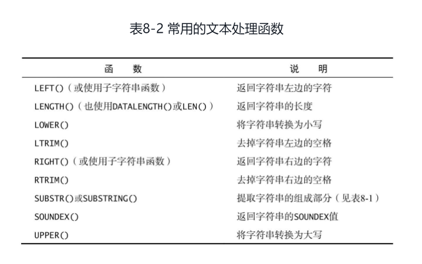

### schema(模式)，instance(实例)，user(用户)区别

#### schema

数据库对象的集合，数据库对象指的是表，索引，视图，存储过程等。

#### 实例

(schema之上的)数据库实例，由create database创建。

#### 关系

*在MySQL中：*

* 服务器实例==未识别目录，只是一组数据库(database)-> 数据库：保存有组织的数据的容器（通常是一个文件或一组文件）
* database == schema == catalog == 服务器中的命名空间。
* user == named account，谁可以连接到服务器，并在一个或多个数据库中使用(但不能拥有 – 没有所有权概念)对象。
* 要识别运行服务器中的任何对象，您需要(数据库名称对象名称)
  在MySQL中创建一个Schema和创建一个Database的效果是一样的

* 在Oracle：

* server instance == database == catalog == 所有数据由同一个执行引擎管理
* schema == 数据库中的命名空间，与用户帐户相同
* user == schema owner == 命名的帐户，与模式相同，谁可以连接到数据库，谁拥有模式和可能在其他模式中使用对象
* 要识别运行服务器中的任何对象，您需要(模式名称对象名称)
  在Oracle数据库中不能新建一个schema，要想创建一个schema，只能通过创建一个用户的方法解决， 在创建一个用户的同时为这个用户创建一个与用户名同名的schema并作为该用户的缺省schema。
  即schema的个数同user的个数相同，而且schema名字同user名字一一 对应并且相同

### Mysql大小写敏感问题

#### Linux

1. 数据库名与表名是严格区分大小写的
2. 表的别名是严格区分大小写的
3. 列名与列的别名在所有的情况下均是忽略大小写的
4. 变量名也是严格区分大小写的

#### Windows

大小写不敏感

### Mysql版本

```mysql
  mysql -V;
status;
select version();
```

### Mysql服务启动

* 服务状态查看(可先通过services.msc查看版本号(服务名)，powershell管理者查看)

```mysql
  net start
mysql80(版本号);
mysqld --console;
```

* 服务停止

```mysql
  net stop
mysql80;
```

###  



### 关键字

* having：过滤分组，而where过滤指定的行而不是分组（where没有分组概念）

区别

    where过滤行
    having过滤分组

### 基本查询

* 连接
  
      mysql -h主机地址 -u用户名 -p用户密码
  
* 查看所有数据库
  
      show databases;
  
* 选择指定数据库
  
      use XXXX;
  
* 查看当前选择的数据库1:show tables的第一行
  
      show tables;
      select database();
      status;
  
* 查看表结构
  
      desc XXXX;
      describe XXXX;
  
* 查看表字段全部信息

      SHOW FULL COLUMNS FROM orders;

* 建库、建表、赋权限

  * 建库
  
        create databse XXXX;
  * 删库
    
        drop database XXXX;
  
