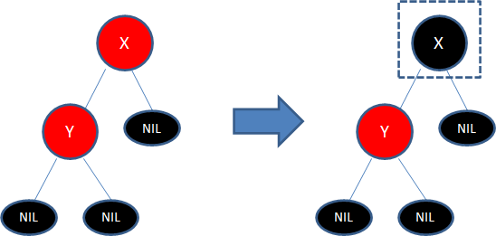
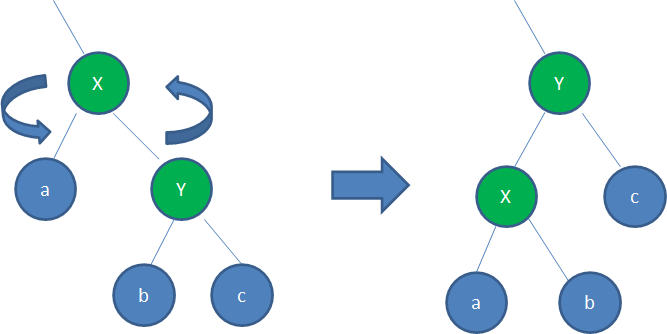
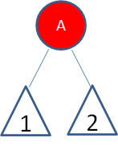
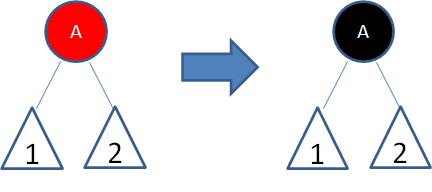
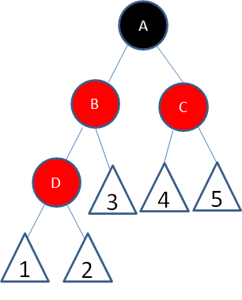
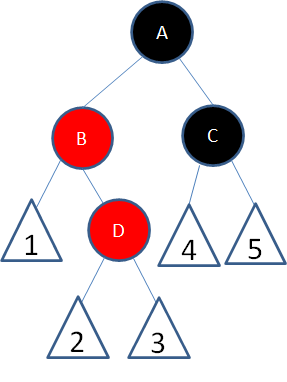
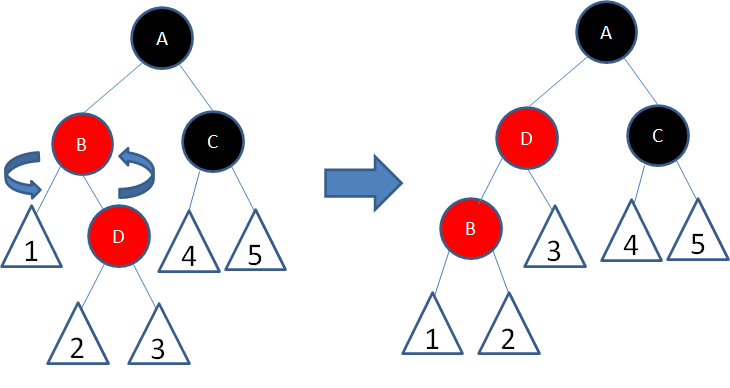
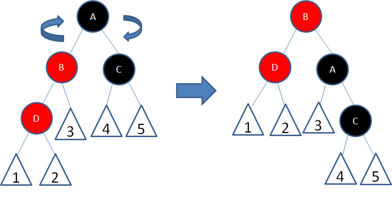

## 红黑树

一种自平衡的二叉查找树，从根到叶子的最长路径不会超过最短路径的2倍

特点

1. 结点是红色或者黑色
2. 根结点是黑色
3. 每个叶子结点都是黑色的空节点(NIL结点)
4. 每个红色结点的(左右)两个子节点都是黑色(即叶子到根的所有路径上不能有两个连续的红色结点)
5. 从任一结点到其每个叶子结点(NIL结点)的所有路径都包含相同数目的黑色结点

  
### 插值

* 向红黑树插入值为14的新结点：满足红黑树特点

    
  
* 向红黑树插入值为21的新结点：不满足特点4

    
  
    调整：
    * 变色：为了符合红黑树规则，把红色结点变为黑色或者把黑色结点变为红色
      
      矛盾：相关路径上多出一个黑色结点(X)，打破规则5
      
      
      
    * 旋转
        * 左旋转：逆时针旋转红黑树的两个结点，父节点被自己的右孩子取代，自己成为新结点的左孩子
          
        * 右旋转：顺时针旋转红黑树的两个结点，父节点被自己的左节点取代，自己称为新结点的右孩子
          
  
    
### 红黑树调整

1. 局面1：新结点(A)位于树根，没有父结点(空心三角形代表结点下面的子树)
    
    矛盾：违反规则2
   
   
   
    对策：新结点变为黑色
    
    

2. 局面2：新结点(B)的父结点是黑色

   矛盾：无

    

   对策：满足规则，不做调整

3. 局面3：新结点(D)的父结点和叔叔结点是红色

   矛盾：违反规则4

    

   对策：
   * 1.父结点变为黑色->父结点路径多一个黑色结点(违反规则5)
     
     
   * 2.父结点的父结点变为红色(违反规则4)
     
     
   * 3.叔叔结点变为黑色(局部符合红黑树规则)
     

4. 局面4：新结点(D)的父结点是红色，叔叔结点是黑色或者没有叔叔结点，且新结点是父结点的右孩子，父结点(B)是祖父节点的左孩子

   矛盾：违反规则4

    

   对策：
    * 1.父结点为轴，做一次左旋转
    

    * 2.进入局面5继续下一步

5. 局面5：新结点(D)的父结点是红色，叔叔结点是黑色或者没有叔叔结点，且新结点是父结点的左孩子，父结点(B)是祖父节点的左孩子

   矛盾：违反规则4
   
    

   对策：
    * 1.祖父结点(A)为轴，做一次右旋转
    

   * 2.结点B变为黑色，结点A变为红色
     
    

