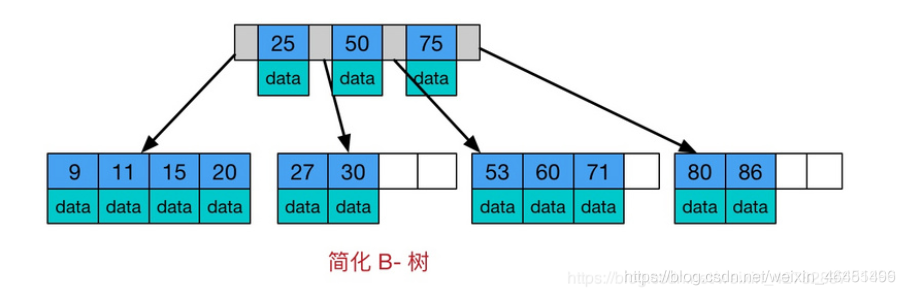
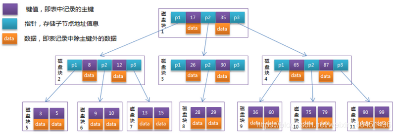
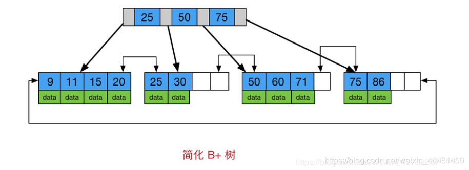
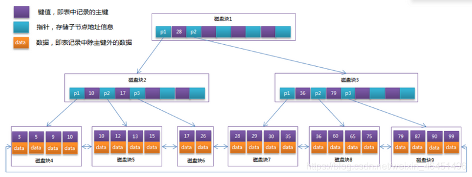

## B-Tree和B+Tree

### B-Tree

多路自平衡搜索树，类似普通的二叉树，允许每个节点有多个子结点

特性

1. 所有键值(key：此处25/50/75)分布在整个树中

2. 任何关键字(需要查询的数据)出现且只出现在一个节点中

3. 搜索有可能在非叶子结点结束

4. 在关键字全集内做一次查找，性能逼近二分查找算法O(log(n))

#### 范例

1. 每个节点占用一个盘块的磁盘空间

    1. 节点上有2个升序的关键字17、35
    
    2. 3个照顾下不过子树根节点的指针
    
2. 关键字划分区域为子树的数据范围

    1. p1子树数据范围:<17
       
    1. p2子树数据范围:17~35
       
    1. p1子树数据范围:>35

模拟查找关键字29的过程

1. 根据根节点找到磁盘块1，读入内存。【磁盘I/O操作第1次】
2. 比较关键字29在区间（17,35），找到磁盘块1的指针P2。
3. 根据P2指针找到磁盘块3，读入内存。【磁盘I/O操作第2次】
4. 比较关键字29在区间（26,30），找到磁盘块3的指针P2。
5. 根据P2指针找到磁盘块8，读入内存。【磁盘I/O操作第3次】
6. 在磁盘块8中的关键字列表中找到关键字29。

### B+Tree

B-Tree变体，也是一种多路自平衡查找树

特性

1. 键值存储在非叶子节点
   
2. 关键字存储在叶子节点，非叶子节点存储实际数据

3. 每次都需要查询到叶子节点，查询性能稳定

4. 叶子节点形成有序链表，范围查询方便

5. 顺序IO，较B-Tree次数更少

    ※ Hash索引：随机IO
    

#### 使用场景

1. InnoDB

    1. InnoDB存储引擎中页的大小为16KB(linux中)，一般表的主键类型为INT（占用4个字节）或BIGINT（占用8个字节），指针类型也一般为4或8个字节(win中)
    
    2. 也就是说一个页（B+Tree中的一个节点）中大概存储16KB/(8B+8B)=1K个键值（这里的K取值为〖10〗^3）
   
    3. 也就是说一个深度为3的B+Tree索引可以维护10^3 * 10^3 * 10^3 = 10亿 条记录。

        说明：
    
        实际情况中每个节点可能不能填充满，因此在数据库中，B+Tree的高度一般都在2~4层。
   
        mysql的InnoDB存储引擎在设计时是将根节点常驻内存的，也就是说查找某一键值的行记录时最多只需要1~3次磁盘I/O操作。

### B-Tree和B+Tree区别

1. 键值存储方式

2. 关键字存储方式

3. 数据存储方式

4. 链指针有无

