## 二叉查找树(BST:binary search tree)
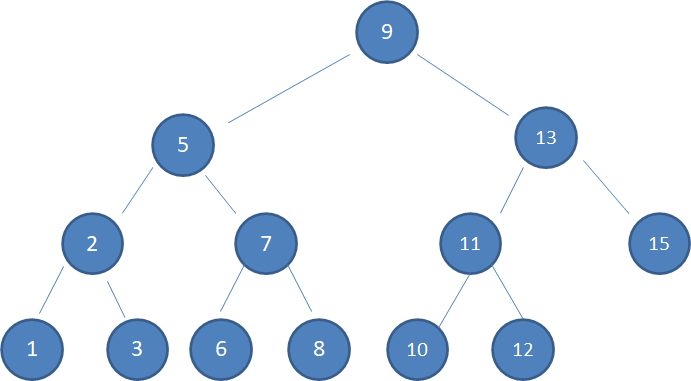

### 特点
* 左子树上所有结点的值均**小于或等于**它的根结点的值
* 右子树上所有结点的值均**大于或等于**它的根结点的值
* 左、右子树也分别称为二叉排序树
* 时间复杂度：O(logN)和O(N)之间
    * O(logN)：插入的数据是随机的，那么它就是接近平衡的二叉树
    * O(N)：新插入的数据是有序的(递增或递减)即新结点始终处在一侧时，BSTree变成一个链表，时间复杂度O(N)
      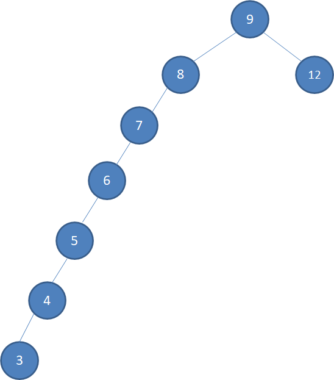
      
### 优点
运用二分查找思想，查找所需最大次数等于二叉查找树的高度

### 范例

范例1：查找值为9的结点

1. 查看根结点：值为9，返回
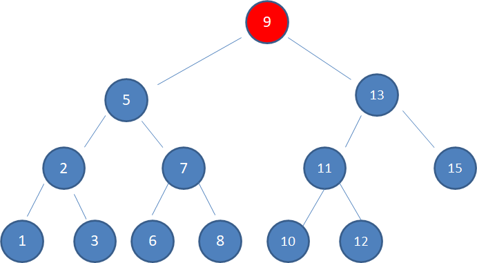

范例2： 查找值为10的结点
1. 查看根结点：值为9，10 > 9，查找右子树
2. 查看右子树结点：值为13，10 < 13，查找左子树
3. 查看左子树结点：值为11，10 < 11，查找左子树
4. 查看左子树结点：值为10，返回
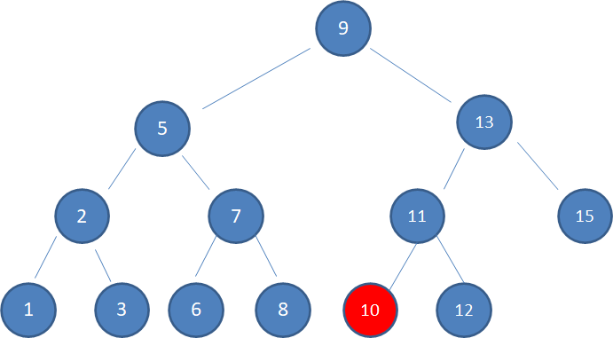

### 二叉树结点删除(TODO)

1. 待删除结点没有子结点

    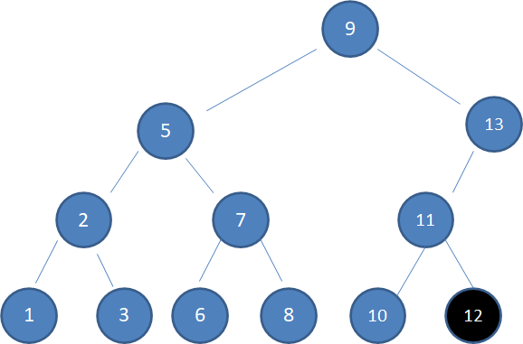

    对策：直接删除
   
     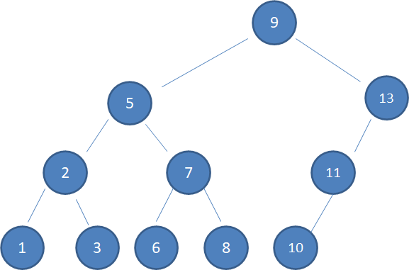

2. 待删除结点有一个孩子

    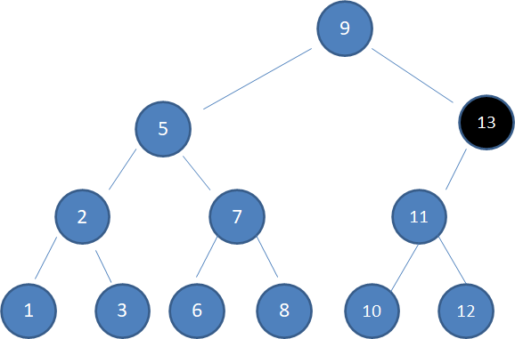

   对策：孩子结点取代被删除结点，孩子结点以下结点关系无需变更

   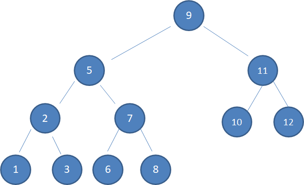

3. 待删除结点有两个孩子

    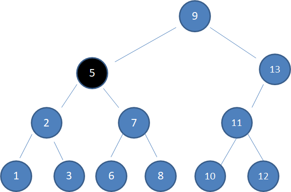

   对策：
    1. 选择与删除结点最接近的结点来取代被删除结点，如存在多个相似值(此处结点3、6)，习惯选取仅大于删除结点的结点
    
        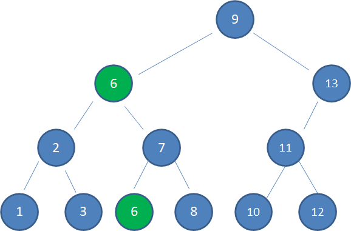

    2. 删除多余结点
    
        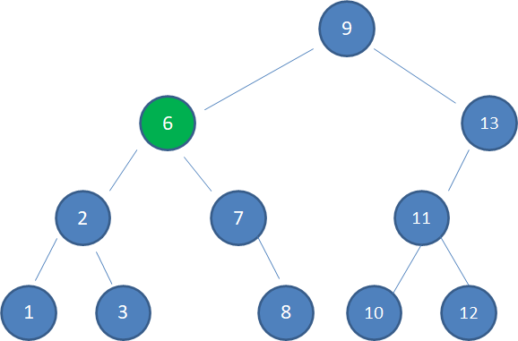
