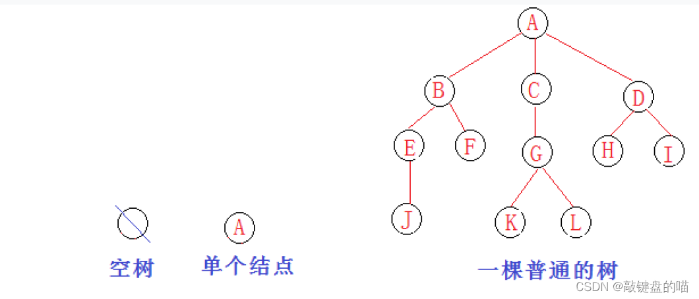
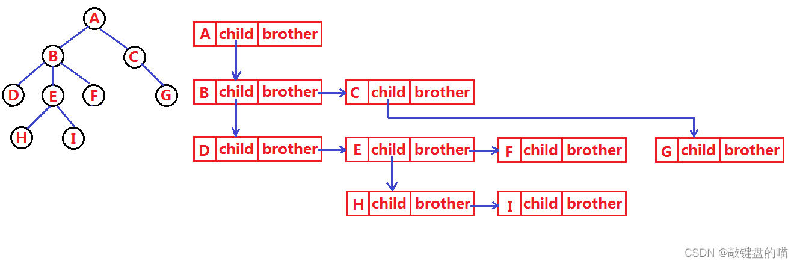
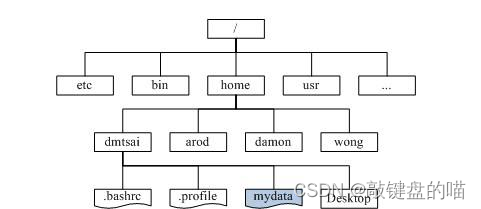
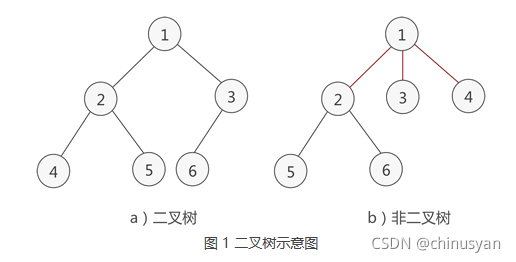
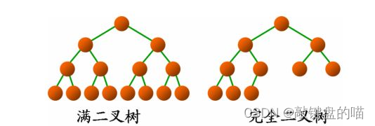

## 二叉树

### 树

#### 概念



特性

1. 根结点：无前驱结点

2. 根节点外分成互不相交的集合

3. 递归定义

节点的度：一个节点含有的子树的个数，叫做该节点的度

树的度：一棵树中最大的节点的度称为树的度

#### 树的数据结构

1. 孩子兄弟表示法

    ```java
    typedef int DataType;
    struct Node
    {
        struct Node* _firstChild1; // 第一个孩子结点
        struct Node* _pNextBrother; // 指向其下一个兄弟结点
        DataType _data; // 结点中的数据域
    };
    ```
    
    

2. 双亲表示法

#### 应用

1. 文件系统目录树结构

    

### 二叉树

特点

* 本身是有序树

* 每个节点**最多**有两颗子树，即各个节点的度不能超过2(0/1/2)

    

#### 满二叉树

二叉树中除了叶子节点，每个节点的度都为2



#### 完全二叉树

如果除去最后一层节点为满二叉树，且最后一层节点从左到右一次分布，称为满二叉树