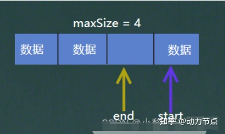

## 环形队列

1. 初始化


```java
// 最大容量
private int maxSize;
// 默认为0
private int start;
// 默认为0
private int end;
private int arr[];

public ArrayCircleQueue(int maxSize) {
    this.maxSize = maxSize;
    arr = new int[maxSize];
}
```

2. 队列满



```java
public boolean isFul() {
    return (end + 1) % maxSize == start;
}
```

3. 有效数据个数


```java
public int size() {
    return (end + maxSize - start) % maxSize;
}
```

4. 添加元素


```java
public void add(int n) {
    if (isFul()) {
        System.out.println("队列满");
        return;
    }
    arr[end] = n;
    end = (end + 1) % maxSize;
}
```