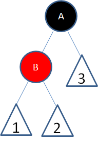
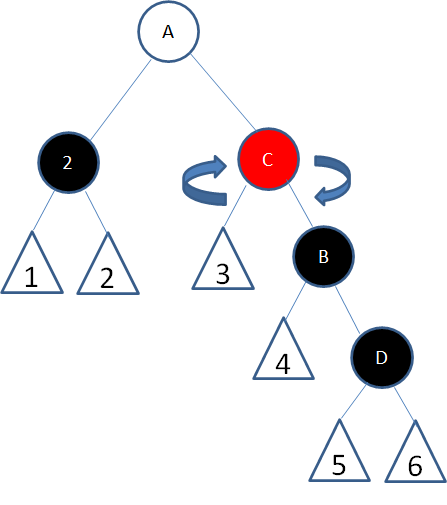

### 红黑树

一种自平衡的二叉查找树，从根到叶子的最长路径不会超过最短路径的2倍

### 特性(规则)

1. 结点是红色或者黑色
2. 根结点是黑色
3. 每个叶子结点都是黑色的空节点(NIL结点)
4. 每个红色结点的(左右)两个子节点都是黑色(即叶子到根的所有路径上不能有两个连续的红色结点)
5. 从任一结点到其每个叶子结点(NIL结点)的所有路径都包含相同数目的黑色结点
6. 新插入结点是红色(约定：插入结点是黑色(相应路径多一个黑色结点)会导致红黑树的旋转变得非常复杂)

### 红黑树调整方式

#### 增加结点范例

* 向红黑树插入值为14的新结点：满足红黑树特点

    
  
* 向红黑树插入值为21的新结点：违反规则4

    

#### 删除结点范例

* 违反规则：规则4、规则5
  
  

* 对策：结点6变成黑色

#### 调整方式

##### 变色

为了符合红黑树规则，把红色结点变为黑色或者把黑色结点变为红色
  
  违反规则：相关路径上多出一个黑色结点(X)，违反规则5
  
  

##### 旋转

###### 左旋转

逆时针旋转红黑树的两个结点，父节点被自己的右孩子取代，自己成为新结点的左孩子
  

###### 右旋转
顺时针旋转红黑树的两个结点，父节点被自己的左孩子取代，自己成为新结点的右孩子
  

#### 应用

##### 变色

为了符合红黑树规则，把红色结点变为黑色或者把黑色结点变为红色

* 局面1(新结点为根结点)
* 局面3(新结点父结点和叔叔结点是红色结点：连续变色)

##### 旋转

###### 左旋转

1. 常规【都处于子树左边(局面4)】：以新增结点父节点B为轴，不影响黑色结点数目
   
   

2. 常规(局面4)的镜像：以新增结点父结点为轴进行**右旋转**

###### 右旋转

1. 常规【都处于子树左边(局面5)】：以新增结点祖父结点A为轴：影响黑色结点数目

   
   
   
2. 常规(局面5)的镜像：以冲突父结点A为轴进行**左旋转**

    

### 增加结点及调整

#### 增加结点

##### 局面1：新结点(A)位于树根，没有父结点
(空心三角形代表结点下面的子树)

违反规则：规则2

对策：新结点变为黑色

##### 局面2：新结点(B)的父结点是黑色

违反规则：无

对策：满足规则，不做调整

##### 局面3：新结点(D)的父结点和叔叔结点是红色
*不能直接将结点D变为黑色，这样将会导致结点D路径多一个黑色

违反规则：规则4

对策：
* 1.父结点变为黑色->父结点路径多一个黑色结点(违反规则5)
 
 
* 2.父结点的父结点变为红色(违反规则4)
 
 
* 3.叔叔结点变为黑色(**局部符合红黑树规则**)
 

##### 局面4：新结点(D)的父结点是红色，叔叔结点是黑色或者没有叔叔结点，且新结点是父结点的右孩子，父结点(B)是祖父节点的左孩子

违反规则：规则4

对策：
* 1.父结点(B)为轴，做一次左旋转

* 2.进入局面5继续下一步

##### 局面5：新结点(D)的父结点是红色，叔叔结点是黑色或者没有叔叔结点，且新结点是父结点的左孩子，父结点(B)是祖父节点的左孩子

违反规则：规则4

对策：
* 1.祖父结点(A)为轴，做一次右旋转

* 2.结点B变为黑色，结点A变为红色
 

#### 增加结点调整总结：1根2父黑3红(变色)4右(新结点父结点左旋转)5左(新结点祖父节点右旋转)
1根腹黑红柚左

#### 范例

局面3：给定二叉树，插入新结点21

二叉树调整：

1. 符合局面3，按照局面3对策处理-->新结点25违反规则4
   
2. 局面5的镜像，按照局面5对策的镜像(相反)处理，即以祖父节点(13)为轴进行左旋转
   
3. 变色调整
   

### 删除结点及调整

#### 步骤1：单子结点/单孩子化

如果待删除结点有两个非空孩子结点，使用二叉树删除节点方式转化成只有一个孩子(或者没有孩子)的情况

* 将仅大于8的结点10复制到结点8位置

    

#### 步骤2：根据待删除结点和其唯一子结点颜色，分情况处理

##### 1. 待删除结点是红色，子结点是黑色

对策：

1. 直接删除结点

    

##### 2. 待删除结点是黑色，子结点是红色
  
  

  对策：
  
  1. 删除结点

          

  2. 该路径少一个黑色结点，将结点2变色

          

##### 3. 双黑结点(待删除结点是黑色，子结点也是黑色，或者子结点为空叶子结点)

**以下情况均为子结点顶替父结点之后的子情况(此时子结点路径少了一个黑色结点)**

###### 子情况1(共同减少黑色结点)：结点2变为红黑树的根结点

对策：

1. 无需调整，因为所有路径都减少了一个黑色结点

###### 子情况2(共同减少黑色结点)：结点2的父亲、兄弟、侄子结点都是黑色

对策：

1. 将结点2的兄弟结点变为红色：结点B所在路也径少一个黑色结点(同结点2一样)

    

2. 上述操作将导致结点A路径少一个黑色结点(相对结点A的兄弟结点而言)，递归结点A：让结点A扮演原结点2的角色递归重新判断

###### 子情况3(结点2变相增加父节点)：结点2的兄弟是红色

对策：

1. 以结点2的父结点A为轴，进行左旋转
 
    

2. 结点B变黑色(不影响上层节点/结点B父结点)，结点A变红色(不影响C结点)

    

3. 此时可转换成子情况4/5/6中的一种 

###### 子情况4：结点2父结点是红色，兄弟和侄子结点是黑色

对策：

1. 结点2的父结点A变黑色，兄弟结点B变红色

 

###### 子情况5：结点2父结点随意，兄弟结点B是黑色右孩子，左侄子结点是黑色，右侄子结点是黑色

对策：

1. 以结点2的兄弟结点B进行右旋转

 

2. 结点C变黑色，结点B变红色

 

3. 此时可变成情况6

###### 子情况6(结点2变相增加父结点)：结点2父结点随意，兄弟结点B是黑色右孩子，左侄子结点是黑色，右侄子结点是红色

对策：

1. 以结点2的父结点A进行左旋转

 

2. 结点A和结点B颜色交换，结点D变为黑色

 

#### 删除结点调整总结：1根2全少(变色)3兄4(顶替节点的父节点左旋)父5左侄(顶替节点的父结点右旋)6右侄(顶替节点的父节点左旋)
1根全少兄父左右

#### 删除范例

给定红黑树，删除结点17

1. 结点25复制到待删除结点17
   
   
2. 待删除结点25是黑色，且子结点为空叶子结点(双黑结点)
   
    删除结点25，空叶子结点顶替父结点(删除的结点25)
    
   
3. 符合子情况5的镜像
    
   
4. 顶替节点的兄弟结点15为轴左旋转，变色=>变成子情况6的镜像
    
   
5. 右旋转，变色
    
    

### 应用

1. TreeSet
2. HashSet
3. HashMap(JDK8)

#### 应用场景

1. 数据操作类型

    1. **频繁插入删除，查找要求高，使用红黑树**
  
    2. 查找要求高，但插入删除不频繁，使用AVL树

2.  IO操作有无

    1. **无IO操作：存储内存中有序数据，增删快(内存存储不涉及IO)**
    
    2. 有IO操作：B/B+树(磁盘数据)，可减少IO次数
    
        B/B+主要用于文件系统以及数据库中做索引等，如MySQL:B-Tree in MySQL

### 常见误区

1. 红黑树判断：NIL结点才是叶子结点

    
    
    

    解析：路径2有3个黑色结点(含NIL)，其他路径4个黑色结点，违反规则5

