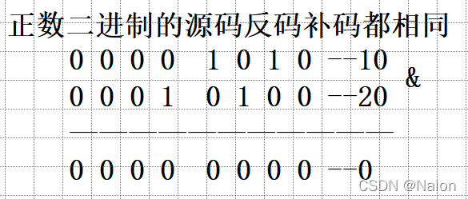
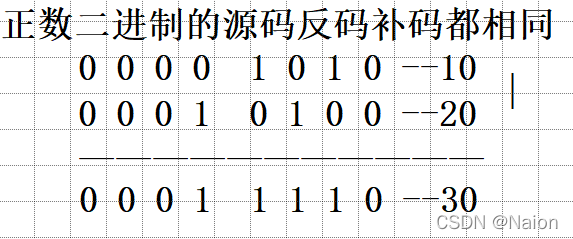
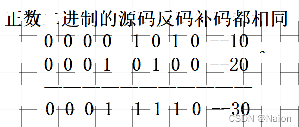
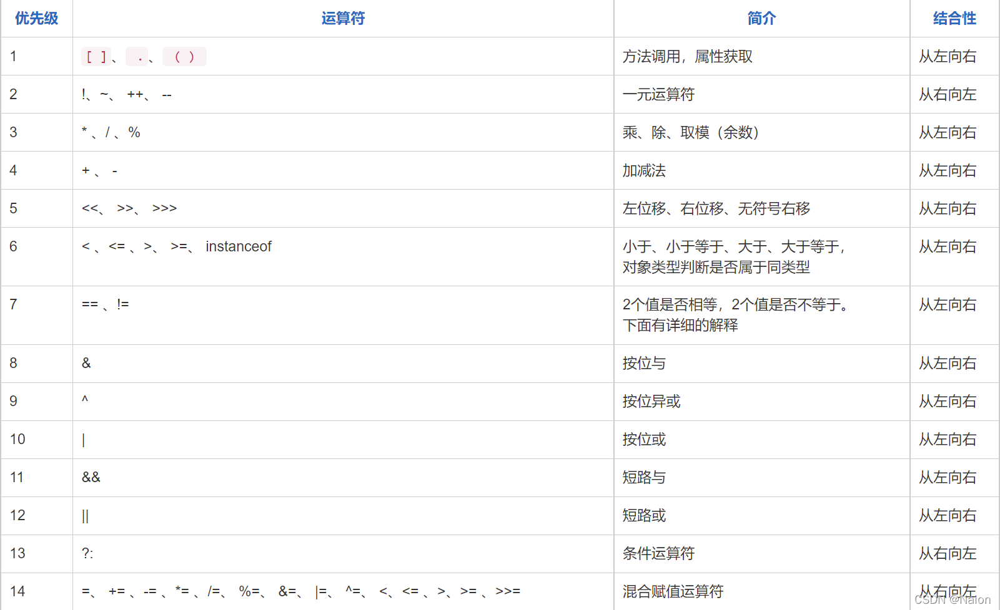

## 运算符

### 算术运算符

#### 基本四则运算符

* \+：加
    
* \-：减
    
* \*：乘
    
* /：(整)除

* %：求余

#### 增量运算符

* \+=
  
* \-=
  
* *=
  
* %=

#### 自增自减运算符

* ++

* --

### 关系运算符

* ==
  
* !=
  
* <
  
* \>
  
* <=
  
* \>=

### 逻辑运算符

* &&：逻辑与，都真为真

* ||：逻辑或，有真为真

* !：逻辑非操作，真变假，假变真

  !true = false

### 位运算符

* &：按位与，同1则1

    
  
* |：按位或，有1为1

    

* ^： 按位异或，相同为0，不同为1

  
  
* ~：按位取反，二进制位1变0,0变1

    ~n = -n - 1

### 移位运算

* <<：左移

* \>>：右移
  
* \>>>：无符号右移

### 条件运算符

表达式1 ? 表达式2 : 表达式3

