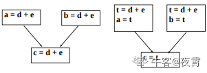

## 代码优化

### 复写传播



* 复写语句：形式为f = g 的赋值

  * 优化过程中会大量引入复写

  * 复写传播变换的做法是在复写语句f = g后，尽可能用g代表f

  * 复写传播变换本身并不是优化，但它给其他优化带来机会

    * 常量合并（编译时可完成的计算）
    
    * 死代码删除

### 死代码删除

* 死代码是指计算的结果决不被引用的语句

* 一些优化变换可能会引起死代码

### 代码外提

* 代码外提是循环优化的一种

    ```java
    while(i <= limit -2)...
    // 代码外提后
    t = limit - 2;
    while (i < t)...
    ```

* 循环优化的其他技术

    * 归纳变量删除
    
    * 强度削弱
  
### 归纳变量删除

```java
j = j - 1
t4 = 4 * j
t5 = a[t4]
if t5 > value goto B3
```

* j和t4的值步伐一致地变化，这样的变量叫作归纳变量
* 在循环中有多个归纳变量时，也许只需要留下一个
* 这个操作由归纳变量删除过程来完成
* 对本例可以先做强度削弱，它给删除归纳变量创造机会
    
### 强度削弱

把强度大的运算换算成强度小的运算，如将乘法换成加法运算