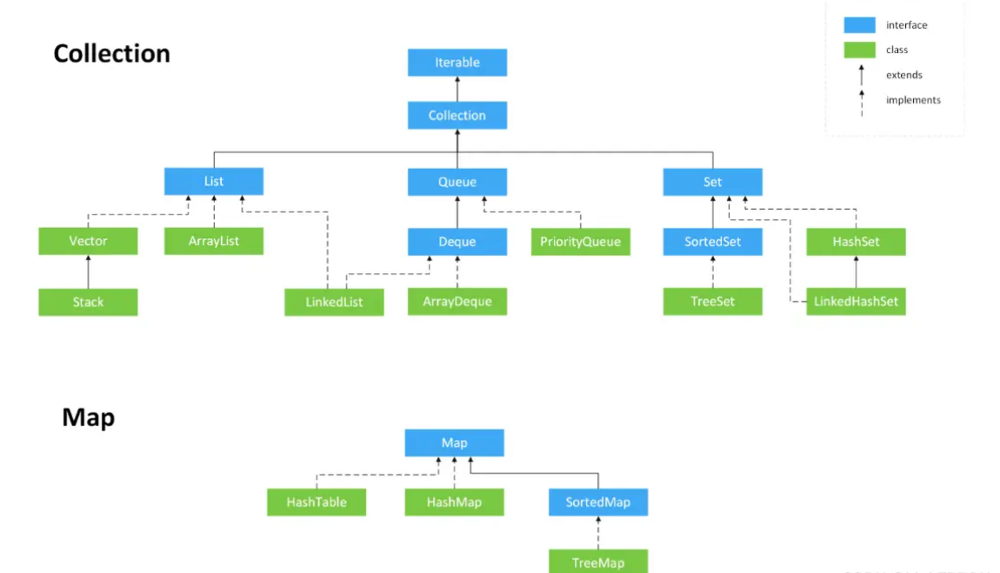
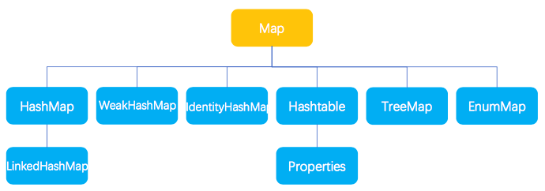

## 集合

数组、集合都是对多个数据进行存储操作的数据结构，简称Java容器

Java集合类型分为Collection和Map，它们是集合的根接口，这两个接口有包含一些子接口或实现类
    
    Collection集合保存数据多为了数据输出
    Map集合保存数据多为了Key的查找

### Collection

Collection基本结构




### Map

Map基本结构


### Java集合接口

接口名称|作用
---|---
Iterator接口|集合的输出接口，用于遍历Collection集合中的元素，Iterator对象称为迭代器。迭代器接口是集合Collection接口的父接口，实现类实现Collection接口时必须实现Iterator接口。
Collection接口|List、Set、Queue的父接口，单值数据操作的最大接口。单值指集合中的每个元素都是一个对象。
Queue接口|Java提供的队列实现，类似于List。
Deque接口|Queue的子接口，双端队列。
List接口|~~有序~~重复集合。可精确控制每个元素的插入位置，用户可使用索引(类似数组下标)访问List中的元素。
Set接口|无重复元素。
Map接口|存放一对值的最大接口，以key-value形式保存。

### Java集合实现类

父接口|接口名称|作用
---|---|---
Set|HashSet|无序不重复，优化查询而设计的Set。底层使用HashMap实现。
Set|TreeSet|有序不重复，主要用于排序。
List|ArrayList|基于数组实现的List，快速随机访问，效率高且数组大小可变
List|LinkedList|基于链表实现的List，快速顺序访问，随机访问慢。方法：get/add/removeFirst/Last。
Queue|ArrayQueue|基于数组实现的双端队列，以"先进先出"方式操作集合元素
Map|HashMap|哈希算法存取键对象。
Map|TreeMap|可对键对象进行排序(Key排序)。

### List接口

List接口对Collection接口方法进行了以下扩充
```java
// 获取指定索引的数据
public E get(int index);
// 修改指定的索引数据
public E set(int index,E element);
// 返回listIterator接口
public ListIterator<E> listIterator;
```

### ArrayList、LinkedList、HashMap区别

区别|ArrayList|LinkedList|HashMap|AVLTree|BSTree
---|---|---|---|---|---
实现|基于数组实现|基于链表实现
空间开辟|频繁进行空间开辟(数组扩容)|不需要|数组+[JDK7:链表][JDK8:链表/红黑树]
元素访问(按索引)|随机高效O(1)|顺序高效，随机O(n)|O(logN)~O(n)※|O(logN)|O(logN)~O(N)
元素插入(按索引)|数组扩容&数组元素移动|相对高效|-
数据存储|小数据|大数据|-
使用场景|查询次数多(查询效率高)，且插入、删除元素次数少|查询次数不多，且频繁移动/插入、删除元素|查询/插入/删除元素效率高|频繁查找(增删看树调整程度)|

※ key获取hash值定位到桶：O(1)

※ 桶内元素：

 * NULL(没有元素)：O(1)
   
 * 链表：O(n)
   
 * 红黑树：O(log(n))

### Vector和ArrayList区别

区别|Vector|ArrayList
---|---|---
实现|数组|数组
安全性|方法同步，线程安全|线程非安全
扩容|指定增长因子扩容(否则2倍扩容)|1.5倍扩容(当前长+当前长/2)
性能|性能高|性能低(线程同步)

※ 不推荐Vector原因

  * vector线程安全，效率低，只能尾部增删，效率更低

  * 空间满后扩容一倍，ArrayList扩容一半

  * 分配内存需要连续的存储空间，数据太多容易内存分配失败

### HashSet、TreeSet和LinkedHashSet

区别|HashSet|TreeSet|LinkedHashSet
---|---|---|---
用途|通用的存储数据的集合|主要用于排序|用于保证FIFO即有序的集合(先进先出)
速度|插入数据最快|较慢|最慢(内部实现排序)
null数据|允许|允许|不允许

### HashMap和HashTable区别

区别|HashMap|Hashtable
---|---|---
安全性|方法为异步操作，非线程安全|方法为同步操作，线程安全
数据|可为空(null)|不能为空(null)
性能|性能高|性能低

### 队列

#### 优先级队列

特点

1. 根据优先级进行排序，优先级高的先出队列

2. 数字类型优先级队列：数字越小优先级越高

3. 字符串类型优先级队列：ASCII位置越小优先级越高(字符0~9、A~Z、a~z)

### RandomAccess接口

标记接口，内部不存在任何方法

集合中RandomAccess标记接口用于标记该集合具备随机访问的能力，而不是提供了随机访问的能力

集合通过RandomAccess标记接口来标记该结合自身支持随机访问，以便在一些框架或算法中根据是否实现了

该接口而做出更好的决策(方法实现)

* ArrayList底层由数组实现，支持随机访问(get)，故该集合实现了RandomAccess接口

* LinkedList的底层由链表实现，因此它不支持随机访问，只支持顺序访问

    * 链表(伪)随机访问(get):效率低(内部实现：从头开始，越过n-1个元素)
    
    * get内部微小优化：如果index大于size()/2,从列表尾端开始搜索

## 集合各子类使用场景

可按照以下步骤判断使用哪个集合子类

1. 元素唯一

    1.  Set
    
        1. 排序？
    
            1. 是：TreeSet或LinkedHashSet
    
            2. 否：HashSet
    
2. 元素不唯一

    1. 安全？
    
        1. 是：Vector
    
        2. 否：ArrayList或LinkedList
    
            1. 查询多：ArrayList
               
            2. 增删多：LinkedList

