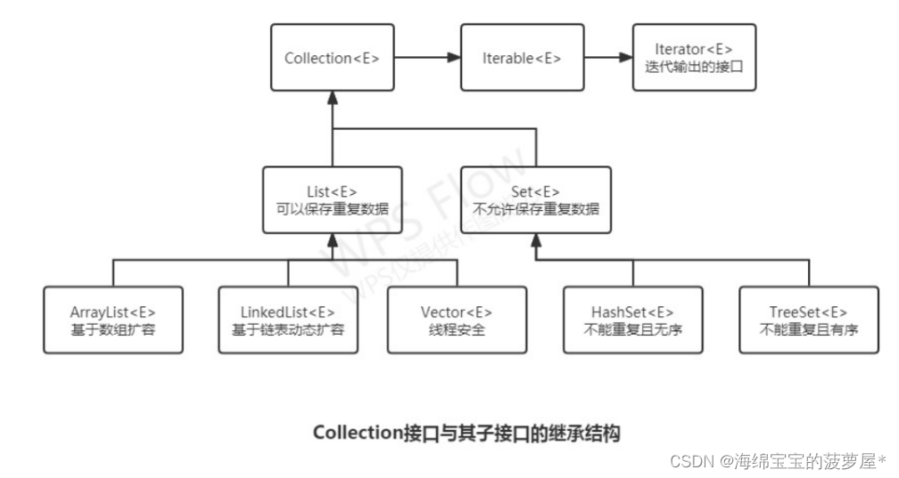

## 集合

数组、集合都是对多个数据进行存储操作的数据结构，简称Java容器

Java集合类型分为Collection和Map，它们是集合的根接口，这两个接口有包含一些子接口或实现类
    
* Collection集合保存数据多为了数据输出

* Map集合保存数据多为了Key的查找

### 集合接口

接口名称|作用
---|---
Iterator接口|集合的输出接口，用于遍历Collection集合中的元素，Iterator对象称为迭代器。迭代器接口是集合Collection接口的父接口，实现类实现Collection接口时必须实现Iterator接口。
Collection接口|List、Set、Queue的父接口，单值数据操作的最大接口。单值指集合中的每个元素都是一个对象。
Queue接口|Java提供的队列实现，类似于List。
Deque接口|Queue的子接口，双端队列。
List接口|~~有序~~重复集合。可精确控制每个元素的插入位置，用户可使用索引(类似数组下标)访问List中的元素。
Set接口|无重复元素。
Map接口|存放一对值的最大接口，以key-value形式保存。

### 集合实现类

父接口|接口名称|作用
---|---|---
Set|HashSet|无序不重复，优化查询而设计的Set。底层使用HashMap实现。
Set|TreeSet|有序不重复，主要用于排序。
List|ArrayList|基于数组实现的List，快速随机访问，效率高且数组大小可变
List|LinkedList|基于链表实现的List，快速顺序访问，随机访问慢。方法：get/add/removeFirst/Last。
Queue|ArrayQueue|基于数组实现的双端队列，以"先进先出"方式操作集合元素
Map|HashMap|哈希算法存取键对象。
Map|TreeMap|可对键对象进行排序(Key排序)。

### Collection

#### Collection基本结构





#### Collection常用功能

    public boolean add(E e)： 把给定的对象添加到当前集合中 。
    public void clear() :清空集合中所有的元素。
    public boolean remove(E e): 把给定的对象在当前集合中删除。
    public boolean contains(E e): 判断当前集合中是否包含给定的对象。
    public boolean isEmpty(): 判断当前集合是否为空。
    public int size(): 返回集合中元素的个数。
    public Object[] toArray(): 把集合中的元素，存储到数组中。

#### List

List接口对Collection接口方法进行了以下扩充
```java
// 获取指定索引的数据
public E get(int index);
// 修改指定的索引数据
public E set(int index,E element);
// 返回listIterator接口
public ListIterator<E> listIterator;
```

##### ArrayList、LinkedList、HashMap区别

区别|ArrayList|LinkedList|HashMap|AVLTree|BSTree
---|---|---|---|---|---
实现|基于数组实现※1|基于链表实现(JDK6双向循环链表，JDK8取消循环)|[JDK7:数组+链表][JDK8:数组+链表/红黑树]
空间开辟|频繁进行空间开辟(数组扩容)|不需要|
元素访问(按索引)|随机高效O(1)RandomAccess|顺序高效，随机O(n)|O(logN)~O(n)※|O(logN)|O(logN)~O(N)
元素插入(按索引)|数组扩容&数组元素移动|相对高效|-
存储空间|相对小|节点+指向前后元素的引用|-
数据存储|小数据|大数据|-
使用场景|查询次数多(查询效率高)，且插入、删除元素次数少|查询次数不多，且频繁移动/插入、删除元素|查询/插入/删除元素效率高|频繁查找(增删看树调整程度)|

        ※1 ArrayList和LinkedList增删速度
        
         * 增删位置在末尾：ArrayList不需要移动和复制数组，此时ArrayList快
        
         * 增删位置在中间：ArrayList消耗在移动和复制，LinkedList消耗在遍历，此时LinkedList遍历速度通常小于移动复制速度，数据百万量级ArrayList快
        
        ※2 key获取hash值定位到桶：O(1)
        
        ※2 桶内元素：
        
         * NULL(没有元素)：O(1)
           
         * 链表：O(n)
           
         * 红黑树：O(log(n))

##### Vector和ArrayList区别

区别|Vector|ArrayList
---|---|---
实现|数组|数组
安全性|方法同步，线程安全|线程非安全
扩容|指定增长因子扩容(否则2倍扩容)|1.5倍扩容(当前长+当前长/2)
性能|性能低(线程同步)|性能高

        ※ 不推荐Vector原因
        
          * vector线程安全，效率低，只能尾部增删，效率更低
        
          * 空间满后扩容一倍，ArrayList扩容一半
        
          * 分配内存需要连续的存储空间，数据太多容易内存分配失败

##### RandomAccess接口

标记接口，内部不存在任何方法

集合中RandomAccess标记接口用于标记该集合具备随机访问的能力，而不是提供了随机访问的能力

集合通过RandomAccess标记接口来标记该结合自身支持随机访问，以便在一些框架或算法中根据是否实现了该接口而做出更好的决策(方法实现)

* ArrayList底层由数组实现，数组支持随机访问(get)，故该集合实现了RandomAccess接口

* LinkedList的底层由链表实现，因此它不支持随机访问，只支持顺序访问

    * 链表(伪)随机访问(get):效率低(内部实现：从头开始，越过n-1个元素)

    * get内部微小优化：如果index大于size()/2,从列表尾端开始搜索

##### List遍历方式选择

1. 支持RandomAccess接口

    1. 标准for循环

2. 不支持RandomAccess接口

    1. 迭代器、增强for循环(底层迭代器实现)

#### Set

##### HashSet、TreeSet和LinkedHashSet区别

区别|HashSet|TreeSet|LinkedHashSet
---|---|---|---
用途|通用的存储数据的集合|主要用于排序|用于保证FIFO即有序的集合(先进先出)
速度|插入数据最快|较慢|最慢(内部实现排序)
null数据|允许|允许|不允许

#### Queue

##### Queue和Deque区别

区别|Queue|Deque
---|---|---
出入顺序|单端队列(尾端插入首端删除即FIFO)|双端队列(队首队尾可插入删除)
模拟栈|无|push()、pop()

Queue接口|抛出异常|返回特殊值null
---|---|---
插入队尾|add(E e)|offer(E e)
删除队首|remove()|poll()
查询队首元素|element()|peek()

##### 优先级队列

特点

1. 根据优先级进行排序，优先级高的先出队列

2. 数字类型优先级队列：数字越小优先级越高

3. 字符串类型优先级队列：ASCII位置越小优先级越高(字符0~9、A~Z、a~z)

4. 默认容量11(底层数组实现)。数组长度<64:2倍扩容、数组长度>=64：1.5倍扩容(增加一半容量)

#### Collections

Collections不属于Java集合框架，它是集合类的一个工具类，此类不能被实例化，服务于Java的Collection框架

### Map

#### Map基本结构


#### HashMap和HashTable区别

区别|HashMap|Hashtable
---|---|---
安全性|方法为异步操作，非线程安全|方法为同步操作，线程安全
数据|key或者value均可为空(null)|key或者value均不能为空(null)
性能|性能高|性能低

#### HashMap的get方法执行流程

1. 计算key的hash值

2. 找到key所在桶及其第一个元素

3. 第一个元素(Entry)的key等于待查找key，返回

4. 第一个元素是树节点，按树的方式查找

5. 否则按链表方式查找

6. 都没有，返回null

#### HashMap中String、Integer包装类适合key

1. 包装类final修饰，是不可变性(即不可变对象，对象当前状态不变)的，保证key的不可更改性，即放入和获取时hash值不会变化

2. 内部重写过hashcode()、equals()等方法

※ Object作为key时，需要重写hashcode()：计算hash确定存储位置、equals()方法：保证key唯一性

※ 可使用任何类作为Map的key，需注意以下2点

    1. 如果类重写了equals方法，也应该重写hashcode方法
    2. 最好定义的key类是不可变的，如此key对应的hashcode()值可被缓存起来，性能更好(这也是为什么string适合作为HashMap的key)。

#### HashMap线程不安全

JDK存在死循环和数据丢失问题

* 死循环

    主要由resize导致

* 数据丢失

    * 并发赋值被覆盖
    
    * 已遍历区间新增元素丢失
    
        transfer导致
    
    * 新表被覆盖
    
        resize、transfer导致

### comparable和comparator区别

区别|comparable|comparator
---|---|---
来源|java.lang|java.util
返回值|※1|※1
实现类|包装类如Integer、String等|
场景|自然排序如上述直接使用|自定义排序需求时

    ※1：返回值
         正整数：比较者大于被比较者
         0    ：相等
         负整数：比较者小于被比较者

## 集合各子类使用场景

可按照以下步骤判断使用哪个集合子类

1. 非元素对

    1. 元素唯一
    
        1.  Set
        
            1. 排序？
        
                1. 是：TreeSet或LinkedHashSet
        
                2. 否：HashSet
        
    2. 元素不唯一
    
        1. 安全？
        
            1. 是：Vector
        
            2. 否：ArrayList或LinkedList
        
                1. 查询多：ArrayList
                   
                2. 增删多：LinkedList

2. 元素对

    1. Map

## 为什么使用集合而不是数组

1. 数组大小固定，集合有自己的扩容机制，可自动调整自身大小

2. 数组特性单一，集合有丰富的特性，不同集合应用场景不同，如Set存储不重复元素

3. 集合体现面向对象思想(集合支持包装类型，数组支持基本类型)

### 数组使用场景

1. 数组大小确定

2. 可存储基本类型时

3. 重复元素