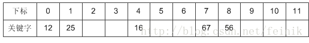
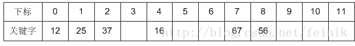
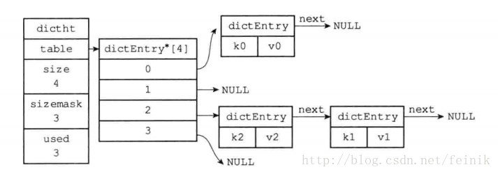

## Hash算法解决冲突

哈希表也叫散列表。通过把关键码值(key value)映射到哈希表中的一个位置来访问记录

这个映射函数叫做散列函数，存放记录的数组叫做散列表

### 开放地址法

一旦发生了冲突，就去寻找下一个空的散列地址，并将记录存入

公式：fi(key) = (f(key)+di) MOD m (di=1,2,3,……,m-1)

1. 线性探测法

    地址增量di = 1,2...,m-1

    i：探测次数，一次探测下一个地址，直到有空的地址后插入；若没有则产生溢出

    容易产生聚集现象：
   
    1. 当表中i,i+1,i+2位置已经存储关键字
       
    2. 下一次哈希地址为i,i+1,i+2,i+3的关键字试图线性探测后一个空地址(i+3位置)
    
    3. 这种多个哈希地址不同的关键字争夺同一后继哈希地址的现象称为聚集

    关键字集合：{12,67,56,16,25,37,22,29,15,47,48,34},表长为12
    
    前S个数{12,67,56,16,25}时没有散列冲突
    
    
    
    key = 37时，发现f(37) = 1，此时就与25所在的位置冲突。
    于是我们应用上面的公式f(37) = (f(37)+1) mod 12 = 2。于是将37存入下标为2的位置：
    
    

2. 二次探测法

   地址增量di = 1

    2 -> -1
   
    2 -> 2
   
    2 -> -2
   
    ，… ， q
   
    2 -> -q
   
    能有效避免聚集现象 

### 链地址法/拉链法

每个哈希表节点都有一个next指针，多个哈希表节点可以用next指针构成一个单向链表

头插法(插在头指针)：发生冲突的多个节点可以用这个单向链表连接起来，以此解决哈希冲突

使用样例：

* HashMap

### 再哈希法

有多个Hash函数，当发生冲突时，使用第二个、第三个等哈希函数计算地址，直到没有冲突

### 建立公共溢出区

将哈希表分为基本表和溢出表两部分，凡是和基本表发生冲突的元素，一律填入溢出表