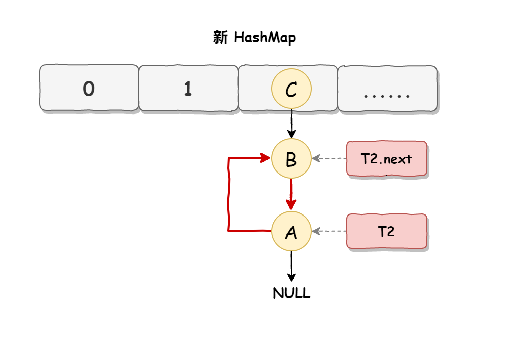

## HashMap死循环

JDK1.7版本中，扩容+头插法+链表+多线程并发导致HashMap死循环

### HashMap扩容

初始数据结构

插入元素时数据结构(头插法:新节点在头部)

扩容：旧HashMap转移顺序A，B，C

### 死循环产生

1. 线程T1和T2同时对HashMap扩容
    
    T1和T2指向链表头结点元素A
   
    T1和T2下一结点即T1.next和T2.next均指向B结点

    

2. T2时间片用完进入休眠，T1开始进行扩容操作，直到T1扩容完成后，T2被唤醒

    T2对新HashMap状态不可知，即T2指向元素没变

    T2指向A元素，T2.next指向B元素

    

3. T2恢复执行，死循环建立(链表中产生环)

    对于T1：结点B下一结点是A，即B.next = A;

    对于T2：结点A下一结点是B，即A.next = B;
   
    

### 解决方案

HashMap死循环常用解决方案

* 使用线程安全容器ConcurrentHashMap替代(推荐使用) 
* 使用线程安全容器Hashtable替代(性能低，不建议使用)
* 使用synchronized或Lock加锁HashMap之后再进行操作，相当于多线程排队(麻烦，不建议使用)
