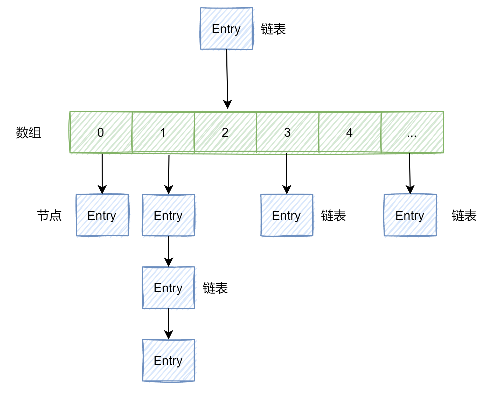
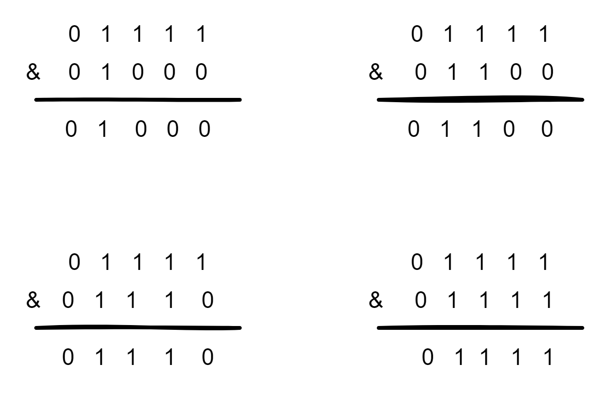
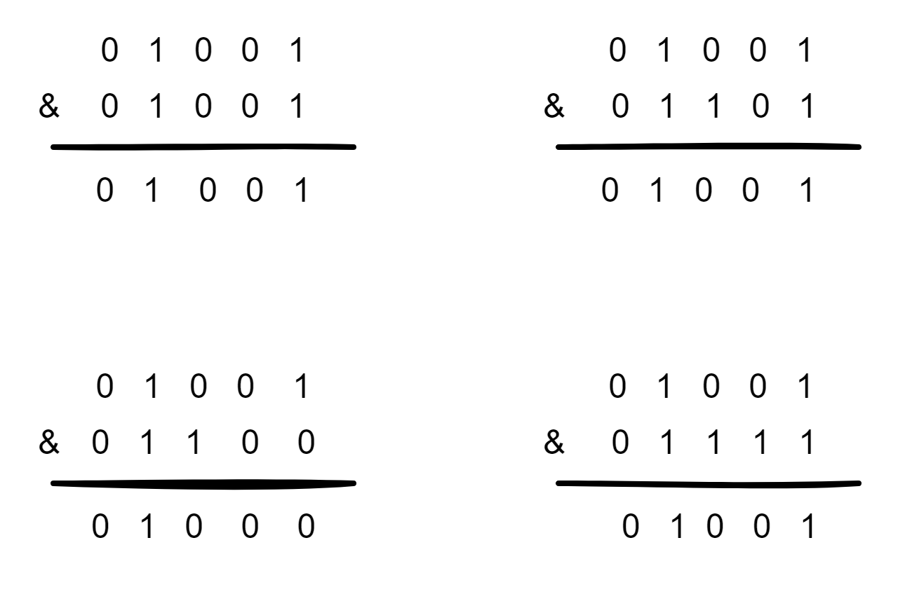

## HashMap扩容原理

HashMap扩容：扩大数组长度，对原数组进行rehash操作，把原数组copy到新数组

### HashMap数据结构

JDK1.7：数组+链表
JDK1.8：红黑树

数组每个元素都是一个Entry对象，链表的每个节点存储一个Entry对象(链表长度可为1)

Entry对象：存储四个属性(hash、key、value、next)



### HashMap扩容

#### HashMap扩容时机
  
HashMap.size() >= threshold时扩容

* HashMap.size()：元素总数，新建时为0

* threshold：阈值

    * 初始：threshold = initialCapacity * loadFactor = 12

    * 扩容后：threshold = newCapacity * loadFactor

* initialCapacity：初始容量(默认16)

* loadFactor：负载因子(默认0.75)

* newCapacity：扩容后容量/数组长度

#### 扩容方式

HashMap使用位运算扩容即2的次幂/倍数扩容：

1. 使添加元素能充分散列(均匀分布在HashMap每个位置)，**减少hash碰撞**(导致某一链表特别长，影响查询效率)几率

      * 即使2倍扩容也有可能导致hash碰撞，即**同一位置存放多对key-value**(链表上处于上下不同位置)，导致链表不符合预期变长
        
        * 原因：不同hash(hash = hash(key)经过&处理导致first相同，即元素位置(数组index)相同
          
          ```java
          // 添加元素时计算该元素在集合中位置
          // n：HashMap数组长度
          (first = tab[(n - 1) & (hash = hash(key))]
          ```
2. 位运算高效(取模运算速度较低故不使用)

#### hash碰撞

HashMap同一位置存放多对key-value(链表上处于上下不同位置)的现象

hash碰撞发生后，后加入的值插入位置

* JDK1.7：头插法加入表头
      
* JDK1.8：插入表尾

hash碰撞范例

1. HashMap容量是2次幂
   
    1. hash计算结果：无hash碰撞

        

    2. hash计算结果：产生hash碰撞
  
        1. 数组长度：16 
           
        2. n - 1 = 0000 0000 0000 0000 0000 0000 <font color=#FF0000>0000</font> 1111
           
           & hash1 1111 1111 1111 1111 0000 1111 <font color=#FF0000>0000</font> 0101
           
           = 0000 0000 0000 0000 0000 0000 <font color=#FF0000>0000</font> 0101
    
           = 5(index为5的位置) 

        3. n - 1 = 0000 0000 0000 0000 0000 0000 <font color=#FF0000>0000</font> 1111

           & hash2 1111 1111 1111 1111 0000 1111 <font color=#FF0000>0001</font> 0101
           
           = 0000 0000 0000 0000 0000 0000 <font color=#FF0000>0000</font> 0101
    
           = 5(index为5的位置)
    
        4. 即数组长度为16时，两个hash值位置相同，用链表进行存放处理，出现一个hash冲突

   3. 2倍扩容后hash计算结果：无hash碰撞
    
       重新对每个hash值进行元素位置(index)寻址

       1. 数组长度：32

       2. n - 1 = 0000 0000 0000 0000 0000 0000 <font color=#FF0000>0001</font> 1111

          & hash1 1111 1111 1111 1111 0000 1111 <font color=#FF0000>0000</font> 0101

          = 0000 0000 0000 0000 0000 0000 <font color=#FF0000>0000</font> 0101

          = 5(index为5的位置)

       3. n - 1 = 0000 0000 0000 0000 0000 0000 <font color=#FF0000>0001</font> 1111

          & hash2 1111 1111 1111 1111 0000 1111 <font color=#FF0000>0001</font> 0101

          = 0000 0000 0000 0000 0000 0000 <font color=#FF0000>0001</font> 0101

          = 21(index为21的位置)

       4. 即扩容后数组长度为32，对两个hash值重新进行寻址
          
       5. 扩容后index
    
            1. 二进制结果没有多出一个比特位，index不变
               
            2. 二进制结果多出一个比特位，index=index(原数组index)+oldCap(原数组容量)：index=5+16

2. HashMap容量不是2次幂时
   
    1. hash计算结果：产生多次hash碰撞

        

### JDK1.8新结构：红黑树

* 链表和红黑树转换
  
    * 链表->红黑树：当数组长度大于64，同时链表长度大于8时，链表将转化为红黑树
    * 红黑树->链表：当红黑树结点总数(数据长度)退化成6(包含)时，红黑树将转化为链表

* 为什么选择红黑树

    查询和插入/删除效率很高的数据结构，综合考虑红黑树比较合适(AVLTree插入/删除效率相对低下)
