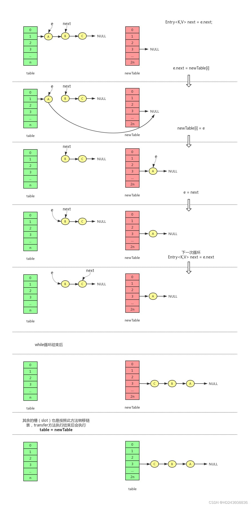
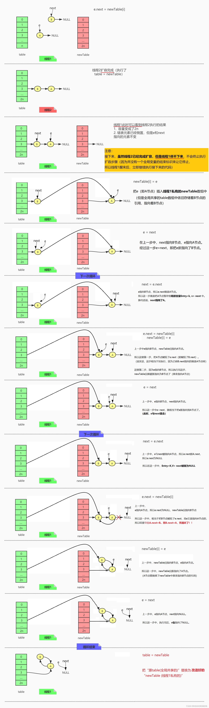

## 扩容死循环

### JDK1.7扩容源码

```java
// JDK1.7
void resize(int newCapacity) {
    Entry[] oldTable = table;
    int oldCapacity = oldTable.length;
    //如果旧容量已经达到了最大，将阈值设置为最大值，与1.8相同
    if (oldCapacity == MAXIMUM_CAPACITY) {
        threshold = Integer.MAX_VALUE;
    return;
    }
    //创建新哈希表
    Entry[] newTable = new Entry[newCapacity];
    //将旧表的数据转移到新的哈希表
    //initHashSeedAsNeeded:判断是否需要重新计算hash值
    transfer(newTable, initHashSeedAsNeeded(newCapacity));
    //替换掉原“全局所有线程共享的table”，变成新的全局线程共享table
    table = newTable;
    //更新阈值
    threshold = (int) Math.min(newCapacity * loadFactor, MAXIMUM_CAPACITY + 1);
}

void transfer(Entry[] newTable, boolean rehash) {
    int newCapacity = newTable.length;
    // 外层循环遍历数组槽（slot）
    for (Entry<K, V> e : table) {
        // 内层循环遍历单链表
        while (null != e) {
            // 记录当前节点的next节点
            Entry<K, V> next = e.next;
            // rehash需要重新计算所有key，效率低
            if (rehash) {
                e.hash = null == e.key ? 0 : hash(e.key);
            }
            // 找到元素在新数组中的槽（slot）
            int i = indexFor(e.hash, newCapacity);
            // 用头插法将元素插入新的数组
            e.next = newTable[i];
            newTable[i] = e;
            // 遍历下一个节点
            e = next;
        }
    }
}

// 判断是否需要重新计算hash值
final boolean initHashSeedAsNeeded(int capacity) {
  // hashSeed：HashMap初始化时设为0、currentAltHashing=false
  boolean currentAltHashing = hashSeed != 0;
  // sun.misc.VM.isBooted()：虚拟机是否已经加载完成，完成为true
  // 初始容量和本地方法返回值altThreshold大小(通常该值较大)比较
  // Hashing=false
  boolean useAltHashing = sun.misc.VM.isBooted() &&
          (capacity >= Holder.ALTERNATIVE_HASHING_THRESHOLD);
  // switching = false ^ false = false
  boolean switching = currentAltHashing ^ useAltHashing;
  if (switching) {
    // HashMap容量未超过指定值，不用rehash，故不需要新的hashSeed
    hashSeed = useAltHashing
      ? sun.misc.Hashing.randomHashSeed(this)
      : 0;
  }
  return switching;
}

static int indexFor(int h, int length) {
  // assertsystem Integer.bitCount(length) == 1 : "length must be a non-zero power of 2";
  return h & (length-1);
}
```

#### 单线程

单线程下，假设处于同一链表上的A、B、C结点，扩容后依然处在同一链表上



结论：

* 单链表在**转移**过程中会被反转

* table是线程共享的，而newTable不共享(线程私有)

* 执行table=newTable后，转移线程转移后的结果**对其他线程可见**

#### 多线程

```java
void transfer(Entry[] newTable, boolean rehash) {
    int newCapacity = newTable.length;
    // 外层循环遍历数组槽（slot）
    for (Entry<K, V> e : table) {
        // 内层循环遍历单链表
        while (null != e) {
            // 记录当前节点的next节点
            Entry<K, V> next = e.next;
            if (rehash) {
                e.hash = null == e.key ? 0 : hash(e.key);
            }
            // 找到元素在新数组中的槽（slot）
            int i = indexFor(e.hash, newCapacity);
            // 用头插法将元素插入新的数组
            e.next = newTable[i];
            newTable[i] = e;    // 线程1在这暂停(尚未执行该行)
            // 遍历下一个节点
            e = next;
        }
    }
}
```



过程：

* 线程1执行newTable[i] = e时暂停(未执行)
  
* 线程2扩容完成

* 线程1继续执行，此时线程2扩容后结果对线程1可见。线程2续扩容

    * 此时线程2内部定义的变量e和next指向的元素不变

* **线程2扩容完成**，形成环

结论：

* 上述情况下会产生死循环，但是不影响扩容过程的顺利结束

* 再次对该HashMap相应元素进行get()操作时，遍历到环的位置发生死循环(ConcurrentModificationException)

### JDK1.8扩容源码

```java
final HashMap.Node<K,V>[] resize() {
  HashMap.Node<K,V>[] oldTab = table;
  int oldCap = (oldTab == null) ? 0 : oldTab.length;
  int oldThr = threshold;
  int newCap, newThr = 0;
  if (oldCap > 0) {
      if (oldCap >= MAXIMUM_CAPACITY) {
          threshold = Integer.MAX_VALUE;
          return oldTab;
      }
      else if ((newCap = oldCap << 1) < MAXIMUM_CAPACITY &&
              oldCap >= DEFAULT_INITIAL_CAPACITY)
          newThr = oldThr << 1; // double threshold
  }
  else if (oldThr > 0) // initial capacity was placed in threshold
      newCap = oldThr;
  else {               // zero initial threshold signifies using defaults
      newCap = DEFAULT_INITIAL_CAPACITY;
      newThr = (int)(DEFAULT_LOAD_FACTOR * DEFAULT_INITIAL_CAPACITY);
  }
  if (newThr == 0) {
      float ft = (float)newCap * loadFactor;
      newThr = (newCap < MAXIMUM_CAPACITY && ft < (float)MAXIMUM_CAPACITY ?
              (int)ft : Integer.MAX_VALUE);
  }
  threshold = newThr;
  @SuppressWarnings({"rawtypes","unchecked"})
  HashMap.Node<K,V>[] newTab = (HashMap.Node<K,V>[])new HashMap.Node[newCap];
  table = newTab;
  if (oldTab != null) {
      for (int j = 0; j < oldCap; ++j) {
          HashMap.Node<K,V> e;
          if ((e = oldTab[j]) != null) {
              oldTab[j] = null;
              // 如果旧数组中e后面没有元素，则直接计算新数组的位置存放
              if (e.next == null)
                  newTab[e.hash & (newCap - 1)] = e;
              // 如果是红黑树则单独处理
              else if (e instanceof HashMap.TreeNode)
                  ((HashMap.TreeNode<K,V>)e).split(this, newTab, j, oldCap);
              //链表结构逻辑，解决hash冲突
              else { // preserve order
                  // 低位链表头节点，尾结点
                  // 低位链表就是扩容前后，所处的槽（slot）的下标不变
                  // 如果扩容前处于table[n]，扩容后还是处于table[n]
                  HashMap.Node<K,V> loHead = null, loTail = null;
                  // 高位链表头节点，尾结点
                  // 高位链表就是扩容后所处槽（slot）的下标 = 原来的下标 + 新容量的一半
                  // 如果扩容前处于table[n]，扩容后处于table[n + newCapacity / 2]
                  // 由于扩容都是2倍扩容，此处 newCapacity / 2 = oldCapacity
                  HashMap.Node<K,V> hiHead = null, hiTail = null;
                  HashMap.Node<K,V> next;
                  do {
                      next = e.next;
                      // 检查原hash新增bit位：
                      //   0：低位链表，即新元素索引不变
                      //   1：高位链表，即新元素索引改变
                      if ((e.hash & oldCap) == 0) {
                          if (loTail == null)
                              loHead = e;
                          else
                              loTail.next = e;
                          loTail = e;
                      }
                      else {
                          if (hiTail == null)
                              hiHead = e;
                          else
                              hiTail.next = e;
                          hiTail = e;
                      }
                  } while ((e = next) != null);
                  if (loTail != null) {
                      loTail.next = null;
                      // 低位链表在扩容后，所处槽的下标不变
                      newTab[j] = loHead;
                  }
                  if (hiTail != null) {
                      hiTail.next = null;
                      // 高位链表在扩容后，所处槽的下标 = 原来的下标 + 扩容前的容量（也就是扩容后容量的一半）
                      newTab[j + oldCap] = hiHead;
                  }
              }
          }
      }
  }
  return newTab;
}
```