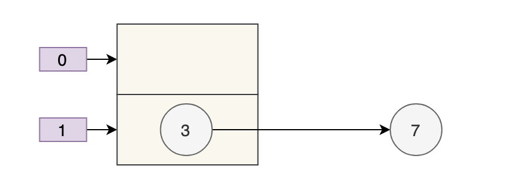
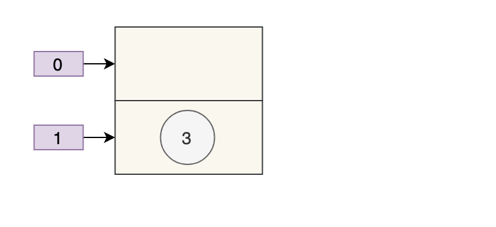
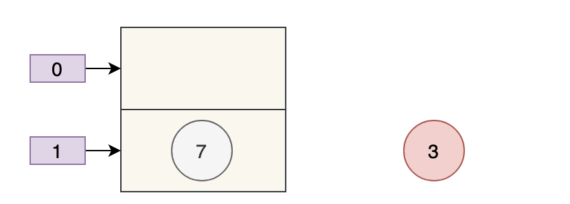

## 多线程put元素丢失

多线程同时执行put操作时，如果计算出来的索引位置相同，那么会造成前一个key被后一个key覆盖，从而导致元素丢失

```java
final V putVal(int hash, K key, V value, boolean onlyIfAbsent,
               boolean evict) {
    Node<K,V>[] tab; Node<K,V> p; int n, i;

    // 步骤①：tab为空则创建
    if ((tab = table) == null || (n = tab.length) == 0)
        n = (tab = resize()).length;

    // 步骤②：计算index，并对null做处理 
    if ((p = tab[i = (n - 1) & hash]) == null)
        tab[i] = newNode(hash, key, value, null);
    else {
        Node<K,V> e; K k;

        // 步骤③：节点key存在，直接覆盖value
        if (p.hash == hash &&
            ((k = p.key) == key || (key != null && key.equals(k))))
            e = p;

        // 步骤④：判断该链为红黑树
        else if (p instanceof TreeNode)
            e = ((TreeNode<K,V>)p).putTreeVal(this, tab, hash, key, value);

        // 步骤⑤：该链为链表
        else {
            for (int binCount = 0; ; ++binCount) {
                if ((e = p.next) == null) {
                    p.next = newNode(hash, key, value, null);

                    //链表长度大于8转换为红黑树进行处理
                    if (binCount >= TREEIFY_THRESHOLD - 1) // -1 for 1st
                        treeifyBin(tab, hash);
                    break;
                }

                // key已经存在直接覆盖value
                if (e.hash == hash &&
                    ((k = e.key) == key || (key != null && key.equals(k))))
                    break;
                p = e;
            }
        }

        // 步骤⑥、直接覆盖
        if (e != null) { // existing mapping for key
            V oldValue = e.value;
            if (!onlyIfAbsent || oldValue == null)
                e.value = value;
            afterNodeAccess(e);
            return oldValue;
        }
    }
    ++modCount;

    // 步骤⑦：超过最大容量 就扩容
    if (++size > threshold)
        resize();
    afterNodeInsertion(evict);
    return null;
}
```

### 单线程

put元素3和7



### 多线程

元素丢失

解析：

```java
if ((p = tab[i = (n - 1) & hash]) == null)
        tab[i] = newNode(hash, key, value, null);
```

1. 线程A、线程B都执行了if语句

2. 线程A先执行tab[i] = newNode(hash, key, value, null);

    
   
3. 线程B执行tab[i] = newNode(hash, key, value, null);

    
   
4. 元素3丢失

