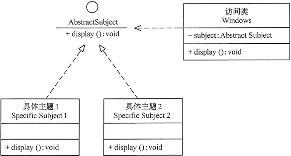

## 设计模式

### 设计模式原则

#### 开闭原则

    软件实体应(类，模块，方法等)对扩展开放，对修改关闭
    实现方式：抽象约束，封装变化。
        即通过接口、抽象类来定义一个相对稳定的抽象层，
        将相同的可变因素封装在具体实现类中。
    


#### 单一职责原则

    一个类、接口及方法只负责单一职责，降低代码复杂度及变更引起的风险

#### 依赖倒置原则

    程序应依赖于抽象类或接口，而不是具体的实现类

#### 里式替换原则(开闭原则补充)

    通俗讲，子类可以扩展父类功能，不能改变父类原有功能。
    即除添加新方法外，尽量不重写父类方法

#### 迪米特原则/最少知道原则

    模块间尽可能少地了解和依赖，降低代码耦合度

#### 合成/聚合原则

    尽可能使用组合(has-a)/聚合(contains-a)而非继承(is-a)，避免继承带来的方法污染和方法爆炸
    方法污染：子类不具备执行从父类继承的方法
    方法爆炸：继承树不断扩大，底层类拥有的方法过于复杂，导致容易选择错误

### 设计模式分类

#### 创建型

创建对象时隐藏创建逻辑，即不用new直接实例化对象。
包括工厂、抽象工厂、单例、建造者、原型模式
```java
// 工厂
ExecutorService executorService = Executors.newCachedThreadPool(new ThreadPoolFactory("CachedThread"));
```

##### 简单工厂模式

  由一个工厂对象创建实例，客户端无需关注创建逻辑，只需提供参数。
  如Calendar的getInstance方法，调用createCalendar方法根据不同时区创建不同对象
  
  场景：创建对象较少时

  缺点：功能扩展需修改工厂逻辑，违背开闭原则，且容易使工厂类复杂化

##### 工厂方法模式

  定义一个创建对象的接口，让接口的实现类决定创建哪种对象，推迟类的实例化到子类进行

  -> 解决功能扩展问题

  如Spring的FactoryBean接口的getObject方法
  
  如Collection接口抽象工厂定义了一个抽象iterator工厂方法，返回一个Iterator类的抽象产品

  iterator由ArrayList、HashMap等实现

##### 抽象工厂模式

  提供一个创建一系列相关或相互依赖对象的接口，无需指定它们的具体类，如java.sql.Connection

##### 单例模式

特点：

* 只存在一个实例
* 构造方法私有，且由内部自定义静态变量调用
* 提供静态公有方法获取实例
    
优点：开销小(频繁创建销毁实例情况避免资源多重占用)

缺点：没有抽象层，扩展难，不符合单一职责原则

应用场景：

* 需要频繁创建的一些类，单例可降低系统内存压力，减少GC
* 某些类只要求生成一个对象，如班级班长，身份证号等
* 某些类需要频繁实例化，且所创建对象又频繁被销毁，如多线程的线程池、网络连接池等
* 对象需要被共享时，如Web配置文件，数据库连接池等。

实现：

* 饿汉式：类加载时初始化创建单例对象，线程安全，不适用该对象时导致内存浪费

```java
public class HungrySingleton {
    private HungrySingleton() {};
    private static HungrySingleton instance = new HungrySingleton();
    public static HungrySingleton getInstance() {
        return instance;
    }
}
```

* 懒汉式：外部调用时才加载，线程不安全(可加锁保证安全，但效率低)。

```java
public class LazySingleton {
    private LazySingleton() {};
    private static LazySingleton instance;
    public static LazySingleton getInstance() {
        if (instance == null) {
            instance = new LazySingleton();
        }
        return instance;
    }
}
```

* 双重检查锁：使用volatile和多重检查来减小锁范围，提升效率

```java
public class DoubleCheckingSingleton {
    private DoubleCheckingSingleton() {};
    private static DoubleCheckingSingleton instance;
    public static DoubleCheckingSingleton getInstance() {
        if (instance == null) {
            synchronized (DoubleCheckingSingleton.class) {
                if (instance == null) {
                    instance = new DoubleCheckingSingleton();
                }
            }
        }
        return instance;
    }
}
```

* 静态内部类：解决饿汉式内存浪费和懒汉式线程安全

```java
public class StaticSingleton {
    private StaticSingleton() {};
    public static StaticSingleton getInstance() {
        return StaticClass.instance;
    }
    private static class StaticClass() {
        private static final StaticSingleton instance = new StaticSingleton();
    }
}
```

* 枚举：线程安全，可防止反序列化重新创建新对象，防止多次实例化，防止反射破解单例

```java
class Resource() {}
public enum EnumSingleton {
    // 创建枚举对象，该对象为单例(内部特性)
    INSTANCE;
    private Resource instance;
    private EnumSingleton() {
      instance = new Resource();
    }
    public Resouce getInstance() {
        return resource;
    }
}
// 调用
public static void main(String[] args) {
    Resouce resouce = EnumSingleton.INSTANCE.getInstance();
}
```

#### 结构型

通过类和接口间的继承和引用实现创建复杂结构的对象

##### 代理模式

  为其他对象提供代理以控制对这个对象的访问
  
  优点：降低代码耦合度，扩展性好
  
  缺点：请求处理速度变慢，增加复杂度
  
  Spring利用动态代理实现AOP，如果Bean实现了接口就使用JDK代理，否则CGLib代理
  
  分类：
  
  * 静态代理
    
    代理对象持有被代理对象的引用，调用代理对象方法时也会调用被代理对象方法，但会在被代理对象前后增加其他逻辑
    
    特点：
      * 代理类和被代理类关系在运行前确定
      * 一个代理只能为一个目标服务，服务多种类型会增加工作量
    
  * 动态代理

    程序运行时通过反射创建具体代理类
    * JDK动态代理：需实现被代理对象接口
      
      Proxy类的newInstance获取动态代理对象
      ```java
      // 参数1：被代理对象类加载器
      // 参数2：被代理对象实现的接口
      // 参数3：调用处理器指明具体逻辑
      public static Object newProxyInstance(ClassLoader loader,
                                          Class<?>[] interfaces,
                                          InvocationHandler h) {}
      ```
      
    * CGLib动态代理：需继承被代理对象
        * final类不能使用CGLib动态代理
        * 效率更高

##### 装饰器模式

不改变原有对象的基础上将功能附加到对象

适用场景：不想增加很多子类的前提下扩展一个类的功能

如java.io包中，InputStream字节输入流通过装饰器BufferedInputStream增强为缓冲字节输入流

##### 装饰器模式VS动态代理模式

* 装饰器模式：关注点在于给对象动态添加方法。将装饰者作为构造方法的参数
* 动态代理模式：注重对象的访问控制。在代理类中创建被代理对象的实例

##### 适配器模式

不兼容接口间桥梁，结合两个独立接口的功能，将一个类的接口转换成另一个类的接口，使得原本由于接口不兼容而不能一起工作的类可以一起工作

缺点：过多使用适配器会让系统变得混乱，不易整体把握

如java.io包中，InputStream字节输入流通过适配器InputStreamReader转换为Reader字符输入流

##### 适配器模式VS装饰器模式VS代理模式

* 适配器模式：无层级关系，即适配器和被适配者之间无必然联系，是一种has-a关系
* 装饰器模式：有层级关系，装饰者和被装饰者实现统一接口，是一种is-a关系
* 代理模式：不能改变代理对象的接口

#### 行为模式

##### 策略模式

定义一系列算法并封装起来，之间可以相互替换。

适用场景：解决在有多种算法相似的情况下，使用if/else所带来的的难以维护的场景

  * 优点：算法建可以自由切换，避免使用多重条件判断且扩展性良好
  * 缺点：策略类增多，且所有策略类都需对外暴露

如集合框架中的比较器Comparator是一个抽象策略类，一个类通过实现该接口并重写compare方法实现具体策略类

如创建线程池时使用相应的拒绝策略

##### 模板模式

使子类在不改变算法结构的情况下重新定义算法的某些步骤

适用场景：抽取子类重复代码到公共父类

* 优点：封装固定不变的部分，扩展可变部分
* 缺点：每一个不同实现都需要一个子类维护，会增加类的数量

特点：防止恶心操作，模板方法都以final修饰

如HttpServlet定义了一套处理HTTP请求的模板，service方法为模板方法，定义了处理Http请求的基本流程，doXXX等方法为基本方法，根据请求类型的方法做相应处理，子类可重写这些方法

##### 观察者模式/发布订阅模式

定义对象间的一种一对多的依赖关系，当一个对象状态发生改变时，所有依赖它的对象都得到通知并被自动更新

* 缺点
  * 如果被观察者有很多的直接和间接观察者的话通知很耗时
  * 如果存在循环依赖可能导致系统崩溃
  * 观察者无法知道目标对象的具体变化
    
如ServletContextListener监听ServletContext对象的生命周期，即监听web应用。
当Servlet容器启动Web应用时调用contextInitialized方法，终止时调用contextDestroyed方法


