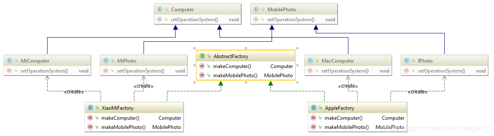

## 基础知识

所谓设计模式，是对软件实体模块间的相互关系总结出的一套规范，以达到降低模块间的耦合度

### 类关系


#### 继承(is-a)

    特殊与一般关系
    如RushOrder类由Order继承而来


#### 实现implements(like-a)

    一个类实现接口的功能


#### 依赖(use-a)

    如果一个类的方法操纵另一个类的对象，我们就说一个类依赖于另一个类
    通常在局部变量、方法的形参或者静态方法的调用上体现
    如Order类对象查看用户信用状态需要访问Account类对象，则称Order类依赖于Account类


#### 关联(Association)

    类与类之间的联结，使一个类知道另一个类的属性和方法
    分为单向关联、双向关联等
    通常表现为被关联类B以类属性的形式出现在关联类A中，也可能是类A引用了一个类型为被关联类B的全局变量


##### 分类 

* 单向关联/直接关联

    

* 双向关联

    

* 自身关联

    

* 多维关联
    
    


#### 聚合(has-a)

    对象包含关系，强调整体与部分之间的关系
    如Order对象包含一些Item对象


#### 组合

    强调整体与部分的生命周期是一致的，不可分的


#### 泛化

    Generalization
    学术名称，通常包含类与类之间的继承关系和类与接口的实现关系

### 类关系强弱程度

组合 > 聚合 > 关联 > 依赖  

### 减小耦合度

    将相互依赖的类减至最少
    如果类A不知道B的存在，它就不会关心B的任何改变（亦即B的改变不会导致A产生任何bug）

## 设计模式

### 设计模式原则

#### 开闭原则

    软件实体(类，模块，函数等)应对扩展开放，对修改关闭
    实现方式：抽象约束(需求变化可通过扩展实现)，封装变化。
            即通过接口、抽象类来定义一个相对稳定的抽象层，
            将相同的可变因素封装在具体实现类中。


#### 单一职责原则

    一个类只负责一项职责，一个类应该只有一个引起它修改的原因
    例如：
        类A负责2个功能，功能1、功能2
        当功能1需求变更而改变类A时，可能造成功能2执行错误
        所以需要将类A的粒度分解为类A1、类A2两个类

#### 依赖倒置原则

    程序应依赖于抽象类或接口，而不是具体的实现类
    简单来说就是要求对抽象进行编程，而不要对实现进行编程
    例如：
        访问数据库公用代码库(未用接口/抽象类)
        项目内各个地方均可公用
        新项目更改数据库或存储方式时，无法复用

#### 里式替换原则(开闭原则补充)

    子类应该可以完全替换父类
    通俗讲，子类可以扩展父类功能，不能改变父类原有功能
    即除添加新方法外，尽量不重写父类方法

#### 迪米特原则/最少知道原则

    模块间尽可能少地了解和依赖，降低代码耦合度
    即类不应知道自己操作的类的细节

#### 合成复用原则
    
    Composite Reuse Principle
    尽可能使用聚合(contains-a)/组合(has-a)而非继承(is-a)，避免继承带来的方法污染和方法爆炸
    方法污染TODO：子类不具备执行从父类继承的方法的能力
    方法爆炸：继承树不断扩大，底层类拥有的方法过于复杂，导致容易选择错误
    常用于结构型模式的桥接模式


#### 接口隔离原则

    Interface Segregation Principle
    客户端不应该依赖它不需要的接口，即类间的依赖关系应建立在最小接口上(接口拆分)
    结构型模式的组合模式(透明方式)违背该原则

### 设计模式分类

#### 传统创建对象

    传统创建对象的方式是new一个对象，每new一个对象，调用者多知道了一个类，
    增加了类与类之间的联系，不利于程序的松耦合

#### 构建型模式(creational)

    创建对象时隐藏创建逻辑，即不用new直接实例化对象。
    包括工厂模式、抽象工厂模式、单例模式、建造者模式、原型模式

##### 工厂模式(factory pattern)

```java
// 工厂
ExecutorService executorService 
        = Executors.newCachedThreadPool(new ThreadPoolFactory("CachedThread"));
```

###### 简单工厂模式(Simple Factory Pattern)

    工厂方法模式的一个特例
    由一个工厂对象创建实例，客户端无需关注创建逻辑，只需提供参数。
    如Calendar的getInstance方法，调用createCalendar方法根据不同时区创建不同对象
    场景：创建对象较少时
    缺点：
        1. 扩展过多，导致工厂类过于庞大，承担过多职责，变成超级类
        2. 各个功能变更时均需修改工厂逻辑，违背单一职责原则(这个类不止一个引起修改的原因)
        3. 功能需要扩展时，需修改工厂类，违背开闭原则


```java
// 定义对象抽象基类
public abstract class Fruit {
    public abstract void eat();
}

// 定义具体的对象类
public class Apple extends Fruit {
    @Override
    public void eat() {
        System.out.println("Eat an apple");
    }
}
public class Pear extends Fruit {
    @Override
    public void eat() {
        System.out.println("Eat a pear");
    }
}

// 定义对象工厂：简单工厂模式创建水果对象
public class FruitFactory {
    // 可根据实际情况注入该类bean(xml,注解)
    public Fruit create(String type) {
        switch (type) {
            case "Apple": 
                // 生产苹果需要种子、阳光、水
                Appleseed seed = new AppleSeed();
                Sunlight sunlight = new Sunlight();
                Water water = new Water();
                return new Apple(seed, sunlight, water);
            case "Pear": 
                return new Pear();
            default: 
                throw new IllegalArgumentException("Undefined fruit!");
        }
    }
}

// 客户端使用
public class User {
    private void eat() {
        // 创建工厂对象
        FruitFactory factory = new FruitFactory();
        // 生产苹果
        factory.create("Apple").eat();
        // 生产梨子
        factory.create("pear").eat();
    }
}
```

###### 工厂方法模式(Factory Method Pattern)

    定义一个创建对象的接口，让子类(接口的实现类)决定创建哪种对象，推迟类的实例化到子类进行
    即每个产品都有一个专属的工厂
    如Spring的FactoryBean接口的getObject方法
    如Collection接口抽象工厂定义了一个抽象iterator工厂方法，返回一个Iterator类的抽象产品，
      iterator由ArrayList、HashMap等实现
    优缺点：
        1. 可解决简单工厂模式的3个问题
        2. 每增加一种对象(产品等)就需增加一个工厂类，类增多了


```java
// 定义对象抽象基类
public abstract class Fruit {
    public abstract void eat();
}

// 定义具体的对象类
public class Apple extends Fruit {
    @Override
    public void eat() {
        System.out.println("Eat an apple");
    }
}
public class Pear extends Fruit {
    @Override
    public void eat() {
        System.out.println("Eat a pear");
    }
}

// 定义工厂
public interface FruitFactory {
    Fruit create();
}
// 定义实现工厂
public class AppleFactory implements FruitFactory{
    @Override
    public Fruit create() {
        return new Apple();
        // 需要更改逻辑时，只需修改相应工厂类
        // 生产苹果需要种子、阳光、水
        Appleseed seed = new AppleSeed();
        Sunlight sunlight = new Sunlight();
        Water water = new Water();
        return new Apple(seed, sunlight, water);
    }
}
// 定义实现工厂
public class PearFactory implements FruitFactory {
    @Override
    public Fruit create() {
        return new Pear();
    }
}

// 客户端使用
public class User {
    private void eatFruit() {
        // 生产苹果
        AppleFactory appleFactory = new AppleFactory();
        appleFactory.create().eat();
        
        // 生产梨子
        PearFactory pearFactory = new PearFactory();
        pearFactory.create().eat();
    }
}
```

###### 抽象工厂模式(Abstract Factory Pattern)

    提供一个创建一系列相关或相互依赖对象的接口，无需指定它们的具体类，如java.sql.Connection
    优缺点：
        替换具体工厂时只需修改少量代码(具体工厂类那一行即可)
        新增抽象方法时需修改所有具体工厂类(给人很重的感觉)
    适用于只增加同类工厂这样的横向扩展需求，不适合新增功能这样的纵向扩展需求



```java
// 水果接口
public abstract class Fruit {
    public abstract void eat();
}

public class AFruit extends Fruit {
    @Override
    public void eat() {
        System.out.println("A公司水果产品");
    }
}
public class BFruit extends Fruit {
    @Override
    public void eat() {
        System.out.println("B公司水果产品");
    }
}

// 蔬菜接口
public abstract class Vegetable {
    public abstract void eat();
}
public class AVegetable extends Vegetable {
    @Override
    public void eat() {
        System.out.println("A公司蔬菜产品");
    }
}
public class BVegetable extends Vegetable {
    @Override
    public void eat() {
        System.out.println("B公司蔬菜产品");
    }
}

// 抽象工厂接口：开闭原则的约束抽象，即定义一个相对稳定的抽象层
public interface IFactory {
    Fruit createFruit();
    Vegetable createVegetable();
}

// A公司产品工厂
public class ACompanyFactory implements IFactory {
    @Override
    public Fruit createFruit() {
        return new AFruit();
    }

    @Override
    public Vegetable createVegetable() {
        return new AVegetable();
    }
}

// B公司产品工厂
public class BCompanyFactory implements IFactory {
    @Override
    public Fruit createFruit() {
        return new BFruit();
    }

    @Override
    public Vegetable createVegetable() {
        return new BVegetable();
    }
}

// 客户端使用
public class User {
    private vloid eat() {
        // 使用A公司工厂生产系列产品
        IFactory aCompanyFactory = new ACompanyFactory();
        aCompanyFactory.createFruit().eat();
        aCompanyFactory.createVegetable().eat();
        // 使用B公司工厂生产系列产品
        IFactory bCompanyFactory = new BCompanyFactory();
        bCompanyFactory.createFruit().eat();
        bCompanyFactory.createVegetable().eat();
    }
}
```

##### 单例模式(Singleton Pattern)

    特点：
      1. 只存在一个实例
      2. 构造方法私有，且由内部自定义静态变量调用
      3. 提供静态公有方法获取实例
    
    优点：开销小(频繁创建销毁实例情况避免资源多重占用)
    缺点：没有抽象层，扩展难，不符合单一职责原则

    应用场景：
     * 需要频繁创建的一些类，单例可降低系统内存压力，减少GC
     * 某些类只要求生成一个对象，如班级班长，身份证号等
     * 某些类需要频繁实例化，且所创建对象又频繁被销毁，如多线程的线程池、网络连接池等
     * 对象需要被共享时，如Web配置文件，数据库连接池等。

    加载方式选择：
        饿汉式：构建不复杂，加载完成后会立即使用的单例对象
               如QQ、微信等，启动时立刻刷新所有数据，保证最新内容
        懒汉式：构建过程耗时较长，并不是所有使用此类都会用到的单例对象
               如美团、饿了么等，首页立刻刷新，其他标签页点击才会刷新
               游戏中某些模块，点击时才会下载资源
        代码整洁之道：不提倡懒加载，因为程序应该将构建与使用分离，达到解耦

###### 饿汉式

* 类加载时初始化创建单例对象，线程安全，不使用该对象时导致内存浪费

    ```java
    public class HungrySingleton {
        private HungrySingleton() {};
        private static HungrySingleton instance = new HungrySingleton();
        public static HungrySingleton getInstance() {
            return instance;
        }
    }
    ```

###### 懒汉式

* 外部调用时才加载，线程不安全(可加锁保证安全，但效率低)

    ```java
    public class LazySingleton {
        private LazySingleton() {};
        private static LazySingleton instance;
        public static LazySingleton getInstance() {
            // 多线程不安全：获取到CPU时间片时可能已经创建
            if (instance == null) {
                instance = new LazySingleton();
            }
            return instance;
        }
    }
    ```

###### 双重检查锁 

* 使用volatile/synchronized和多重检查来减小锁范围，提升效率

    ```java
    /**
     * 
     * 如果发生指令重排，多线程可能不安全
     *   1.分配内存空间
     *   2.执行构造器，初始化对象
     *   3.把对象指向内存空间
     * 正常情况下：按照123执行；发生指令重排，可能会先执行132
     * 多线程情况下：如果第一个线程执行了13，此时第二个线程过来可能就会判断instance不为空，
     *              直接就返回了instance，此时，instance对象内存空是空的。
     *              使用volatile避免指令重排
     */
    public class DoubleCheckingSingleton {
        private DoubleCheckingSingleton() {};
        private static volatile DoubleCheckingSingleton instance;
        public static DoubleCheckingSingleton getInstance() {
            // 第一重check：提高访问性能，一旦实例被创建，所有的check均为假
            //             可以被多个线程进入
            if (instance == null) {
                synchronized (DoubleCheckingSingleton.class) {
                    // 第二重check：线程安全，确保多线程下只生成一个实例
                    //             线程只能排队进入
                    if (instance == null) {
                        // 非原子性操作，可能会有指令重排
                        instance = new DoubleCheckingSingleton();
                    }
                }
            }
            return instance;
        }
    }
    ```
  
###### 静态内部类

* 解决饿汉式内存浪费和懒汉式线程安全

    ```java
    // 避免内存浪费：内部类不随外部类一起加载，外部类实例化之后，内部类才会加载
    // 线程安全由虚拟机保证(client方法的正确加锁、同步)
    // 类加载过程：加载(二进制字节流)、验证(安全)、准备(空间)、解析(常量池符号引用)、初始化(client方法)
    public class StaticSingleton {
        private StaticSingleton() {};
        public static StaticSingleton getInstance() {
            return SingletonHolder.instance;
        }
        private static class SingletonHolder {
            private static final StaticSingleton instance = new StaticSingleton();
        }
    }
    ```

###### 枚举

* 线程安全，可防止反序列化重新创建新对象，防止多次实例化，防止反射破解单例

    ```java
    class Resource() {}
    public enum EnumSingleton {
        // 创建枚举对象，该对象为单例(内部特性)
        INSTANCE;
        private Resource instance;
        private EnumSingleton() {
          instance = new Resource();
        }
        public Resouce getInstance() {
            return instance;
        }
    }
    // 调用
    public static void main(String[] args) {
        Resouce resouce = EnumSingleton.INSTANCE.getInstance();
    }
    ```

##### 建造型模式(Builder Pattern)

    将一个复杂的构建与其表示分离，使得同样的构建过程可以创建不同的表示
    
    优缺点：不用担心忘记某个配置，保证构建过程的稳定
    应用场景：OkHttp、Retrofit等框架源码中使用

##### 原型模式(Prototype Pattern)

    用原型实例指定创建对象的种类，并通过拷贝这些原型创建新的对象

    应用场景：Object的clone()方法

```java
public class MilkTea implements Cloneable {
    public String type;
    public boolean ice;

    @Override
    public MilkTea clone() throws CloneNotSupportedException {
        return (MilkTea) super.clone();
//        MilkTea milkTea = new MilkTea();
//        milkTea.type = this.type;
//        milkTea.ice = this.ice;
//        return milkTea;
    }
}
public class CustomerUse {
    public static void main(String[] args) throws CloneNotSupportedException {
        MilkTea milkTeaOfA = new MilkTea();
        milkTeaOfA.type = "原味";
        milkTeaOfA.ice = false;
        MilkTea milkTeaOfB = milkTeaOfA.clone();
    }
}
```

#### 结构型模式(structural)

结构型模式就像搭积木，将不同的类结合在一起形成契合的结构

##### 适配器模式(Adapter Pattern)

    将一个类的接口转换成另一个类的接口，使得原本由于接口不兼容而不能一起工作的类可以一起工作
    适配：源接口通过一个中间件转换之后才可以适用于目标接口，这个转换过程称为适配
    中间件：中间件称为适配器
    优缺点：过多使用适配器会让系统变得混乱，不易整体把握
    适用场景：有相关性但不兼容的结构
             如java.io包中，InputStream字节输入流通过适配器InputStreamReader转换为Reader字符输入流

##### 桥接模式(Bridge Pattern)

    将抽象部分与它的实现部分分离，使它们都可以独立地变化
    通常表现为合成复用原则(Composite Reuse Principle)的实现
    主要用于两个或多个同等级的接口

##### 组合模式(Composite Pattern)

    定义：又称为部分整体模式。是用于把一组相似的对象当做一个单一的对象。
         组合模式依据树形结构来组合对象，用来表示部分以及整体层次
    用于整体与部分的结构，当整体与部分有相似的结构，
    在操作时可以被一致对待，就可以使用组合模式(生命周期)
    如：文件夹和子文件夹：都可以存放文件、新建文件夹
        总公司和子公司：都可以设立部门、设立新的分公司

    透明方式：在Component中声明所有管理子对象的方法，包括add、remove等，
            这样继承自Component的子类都具备了add、remove方法。
            对于外界来说叶子结点和枝节点都是透明的，他们具备完全一致的接口
    透明方式优缺点：子类具备完全一致的行为接口，调用者可以一致对待他们
                 违背接口隔离原则

    安全方式：在Component中不声明add和remove等管理子对象的方法，这样
            叶子节点就无需实现它，只需在枝节点中实现管理子对象的方法即可
    安全方式优缺点：遵循接口隔离原则
                 不够透明，子类需要区别对待使用


##### 装饰模式(Decorator Pattern)

    定义：动态的给一个对象增加一些额外的职责，就增加对象功能来说，装饰模式比子类更加灵活
         也称为装饰器模式、包装器(模式)
    作用：1. 增强一个类原有功能
           a. 仅用于增强，不改变原有功能，称为透明装饰模式
             i. 透明：无需知道被装饰者具体的类
           b. 继承的一种替代方案。避免多种装饰下继承实现产生的类爆炸
           c. 相比集成来说更加灵活
         2. 为一个类添加新的功能
           a. 不改变原有功能，增加新功能，称为半透明模式
             i. 一半透明：无需知道被装饰者具体的类(可以为任意的装饰者类，被装饰者对客户端不可见)
             i. 一半不透明：使用新方法必须知道具体装饰类，装饰类对客户端可见、不透明
           b. 半透明模式无法多次装饰
    适用场景：
      1. 不想增加很多子类的前提下扩展一个类的功能
      2. java.io包中，InputStream字节输入流通过装饰器BufferedInputStream增强为缓冲字节输入流

JavaIO解析


```java
public abstract class InputStream implements Closeable {
  
    public abstract int read() throws IOException;
    // ...
}
```

1. 左边3个类：FileInputStream、ByteArrayInputStream、ServletInputStream实现InputStream基本功能，类似House类实现IHouse接口

2. 右下角3个类：BufferedInputStream、DataInputStream、CheckedInputStream是具体的装饰类

    1. FilterInputStream：装饰类父类，无具体功能，仅用于包装InputStream

        ```java
        public class FilterInputStream extends InputStream {
          protected volatile InputStream in;
        
          protected FilterInputStream(InputStream in) {
            this.in = in;
          }
        
          public int read() throws IOException {
              return in.read();
          }
          
          // ...
        }
        ```
   2. BufferedInputStream
      
      * 读取内容到缓冲区，满后再从缓冲区一段一段取出
  
      * 只有增强功能fill(read方法体内)，故该类使用透明的装饰模式

        ```
   3. DataInputStream

     * 方便读取int、double等类型内容

     * 新增readInt、readLong等方法，故该类使用半透明模式

##### 外观模式(Facade Pattern)

    外部与一个子系统的通信必须通过一个统一的外观对象进行，为子系统中的一组接口提供一个一致的界面
    外观模式定义了一个高层接口，这个接口使得这一子系统更加容易使用，又称为面模式
    简而言之，封装多个子系统，提供一个更简洁的接口供外部调用
    适用场景：
        1. 日志外观系统
        2. MVC中的C层，M层和V层通过Controller交互减少耦合

##### 享元模式(Flyweight Pattern)

    简单来说享元模式就是共享对象，提高复用性。
    要求能够共享的对象必须是细粒度对象，又称轻量级模式
    适用场景：缓存池、对象池

##### 代理模式(Proxy Pattern)

    给某一个对象提供一个代理，并由代理对象控制对原对象的引用

    优缺点：降低代码耦合度，扩展性好
           请求处理速度变慢，增加复杂度
    
    适用场景：
        1. 日志打印
        2. 权限管理
        3. Spring利用动态代理实现AOP，如果Bean实现了接口就使用JDK代理，否则CGLib代理

区别|适配器模式|装饰模式|代理模式
---|---|---|---
着重点|改变接口,接口回炉重造|为了增强/添加功能|为了加以控制
关系|无层级关系|有层级关系|不能改变代理对象接口

#### 行为模式(behavioral)

行为模式重点关注类与类之间的交互协作

##### 责任链模式(Chain of Responsibility)

    使得多个对象都有机会处理请求，从而避免请求的发送者和接收者之间的耦合关系
    将这些对象形成一条链，并沿着这条链传递该请求，直到有一个对象处理它为止
    优点：
        1. 降低对象耦合度
        2. 扩展性强、灵活性强
        3. 简化对象之间的连接
        4. 责任分担
    缺点：
        1. 不能保证每个请求一定被处理，可能传递到链尾也得不到处理
        2. 责任链过长，请求处理涉及多个处理对象，系统性能将会受到一定影响
        3. 责任链建立的合理性靠客户端来保证，增加了客户端的复杂性；可能出现责任链拼接次序出错而导致系统出错(如循环调用)
    适用场景：
        1. 假期审批
        2. 加薪申请等

##### 命令模式(Command Pattern)

    将一个请求封装为一个对象，从而使你可用不同的请求对客户进行参数化，对请求排队或记录请求日志，以及支持可撤销操作
    宏命令：将一组命令封装起来
    优点：
        1. 降低系统耦合度
        2. 扩展性强，方便实现Undo和Redo操作
        3. 很容易实现序列操作及实现回掉系统
            1. 命令添加到列表实现序列操作
            2. 将命令对象添当做参数，而这个对象可以执行，实现了回调功能
    缺点:
        1. 产生大量命令类，增加系统复杂性
    适用场景：
        1. 当需要将各种执行的动作抽象出来，使用时通过不同的参数来决定执行哪个对象
        2. 当某个或者某些操作需要支持撤销的场景
        3. 当要对操作过程记录日志，以便后期通过日志将操作过程重新做一遍时
        4. 当某个操作需要支持事务操作的时候
    总结：日常开发中使用频率不高


* Command

    一个接口，定义一个命令

* ConcreteCommand

    具体的执行命令，实现Command接口

* Receiver

    真正执行命令的角色，那些具体的命令引用它，让它完成命令的执行

* Invoker

    负责按照客户端的指令设置并执行命令，像命令的撤销、日志的记录等功能都在此类中完成

##### 解释器模式(Interpreter Pattern)

    给定一门语言，定义它的文法的一种表示，并定一个解释器，该解释器使用该表示来解释语言中的句子
    终结表达式：不可拆分的最小单元
    非终结表达式：可被拆分的表达式
    适用场景：正则表达式

##### 迭代器模式(Iterator Pattern)

    提供一种访问一个容器对象中各个元素，而又不暴露该对象的内部细节

##### 中介者模式(Mediator Pattern)

    定义一个中介对象来封装一系列对象之间的交互，使原有对象之间的耦合松散，且可以独立地改变他们之间的交互
    优缺点：
        1. 将类与类之间的多对多关系简化成多对一、一对多关系
        2. 中介类容易变成一个超级类，需权衡利弊

##### 备忘录模式(Memento Pattern)

    在不破坏封装的条件下，通过备忘录对象存储另外一个对象内部状态的快照，在将来合适的时候把这个对象还原到存储起来的状态
    优点：
        1. 给用户提供一种可以恢复状态的机制，方便用户回到某个历史的状态
        2. 实现了信息的封装，使用户不需要关心状态的保存细节
    缺点：
        1. 消耗资源，类成员变量过多，占用较大资源，每次保存均会消耗一定内存
    适用场景：
        1. IDE的导出用户设置为zip，内部原理就是备忘录模式

##### 观察者模式(Observer Pattern)

    定义一种一对多的依赖关系，当一个对象的状态发生改变时，所有依赖于它的对象都得到通知并被自动更新
    又称为发布订阅模式
    概念：
        观察者observer
        被观察者observable
        订阅subscribe、注册register
        响应update
    适用场景：
        1. 开关灯，灯对我们控制开关的事件做出了相应，即一对一的观察者模式
        2. IO复用模型(非阻塞IO) 中的注册通道事件到选择器selector上并指定监听事件就是一个观察者模式

##### 状态模式(State Pattern)

    当一个对象的内在状态改变时允许改变其行为，这个对象看起来像是改变了其类
    简而言之，状态模式是一个关于多态的设计模式
    优缺点：
        1. 将与特定状态相关的行为封装到一个状态对象中，使用多态代替if-else或switch-case判断
        2. 导致类增加(多态不可避免)

##### 策略模式(Strategy Pattern)

    定义了一系列算法，并将每一个算法封装起来，并且使它们还可以相互替换。策略模式让算法独立于使用它的客户而独立变化
    简而言之，殊途同归(在不同场景使用不同的策略/方法达到相同目的)
    优缺点：
        1. 每new一个对象，相当于调用者多知道了一个类，增加了类与类之间的联系，不利于程序的松耦合
        2. 通常配合工厂模式使用，将不同策略封装到工厂类中
    工厂策略模式又称为混合模式：较为常用

    状态模式区别：
        状态模式：在不同状态下才能完成某件事
        策略模式：任一策略均可完成某一件

##### 模板方法模式(Template Method Pattern)

    定义一个操作中算法的骨架，而将一些步骤延迟到子类中。
    模板方法使得子类可以不改变一个算法的结构即可重定义该算法的某些特定步骤
    简而言之，模板方法模式就是一个关于继承的设计模式
    适用场景：抽取子类重复代码到公共父类
    优点：封装固定不变的部分，扩展可变部分
    缺点：每一个不同实现都需要一个子类维护，会增加类的数量

##### 访问者模式(Visitor Pattern)

    表示一个作用于某对象结构中的各元素的操作。它使你可以再不改变各元素的类的前提下定义作用于这些元素的新操作
    调用重写方法时(多态)，与对象的运行时类型有关 --> 运行时动态绑定
    调用重载方法时，只与方法签名中声明的参数类型有关，与对象运行时的具体类型无关

    分派：方法调用称之为分派
    静态分派：调用重载方法时，编译时期确定的分派称之为静态分派
    动态分派：调用重写方法即多态时，运行时根据参数实际类型进行动态绑定，称之为动态分派
    方法的宗量：方法的接收者和方法的参数称为方法的宗量
    单分派：根据一个宗量就可以知道应该调用哪个方法
        简而言之，程序在选择重载方法和重写方法时，如果其中一种情况时动态分派，另一种是静态分派，则称之为单分派
    双重/多分派：需要根据多个宗量才能确定调用目标
        简而言之，程序在选择重载方法和重写方法时，如果两种情况都是动态分派的，则称之为双重分派