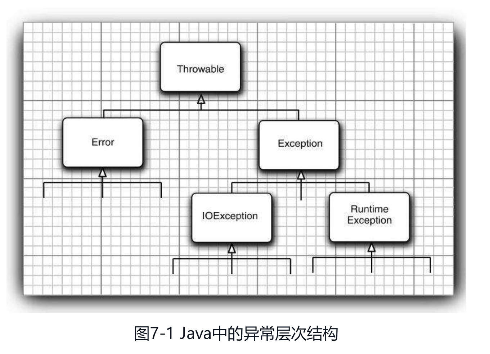

## JAVA系统错误处理

### 异常

异常层次结构



#### 异常分类

##### 继承层次分类

###### Error(Java内部错误)
  
系统内部错误和资源耗尽等，应用程序不应该抛出这类异常（底层系统抛出）

###### Exception：Error以外异常

1. RuntimeException：由于程序错误导致的异常
   
    * 错误的类型转换
      
    * 数组访问越界
      
    * 访问null指针

2. IOException：由于I/O错误这类问题导致的异常
   
    * 从文件尾部后面读取数据
      
    * 打开一个不存在的文件
      
    * 根据字符串查找不存在的Class对象

##### 受查/非受查

###### 非受查unchecked

派生于Error类和RuntimeException类的异常

###### 受查checked

其他异常(如派生于IOException类的异常)

#### 声明异常

* 必须声明所有可能抛出的受查异常(编译器会检查是否提供了处理器)

* 不应声明非受查异常(不必将所有可能抛出的异常进行声明)

   * 不应声明RuntimeException继承的非受查异常(下列3)
   
      应避免发生
   
   * 不需要声明Java内部错误，即Error继承的异常(下列4)
   
      不可控制
   
* 如果系统不允许抛出的的受查异常，可以通过TODO：包装技术将其包装成运行时异常（非受查异常） 可通过xx.getCause()获取原始受查异常细节

##### 异常抛出场景

1. 调用一个抛出受查异常的方法，如FileInputStream构造器
   
2. 程序运行过程中发现错误并用throw语句抛出一个受查异常
   
3. 程序出现错误，如a[-1]将抛出一个ArrayIndexOutOfBoundsException非受查异常
   
4. Java虚拟机和运行时库出现的内部错误

##### 带资源的try语句


### 断言

当条件(又称前置条件Precondition)检测结果为false时，会抛出AssertionError异常

特点：允许在测试期间插入一些检查语句，代码发布时这些插入的检测语句会被自动移除

#### 用法

1. assert 断言条件
   
2. assert 断言条件：断言信息
   
    * 断言信息被传入AssertionError构造器中并转换成一个消息字符串

    * AssertionError对象并不存储表达式的值，不可能在以后得到它

#### 启用

默认禁用

1. 非系统类(类加载器的类)

    启用禁用不用重新编译，属于类加载器功能
   
    1. 启用：-enableassertions或-ea
    
    2.禁用：-disableassertions或-da
   
2. 系统类(虚拟机加载的类)

    系统类没有类加载器，启用或禁用断言时
   
    1.启用：-enablesystemassertions或-esa
   
    2.急用：-disablesystemassertions或-dsa
   
#### 适用场景

测试和调试阶段使用

#### 方法

```java
// 启用/禁用包或类的断言状态
setDefaultAssertionStatus
// 启用/禁用类（包括内部类）的断言状态
setClassAssertionStatus
// 启用/禁用包和其子包的断言状态
setPackageAssertionStatus
// 移去所有类和包的显式断言状态设置，并禁用所有通过这个类加载器加载的类的断言
clearAssertionStatus
```

### 日志系统

1. Logger

   Java自带：java.util.logging.Logger

2. slf4j