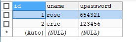

## Java Bean

一种特殊的Java类，通过封装属性和方法使之成为具有某种功能或者处理某个业务的对象，简称JavaBean

分类

1. 封装数据的JavaBean

    也称实体类，一般来说对应数据库中的一张表

    ```java
    public class UserDemo {
        private int id;
        private String uname;
        private String upwd;
        
        public Login() {
        }
        
        public Login( String uname, String upwd) {
            this.uname = uname;
            this.upwd = upwd;
        }
        
        
        public Login(int id, String uname, String upwd) {
            this.id = id;
            this.uname = uname;
            this.upwd = upwd;
        }
        
        public int getId() {
            return id;
        }
        public void setId(int id) {
            this.id = id;
        }
        public String getUname() {
            return uname;
        }
        public void setUname(String uname) {
            this.uname = uname;
        }
        public String getUpwd() {
            return upwd;
        }
        public void setUpwd(String upwd) {
            this.upwd = upwd;
        }
    }
    ```
   
    

2. 封装逻辑的JavaBean

    用于实现业务逻辑，提高代码的复用和解耦

    ```java
    public class LoginDao {
        // 使用默认的无参构造
        // 基本四项之前三
        private String DBurl = "jdbc:mysql://localhost:3306/student?useUnicode=true&characterEncoding=utf8";
        private String user = "root";
        private String password = "123456";
		
        public int login(UserDemo user) throws Exception{
            Connection conn = jdbcUtil.getConnection();
            Statement stmt = conn.createStatement();
            String sql = "SELECT UPASSWORD FROM myusers WHERE UNAME ='"+user.getUname()+"' AND UPASSWORD='"+user.getUpwd()+"'";
            
            ResultSet rs = stmt.executeQuery(sql);
            
            int result;
            if(rs.next()) {
                result =  1;
            }else {
                result = 0;
            }
            
            jdbcUtil.close(conn, stmt, rs);
            return result;
        }
    }
    ```

特征(满足以下特征就可称为JavaBean):

* public修饰的类，public无参构造

    * 默认无参构造方法

    * 如自定义了有参构造，则必须显示提供无参构造方法
  
* private属性(如果有)，且提供public的setter/getter方法(boolean变为is)
