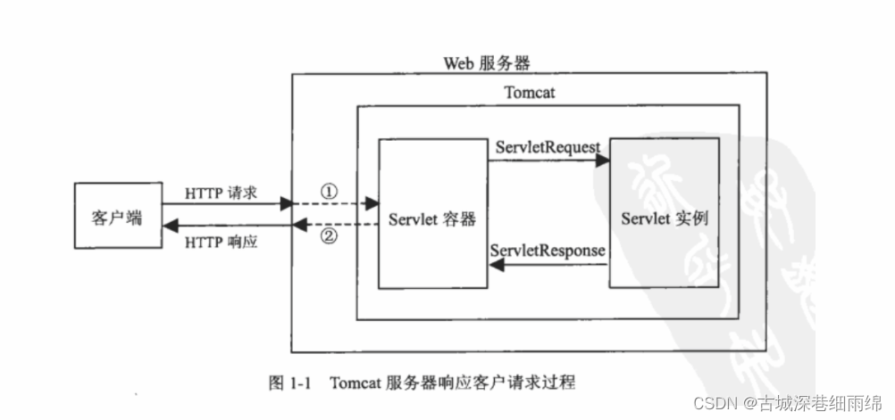
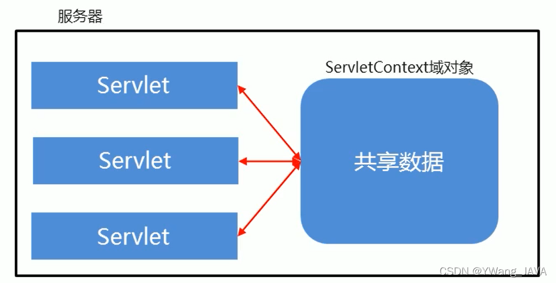
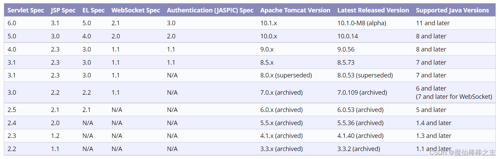

## Servlet

### 什么是Servlet

servlet是运行在web服务器中的小型java程序(服务器端的小应用程序)

作用：**接收**用户的请求，并对请求做出**处理**，将处理结果**响应**给客户端

JavaWeb三大组件：servlet、过滤器、监听器



### 实现Servlet的3种方式

1. 实现Servlet接口：javax.servlet.Servlet

   1. 实现Servlet接口
   
   2. 重写包括init()、service()、destroy()等五个方法
   
   3. 在web.xml中声明和配置Servlet
   
   4. 部署web项目并通过浏览器访问

2. 继承抽象类：javax.servlet.GenericServlet

   1. 继承GenericServlet类
   
   2. 重写service()方法

   3. 在web.xml中声明和配置Servlet

   4. 部署web项目并通过浏览器访问

3. 继承HttpServlet类(常用)：javax.servlet.HttpServlet

   1. 重写doGet()和doPost()方法
   
      1. 两个方法的方法体一样，因此只用重写一个，另一个方法的方法体直接调用重写好的那个函数即可

   3. 在web.xml中声明和配置Servlet

   4. 部署web项目并通过浏览器访问

### Servlet生命周期

相关方法

    // 出生：servlet被创建成功后执行的方法
    void init(ServletConfig);
    // 服务
    void service(ServletRequest, ServletResponse);
    // 销毁
    void destory();

1. 出生

    1. 服务器启动时创建Servlet：此时需要配置web.xml(load-on-startup标签)
   
         1. 优点：提前创建好对象，提高首次执行效率，可以完成一些应用加载时的操作
      
         2. 缺点：占用内存多，影响服务器启动效率
       
    2. 第一次访问Servlet时由服务器创建：默认方式

         1. 优点：较少内存浪费，提高服务器启动效率
      
         2. 缺点：如果有些应用需要在加载时完成初始化，则这种启动方式无法完成
   
2. 服务

    1. 服务器接收请求，调用Servlet的service()方法处理请求
    
    2. 接收多次请求，service()方法被调用多次
    
3. 离去

    1. 服务器关闭时销毁Servlet：通常销毁Servlet前调用Servlet()方法做收尾(资源释放等)

         ```java
         public class HelloServlet implements Servlet {
             public void init(ServletConfig config) throws ServletException {
                 System.out.println("Servlet被创建了！");
             }
             public ServletConfig getServletConfig() {return null;}
             public void destroy() {
                 System.out.println("Servlet要离去了！");
             }
             public String getServletInfo() {return null;}
         
             public void service(ServletRequest req, ServletResponse res)
                     throws ServletException, IOException {
                 System.out.println("hello servlet!");
             }
         }
         ```
       
### Servlet映射

1. 具体名称方式

   访问资源路径(类路径)必须和映射配置完全相同

   ```java
   <!--具体名称格式-->
    <servlet>
        <servlet-name>servLet01</servlet-name>
        <servlet-class>com.moku.ServLet.Serv01</servlet-class>
    </servlet>
    <servlet-mapping>
        <servlet-name>servLet01</servlet-name>
        <url-pattern>/hello</url-pattern>
    </servlet-mapping>
   ```

2. '/'开头+通配符方式

   ```java
   <!--具体名称格式-->
    <servlet>
        <servlet-name>servLet01</servlet-name>
        <servlet-class>com.moku.ServLet.Serv01</servlet-class>
    </servlet>
    <servlet-mapping>
        <servlet-name>servLet01</servlet-name>
        <!-- 以/serv/开头的资源url都可以访问 -->
        <url-pattern>/serv/*</url-pattern>
    </servlet-mapping>
   ```

3. 通配符+固定格式结尾

   ```java
   <!--具体名称格式-->
    <servlet>
        <servlet-name>servLet01</servlet-name>
        <servlet-class>com.moku.ServLet.Serv01</servlet-class>
    </servlet>
    <servlet-mapping>
        <servlet-name>servLet01</servlet-name>
        <!-- 以.do结尾的资源url都可以访问 -->
        <url-pattern>*.do</url-pattern>
    </servlet-mapping>
   ```

### Servlet线程安全问题

Servlet是单例的(100个人访问，访问都是同一个servlet)，即一个类型的Servlet只有一个实例对象

Servlet线程不安全，解决方式：

   * 类成员加同步锁(synchronized)，即使用类成员的地方加上synchronized使之称为同步代码块

   * 将类成员定义在service(doGet和doPost)方法中

### Servlet get/post区别

区别|get|post
---|---|---
参数|拼接在路径后面※1|放在请求体中(http包的包体中)
安全|不安全的提交方式|相对安全的提交方式
参数个数|有限制※2|无限制(文本+二进制文件)
处理方法|doGet()|doPost()※3

※1：?username=admin&password=admin123

※2：get方式能提交的数据只能是文本，且大小不能超过1024字节

※3：除了用form表单提交指定为post方式外，其他均为get方式提交

### 重定向和转发

重定向(Redirect)：当浏览器请求一个URL时，服务器返回一个重定向指令，告诉浏览器地址已经变了，使用新的URL重新发送新请求

转发(Forward)：内部转发。当一个Servlet处理请求时，自己不继续处理，而是转发给另一个Servlet处理

### ServletConfig

Servlet配置参数对象

```xml
 <servlet>
     <servlet-name>servlet02</servlet-name>
     <servlet-class>com.moku.servlet02.Servlet02</servlet-class>
     <!--配置ServLetConfig-->
     <init-param>
         <!--设置编码为utf-8-->
         <param-name>encoding</param-name>
         <param-value>UTF-8</param-value>
     </init-param>
     <init-param>
         <!--设置描述信息-->
         <param-name>desc</param-name>
         <param-value>this is Servlet02</param-value>
     </init-param>
 </servlet>
 <servlet-mapping>
     <servlet-name>servlet02</servlet-name>
     <!-- 以.do结尾的资源url都可以访问 -->
     <url-pattern>*.do</url-pattern>
 </servlet-mapping>
```

### ServletContext

应用上下文对象(应用域对象)，每一个应用中只有一个ServletContext对象

作用：配置和获取应用的全局初始化参数，实现Servlet之间的数据共享

生命周期：应用加载时创建，停止时销毁



#### 调用方式

1. 通过ServletConfig对象的getServletContext()方法获取ServletContext对象

2. 步骤1获取的ServletContext对象来使用其方法

### Servlet、Tomcat、JDK版本冲突

