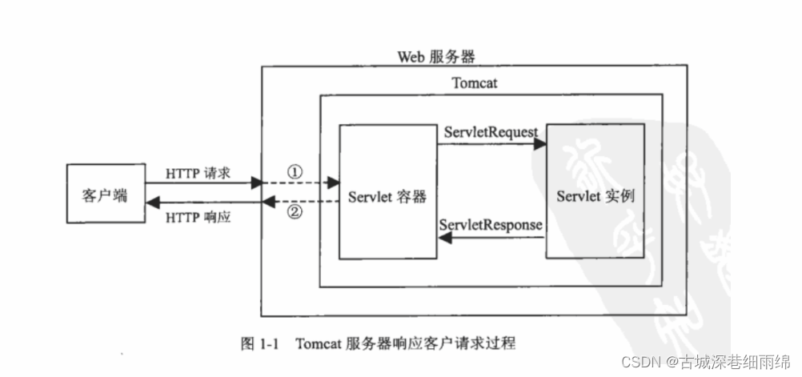
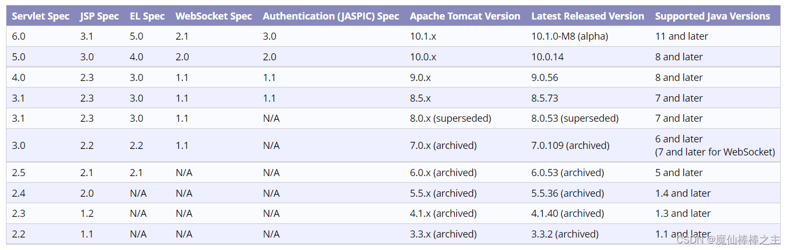

## Servlet

### 什么是Servlet

servlet是运行在web服务器中的小型java程序(服务器端的小应用程序)

作用：接收用户的请求，并对请求做出处理，将处理结果响应给客户端

JavaWeb三大组件：servlet、过滤器、监听器



### 实现Servlet的3种方式

1. javax.servlet.Servlet接口

2. javax.servlet.GenericServlet类 implements Servlet abstractor

3. javax.servlet.HttpServlet类 extends GenericServlet abstractor

### Servlet生命周期

相关方法

    // 出生：servlet被创建成功后执行的方法
    void init(ServletConfig);
    // 服务
    void service(ServletRequest, ServletResponse);
    // 销毁
    void destory();

1. 出生

    1. 服务器启动时创建Servlet：此时需要配置web.xml
    
    2. 第一次访问Servlet时由服务器创建：默认方式

2. 服务

    1. 服务器接收请求，调用Servlet的service()方法处理请求
    
    2. 接收多次请求，service()方法被调用多次
    
3. 离去

    1. 服务器关闭时销毁Servlet：通常销毁Servlet前调用Servlet()方法做收尾(资源释放等)

         ```java
         public class HelloServlet implements Servlet {
             public void init(ServletConfig config) throws ServletException {
                 System.out.println("Servlet被创建了！");
             }
             public ServletConfig getServletConfig() {return null;}
             public void destroy() {
                 System.out.println("Servlet要离去了！");
             }
             public String getServletInfo() {return null;}
         
             public void service(ServletRequest req, ServletResponse res)
                     throws ServletException, IOException {
                 System.out.println("hello servlet!");
             }
         }
         ```
### Servlet线程安全问题

Servlet是单例的(100个人访问，访问都是同一个servlet)，即一个类型的Servlet只有一个实例对象

Servlet线程不安全

### Servlet get/post区别

区别|get|post
---|---|---
参数|拼接在路径后面※1|放在请求体中(http包的包体中)
安全|不安全的提交方式|相对安全的提交方式
参数个数|有限制※2|无限制(文本+二进制文件)
处理方法|doGet()|doPost()※3

※1：?username=admin&password=admin123

※2：get方式能提交的数据只能是文本，且大小不能超过1024字节

※3：除了用form表单提交指定为post方式外，其他均为get方式提交

### 重定向和转发

重定向(Redirect)：当浏览器请求一个URL时，服务器返回一个重定向指令，告诉浏览器地址已经变了，使用新的URL重新发送新请求

转发(Forward)：内部转发。当一个Servlet处理请求时，自己不继续处理，而是转发给另一个Servlet处理

### Servlet、Tomcat、JDK版本冲突

