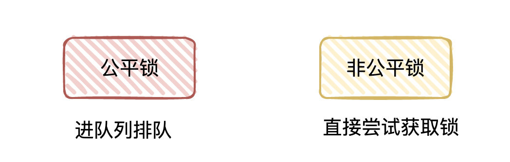
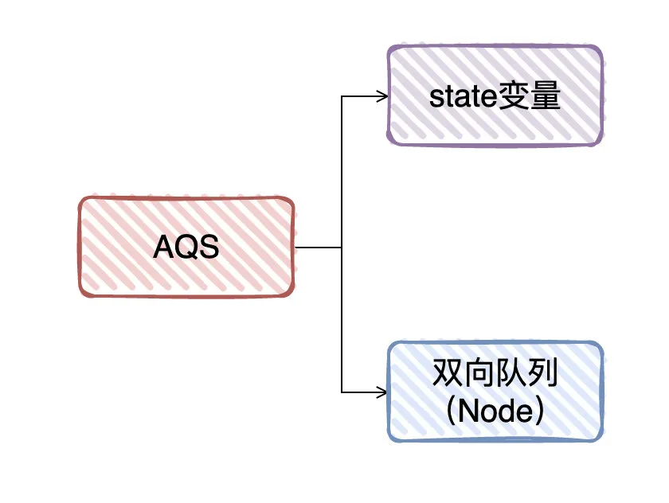
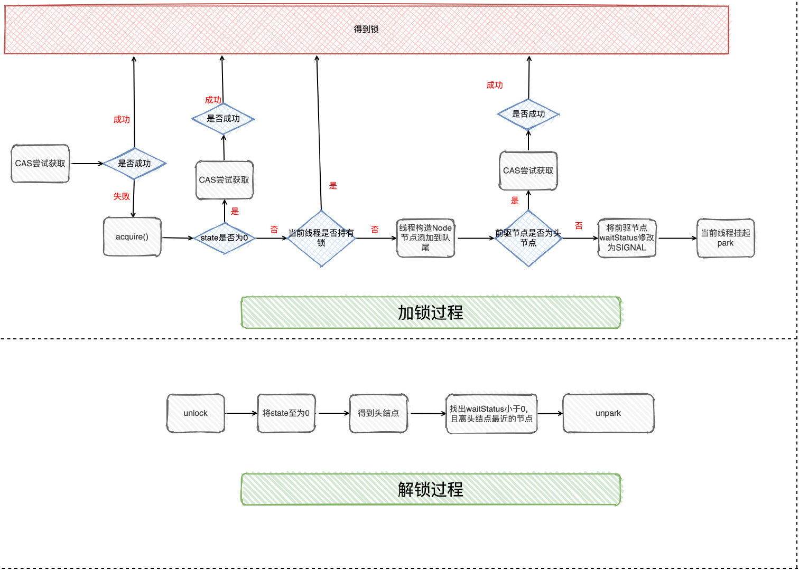
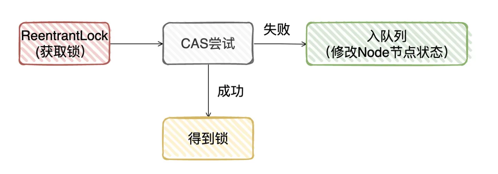

## AQS原理

### 公平锁/非公平锁

#### 公平锁

竞争环境下，先到临界区的线程比后到临界区的线程一定更快地获取到锁

#### 非公平锁

先到临界区的线程未必比厚道的线程更快地获取到锁

#### 区别

线程执行同步代码块时，是否会去尝试获取锁

非公平锁：尝试获取锁

公平锁：不尝试获取锁，直接进入队列，等待唤醒

#### 实现公平锁/非公平锁

##### 队列实现公平锁

1. 公平锁可以把竞争线程放在一个先进先出的队列上

2. 持有锁的线程执行完了，唤醒下一个线程去获取锁

##### 队列实现非公平锁

1. 线程先尝试能不能获取到锁

2. 获取得到锁则执行同步代码块

3. 获取不到，把这个线程放到队列

#### 线程为什么要进入队列？线程为什么不一直尝试获取锁？

一直尝试获取锁称为自旋，多个线程自旋，大部分竞争失败，消耗系统资源

#### synchronized锁：非公平

偏向锁：当前线程ID与markword存储的不相等，则CAS尝试更换线程ID，CAS成功就获取得到锁了；CAS失败则升级为轻量级锁

轻量级锁：实际也是通过CAS来抢占锁资源(底层多了拷贝Mark Word到Lock Record的过程)，抢占成功则获取得到锁；失败一定次数则升级为重量级锁

重量级锁：通过monitor对象中的队列存储线程，线程进入队列前，还会先尝试获取得到锁，如果失败则进入线程等待队列

### AQS

AbstractQueuedSynchronizer，是可以给我们实现锁的一个框架，内部实现关键是维护了一个先进先出的队列(队列载体为Node节点)以及state状态变量

简单理解：AQS定义了一个模板，具体的实现由子类完成。如以下同步方法基于AQS实现：

* ReentrantLock
  
* ReentrantReadWriteLock

* CountDownLatch

* Semaphore

Node节点内容

* 当前的状态值status：独占模式、共享模式

* 前驱、后继节点

#### ReentrantLock的加锁和解锁过程

非公平锁为例，当外界调用lock方法时源码实现：

1. CAS尝试获取锁，成功则执行同步代码

2. CAS失败，调用acquire方法(AQS的模板方法)

3. acquire首先调用子类的tryAcquire方法(又回到ReentrantLock中)

4. tryAcquire方法判断当前state是否等于0，等于0则说明没有线程持有锁，则又尝试CAS直接获取锁

    1. 如果CAS成功，则执行同步代码

6. CAS失败或者state不等于0，判断当前线程是否持有锁

    1. 持有：更新state值，获取得到锁(这里就是处理可重入的逻辑)
    
    2. 未持有：回到tryAcquire方法执行[入队列]操作
    
7. 节点入队列后，判断前驱节点是不是头节点

    1. 是头节点：CAS尝试获取锁
    
        1. 获取到锁：把当前节点设置为头节点，将前驱节点置空(实际上原有的头节点已经释放锁)
    
    2. 未获取到锁或者不是头节点:判断前驱节点状态是否为SIGNAL

        1. 不是：找到合法的前驱节点，并使用CAS将状态设置为SIGNAL
    
8. 调用park将当前线程挂起

简略版：当线程CAS获取锁失败，将当前线程入队列，把前驱结点状态设置为SIGNAL状态，并挂起当前线程

解锁过程

1. 外界调用unlock方法，内部调用AQS的release方法

2. release方法调用子类tryRelease方法(回到ReentrantLock中)

3. tryRelease会把state一直减(锁重入使state>1)，直到0：表明当前线程已经释放锁

4. 从队尾往前找节点状态需要<0，并离头节点最近的节点进行唤醒

5. 唤醒之后，被唤醒线程CAS获取锁，假设成功则把头节点干干掉，把自己设置为头节点

简略版：把state置0，唤醒头节点下一个合法的节点，被唤醒线程获取锁

前驱节点设置SIGNAL：表示后继节点需要被唤醒，用于判断节点状态，去做一些处理

Node中节点状态：

1. CANCELED(1)

2. SIGNAL(-1)

3. CONDITION(-2)

4. PROPAGATE(-3)

5. 0

