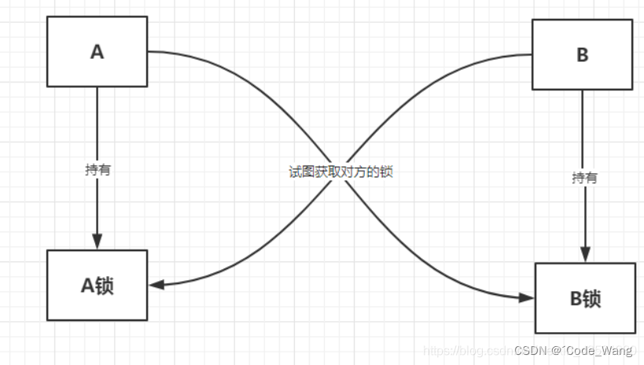

## Java锁

### 乐观锁OptimisticLock

    操作数据时非常乐观，认为别人不会同时修改数据，因此不会上锁。
    只在执行更新时判断在此期间数据是否有修改，如有则放弃执行操作

* 实现方式：
  
    * CAS机制

        * CAS(Compare And Swap)操作数:

            * V：需要读写的内存内置V
            * A：进行比较的预期值A
            * B：拟写入的新值B
            
        * 操作逻辑：
          
            ```java
            // compare
            if (V == A) {
                // swap
                V == B;
            } else {
                do nothing;
            }
            ```
          
        * 许多CAS操作都是自旋的，即操作不成功则一直重试直到成功为止
        
        * CAS原子性：
            * Compare和Swap两个操作是CPU支持的原子性操作，即硬件层面支持

    * 版本号机制(query)
      
        * 在数据中增加一个version字段，用于表示该数据的版本号，每当数据修改时，版本号加1

        * 操作逻辑：
          
            * 线程查询数据时，将该数据版本号一起查出来
            * 线程更新数据时，判断当前版本号与之前版本号是否一致(update语句条件)，一致才进行操作
    
        * 实际应用中亦可使用时间戳等标记为版本字段
  
### 悲观锁PessimisticLock

    操作数据时非常悲观，认为别人会同时修改数据，操作数据时直接把数据锁住，直到操作完成后释放锁
    上锁期间别人不能修改数据

* 实现方式：

    * 代码块加锁，如Java的Synchronized关键字
  
    * 对数据加锁，如MySQL中的排它锁queryForUpdate

### 锁优化策略

自适应自旋、锁消除、锁粗化(可自定义实现如synchronized)、偏向锁、轻量级锁等

锁状态：无锁 -> 偏向锁 -> 轻量级锁 -> 重量级锁

锁状态会随竞争情况升级，锁可以升级但不能降级

### 可重入锁

可多次加锁

* synchronized

* ReentrantLock(默认非公平锁，可使用参数true设置为公平锁)

    * 十分公平，一定要排队
      
    * 十分不公平，可以插队(默认)

### 自旋锁spinlock

为实现保护共享资源(互斥使用)而提出的一种轻量级锁机制

特点：

* 在任何时刻，最多只能有一个持有者，即只能有一个执行单元获得锁

* 调度机制

    * 互斥锁
    
        资源被占用，资源申请者/调用者进入睡眠状态
      
    * 自旋锁
      
        * 资源被占用，资源申请者/调用者不进入睡眠，而是一直循环检测自旋锁持有者是否释放了锁
    
        * 锁被释放，调用者线程立即获取，不需经过唤醒和上下文且切换

### 自适应自旋锁

同一个锁上，自旋刚刚成功获得过锁且持有锁的线程正在运行，虚拟机认为这次自旋也可能成功，进而允许自旋持续更久

如果自旋很少成功，以后获取锁将很肯能省略掉自旋，避免浪费处理器资源

### 锁消除

锁消除指编译器对检测到可能不存在共享数据竞争的锁进行消除

判定依据：如果一段代码中堆上的所有数据都只被一个线程访问，就可以当做栈上的数据对待，认为它们是线程私有的而无需同步

### 锁粗化(可自定义实现)

原则需要将同步代码块的作用范围限制得尽量小，只在共享数据的实际作用域中进行同步，为了使等待锁的线程尽快获取到锁

### 偏向锁

为了在没有竞争的情况下减少开销，锁会偏向于第一个获得它的线程。如果在执行过程中锁一直没有被其他线程获取，则持有偏向锁的线程将不需要同步

有其他线程尝试获取锁，偏向模式结束，后续同步按照轻量级锁执行

### 轻量级锁

为了在没有竞争的前提下减少重量级锁使用操作系统互斥量产生的性能消耗

### 偏向锁、轻量级锁、重量级锁区别

* 偏向锁

    优点：加解锁不需要额外消耗
  
    缺点：如果存在竞争会带来额外的锁撤销消耗

    适用场景：只有一个线程访问同步代码块的场景

* 轻量级锁

    优点：竞争线程不阻塞，程序响应快

    缺点：如果线程始终得不到锁会自旋消耗CPU

    适用场景：追求响应时间、同步代码块执行快的场景

* 重量级锁

    * 优点：线程竞争不使用自旋消耗CPU
    
    * 缺点：线程会阻塞、响应时间慢
    
    * 适用场景：追求吞吐量、同步代码块执行慢的场景

### ReentrantLock可重入实现原理

以非公平为例，获取锁释放锁主要是通过同步状态值的增减来实现

公平锁较非公平锁而言，多了一个前驱节点的判断

### AQS(AbstractQueuedSynchronizer)

队列同步器，用于构建锁或其他同步组件的基础框架，使用一个volatile int state变量作为共享资源，Lock实现类都基于AQS实现

如果线程资源获取失败，则进入同步队列等待

获取成功，执行临界区代码，释放资源时会通知同步队列中的等待线程

### 线程方法

* sleep：当前线程睡眠
  
* yield：让出当前线程CPU执行时间,让有相同优先级的线程之间能够适当的轮换执行

* join：线程等待

### 线程通信方式

主要有共享内存(Java使用)和消息传递

* volatile

* synchronized

* 管道IO

    用于线程间数据传输

* ThreadLocal

### 死锁

如果一个进程里面的每个进程都在等待这个集合中的其他一个进程(包括自身)才能继续执行下去，若无外力他们将无法推进，这种情况就是死锁



产生条件：

1. 互斥条件

    1. 进程对所分配到的资源不允许其他进程访问

    2. 其他进程访问时只能等待，直至占有该资源的进程使用完成后释放该资源
    
2. 请求和保持条件

    1. 进程获取一定资源后，又对其他资源发出请求，但该资源被其他进程占有，导致：
    
        1. 请求进程被阻塞
    
        2. 请求进程对自己获取到的资源保持不释放
    
3. 不可剥夺条件

    1. 指进程已获得的资源，在未完成使用之前，不可被剥夺，只能在使用完成后自己释放
    
4. 环路等待条件

    1. 进程发生死锁后，必然存在一个进程-资源之间的环形链
        
解决方法：

1. 预防死锁

    设置一些限制条件，破坏产生死锁的必要条件
    
2. 避免死锁

    在资源分配过程中，使用某种方法避免系统进入不安全状态，从而避免发生死锁
    
3. 检测死锁

    允许死锁的发生，但是通过系统检测之后，采取一些措施，将死锁清除掉

4. 解除死锁

    与检测死锁配合使用

### 适用场景

乐观锁

1. 简单而言多读场景
   
2. 当竞争不激烈(出现并发冲突概率小)时优先考虑乐观锁

    * CAS
    
        1. 只保证单个变量的原子性操作，即涉及多个变量无法使用CAS
            
            1. 原子性(只能说明原子操作安全)不一定能保证线程安全，需配合volatile保证线程安全
            
        2. 不断重试CPU开销大
               
            1. 引入退出机制
               
            2. 高竞争下避免乐观锁
          
        3. 实现需硬件层面支持，普通用户无法直接使用，只能借助atomic包
    
        4. 出现ABA问题(多线程下只关心起始值和最终值，不关心中间过程)
           
            * 线程1读取共享内存的值A，线程1时间片用完，切换到线程B
    
            * 线程2修改该值为B，随后又修改成A
              
            * 切换到线程1，判断A值是预期值，对共享变量进行更新
              
            * 样例：会员充值系统(小于20免费充20)
        
                * 对某一会员卡系统，线程1充了20
    
                * 会员消费20
    
                * 线程2发现余额小于20，又充20，循环
    
    * 版本号机制
      
        1. 如果query针对表1，而update针对表2，很难通过简单版本号实现

悲观锁

1. 简单而言多写场景

2. 当竞争激烈(出现并发冲突概率大)时优先考虑悲观锁，因为乐观锁会不断重试

    * 代码级别锁synchronized：对代码块加锁
    
优先使用顺序：Lock > 同步代码块 > 同步方法

乐观锁自身不加锁

1. 乐观锁本身不加锁，只在更新时判断数据是否被其他线程更新了。如AtomicInteger
2. 乐观锁可与悲观锁合作，如版本号机制乐观锁中使用queryForUpdate时，会对数据加锁