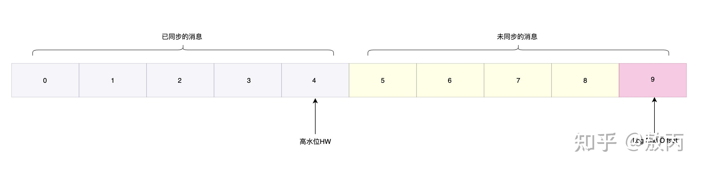

## Kafka可靠性

### 概念

* record：消息，消息队列基础通信单位
  
* topic：主题，目的是将消息进行分类，不同业务类型的消息被分发到不同主题
  
* partition：分区，每个主题可以创建多个分区，每个分区由一系列有序和不可变的消息组成 

* replica：副本，每个分区都有一个至多个副本存在，它的主要作用是存储保存数据，以日志(Log)对象形式体现。副本又分为leader副本和follower副本

    * 主分区副本leader副本负责与生产者、消费者进行数据交互
    
    * 从分区副本follower定义从leader副本拉取数据以保证整个集群数据可用性
  
* offset：偏移量，每一个消息在日志文件中的位置都对应一个按序递增的偏移量，可理解为类似数组的存储形式
  
* producer：生产者，生产消息的一方
  
* consumer：消费者，通常不同的业务都有一到多个消费者组成消费者集群
  
* broker：代理，一个Kafka集群由一个或多个Kafka实例构成，每一个Kafka实例称为代理

    

### 保证数据可靠

Kafka通过副本机制实现数据存储，因此需要一些机制保证数据在跨集群的副本之间能够可靠地传输

1. 副本同步集合

    业务数据封装成消息在系统中流转，由于各个组件分布在不同服务器上，所以主题和生产者、消费者之间的数据同步可能存在一定的时间延迟，Kafka通过延迟范围划分了几个不同的集合
   
    * AR(Assigned Replicas)
    
        指的是已经分配数据的分区副本，通常指的是leader副本+follower副本
      
        
      
    * ISR(In Sync Replicas)
    
        指的是和leader副本数据保持同步的副本集合。当follower副本数据和leader副本数据保持同步，那么这些副本就处在ISR里面，ISR集合会根据数据的同步状态动态变化
    
        
      
    * OSR(Out Sync Replicas)
    
        一旦follower副本的数据同步跟不上leader，它们就会被放进叫做OSR的集合里，也就是这个集合包含的是不处于同步状态的分区副本
      
        
      
    1. 判断标准
    
        * 通过replica.lag.time.max.ms参数设置同步时间差，默认10s
    
        * 一旦从分区副本和主分区副本的消息相差10s以上，就认为消息处于OSR不同步状态
    
        * 若从分区副本处于OSR集合里，在选取新的leader时就不会选择它作为新的leader
    
2. ACK应答机制

    Kafka通过ack来发送数据同步信号，信号发送频率
    
    可通过request.required.acks参数控制消息发送频率

    * ack = 0
      
        生产者发送一次消息后就不再发送。不管是否发送成功，若发出去的消息处于通信路上就丢失或者还未做磁盘持久化操作，那么消息就可能丢失
      
        * 优点
        
            性能很高，不用消息等待
        
        * 缺点
        
            可靠性地，数据容易丢失
        
    * ack = 1
      
        leader接收到消息并且写入本地磁盘后就认为消息处理成功，不论follower是否同步完成消息就会返回给producer
      
        * 优点
        
            可靠性比上一种好一些
        
        * 缺点
        
            假如partition leader所在代理节点宕机，数据也可能丢失，follower副本的数据同步很重要
        
    * ack = -1(Kafka默认)
      
        生产者只有收到分区内所有副本的响应ack才会认为消息已经push成功
    
        * 优点
          
            高数据的可靠性
        
            * 不绝对可靠
        
                主要取决于副本数据是否同步完成。若生产者收到响应消息前leader副本挂掉，那么生产者会因为未收到消息重复发送消息，造成数据重复
        
                只要保证业务幂等可解决上述问题
          
        * 缺点
        
            性能很差，影响吞吐量

3. 消息语义

    消息集群整体复杂，整个过程中可能因为各种原因导致消息传递出错，Kafka对于可能遇到的场景定义了对应的消息语义

    通过配置各种参数间接设置消息语义
    
    * at most once
    
        代表消息可能被消费者消费0次或者1次，场景：
    
        1. 消息从分区分发给消费者集群
        
        2. 消费者把自己收到的消息告诉集群，集群收到之后offset会往后移动
      
        3. 消费者将数据入库做持久化

        数据丢失问题：第三步入库时消费者A宕机，切换到消费者B后，数据未入库，此时分区不知道，造成数据丢失
    
        
      
    * at least once
      
        代表分区分发的消息至少被消费一次，场景

        1. 消息从分区分发给消费者集群

        2. 消费者将数据入库做持久化

        3. 消费者把自己收到的消息告诉集群，集群收到之后offset会往后移动

        数据重复问题：数据入库后，将数据返回给分区过程中消费者A挂掉，分区因为收不到响应ACK导致重发，消费者B将数据再次入库导致重复
    
        
        
      
    * exactly once
      
        代表消息正好能被消费一次，不丢失，不重复
    
        at least once基础上，消费者B从数据库查看最新消息对应偏移位，根据这个偏移位返回Kafka集群从对应的偏移位置出发(获取最新消息)，避免消息丢失和重复
    
        

4. 数据截断机制

    主/从分区副本数据不一致

    * 概念
    
        * HW：High Watermark
    
            高水位，用于体现副本间数据同步的相对位置。消费者只能消费到HW所在位置，通过HW可以判断数据对副本是否可见
    
        * LEO：Log End Offset
            
            下一条待写入消息的记录位置
    
            
    
    * 数据截断
    
        1. leader副本从生产者获取消息，follower副本实时从leader副本同步数据，此时数据一致都同步到2，下一个写入的消息都是偏移位4
           
           

        2. leader副本宕机，follower选为新leader，此后从生产者写入最新的偏移位4和5
           
           

        3. 原leader恢复服务，和新leader数据不一致
           
            
           
        4. 为保证数据一致性，原leader会将自己数据截断到与新leader相同的HW和LEO位置，称为Kafka的数据截断机制
    
            

4. 数据清理机制

    Kafka主要用于通信，为了节约存储空间它会通过一些机制对过期数据进行清理

    * 日志删除
      
        日志删除会直接删除日志分段，Kafka会维护一个定时任务来周期性检查和删除过期数据
      
        * 基于时间的日志删除(默认log.retention.hours=168即7天)
        
            在每一个日志段文件维护一个最大时间戳，日志段写入新消息该字段被更新，写满后该字段保持不变
        
            写满后，Kafka通过当前时间与最大时间戳比较判断该日志段文件是否过期
    
            
        
        * 基于容量的日志删除(log.retention.bytes设置)
        
            时间换成容量，设置总容量域值，所有日志段实际占用空间-域值大于单个日志段文件大小则删除最旧日志段文件
        
            
        
    * 日志压缩

        Kafka消息由键值转换成，相同key不同value则清除旧数据保留最新记录
    
        通过创建检查点文件实现
    
        

### 业务幂等

无论对某一个资源操作多少次，其影响都是相同的。即在接口重复调用情况下，对系统产生的影响是一样的，返回值允许不同，如查询

幂等性分类

* 数据幂等

    如SQL查找、增加(有主键不能重复)、更新、删除具备幂等性

* 接口幂等

* 服务幂等

* 消息幂等

#### 业务与幂等性

订单因网络波动，库存服务执行成功，未在超时时间内返回，订单服务重试，出现多次对商品进行库存扣减

#### 接口幂等

幂等性考虑主要解决前后端交互与服务间交互。前端解决思路

* 前端防重

    前端相关属性和JS代码即可完成设置，可靠性不好，可通过工具跳过页面仍能重复提交

    主要用于表单重复提交或按钮重复点击

* RPG模式

    Post-Redirect-Get。用户提交表单后重定向到另一个提交成功页面，避免用户刷新导致重复提交，同时防止通过浏览器前进/后退导致表单重复提交

* Token令牌机制

    需要通过前后端进行一定程度的交互来完成

    Toke组成：uid、time时间戳、sign签名(token前几位以hash算法压缩)
  
    

    多线程高并发产生问题：第一次访问时Token存在，业务操作完成后Token未删除前客户端第二次请求会通过Token验证，重复执行业务操作

    解决方案：

    * 业务代码执行和Token删除处理整体加锁
    
    * 借助redis单线程和incr原子性特点。客户初次获取token时以token作为key对incr自增(1)，客户初次请求时对incr自增(2)，后续业务(携带Token)请求时incr=2则合法，进行业务操作+删除token
  
    
  
    * 先删除Token再执行业务也会出现问题
    
        业务代码执行超时或失败，未向客户端返回明确结果，客户端可能重试，此时Token已经被删除，会认为重试请求是一个重复的请求，不再处理
    
        
      
    * 基于自定义业务流程实现
    
        
    