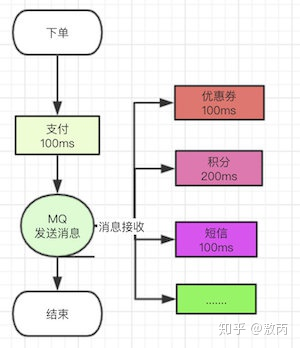

## 消息队列

一个流程执行完毕，随着业务增加，很多场景单机技术栈和中间件不够用，对系统友好型也下降，因此引入消息队列

### 高并发性能指标

三高：高性能、高并发、高可用

#### 定义

* QPS(9W)

    Queries Per Second每秒查询数

* TPS

    Transactions Per Second每秒事务数

    * 定义
    
        一个事务是指一个客户端向服务器发送请求后服务器作出响应的过程
    
    * 和QPS区别
    
        * TPS和QPS基本类似，对于一个页面的一次访问，形成一个TPS
        
        * 一次页面请求，可能产生多次对服务器的请求，服务器对这些请求，可计入QPS中
    
            如访问一个页面会请求服务器两次，一次访问产生一个T，总计产生2个Q
* RT

    Response Time响应时间(200ms/50ms以内)

    * 定义
    
        执行一个请求从开始到最后收到响应数据所花费的总体时间，即从客户端发起请求到收到服务器响应结果的时间(该
        请求可以是任何东西，从内存获取、磁盘IO、复杂的数据库查询或加载完整网页等)
      
    * 响应事件=处理时间+等待时间
    
        * 处理时间：完成请求要求的工作所需的时间
    
        * 等待时间：被处理之前必须在队列中等待的时间
    
* 并发数

    指系统能同时处理的请求数量，反应系统的负载能力

    

* 吞吐量Throughput

    系统的吞吐量(外部承压能力)和处理对CPU的消耗、外部接口、IO等因素紧密关联

    单个处理请求对CPU消耗越高，外部系统接口、IO速度越慢，系统吞吐能力越低；反之越高

    * 吞吐量指标
    
        * QPS(TPS)：每秒请求/事务数量
          
            QPS(TPS) = 并发数/响应时间
          
        * RT：一般取平均响应时间
    
        * 并发数：系统同时处理的请求/事务数
    
            并发数 = QPS * 平均响应时间
    
* PV

    Page View每个页面的浏览次数，用户每次刷新就算一次

    上午浏览2页面+下午浏览3页面则，PV = 2 + 3

* UV

    Unique Visitor独立访客数，每天访问的用户数，此数据需要根据用户唯一标识进行去重

    一天内同一访问多次：UV=1

* VV

    Visit View方可访问的次数，用于记录所有访客一天内访问网站的次数
    
    一天内同一访问多次：VV=多次

* 系统负载Load

    此数据指的是Linux系统的负载情况，即Top查看最上面显示的数据信息，会显示1/5/15分钟的系统平均Load，Load average越低，系统负荷越小

    load average:0.1、0.2/0.5

    * 1分钟系统负载：如果只有1分钟系统负载较高，可能是突发情况
    * 5分钟系统负载
    * 15分钟系统负载：如果15分钟内，系统负载都很高，则需要解决相应高负载问题

#### 范例

二八定义：每天80%的访问集中在20%的时间里，这20%的时间就叫做峰值时间

* 公式
  
    (总PV数 * 80%) / (每天秒数 * 20%) = 峰值时间每秒请求数(QPS)

    如果每天300W的PV单台机器所需QPS = ( 3000000 * 0.8 ) / (86400 * 0.2 ) = 139 (QPS)

* 机器

    峰值时间QPS / 单台机器的QPS = 需要的机器数

    一台机器的QPS是58，需要139 / 58 = 3台机器

#### 最佳线程数、QPS、RT

* 单线程QPS=1000ms/RT

    同一系统支持的线程数越多，QPS越高，假如一个RT是80ms，则QPS = 1000/80 = 12.5

* 多线程QPS=1000ms/RT * 多线程数

    即多线程(此处2个线程)QPS = 1000/80 * 2  = 25

* QPS和RT真实关系

    * 预想
    
        
    
    * 实际
    
        
    
* 最佳线程数量

    刚好消耗完服务器的瓶颈资源的临界线程数

    即最佳线程数量 = ((线程等待时间 + 线程CPU时间) / 线程CPU时间) * CPU数量

    特性

    * 达到最佳线程数的时候，线程数量继续递增，则QPS不变，而响应时间变长，持续递增线程数量，则QPS开始下降
    
    * 每个系统都有其最佳线程数量，不同状态下，最佳线程数量会发生变化
    
    * 瓶颈资源可以是CPU、内存、锁资源、IO资源
      
        * 超过最佳线程数->导致资源竞争->响应事件递增 

### 消息队列常见场景

* 异步

* 削峰

* 解耦

#### 异步

传统一个流程业务增加后，链路变得更长，系统响应时间随之增加

解决方案：流程异步解决，如支付成功后，校验优惠券同时增减积分、发短信

* 为什么不用线程池

    整个订单流程，扣积分、扣优惠券、发短信、扣库存等业务需要调用接口，每增加一个流程需要调用一个接口然后重新发布系统
    全部写在一起，容易出现耦合性问题，出故障排查麻烦，try/catch等代码像定时炸弹，P0故障(最高等级)麻烦。消息队列可解决上述问题
  
* 使用消息队列

    下单支付成功的消息告诉别的系统，自己走完自己的流程，接入的别的系统订阅该消息，即订阅监听支付成功消息

    

    * 其他系统失败
    
        没有必要考虑，扣分系统自己处理，下单系统不用理会

#### 削峰

峰值很大，流量很多的时候，将请求放到队列里面，每秒消费请求数由服务器处理能力决定，避免打挂服务器

#### 消息队列问题

* 系统复杂性

    系统增加中间件，需要维护，使用过程中需要考虑各种问题，如重复消费、消息丢失、消息的顺序消费等

* 数据一致性

    分布式服务通用问题，不仅仅是消息队列的问题，消息队列会暴露得更加严重一点

    如订单系统中，下单系统成功，积分系统失败，对于系统而言，所有的服务都成功才能算一次完整的订单。可使用以下保证数据一致性：

    * 分布式事务：把下单、优惠券、积分都放在一个事务里面，要么一起成功，要么一起失败
    
* 可用性

    * 高可靠
    
        数据的可靠性保证，即系统提供可靠的数据支撑，不发生丢失、重复等错误现象
    
    * 高可用
    
        更偏向于整体服务的可用性，防止系统宕机等

#### 技术选型

* Kafka

  多数选择

* ActiveMQ

  吞吐量问题、社区活跃度问题，基本不使用

* RabbitMQ

    吞吐量问题、社区活跃度问题，基本不使用

* RocketMQ

    多数选择
  
    