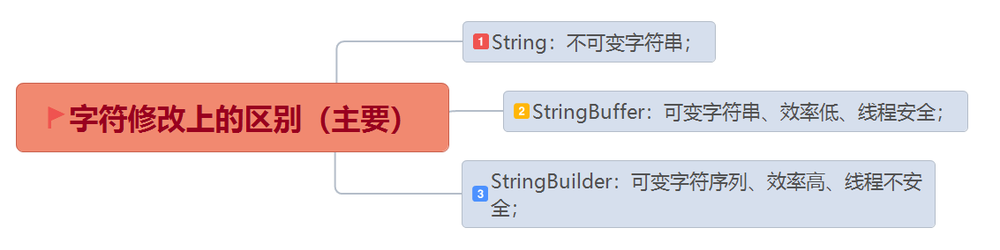
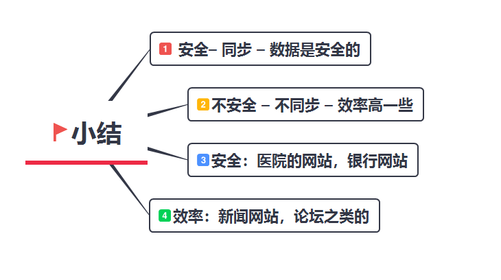
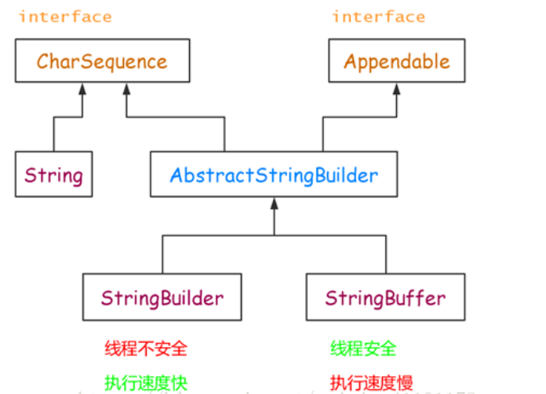
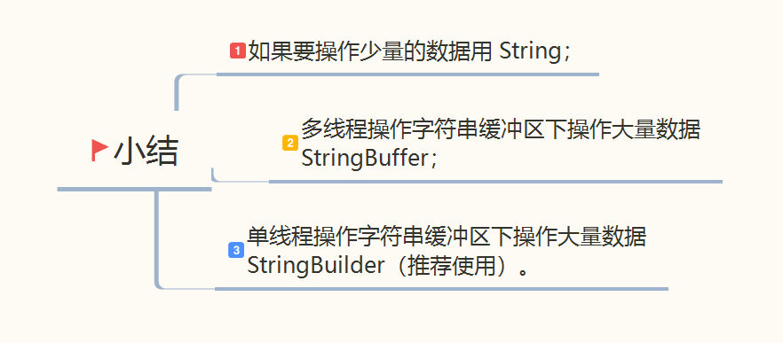

## StringBuffer和StringBuilder区别

### 一.字符修改上的区别



1. 当对字符串进行修改的时候，需要使用 StringBuffer 和 StringBuilder 类。
2. 和 String 类不同的是，StringBuffer 和 StringBuilder类的对象能够被多次的修改，并且不产生新的未使用对象。
3. StringBuilder和 StringBuffer 之间的最大不同在于 StringBuilder 的方法不是线程安全的（不能同步访问）。
4. 由于 StringBuilder 相较于 StringBuffer 有速度优势，多数情况下建议使用 StringBuilder类。然而在应用程序要求线程安全的情况下，则必须使用 StringBuffer 类。



### 二. 继承结构



### 三.StringBuffer 和 StringBuilder区别详解

1. 线程安全

    * StringBuffer：线程安全
    * StringBuilder：线程不安全

    因为 StringBuffer 的所有公开方法都是 synchronized 修饰的，而 StringBuilder 并没有
    ```java
    @Override
    public synchronized StringBuffer append(String str) {
        toStringCache = null;
        super.append(str);
        return this;
    }
    ```
2. 缓冲区

* StringBuffer 代码片段：
    ```java
    private transient char[] toStringCache;
    
    @Override
    public synchronized String toString() {
        if (toStringCache == null) {
            toStringCache = Arrays.copyOfRange(value, 0, count);
        }
        return new String(toStringCache, true);
    }
    ```
* StringBuilder代码片段
    ```java
    @Override
    public String toString() {
        // Create a copy, don't share the array
        return new String(value, 0, count);
    }
    ```
* StringBuffer 每次获取 toString 都会直接使用缓存区的 toStringCache 值来构造一个字符串。
* 而 StringBuilder 则每次都需要复制一次字符数组，再构造一个字符串。
* 缓存冲这也是对 StringBuffer 的一个优化，不过 StringBuffer 的这个toString 方法仍然是同步的。

3. 性能

    StringBuffer是线程安全的，它的所有公开方法都是同步的，StringBuilder 是没有对方法加锁同步的，所以毫无疑问，StringBuilder的性能要远大于StringBuffer。

4. 是否实现了equals和hashCode方法

    * String:实现了equals()方法和hashCode()方法，new String("java").equals(new String("java"))的结果为true；
    * StringBuffer:未实现equals()方法和hashCode()方法，new StringBuffer("java").equals(new StringBuffer("java"))的结果为false
    * StringBuilder:未实现equals()方法和hashCode()方法，new StringBuilder("java").equals(new StringBuilder("java"))的结果为false
    
### 作用领域




