## MySQL逻辑架构

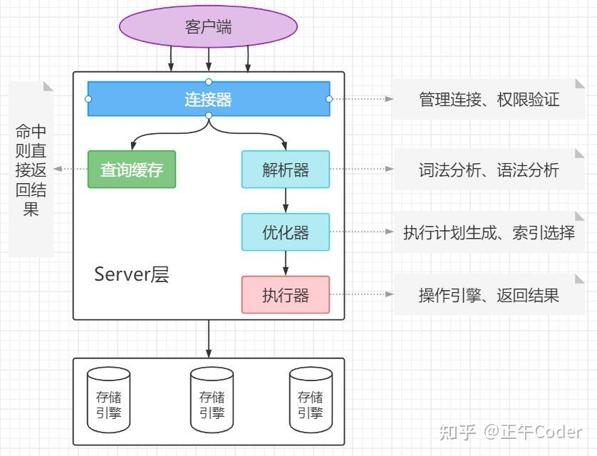

* **连接层**
  
    1. 主要工作：连接处理、授权认证、安全防护等
       
        * 每个客户端连接都会在服务器进程中拥有一个线程，服务器会缓存线程
        
    2. 为通过安全认证的接入用户提供线程，该层可以实现基于SSL的安全连接
    
* **服务层**
  
    1. 用于处理核心服务
    2. 标准SQL接口，查询解析，SQL优化和统计，全局的和引擎依赖的缓存与缓冲器等
    3. 所有的与存储引擎无关的工作，如过程、函数等
    4. SELECT 语句，服务器还会查询内部的缓存
    
* **引擎层**

    1. 负责实际数据的存储与提取。
    2. 服务器通过API与存储引擎进行通信

### 长连接短连接

* 长连接
  
  连接成功后，如果客户端有持续请求，则一直使用同一个连接

* 短连接

  每次执行完很少的几次查询后就断开连接，下次查询重新建立一个连接

* 实际场景

    1. 定期断开长连接。
        使用一段时间或者程序里占用内存的大查询后断开连接，之后要查询再重连
    2. 大查询操作后，使用mysql_reset_connection重新初始化连接资源。
        无需重连和权限认证，恢复到刚创建连接时的状态
     
### 查询缓存

解析查询前，服务器会先检查查询缓存。不命中，再执行查询解析、优化、执行过程

* 不推荐使用
       
    * 查询缓存失效频繁，更新操作会导致响应表查询缓存清空
    * 静态表(如系统配置)，可使用
    * select SQL_CACHE * from T where ID = 10;
  
### 解析器

* 词法分析
    
    关键字识别，表识别，字段识别等

* 语法分析
    
    SQL语句是否满足语法规则
    
### 优化器
  
* 多索引
  
    使用哪个索引
  
* 多表关联
  
    各个表的连接顺序
    
### 执行器

* 判查询权限
    
    * 使用查询缓存：缓存命中后返回结果时做权限查询
      
    * 不使用查询缓存：判断查询权限
      
* 调用引擎接口进行查询或其他操作
    
    * 命中后，结果缓存到内存
      
    * 采用LRU(Least recently used，最近最少使用)算法，hash表数据结构
    
* 查询结果返回客户端

### MYSQL工作流程
1. 客户端请求查询
2. 服务器检查缓存，命中返回结果
3. 服务器端SQL解析，预处理及优化后生成执行计划
4. 调用存储引擎API执行
5. 返回结果
   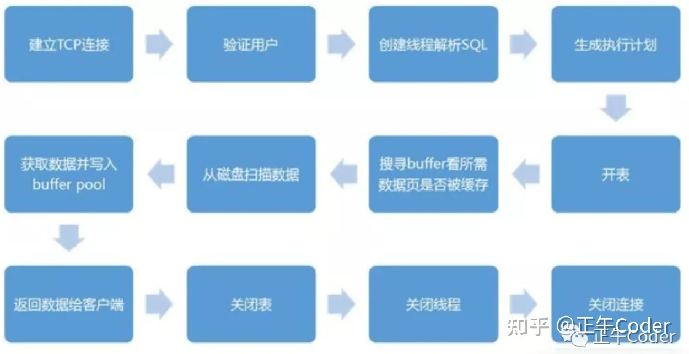

## MYSQL锁

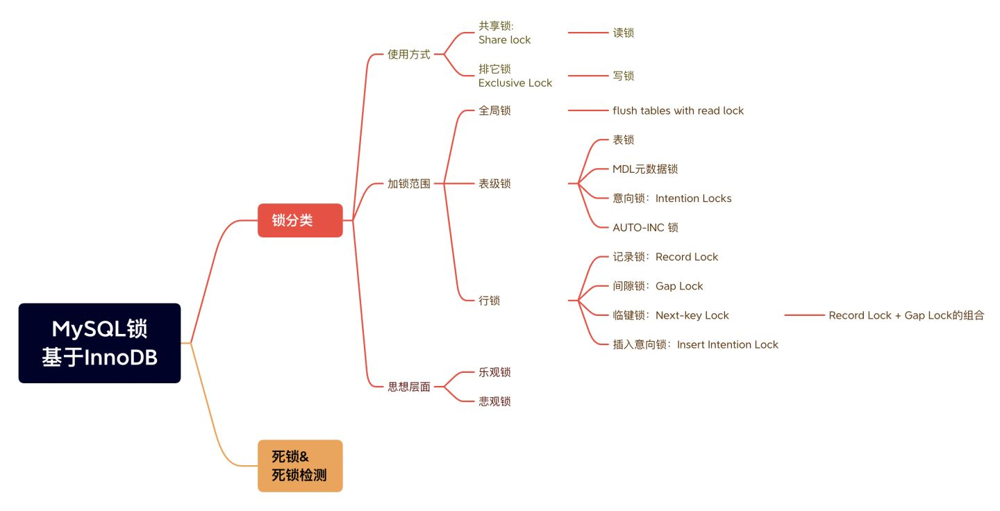

### 划分

1. 按照锁使用方式

    * 共享锁/读锁

    * 排他锁/写锁

2. 按照加锁范围

    * 全局锁

    * 表级锁

    * 行级锁

3. 从思想层面

    * 乐观锁

    * 悲观锁

### 使用方式

#### 共享锁/读锁
  
对象被锁定时，允许其他事务读取该对象，也允许其他事务从该对象上再次获取共享锁

```mysql
# 加锁方式1
select ... lock in share mode;
# 加锁方式2
select ... for share;
```

* 表级锁定

    允许其他事务再次获取共享锁，不允许获取排它锁

    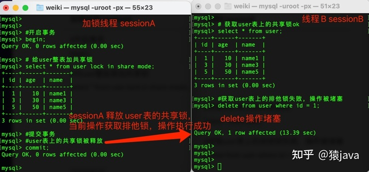

* 行级锁定

   允许其他事务再次获取共享锁，允许获取未锁定行的排它锁，不允许获取锁定行的排它锁

    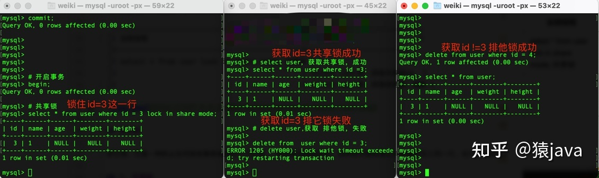

#### 排他锁/写锁/独占锁

防止其他事务和当前事务锁定同一对象。写锁优先级高->写锁可插入读锁队列前面，反之则不行

```mysql
# 加锁方式
select ... for update;
```
* 表级锁定

    其他事务无法对该表进行DML等操作，如insert、update、delete、alter、drop

    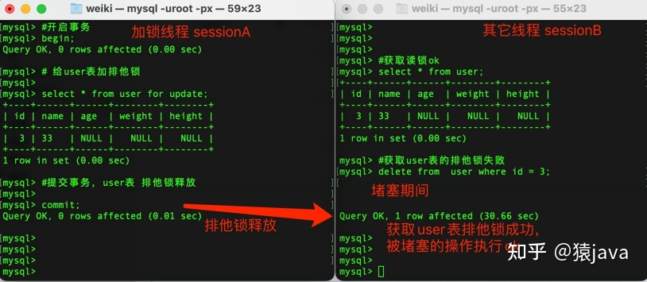

* 行级锁定

    其他事务无法对该行进行DML等操作，如insert、update、delete、alter、drop

    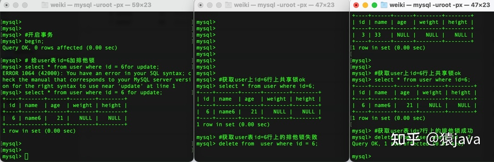

### 加锁范围

#### 全局锁

对整个数据库实例加锁。粒度最大的锁

```mysql
# 加锁方式：全局读锁
#   1. DDL、DML语句被阻塞
#   2. 更新操作事务commit语句被阻塞
flush tables with read lock;
# 释放锁方式1
unlock tables;
# 释放锁方式2：对表加锁时，全局锁会自动释放
```
加锁线程sessionA|线程B sessionB
---|---
flush tables with read lock; 加全局锁|-
select user表ok|select user表ok
insert user表堵塞|insert user表堵塞
delete user表堵塞|delete user表堵塞
drop user 表堵塞|drop user 表堵塞
alter user表堵塞|alter user表 堵塞
unlock tables; 解锁|
被堵塞的修改操作执行ok|被堵塞的修改操作执行ok

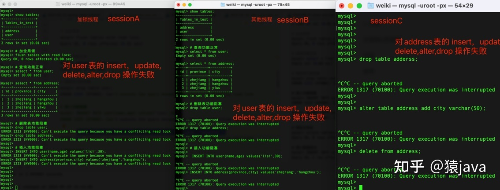

全库备份

* 全库逻辑备份FTWRL，常见问题

    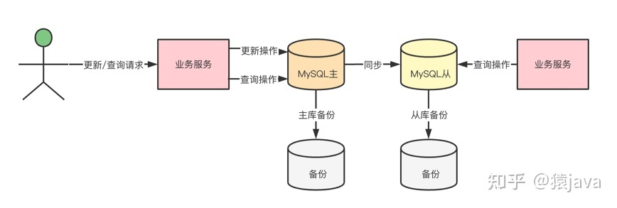

    * 主库上备份

        备份期间，业务服务器不能对数据库执行更新操作，更新业务瘫痪
      
    * 从库上备份

        备份期间，从库不能执行主库同步过来的binlog，导致主从延迟变大

        如果做了读写分离，从库上获取数据会出现延迟，影响业务
    
* mysqldump

    ```mysql
    mysqldump -single-transaction 
    ```
  
    * 备份数据前会启动一个事务，确保获取一致性视图read view，MVCC保证备份过程中数据可以正常更新
    
    * 限制：适用于库中所有表都使用事务引擎，如有表不支持则只能使用FTWRL

#### 表级锁

* 基本策略，开销最小
* 获取写锁后，阻塞其他用户读写操作
* 没有写锁后，其他用户才能进行读写操作

#### 行级锁

* 最大程度支持并发，开销大
* 只在存储引擎实现
* InnoDB和XtraDB及其他存储引擎实现了行锁

##### 记录锁

##### 间隙锁

##### 临建锁
  
### 数据库死锁

多个事务在同一资源上相互占用并请求锁定对方占用的资源而导致的恶性循环

产生：

* 多个事务以不同顺序锁定资源时
* 多个事务同时锁定同一资源时

规避：

* 死锁检测
* 死锁超时

InnoDB处理死锁：将持有最少行级排它锁的事务进行回滚

## MYSQL事务

### 事务

一组原子性的SQL查询/操作，或者说一个独立的工作单元

MYSQL事务特点：事务内的语句要么全部执行成功，要么全部执行失败

数据库正常执行事务的4个要素(特性ACID中的AID都是为了实现C即一致性)：

* 原子性atomicity：逻辑上不可分割，要么全部成功要么全部失败
* 一致性consistency：数据库从一个一致性的状态转换为另一个一致性状态
    * 瓶装可乐倒入杯中，守恒
    * 建行转账农行，建行扣除余额后宕机，不守恒，即产生不一致性
* 隔离性isolation：对并发而言，并发运行的多个事务相互不影响。即一个事务最终提交前对其他事务不可见
* 持久性durability：事务提交后修改内容永久保存到数据库中

### MYSQL隔离级别

* 未提交读/脏读Read Uncommitted
  
  修改即使没有被提交，对其他事务也是可见(即如果修改被撤回，其他事务读取到修改的数据)
  
* 提交读/不可重复读Read Committed ->侧重于修改，对策：MVCC

    * 多数数据库默认隔离级别，事务提交前相互不可见
    * 多次查询可能得到不同结果

* 可重复读Repeatable Read（MySQL默认隔离级别）

    * 保证当前事务不会读取到其他事务已提交的UPDATE操作(保证多次读取结果一致，未UPDATE前的相同值)
    * 无法保证当前事务感知到其他事务中的INSERT或DELETE操作，导致幻读产生

        * 幻读(前后多次读取，数据总量不一致) ->侧重于新增/删除，对策：临建锁（Next key lock）
        
            某个事务在读取某个范围内的记录时，会产生幻行
    
            幻读是指在一个事务内读取到了别的事务修改的数据，导致前后读取不一致
        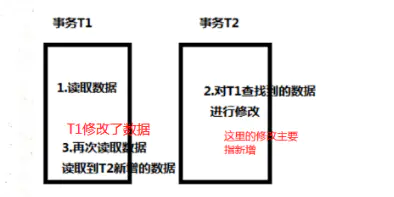
  
* 可串行化Serializable

    * 最高隔离级别，强制事务串行执行，避免幻读
    * 读取的每一行上加锁，导致大量的超时和锁争用问题
    * 非常需要确保数据一致性且没有并发情况下使用
    
### MYSQL log

#### undo log：实现MVCC，用于事务回滚

* 记录了修改的反向操作，可实现事务回滚
* 可根据undo log回滚到某个特定版本的数据，实现MVCC

#### binlog：服务层生产日志

* 数据恢复：mysql主从架构是通过slave同步到master的binlog来实现

* 数据库复制:解析binlog

#### redo log：记录数据操作在物理层面的修改

* 脏页：mysql中使用大量缓存，该缓存存在于内存中，修改操作时会直接修改内存，而不是立刻修改磁盘，当内存和磁盘数据不一致时，称内存中数据为脏页
  
* MySQL如何保证一致性
  
    * 为保证数据安全性，事务进行中会不断产生redo log，事务提交时进行一次flush操作，保存到磁盘中，redo log是按照顺序写入的(因为磁盘顺序读写速度远大于随机读写)
    * 当数据库重启时，根据redo log进行数据恢复，如果redo log有未提交事务则提交该事务
    * 以上操作实现了事务的原子性，一致性和持久性

* 数据修改产生redo log（用于修改提交），undo log（用于回滚）

### MVCC

Multi-Version Concurrency Control多版本并发控制

* 很多情况下避免加锁，大多实现非阻塞操作，写操作只锁定必要行
* 只能在不可重复读和可重复读隔离级别下工作
    * 未提交读：总是读取最新数据行，而不是符合当前事务版本的数据行(未提交部分)
    * 可串行化：对所有读取行都加锁

#### 版本链

* row_id：聚簇索引id(通常使用主键或第一个非NULL列)
* trx_id：最新修改的事务id,即事务ID(transaction id)
* db_roll_ptr：指向undo segment中的undo log
* trx_ids：活跃事务列表，ReadView初始化时当前未提交事务列表。对于本事务不可见
* up_limit_id：当前**已提交**事务号+1
  * 当事务号<up_limit_id时，ReadView可见
  * 即创建Read View视图的时候，之前已经提交的事务对于该事务肯定是可见的
* low_limit_id：当前**最大**事务号+1
  * 当事务号>=up_limit_id时，ReadView不可见
  * 即在创建Read View视图之后创建的事务对于该事务肯定是不可见的
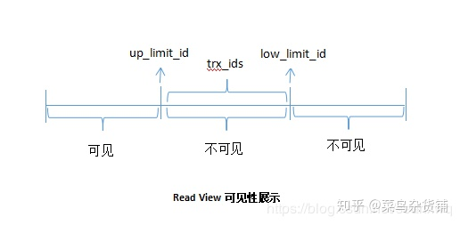
* 一致性视图Read View(事务开始时生成)
  * 不可重复读：每次读取数据前都生成一个Read View
  * 可重复读：第一次读取数据时生成一个Read View

#### 版本链操作

* 版本链操作
    1. 修改前
       
       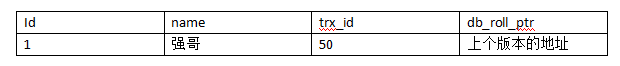
       
    2. 更新并提交事务
       ```mysql
       update user set name = '强哥1' where id = 1;
       ```
         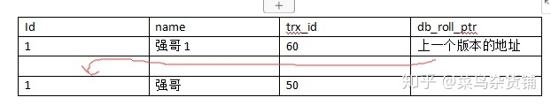
       
    3. 更新但不提交事务
       ```mysql
       update user set name = '强哥2' where id = 1;
       ```
        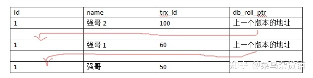
       
       * select id = 1;
       * 新生成ReadView(事务初次开始时生成)
       * trx_ids=100，不可见
       * trx_id=60小于up_limit_id(61)，返回该条记录
    4. 提交上述事务
    5. 更新但不提交事务
         ```mysql
         update user set name = '强哥3' where id = 1;
         ```
        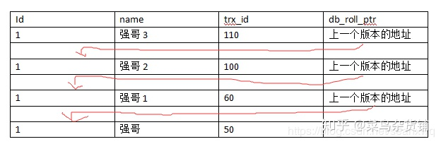
       
        * 隔离级别：提交读/不可重复读Read Committed
            * select id = 1;
            * 重新生成ReadView(新事务)
            * trx_ids=110，不可见
            * trx_id=100小于up_limit_id(101)，返回该条记录
        * 隔离级别：可重复读Read Repeatable
            * select id = 1;
            * 使用操作3生成的ReadView
            * trx_ids=100，不可见
            * trx_id=60小于up_limit_id(61)，返回该条记录
            * 和第一次select(操作3)结果一样，叫可重复读

## 数据库索引

为了使查询数据效率更高，小表通常采用全表扫描，无需索引；索引应避免NULL列

索引/存储引擎|MyISAM|InnoDB|Memory|NDB
---|---|---|---|---
B-Tree索引|支持(默认)|支持(默认)|支持|
HASH索引|不支持|不支持|支持(默认)|支持
R-Tree索引|支持|支持|不支持|
Full-Text索引|支持|支持|不支持|

### 分类

#### 聚簇索引

    聚簇索引并不是一种索引类型，而是数据存储方式。
    InnoDB聚簇索引在同一结构中包含B+Tree索引和数据行
    数据存放在叶子页中，一个表只能有一个聚簇索引
    特点：
      可将相关数据保存在一起
      访问速度快(因为索引和数据保存在同一B+Tree中，通常根结点常驻内存最多需要1~3次磁盘IO)
    劣势：
      更新聚簇索引列代价高，被更新行移动到新位置
      更新或插入可能导致页分裂，占用更多磁盘空间
      上述可能导致全表扫描慢

##### B+树

为了解决大量数据存放在外存储器时候，查找效率低下的问题

* 外存储器

  将数据存储到磁盘中，每次查找元素从磁盘中取出，再写入内存。

  特点：容量大，效率低。

* 内存储器

  将数据存储在内存中。

  特点：查询快，容量小。

* B+树特点

    * 中间元素不存储数据，只当索引用，所有数据保存在叶子结点
    * 所有中间节点在子节点中要么是最大元素，要么是最小元素
    * 叶子结点包含所有数据和指向这些数据的指针
    * 叶子结点形成了自小向大的链表

  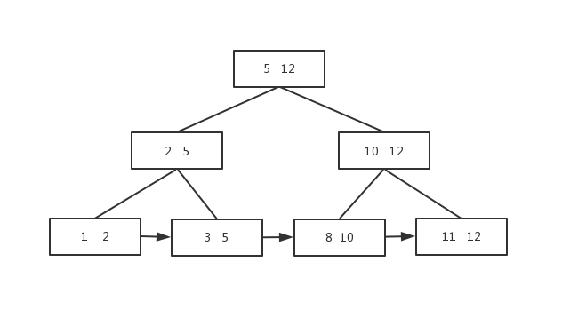

    * 一个节点可存放多个数据，查找一个节点时候可以有多个元素，提高查找效率
    * 数据库索引很大，通常以文件形式存储在磁盘中，查找数据有磁盘I/O消耗，B+树可以减少与磁盘交互(因为一次查找可以得到多个数据)，增大命中率

* B+树查找方法

    * 单元素查找

      从根结点一直查找到叶子结点，即使中间结点有相应元素也需要继续查找(因为数据存储在叶子结点)

      查找元素3：
      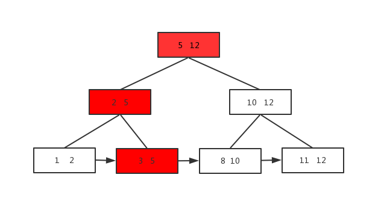

    * 范围查找

      直接从链表查
      查找元素3到元素8
      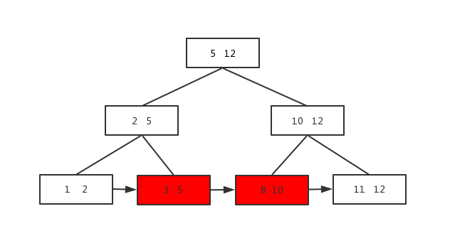

#### hash索引

    对每一行数据，存储引擎对所有索引列计算一个哈希码并存储在索引中
    MySQL哈希表(buckets):哈希值+指向数据行的指针

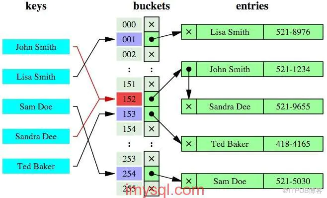

    哈希冲突：散列码相同，需多次遍历冲突数据直到找到相应数据
    哈希索引效率低下：大量数据时，hash表变得庞大，每次查找都需要遍历哈希表，性能下降
    查找步骤
      1. 检索条件(索引列)通过相同算法计算出hash值 
      2. hash表中找到存储地址
      3. 根据地址获取数据
      4. 确定是否是需要查询的数据(避免哈希冲突)
    哈希索引使用场景：只需一次哈希算法可立即找到相应位置

#### 自适应hash索引

InnoDB引擎特殊功能，当某些索引被频繁使用时，在内存中基于B-Tree索引之上在创建一个hash索引，用户可关闭该功能

#### 空间索引(R-Tree)

MyISAM支持。无所前缀索引，从所有维度来索引数据。

#### 全文索引(Full-Text)

MyISAM支持。基于相似度查询，即关键字匹配查询

#### 覆盖索引

指索引覆盖或包含了所有需查询的字段，不再需要根据索引再重新回表查询数据

### 索引使用原则

* 建立索引
    
    对使用频繁的列建立索引，应使用常用、过滤效果好的组合或者唯一特性字段

* 使用索引前缀

    * 短索引可提升访问的IO效率
    * 前缀索引：对于Text,Blob或者VARCHAR列必须使用前缀索引
        * 前缀索引无法使用Order By，Group By

* 选择合适的索引顺序

    * 索引选择性：不重复的索引值和记录总数比(<=1)，值越高查询效率越高
    * 唯一索引选择性=1

* 删除无用索引

    * 删除重复索引：相同列上按照相同顺序创建的相同类型的索引
    * 如Key1(A,B)后再创建Key2(A),Key2是Key1的前缀索引
    
### 索引失效

```mysql
key 'idx_age'(age)
key 'idx_name'(name)
``` 

* 查询字段中，索引列出现隐式类型转换

    * 如字符串字段索引中，where xx = 数值(隐式转换成字符串)，不使用索引
    * 如字符串字段索引中，where xx = '数值'，使用索引

* or操作

    * or前使用了索引列，索引列有效
    * or后使用索引列，索引列无效

* like操作

    * 通配符在前，不使用索引
    * 通配符在后，使用索引
      ```mysql
      -- 不使用索引
      select * from student where name like '%小';
      -- 使用索引
      select * from student where 'name' like '王%'
      ``` 
      
* 索引列进行计算(包含!=)、使用函数

    ```mysql
    -- 不使用索引
    select * from student where age + 8 = 18
    -- 使用索引
    select * from student where age = 10 + 8
    -- 不使用索引
    select * from student where age != 18
    -- 不使用索引
    select * from student where  concat('name','哈') ='王哈哈';
    -- 使用索引
    select * from student where name = concat('王哈','哈');
    ```

* MySQL判断全表扫描比索引查询快，则不使用索引

### 索引分类

* 聚集索引/主键索引

  所有行数都会按照主键索引进行排序

* 非聚集索引

  给普通字段加上索引
  
* 联合索引：多个字段组成的索引

  * 遵从最左前缀原则，即mysql内部转换(检索字段排序)后的sql语句第一个字段为联合索引的第一个字段
  * *范围字段后的索引字段不适用，即索引到范围字段有效*
        
        学生表联合索引：key idx_age_name_sex(age, name, sex)
        ```mysql
        -- 遵从最左前缀原则，age在最左边，使用索引
        select * from student where age = 16 and name = '小张'
        -- 不遵从最左前缀原则，不适用索引  
        select * from student where name = '小张' and sex = '男'
        -- mysql内部转换后(age字段提前)遵从最左前缀原则，使用索引 
        select * from student where name = '小张' and sex = '男' and age = 18
        -- 范围字段，只使用age索引 
        select * from student where age > 20 and name = '小张'
        -- 遵从最左前缀原则，但!=表达式不使用索引
        select * from student where age != 15 and name = '小张'
        -- 只适用age索引，原因同上
        select * from student where age = 15 and name != '小张'
        ```

### 索引存储结构

* 表结构
    ```mysql
    CREATE TABLE `student` (
                               `id` int(11) NOT NULL AUTO_INCREMENT COMMENT '主键id',
                               `name` varchar(50) NOT NULL DEFAULT '' COMMENT '学生姓名',
                               `age` int(11) NOT NULL DEFAULT 0 COMMENT '学生年龄',
                               PRIMARY KEY (`id`),
                               KEY `idx_age` (`age`),
                               KEY `idx_name` (`name`)
    ) ENGINE = InnoDB CHARSET = utf8 COMMENT '学生信息';
    ```
*  表数据

    

    * 主键索引：id
    * 非聚集索引：name，age
    
* 聚集索引磁盘存储结构

    

    * 叶子结点：存储表里所有行数据
    * 每个数据页在不同磁盘上面
    * 数据查找（查找id=5）
        1. 磁盘0读入内存
        2. 二分查找法id=5在3和6中间
        3. 通过指针p1查找到磁盘2地址
        4. 磁盘2读入内存
        5. 二分查找法查到id=5的数据
    
* 非聚集索引磁盘存储结构

    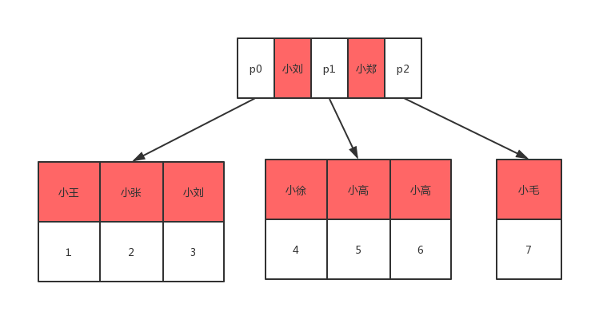

    * 叶子结点：存储聚集索引键
    * 数据查找（查找name=小徐）
        1. 磁盘0读入内存
        2. 二分查找法查到对象在p1所指地址上
        3. 通过指针p1查找到磁盘2地址
        4. 二分查找法查到小徐id=4
        5. 重复上面聚集索引步骤
    
### 联合主键

MySQL不能同时存在多个独立主键，但可以有多个unique

```mysql
CREATE TABLE `user` (

`userid` SMALLINT UNSIGNED AUTO_INCREMENT PRIMARY KEY,

`username` CHAR(16) NOT NULL,

`password` char(40) NOT NULL,
-- 联合主键
UNIQUE(`username`)
);
```

## MySQL存储引擎

### InnoDB
* MySQL默认事务型引擎(5.5开始)，处理大量短期事务
* 数据存储在表空间，表空间由一系列数据文件组成
* 采用MVCC支持高并发
* 默认隔离级别可重复读，并通过间隙锁(锁定涉及行及索引中间隙进行锁定防止幻行插入)防止幻读
* 基于聚簇索引建立

### MyISAM
* MySQL5.5之前默认引擎
* 不支持事务和行锁(对整张表加锁，读加共享锁，写加排它锁)
* 实用 

### Memory
* 快速访问且数据不被修改
* 重启后数据丢失
* 表级锁
* 不支持BLOB和TEXT类型列，每行长度固定CHAR(VARCHAR会转换成CHAR)
* 默认索引类型：hash索引
* 场景：查找或映射表，保存数据分析中产生的中间数据等
    * 如MySQL查询时的临时表，内部使用Memory表，如果中间结果超出memory限制或BLOB/TEXT，则转换成MyISAM

## MySQL数据类型

### 数据类型

* 整形：(m)显示宽度，不影响存储范围，unsigned范围加倍
    * tinyint(m)：1byte
    * smallint(m)：2byte
    * mediumint(m)：3byte
    * int(m)：4byte
    * bigint(m)：8byte
    * zerofill：空格替换为0
      ```mysql
        CREATE TABLE zerofill_tests(
        id INT AUTO_INCREMENT PRIMARY KEY,
        v1 INT(2) ZEROFILL,
        v2 INT(3) ZEROFILL,
        v3 INT(5) ZEROFILL
        );
        -- 数据长度不足显示宽度时，空格补全
        INSERT into zerofill_tests(v1,v2,v3) VALUES(1, 6, 9);
        SELECT v1, v2, v3 from zerofill_tests
        -- Result
        -- v1:01
        -- v2:001
        -- v3:00009
      ```
* 浮点型：存放近似值
  * float(m,d)：单精度浮点型，8位精度(4字节)，m个总数，d个小数
      * 精确到23位小数
  * double(m,d)：双精度浮点型，16位精度(8字节)
      * 24~54位小数
  * 特点：
      * 小数超过设定值，四舍五入
      * 小数位都是0，不保存
      * 小数位不足设定值，0补位
      
* 定点数：存放精确值
  * decimal(m,d)：m<65,d<30&&d<m
      ```mysql
      CREATE TABLE test (c1 float(10,2),c2 decimal(10,2));
      insert into test values(131072.32,131072.32);
      select * from test;
      -- 浮点数：精度丢失
      -- 定点数：精度不丢失
      -- +-----------+-----------+
      -- | c1        | c2        |
      -- +-----------+-----------+
      -- | 131072.31 | 131072.32 |
      -- +-----------+-----------+
      -- 1 row in set (0.00 sec)
      ```
* 字符串
  
    * CHAR<255
      * 定长长度，存储时固定长度(不足补空格)，查询时删除末尾空格
      * 场景
          * 短字符串或所有值都接近同一长度
          * 列更新频繁->不产生碎片
        
    * VARCHAR<65535
      * 可变长度，存储时不删除末尾空格
      * 需要1/2个额外字节记录数据长度
          * 最大长度不超过255用1个字节
      * 可直接创建索引
      * 场景
          * 字符串最大长度比平均长度大很多
          * 列更新少->产生碎片
          * UTF8等复杂字符集
          * 每个字符都使用不同字节数存储
    
    * CHAR和VARCHAR存取
        
        值|CHAR(4)|存储|查询|VARCHAR(4)|存储|查询|备注
        -----|-----|-----|-----|-----|-----|-----|-----
        ''|'    '|4个字节|空字符串|''|1个字节|空字符串|
        'ab'|'ab  '|4个字节|'ab'|'ab '|3个字节|'ab '|
        'abcd'|'abcd'|4个字节|'abcd'|'abcd'|5个字节|'abcd'|
        'abcdefgh'|'abcd'|4个字节|'abcd'|'abcd'|5个字节|'abcd'|适用于不严格模式，严格模式出错
      
  * tinytext<255
      * 可变长度
      
  * text<65535
      * 可变长度
      * 需额外2个额外字节记录数据长度
      * 无默认类型
      * 创建索引需指定前N个字符
      
  * mediumtext<2的24次方-1
      * 可变长度
      
  * longtext<2的24次方-1
      * 可变长度
    
* 二进制数blob
  
  * 二进制方式存储，不区分大小写
  * 整体读出
  * blob和字符串text执行大量更新删除会在数据表中产生空洞，为提高性能可定期OPTIMIZE TABLE进行表碎片整理
  * 合成索引synthetic：对大文本字段(blob或text)内容散列并存储在新列，可通过散列值查找相应数据提高效率
* 日期时间类型
  * date:'2008-12-2'
  * time：'12:25:36'
  * DATETIME:'2008-12-2 22:06:44'
      * 保存大范围值1001~9999，精度秒
      * 8字节存储空间，日期和时间封装在整数中，与时区无关
  * TIMESTAMP:自动存储记录修改时间
      * 保存小范围值1970~2038
      * 4字节存储空间，依赖于时区
    
### 数据类型属性

关键字|含义
---|---
NULL|数据列可包含NULL值
NOT NULL|数据列不允许包含NULL值
DEFAULT|默认值
PRIMARY KEY|主键
AUTO_INCREMENT|自动递增，适用于整数类型
UNSIGNED|无符号
CHARACTER SET name|指定一个一个字符集

### 数据类型优化
  * 使用最小数据类型，如CHAR
  * 简单数据类型
    * 如整形替代字符串(字符串类型开销大，字符集和校对规则)
    * 整形IP存储
      * inet_aton('73.115.134.73'):字符串地址转换成网络地址(整形)
      * inet_ntoa(1232307785):网络地址(整形)转换成字符串地址
    * 内建类型如date，time，datetime而不使用字符串
  * 避免NULL
    * 数据库难于优化，尤其对于索引(还会使用更多存储空间)

### 数据类型选择

* InnoDB：VARCHAR
* Memory：CHAR
* MyISAM：CHAR/VARCHAR均可，因为定长，所以VARCHAR会转换成CHAR

## MySQL优化

### 定位低效SQL

* 慢查询日志：可能影响性能，调优时可开启
  
    * SHOW VARIABLES LIKE 'slow_query%';
      * slow_query_log：开启状态 
      * slow_query_log_file：日志文件
    * LIKE 'long_query_time';
      * 超过多长时间才记录
    
* show processlist：查看当前运行线程

    * 线程状态，表锁等
    * 定位到sql后，用以下语句优化
      * show profile：SQL语句性能消耗(状态，持续时间等)
      * explain：获取select执行计划，表读取顺序，索引，表间引用等 
      * trace：sql语句执行过程(优化器选择哪个计划)
    
### 优化SQL

* count

    * 不要求完全精确结果的场景，可使用explain估算近似值(并不真正执行查询)
    * count全表行扫描，可用MySQL层面的覆盖扫描优化
    * 修改应用架构：增加汇总表(影子表(重命名替换))或者外部缓存系统
    
* 优化关联查询

    * Group By，Order By只涉及一个列，优化器可使用索引优化
    
* 优化Group By

    * 不关心结果集顺序，即当不显示指定排序的列(Order By)时，Order By Null禁止排序

* 优化Limit分页

    * select * from table limit (start-1)*pageSize,pageSize
      * start：页码
      * pageSize：每页显示条数
    * 偏移量大的时候：需查询多条数据再舍弃，代价高
    * 优化
        * 限制分页数量
        * 优化大偏移量性能
        * 最简单：使用覆盖索引扫描，而非查询所有列，再根据需要进行相应关联操作
        * 从上一次读取数据位置开始扫描，避免使用offset
    
* 优化union查询
    
    * union查询原理：创建并填充临时表，默认临时表distinct，唯一性检查消耗高
    * 优化：当不需要消除重复行时，使用union all
    
* 使用自定义变量

    连接的MySQL整个过程中存在的存储内容的临时容器，可避免重复查询

* 优化insert

    * 一次性插入多个值的inert语句，避免使用多次insert
    * insert into userInfo(name,password) values('ddf','8979'),('fsd','343'),('sf','45');
    * 插入语句
      * INSERT...VALUES语句
        
            INSERT INTO <表名>
            -- 列名可不写，不写时表结构变化会影响相应数据
            [<列名1>[,<列名2>,...<列名n>]]
            VLAUES（值1）[....（值n）]；
      * INSERT...SET语句
    
            INSERT INTO<表名>
            -- 未指定列，默认值
            SET <列名1> = <值1>，
            <列名2> = <值2>，
            ...
   
## MySQL架构

### 主从复制

一台服务器的数据与其他服务器的数据保持同步

* 复制方式
    1. 基于行的复制
    2. 基于语句的复制：逻辑复制
    
* 实现方式

    1. 主库：数据更改记录到二进制文件binlog
    2. 备库：将主库日志复制到备库的中继日志
    3. 备库：读取中继日志，放到备库数据之上 
        * 主从数据不一致，延迟
  
* 向后兼容
  
    * 主库：旧版本，备库：新版本 -> OK
    * 主库：新版本，备库：旧版本 -> NG(新特性，语法无法解析)
    
* 作用

    * 数据分布
    * 负载均衡
    * 备份
    * 高可用性和故障切换

### 数据库读写分离

#### 定义
1. 读写分离是将数据库分为主从库，一个主库用于写数据，多个从库用于读数据操作，主从库之间通过某种机制进行数据同步，称为读写分离架构或者分组架构
2. 一个主从同步集群称为一个“分组”

    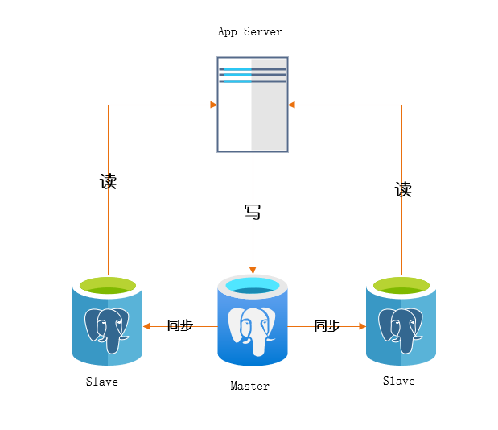

       读写分离作用：用于解决数据库读性能瓶颈
       大多数业务读多写少，数据库读会首先成为数据库性能瓶颈，此时如果想提升数据库读性能，
       消除读写锁冲突从而提升数据库写性能，可采用分组架构/读写分离架构

#### 读写分离问题

1. 数据库连接池需要进行区分，哪些是读连接池，哪些是写连接池，增大研发难度
2. 为保证高可用性，读连接池要能够实现故障自动转移
3. 主从的一致性问题(网络不确定性等)

#### 为什么不用缓存

在缓存和读写分离之间选择时，应首先考虑缓存，因为
1. 缓存成本低
2. 缓存开发容易，大部分读操作可以先去缓存查找，找不到再去数据库查找
    1. 缓存缺点：缓存挂了，所有流量同时聚集到数据库容易导致宕机(缓存击穿/雪崩)

读写分离可作为运用了缓存之后，数据库读依然是瓶颈的一种解决方案

### 数据库水平切分

    常见数据库性能瓶颈：数据容量瓶颈
    如订单表，数据量只增不减，历史数据需要保留，非常容易成为性能瓶颈
    此时缓存和读写分离架构都不适合。

数据库水平切分是一种通过算法将数据库进行分割的架构。

一个水平切分集群中的每个数据库称为一个分片，每个分片中数据没有重合，分片数据并集组成全部数据

    水平切分作用：业务数据量大，当单库的容量成为性能瓶颈，
    我们希望提高数据库写性能时，降低单库容量，可采用水平切分

