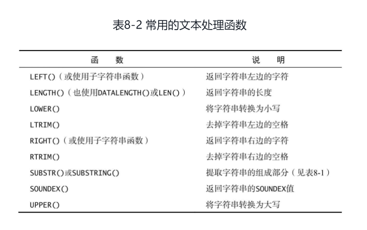

## 基本概念

### schema(模式)，instance(实例)，user(用户)区别

#### schema

数据库对象的集合，数据库对象指的是表，索引，视图，存储过程等。

#### 实例

(schema之上的)数据库实例，由create database创建。

#### 关系

*在MySQL中：*

* 服务器实例==未识别目录，只是一组数据库(database)-> 数据库：保存有组织的数据的容器（通常是一个文件或一组文件）
  
* database == schema == catalog == 服务器中的命名空间。
  
* user == named account，谁可以连接到服务器，并在一个或多个数据库中使用(但不能拥有 – 没有所有权概念)对象。
  
* 要识别运行服务器中的任何对象，您需要(数据库名称对象名称)
  在MySQL中创建一个Schema和创建一个Database的效果是一样的

*在Oracle：*

* server instance == database == catalog == 所有数据由同一个执行引擎管理
  
* schema == 数据库中的命名空间，与用户帐户相同
  
* user == schema owner == 命名的帐户，与模式相同，谁可以连接到数据库，谁拥有模式和可能在其他模式中使用对象
  
* 要识别运行服务器中的任何对象，您需要(模式名称对象名称)
  
  在Oracle数据库中不能新建一个schema，要想创建一个schema，只能通过创建一个用户的方法解决， 在创建一个用户的同时为这个用户创建一个与用户名同名的schema并作为该用户的缺省schema。
  
  即schema的个数同user的个数相同，而且schema名字同user名字一一 对应并且相同

### Mysql大小写敏感问题

#### Linux

1. 数据库名与表名是严格区分大小写的
   
2. 表的别名是严格区分大小写的
   
3. 列名与列的别名在所有的情况下均是忽略大小写的
   
4. 变量名也是严格区分大小写的

#### Windows

大小写不敏感

## 常用功能

### Mysql版本

```mysql
mysql -V;
status;
select version();
```

### Mysql服务

* 启动服务 

  服务状态查看(可先通过services.msc查看版本号(服务名)，powershell管理者查看)

  ```mysql
  net start
  mysql80(版本号);
  mysqld --console;
  ```

* 停止服务

  ```mysql
  net stop
  mysql80;
  ```

## 程序

### 基本功能

#### 建表
  
```mysql
-- 连接
-- mysql -h主机地址 -u用户名 -p用户密码
-- git bash连接数据库
-- winpty mysql -h主机地址 -u用户名 -p用户密码
-- 查看所有数据库
show databases;
-- 选择指定数据库
use XXXX;
-- 查看当前选择的数据库1:show tables的第一行
show tables;
-- 查看当前选择的数据库2:select database()
select database();
-- 查看当前选择的数据库3:status中查看
status;
-- 查看表结构
desc XXXX;
describe XXXX;
-- 查看表字段全部信息
SHOW FULL COLUMNS FROM orders;

-- 建库、建表、赋权限
-- 建库
create databse XXXX;
-- 删库
drop database XXXX;
-- 建表
create table XXXX(字段列表);
-- 删表
drop table XXXX；
-- 修改表名
alter table table1 rename [to/as] table2;
-- 修改表名：迁移表
rename table users.student to mybatis2.student;

-- 增加主键
alter table table_name add primary key(column_name);
-- 删除主键
--  1. 如有自增，先删除自增
alter table table_name change id id int;
--  2. 删除主键
alter table table_name drop primary key;
-- 增加自增
alter table table_name modify id int auto_increment;
-- 增加字段为主键并自增
alter table table_name add column column_name column_type primary key auto_increment;

-- 删除字段
alter table table_name drop column column_name;
-- 增加字段
alter table table_name add column column_name column_type;
alter table table_name add column(column_name column_type, column2 column2Type);
```

#### 自增

```mysql
-- 建表并设置字段为自增(默认自增初始值为1)
create table table_name(column_name column_type not null auto_increment, primary key key_id);
-- 建表并设置字段自增初始值(初始值为指定值，此处为10)
create table table_name(column_name column_type not null auto_increment, primary key (key_id)) auto_increment=10;

-- -------自增字段初始值及自增步长 START-------------
-- 当表有数据时，设置自增初始值无效，即以下无效
alter table table_name auto_increment = x;
-- truncate table table_name或者delete from table_name后，可修改自增字段初始值(以下生效)
alter table table_name auto_increment = x;

-- delete删除表数据后，auto_increment自增字段初始值为删除前初始值
delete from table_name;
insert into table_name values();
-- truncate删除表数据后，
-- auto_increment自增字段初始值为默认值(如session或者global设置有值，则为该值。否则默认为1)
truncate table_name;
insert into table_name values();

-- session内：显示自增步长
-- *****注意：auto_increment_offset大于auto_increment_increment时，初始插入值不确定(非想定值)*****
show session variables like 'auto_inc%';
-- session内：设置自增初始值
set session auto_increment_offset = x;
-- session内：设置自增步长
set session auto_increment_increment = x;

-- 全局：显示自增步长
show global variables like 'auto_inc%';
-- 全局：设置自增初始值
set global auto_increment_offset = x;
-- 全局：设置自增步长
set global auto_increment_increment = x;
-- -------自增字段初始值及自增步长 END-------------

-- 增加主键
alter table table_name add primary key(column_name);
-- 删除主键
alter table table_name drop primary key;
-- 增加字段为主键并自增
alter table table_name add column column_name column_type primary key auto_increment;

-- 删除字段
alter table table_name drop column column_name;
-- 增加字段
alter table table_name add column(column_name column_type);
```

#### 行号

```mysql
-- ①显示行号1
SELECT
  @rownum := @rownum + 1 AS rownum,
  pr.vend_id,
  pr.prod_price 
FROM
  products pr,
  -- 设置初始值
  ( SELECT @rownum := 2 ) t
;
-- ②显示行号2
-- 设置初始值
SET @mycnt := 0;
SELECT
  @mycnt := @mycnt + 1 AS rownum2,
  s.* 
FROM
  (
  SELECT DISTINCT
      pr.vend_id,
      pr.prod_price 
  FROM
    products pr) s
;
```

#### 统计分析

```mysql
-- 统计表数据(以下统计方法针对InnoDB引擎会产生极大误差，MyISAM引擎可正确统计)
select table_rows, table_name from information_schema.tables where table_schema = 'tmp' and table_name <> 'aa';
-- 统计表数据加上sum
select sum(table_rows) sum,table_schema from information_schema.tables where table_schema in ('test','teach') and table_name not in ('aa') 
group by table_schema;

-- 统计表数据(更改数据更新时机)
-- 设置session(会话)内information_schema_stats_expiry为0(表示自动更新)
show variables like '%information_schema_stats%';
SET SESSION information_schema_stats_expiry=0;
SET @@SESSION.information_schema_stats_expiry=0;
show variables like '%information_schema_stats%';
```

#### 数据库状态

```mysql
-- 查看当前连接详细情况
SHOW FULL PROCESSLIST;
-- 查看状态
SHOW STATUS LIKE '%Aborted_clients%';
-- Aborted_clients 由于客户没有正确关闭连接已经死掉，已经放弃的连接数量。 
-- Aborted_connects 尝试已经失败的MySQL服务器的连接的次数。 
-- Connections 试图连接MySQL服务器的次数。 
-- Created_tmp_tables 当执行语句时，已经被创造了的隐含临时表的数量。 
-- Delayed_insert_threads 正在使用的延迟插入处理器线程的数量。 
-- Delayed_writes 用INSERT DELAYED写入的行数。 
-- Delayed_errors 用INSERT DELAYED写入的发生某些错误(可能重复键值)的行数。 
-- Flush_commands 执行FLUSH命令的次数。 
-- Handler_delete 请求从一张表中删除行的次数。 
-- Handler_read_first 请求读入表中第一行的次数。 
-- Handler_read_key 请求数字基于键读行。 
-- Handler_read_next 请求读入基于一个键的一行的次数。 
-- Handler_read_rnd 请求读入基于一个固定位置的一行的次数。 
-- Handler_update 请求更新表中一行的次数。 
-- Handler_write 请求向表中插入一行的次数。 
-- Key_blocks_used 用于关键字缓存的块的数量。 
-- Key_read_requests 请求从缓存读入一个键值的次数。 
-- Key_reads 从磁盘物理读入一个键值的次数。 
-- Key_write_requests 请求将一个关键字块写入缓存次数。 
-- Key_writes 将一个键值块物理写入磁盘的次数。 
-- Max_used_connections 同时使用的连接的最大数目。 
-- Not_flushed_key_blocks 在键缓存中已经改变但是还没被清空到磁盘上的键块。 
-- Not_flushed_delayed_rows 在INSERT DELAY队列中等待写入的行的数量。 
-- Open_tables 打开表的数量。 
-- Open_files 打开文件的数量。 
-- Open_streams 打开流的数量(主要用于日志记载） 
-- Opened_tables 已经打开的表的数量。 
-- Questions 发往服务器的查询的数量。 
-- Slow_queries 要花超过long_query_time时间的查询数量。 
-- Threads_connected 当前打开的连接的数量。 
-- Threads_running 不在睡眠的线程数量。 
-- Uptime 服务器工作了多少秒。
```

#### case~when

```mysql
-- 简单case函数：表达式为true或者false
-- case expression when ...
SELECT CASE a IS NULL
      WHEN true THEN b
      ELSE a
  END AS new, a, b
FROM (
  SELECT NULL AS a, 1 AS b
) tmp;

-- 简单case函数2：
-- 根据a=when后面语句为true/false判断输出结果
SELECT CASE a
      WHEN a is null THEN b
      ELSE a
  END AS new, a, b
FROM (
  SELECT NULL AS a, 1 AS b
) tmp;

-- case搜索函数
-- case when expression...
SELECT CASE 
      WHEN a IS NULL THEN b
      ELSE a
  END AS new, a, b
FROM (
  SELECT NULL AS a, 1 AS b
) tmp;

-- 简单case函数
-- 方法1
SELECT CASE state
    WHEN 'China' THEN 'Aisa'
    WHEN 'Japan' THEN 'Aisa'
    WHEN 'England' THEN 'Eourpe'
    WHEN 'France' THEN 'Eourpe'
    WHEN 'American' THEN 'NAmerican'
    WHEN 'Canada' THEN 'NAmerican'
    ELSE ''
  END AS Land, sum(population) AS Population
FROM country
GROUP BY CASE state
    WHEN 'China' THEN 'Aisa'
    WHEN 'Japan' THEN 'Aisa'
    WHEN 'England' THEN 'Eourpe'
    WHEN 'France' THEN 'Eourpe'
    WHEN 'American' THEN 'NAmerican'
    WHEN 'Canada' THEN 'NAmerican'
    ELSE ''
  END
;

-- 方法2
SELECT Land, sum(population) AS Population
FROM (
  SELECT CASE state
      WHEN 'China' THEN 'Aisa'
      WHEN 'Japan' THEN 'Aisa'
      WHEN 'England' THEN 'Eourpe'
      WHEN 'France' THEN 'Eourpe'
      WHEN 'American' THEN 'NAmerican'
      WHEN 'Canada' THEN 'NAmerican'
      ELSE ''
    END AS Land, population
  FROM country
) derived
GROUP BY Land
;

-- case搜索函数
-- 方法3
SELECT Land, sum(population) AS Population
FROM (
  SELECT CASE 
      WHEN state = 'China' THEN 'Aisa'
      WHEN state = 'Japan' THEN 'Aisa'
      WHEN state = 'England' THEN 'Eourpe'
      WHEN state = 'France' THEN 'Eourpe'
      WHEN state = 'American' THEN 'NAmerican'
      WHEN state = 'Canada' THEN 'NAmerican'
      ELSE state = ''
    END AS Land, population
  FROM country
) derived
GROUP BY Land
;
```

#### tmp

```mysql

```

#### tmp2

```mysql

```

### 函数

#### ifnull

```mysql
-- 如果a值为null 则取b值，否则取a值
-- ifnull函数
SELECT IFNULL(a, b) AS new, a, b
FROM (
  SELECT NULL AS a, 1 AS b
) tmp;
```

#### 文本处理函数



### 关键字

#### having

过滤分组

#### where

过滤指定的行而不是分组（where没有分组概念）