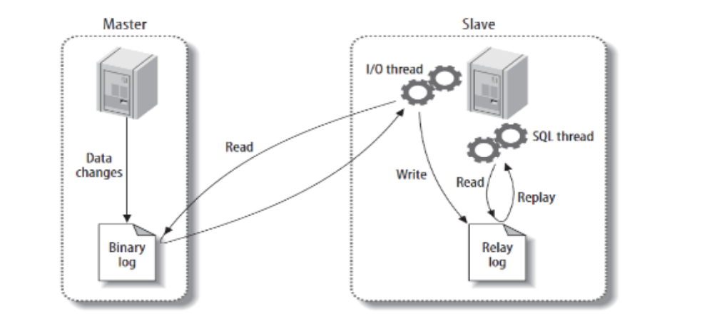
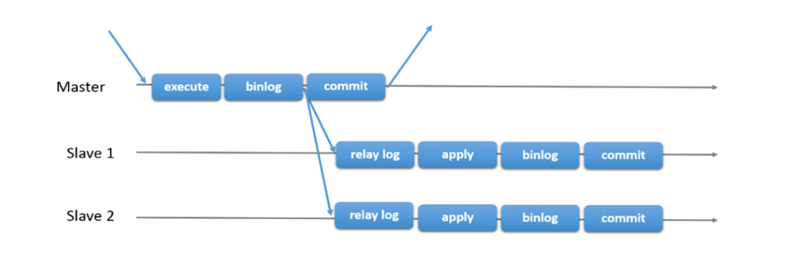
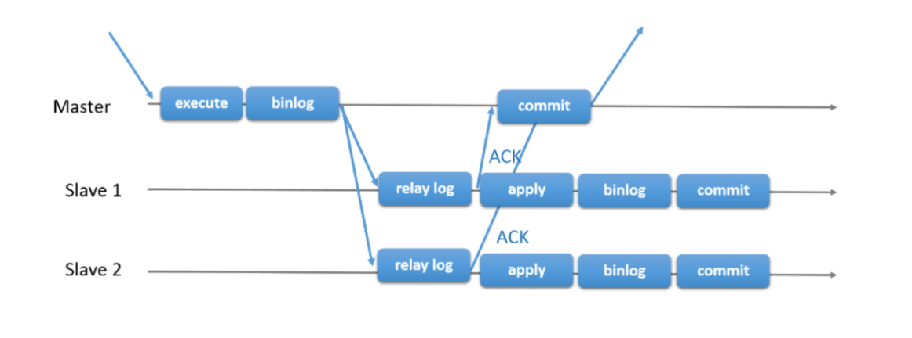
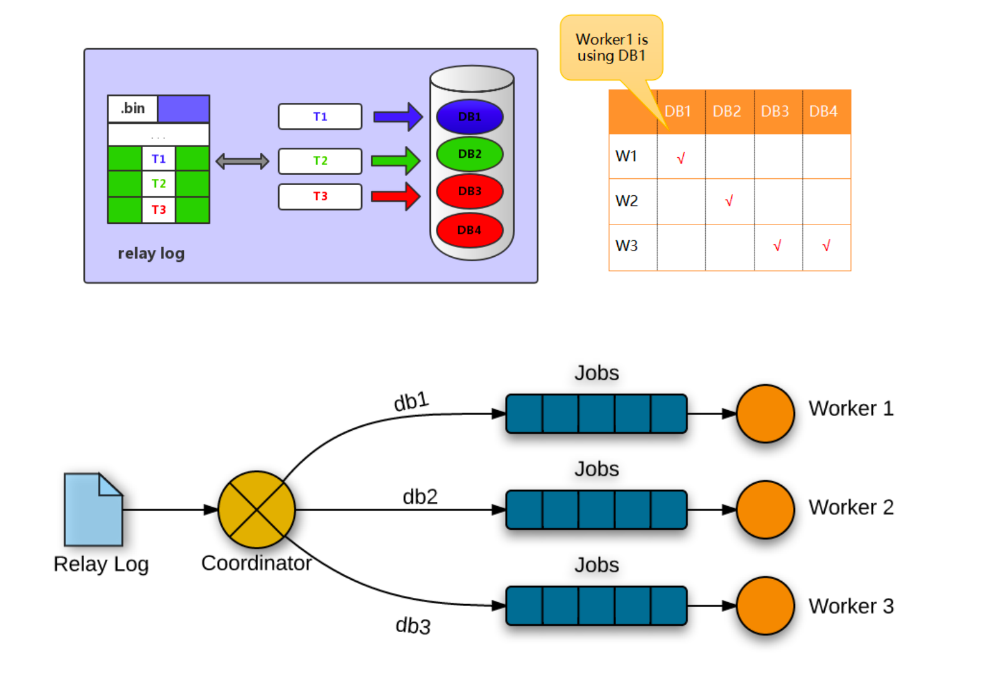
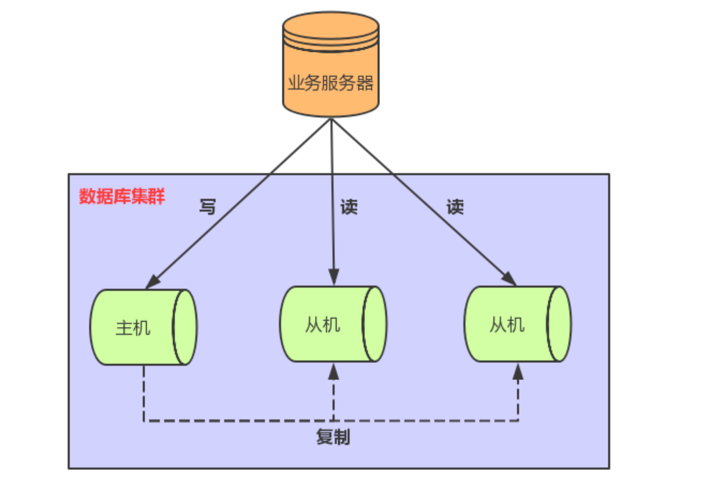
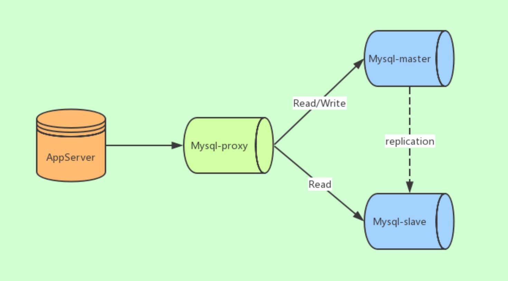
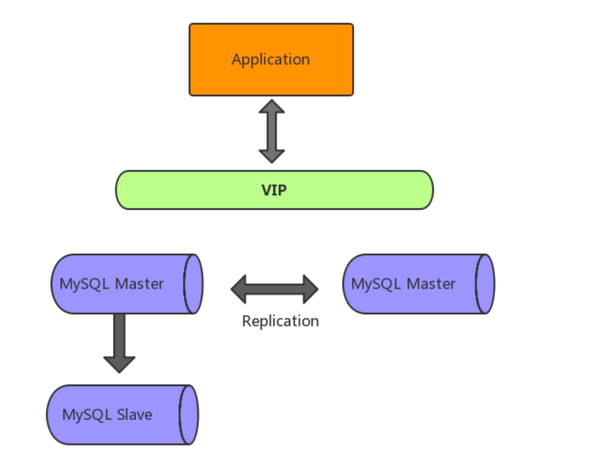
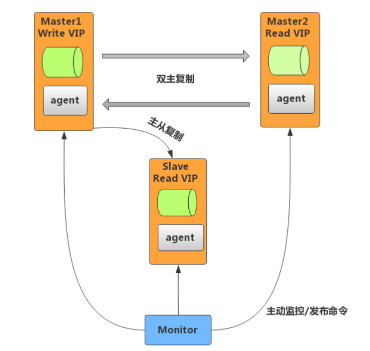
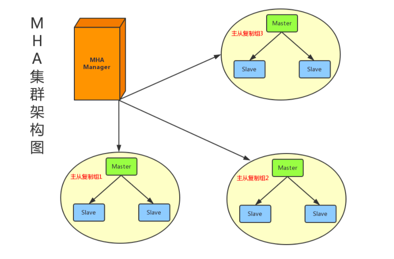

## MySQL集群

### 主从模式

主从模式指的是数据可以从一个服务器节点复制到另外一个或多个节点

MySQL默认采用异步复制方式，从节点可以不用一直访问主服务器来更新自己的数据

#### 主从部署条件

1. 从库可以连通主库

2. 主库开启binlog日志：设置log-bin参数

3. 主从server-id不同

#### 实现原理

1. 主从复制/异步复制

   1. 过程

      1. 主库的数据变更操作记录到binlog文件
       
      2. 从库读取主库binlog日志文件并写入到从库的relay log中继日志中
       
      3. 从库读取中继日志信息在从库进行replay，更新从库数据库信息
      
         
   
      主从复制线程
   
         1. master：binlogDump Thread
      
            master服务器对数据的更改操作记录在binlog中，binlogDump Thread接收到写入请求后，读取binlog信息推送给slave的I/O Thread
            
         2. slave：I/O Thread
      
            slave的I/O Thread将读取到的binlog信息写入到本地的relay log中
            
         3. slave：SQL Thread
      
            slave的SQL Thread检测到relay log的变更请求，解析relay log中的内容从并在从库上执行
      
      上述过程都是异步操作，俗称异步复制，存在数据延迟现象
   
      
   
   2. 主从复制问题
   
      1. 主数据库宕机后，数据可能丢失
   
      2. 从库只有一个SQL Thread，主库写压力大，复制可能延时
   
   3. 解决办法
   
      1. 半同步复制：解决数据丢失
   
      2. 并行复制：解决从库复制延迟
   
2. 半同步复制

   传统主从复制过程中master接收到slave节点的ack消息后才进行事务的提交，称为半同步复制

   事务提交过程：

      1. InnoDB Redo File Write(Prepare Write)
   
      2. Binlog File Flush & Sync to Binlog File
   
      3. InnoDB Redo File Commit(Commit Write)
   
      4. Send Binlog to Slave
   
         

3. 并行复制

   1. 5.6并行复制
   
      基于库的并行复制，多库时复制效率有提升，单库多表时无优势
   
      
      
   2. 5.7并行复制
   
      基于组提交的并行复制，即slave的回放replay和master是一致的，master上怎么并行执行的slave上就怎样并行回放  

#### 主从模式下的读写分离

主库用于写操作，多个从库用于读操作。主从库之间通过主从复制机制进行数据同步

1. 实际应用中的读写分离优化

   1. 从库中追加多个索引，主库索引可以不加，提升写的效率

2. 读写分离问题

   1. 主从同步延迟
   
      1. 写后立刻读：写入数据库后某个时间段内访问主库，之后访问从库
   
      2. 二次查询：先从库检索，未找到则去主库检索。压力给主库
      
      3. 业务特殊处理：实时性要求高则读写都在主库，次要业务则读写分离
   
   2. 读写(路由)分配机制
   
      1. 编程和配置实现
   
         1. 根据操作类型进行路由分配，增删改在主库，查在从库
   
         2. 优缺点：无需额外硬件支持，数据库宕机需要配置重启项目
   
      2. 服务器端代理实现
   
         1.  代理服务器接收到请求后，先进行判断然后转发到master和slave数据库
   
            

#### 主从模式缺点

1. 单点故障，从库切换为主库需要做改动

### 双主/多主模式

两台服务器互为主从，任何一台数据变更，都会通过复制应用到另外一台数据库中

#### 双主双写、双主单写

建议：双主单写

1. 双主双写问题

   1. ID冲突
   
      A、B库并发写入，如自动递增ID主键冲突：自增步长(1、3、5)可解决，扩展不友好
   
   2. 更新丢失
   
      并发更新发生覆盖，导致数据丢失
   
2. 高可用架构

   一个master提供线上服务，下游挂载slave实现读写分离；另一个master作为故障切换节点，
   
   

   1. 高可用组件MMM：支持双主模式
      
      
      
   2. 高可用组件MHA：支持一主多从模式
   
      