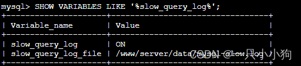
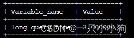
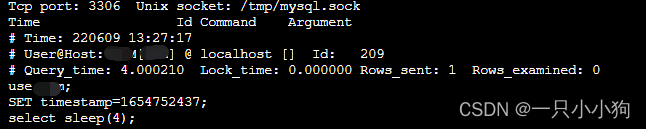
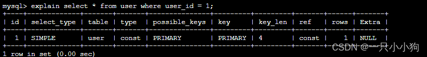
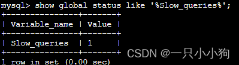

## MySQL优化

原因

1. SQL语句欠佳(连接查询)

2. 索引失效

3. 服务器参数设置不合理


### 定位低效SQL

* 慢查询日志

    * SHOW VARIABLES LIKE 'slow_query%';
        * slow_query_log：开启状态
        * slow_query_log_file：日志文件
    * LIKE 'long_query_time';
        * 超过多长时间才记录

* show processlist：查看当前运行线程

    * 线程状态，表锁等
    * 定位到sql后，用以下语句优化
        * show profile：SQL语句性能消耗(状态，持续时间等)
        * explain：获取select执行计划，表读取顺序，索引，表间引用等
        * trace：sql语句执行过程(优化器选择哪个计划)

### 优化SQL

* join优化

    * 小表驱动大表
    
    * 被驱动表关联字段增加索引
    
    * 关联字段字符集和校对规则一致

* 使用索引

* count

    * 不要求完全精确结果的场景，可使用explain估算近似值(并不真正执行查询)
    * count全表行扫描，可用MySQL层面的覆盖扫描优化
    * 修改应用架构：增加汇总表(影子表(重命名替换))或者外部缓存系统

* 优化关联查询

    * Group By，Order By只涉及一个列，优化器可使用索引优化

    * 分拆关联查询

        ```sql
        SELECT * FROM tag
        JOIN tag_post ON tag_id = tag.id
        JOIN post ON tag_post.post_id = post.id
        WHERE tag.tag = 'mysql';
        -- 分解为：
        SELECT * FROM tag WHERE tag = 'mysql';
        SELECT * FROM tag_post WHERE tag_id = 1234;
        SELECT * FROM post WHERE post.id in (123,456,567);
        ```

* 优化Order By

    * 不关心结果集顺序，即当不显示指定排序的列(Order By)时，Order By Null禁止排序

* 优化Limit分页

    * select * from table limit (start-1)*pageSize,pageSize
        * start：页码
        * pageSize：每页显示条数
    * 偏移量大的时候：需查询多条数据再舍弃，代价高
    * 优化
        * 限制分页数量
        * 子查询分页
            ```mysql
            -- 原始查询
            select * from articles where category_id = 123 order by id limit 10000,10
            -- 子查询分页
            select * from articles where category_id >=
             (select id from articles where category_id = 123 order by id limit 10000, 1) limit 10;
            -- join分页
            select * from content as t1
            join (select id from content order by id desc limit ".($page-1)*$pagesize.",1) as t2
            where t1.id <= t2.id order by t1.id desc limit $pagesize;
            ```
        * 最简单：使用覆盖索引扫描，而非查询所有列，再根据需要进行相应关联操作
        * 从上一次读取数据位置开始扫描，避免使用offset

            ```sql
            SELECT <cols> FROM profiles where sex='M' order by rating limit 100000, 10;
            SELECT <cols>
            FROM profiles
                inner join
                (SELECT id form FROM profiles where x.sex='M' order by rating limit 100000, 10)
                as x using(id);
            -- 先从覆盖索引中获取 100010 个 id，再丢充掉前 100000 条 id，保留最后 10 个 id 即可
            ```

* 优化union查询

    * union查询原理：创建并填充临时表，默认临时表distinct，唯一性检查消耗高
    * 优化：当不需要消除重复行时，使用union all

* 使用自定义变量

  连接的MySQL整个过程中存在的存储内容的临时容器，可避免重复查询

* 优化insert

    * 一次性插入多个值的inert语句，避免使用多次insert

      insert into userInfo(name,password) values('ddf','8979'),('fsd','343'),('sf','45');

    * 插入语句
        * INSERT...VALUES语句

              INSERT INTO <表名>
              -- 列名可不写，不写时表结构变化会影响相应数据
              [<列名1>[,<列名2>,...<列名n>]]
              VLAUES（值1）[....（值n）]；
        * INSERT...SET语句

              INSERT INTO<表名>
              -- 未指定列，默认值
              SET <列名1> = <值1>，
              <列名2> = <值2>，
              ...

### 优化SQL实例

1. 查看是否开启慢查询

    ```sql
    SHOW VARIABLES LIKE '%slow_query_log%';
    ```
   

2. 未开启的话开启慢查询

    ```sql
    mysql> set global slow_query_log=1;
    mysql> SHOW VARIABLES LIKE 'long_query_time%';
    --- 修改为3秒
    mysql> set global long_query_time=3;
    ```
   

3. 测试慢查询

    ```sql
    select sleep(4);
    ```

4. 查看慢查询日志

   

5. explain获取执行计划，找到对应的连接类型

   

   连接类型是主键id，是最快的const类型，并且只有一行rows需要检索

6. 查看慢查询出现次数

    ```sql
    mysql> show global status like '%Slow_queries%';
    ```
   

