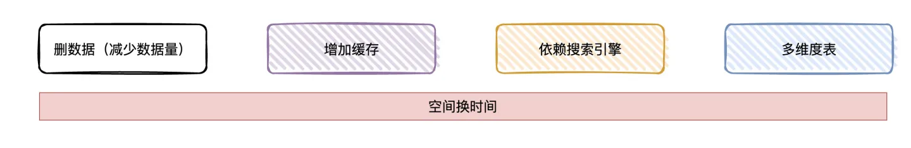
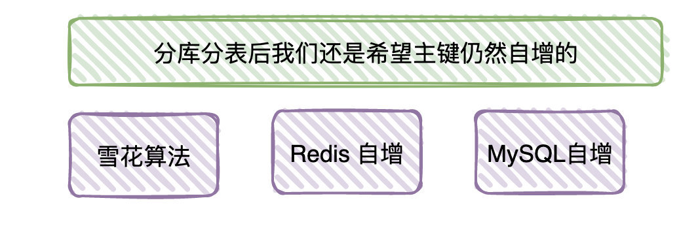
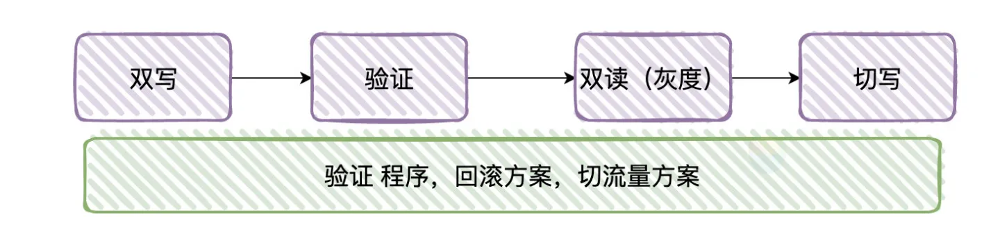

## MySQL优化

调优重点

1. 开发规范：SQL语句欠佳(连接查询)

2. 数据库索引->索引失效

3. 服务器参数设置不合理 -> 专业DBA做

### 开发规范和索引


1. 理论上表有一定的数据量，就应该创建对应的索引

2. 尽量使用覆盖索引减少回表消耗的时间，也就是说select指明列而非select *

3. 考虑组建联合索引避免字段重复，将区分度最高的放在最左边，并且考虑最左匹配原则

4. 对索引使用函数或者计算表达式会导致索引失效

5. 子查询优化超多分页场景

    1. 原查询:limit offset, n
    
    2. 子查询:查询出offset的id，再根据id查询n条记录
    
6. explain查看sql执行计划，sql是否走了索引，走了什么索引；show profile查看资源消耗

7. 开启事务后，在事务内尽可能只操作数据库，尽量减少锁的持有时间

    1. 比如事务内需要插入和修改数据，先插入后修改
    
    2. 因为修改是更新操作，会加行锁
    
    3. 如果先更新，并发下可能导致多个事务的请求等待行锁释放(并发更新)

### 定位低效SQL

#### 慢查询

* 慢查询日志

    * SHOW VARIABLES LIKE 'slow_query%';
        * slow_query_log：开启状态
        * slow_query_log_file：日志文件
    * LIKE 'long_query_time';
        * 超过多长时间才记录

* show (full) processlist：sql命令查看当前运行线程，默认100条

    * 线程状态，表锁等
    * 定位到sql后，用以下语句优化
        * show profile：SQL语句性能消耗(状态，持续时间等)
        * explain：获取select执行计划，表读取顺序，索引，表间引用等
        * trace：sql语句执行过程(优化器选择哪个计划)

#### 索引后查询依然慢

即使使用了索引，查询依然很慢，一般来说表的数据量太大

对策：空间换时间思路，相同数据其他地方也存储一份以提高效率



1. 删除旧数据
   
    1. 旧数据没有查询业务，直接删除 
       
    2. 将旧数据离线存储到数据中心

2. 查询之前，走一层缓存(Redis)

    1. 业务能否容忍非真正实时数据(Redis和MySQL数据一致性需要保证)
    
    2. 查询条件相对复杂且多变(涉及group by和sum等)，缓存维护不方便

3. 如果字符串检索的场景导致查询慢，把数据导入Elasticsearch等搜索引擎，后续线上查询直接走ES

    1. MySQL和ES间需要有对应的同步程序，一般通过监听binlog，解析binlog后导入到ES

4. 可根据查询条件做相对应的聚合表，线上请求直接查询聚合表而非原表

    1. 比如用户下单后有一份订单明细，订单明细表量级太大；用户的查询功能是以天为单位展示
    
    2. 将每个用户的每天数据聚合起来，聚合表就是一个用户一天只有一条数据的汇总

#### 写性能瓶颈

1. 考虑架构

    1. 单库升级至主从架构，实现读写分离
    
        1. 主库：接收写请求
           
        2. 从库：接收读请求
    
        3. 主从通过binlog同步
    
2. 主从下依然慢

    1. 分库分表：原来某个库的某个表进行拆分
    
        
    
        1. 业务区分：流量数据库、广告数据库、商品数据库
            
            1. 业务订单表一亿数据，分8个库，每个库1200万，每个库分8张表，每张表150万数据
    
        2. 分库键：使用经验来说，一般来说按照userId(因为按照用户的维度查询比较多)
    
        3. 分库分表后的ID生成：看公司技术栈
    
            
    
            1. MySQL自增
               
            2. Redis自增
               
            3. 雪花算法
        
    2. 分库分表迁移过程
    
        1. 双写方式迁移
    
            
    
            1. 增量的消息各自往新表和旧表写一份
    
            2. 旧表数据迁移至新库
           
            3. 迟早新表的数据会追上旧表(某个节点上数据是同步的)
               
            4. 校验新表和旧表的数据是否正常(主要看能不能对得上)
               
            5. 开启双读(一部分流量走新表，一部分流量走老表)
               
            6. 读流量全部切新表，停止老表的写入
               
            7. 提前准备回滚机制，临时切换失败能恢复正常业务以及有修数据的相关程序

#### SQL语句优化

* join优化

    * 小表驱动大表
    
    * 被驱动表关联字段增加索引
    
    * 关联字段字符集和校对规则一致

* count

    * 不要求完全精确结果的场景，可使用explain估算近似值(并不真正执行查询)
    * count全表行扫描，可用MySQL层面的覆盖扫描优化
    * 修改应用架构：增加汇总表(影子表(重命名替换))或者外部缓存系统

* 优化关联查询

    * Group By，Order By只涉及一个列，优化器可使用索引优化

    * 分拆关联查询

        ```sql
        SELECT * FROM tag
        JOIN tag_post ON tag_id = tag.id
        JOIN post ON tag_post.post_id = post.id
        WHERE tag.tag = 'mysql';
        -- 分解为：
        SELECT * FROM tag WHERE tag = 'mysql';
        SELECT * FROM tag_post WHERE tag_id = 1234;
        SELECT * FROM post WHERE post.id in (123,456,567);
        ```

* 优化Order By

    * 不关心结果集顺序，即当不显示指定排序的列(Order By)时，Order By Null禁止排序

* 优化Limit分页

    * select * from table limit (start-1)*pageSize,pageSize
        * start：页码
        * pageSize：每页显示条数
    * 偏移量大的时候：需查询多条数据再舍弃，代价高
    * 优化
        * 限制分页数量
        * 子查询分页
            ```mysql
            -- 原始查询
            select * from articles where category_id = 123 order by id limit 10000,10
            -- 子查询分页
            select * from articles where category_id >=
             (select id from articles where category_id = 123 order by id limit 10000, 1) limit 10;
            -- join分页
            select * from content as t1
            join (select id from content order by id desc limit ".($page-1)*$pagesize.",1) as t2
            where t1.id <= t2.id order by t1.id desc limit $pagesize;
            ```
        * 最简单：使用覆盖索引扫描，而非查询所有列，再根据需要进行相应关联操作
        * 从上一次读取数据位置开始扫描，避免使用offset

            ```sql
            SELECT <cols> FROM profiles where sex='M' order by rating limit 100000, 10;
            SELECT <cols>
            FROM profiles
                inner join
                (SELECT id form FROM profiles where x.sex='M' order by rating limit 100000, 10)
                as x using(id);
            -- 先从覆盖索引中获取 100010 个 id，再丢充掉前 100000 条 id，保留最后 10 个 id 即可
            ```

* 优化union查询

    * union查询原理：创建并填充临时表，默认临时表distinct，唯一性检查消耗高
    * 优化：当不需要消除重复行时，使用union all

* 使用自定义变量

  连接的MySQL整个过程中存在的存储内容的临时容器，可避免重复查询

* 优化insert

    * 一次性插入多个值的inert语句，避免使用多次insert

      insert into userInfo(name,password) values('ddf','8979'),('fsd','343'),('sf','45');

    * 插入语句
        * INSERT...VALUES语句

              INSERT INTO <表名>
              -- 列名可不写，不写时表结构变化会影响相应数据
              [<列名1>[,<列名2>,...<列名n>]]
              VLAUES（值1）[....（值n）]；
        * INSERT...SET语句

              INSERT INTO<表名>
              -- 未指定列，默认值
              SET <列名1> = <值1>，
              <列名2> = <值2>，
              ...

### 优化SQL实例

1. 查看是否开启慢查询

    ```sql
    SHOW VARIABLES LIKE '%slow_query_log%';
    ```
   

2. 未开启的话开启慢查询

    ```sql
    mysql> set global slow_query_log=1;
    mysql> SHOW VARIABLES LIKE 'long_query_time%';
    --- 修改为3秒
    mysql> set global long_query_time=3;
    ```
   

3. 测试慢查询

    ```sql
    -- 让sql语句运行N秒钟
    select sleep(4);
    -- 用于执行迅速不易被判断是否执行的语句
    select sleep(1),name from animals where name='tiger
    ```

4. 查看慢查询日志

   

5. explain获取执行计划，找到对应的连接类型

   

   连接类型是主键id，是最快的const类型，并且只有一行rows需要检索

6. 查看慢查询出现次数

    ```sql
    mysql> show global status like '%Slow_queries%';
    ```
   

