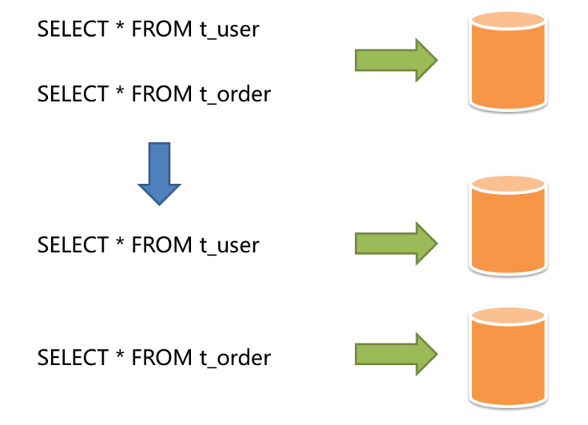
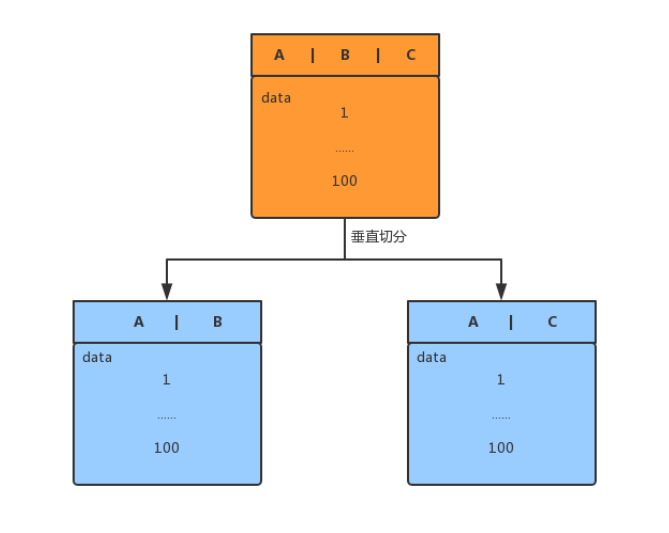
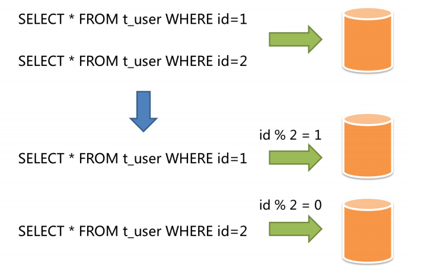

## 分库分表

### 垂直拆分：解决表过多或表字段过多

表数量多导致的单个库大，将表拆分到多个库中或者将某些列拆分出去

分类(垂直拆分一般指垂直分库)：

* 垂直分库

* 垂直分表

#### 垂直分库

#### 垂直分表

将不常用字段拆分到另一张表，保证第一张表字段较少，避免数据库跨页存储问题，提升效率

使用场景：表中字段过长、字段不常用、text类型字段

#### 垂直拆分优缺点

1. 优点

   * 拆分后业务清晰，拆分规则明确
    
   * 易于数据的维护和扩展
    
   * 可以使行数据变小，一个数据块（block）就可以存放更多的数据，在查询时就可以减少I/O次数
    
   * 便于实现冷热分离的数据库表设计
    
2. 缺点

    * 主键冗余
    
    *会引起表连接JOIN操作，可以通过在业务服务器上进行join来减少数据库压力，但是增大了系统的复杂度
   
    * 依然存在标数量过大的问题

    * 事务处理复杂

### 水平拆分：解决表中数据量过大

表记录多导致的单个库大，通过某(几)个字段，根据某种规则将数据拆分到多个库或表中，每个表仅包含一部分数据

分表数量：2的幂次方，方便以后扩容

#### 水平拆分优缺点

1. 优点

* 拆分规则设计好，join操作基本可以数据库做
  
* 不存在单表大数据，高并发的性能瓶颈

* 切分的表结构相同，应用层改造较少，只需要增加路由规则就好

* 提高了系统稳定性和负载能力

2. 水平拆分缺点

* 拆分规则难以抽象

* 跨库join性能较差
  
* 分片事务一致性问题难以解决
  
* 数据扩容难度和维护量级极大

### 分库分表总结

* 分库：是为了解决数据库连接资源不足问题，和磁盘IO的性能瓶颈问题

    适用场景：用户并发量很大，但是需要保存的数据量很少
  
* 分表：是为了解决单表数据量太大，sql语句查询数据时，即使走了索引也非常耗时问题，此外还可以解决cpu资源问题

    适用场景：用户并发量不大，但是需要保存的数据量很多
  
* 分库分表：可以解决 数据库连接资源不足、磁盘IO的性能瓶颈、检索数据耗时 和 消耗cpu资源等问题。

    适用场景：用户并发量大，并且需要保存的数量也很多时