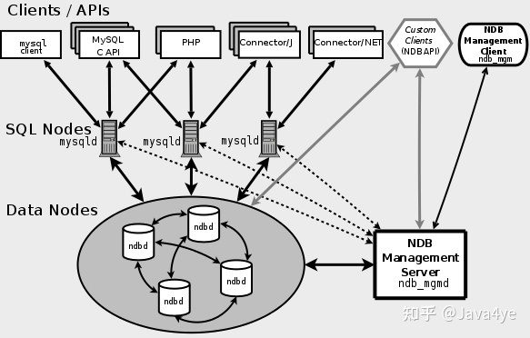

## MySQL版本

### 发行版本

1. MySQL Community Server
   
    社区版本，免费

    * Generally Available(GA)：软件通用版本，一般指正式版
    
    * Essentials：精简版
    
    * Noinstall：非安装
   
2. MySQL Enterprise Edition
   
    企业版，付费
   
3. MySQL Cluster
   
    集群版，可以讲几个MySQL Server封装成一个Server
   
4. MySQL Cluster CGE
   
    高级集群版，收费
   
5. MySQL Workbench

    转为MySQL设计的ER/数据库建模工具
   
    1. MySQL Workbench OSS
        
        社区版
       
    2. MySQL WorkbenchSE
    
        商业版
       
6. MySQLGUITools

    * MySQL Migration Toolkit：数据库迁移
   
    * MySQL Administrator：MySQL管理器
    
    * MySQL Query Browser：用于数据查询的图形化客户端
    
    * MySQL Workbench：DB Design工具

### 各版本区别

#### 5.5

* 默认存储引擎：InnoDB

* 引入UTF-8：utf8mb4

#### 5.6

##### InnoDB增强

* 引入全文索引：基于相似度查询/关键字匹配查询

* 可修改未压缩表InnoDB页大小(4KB、8KB、16KB默认)

* log

    * undo log：可保存在独立的表空间
      
    * redo log：文件可存储最大值4G->512G

##### Partitioning

* 最大分区数量增加到8192

* 支持显示分区选择

    ```mysql
    select * from t partition(p0,p1) where c < 5
    ```

##### MySQL NDB Cluster

MySQL集群，存储引擎NDB



##### Replication and logging

复制和日志记录

* 可以从远程服务器读取binlog

    --read-from-remote-server,-R;
    --raw
  
* 延迟复制
    
##### Optimizer enhancements

优化器增强

* 可用explain查看delete、insert、replace、update等DML操作的执行计划(之前只支持select操作)

* 优化子查询

* 主机缓存

#### 5.7

##### InnoDB

* 增加DATA_GEOMETRY类型支持空间数据类型，之前时blob

* 支持原生Json类型

#### 8.0

* 支持隐藏索引

* 索引支持降序排序

* 正则表达式

