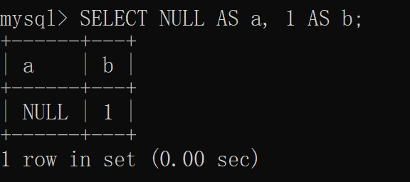

### MySQL中的case when 中对于NULL值判断的坑

sql中的case when 有点类似于Java中的switch语句，比较灵活，但是在Mysql中对于Null的处理有点特殊

Mysql中case when语法：

1. 语法1(case简单函数)

```mysql
CASE case_value
    WHEN when_value THEN statement_list
    [WHEN when_value THEN statement_list] ...
    [ELSE statement_list]
END CASE
```

2. 语法2(case搜索函数)

```mysql
CASE
    WHEN search_condition THEN statement_list
    [WHEN search_condition THEN statement_list] ...
    [ELSE statement_list]
END CASE
```

注意:  这两种语法是有区别的，区别如下：

1. 第一种语法：case_value必须是一个表达式，例如 userid%2=1或者username is null等。该种语法不能用于测试NULL。
2. 第二种语法CASE后面不需要变量或者表达式，直接执行时候评估每一个WHEN后面的条件，如果满足则执行。

案例实战：

表结构如下：a 值为null, b值为1



现在实现，如果a值为null 则取b值，否则取a值

1. ifnull 用法

```mysql
SELECT IFNULL(a, b) AS new,
       a,
       b
FROM
    -- 创建临时表: a 的值为null ,b为1
    (SELECT NULL AS a, 1 AS b) tmp;
```

2. case when 用法

```mysql
SELECT (CASE a
            WHEN a IS NULL THEN b
            ELSE a
    END
           ) AS new,
       a,
       b
FROM (SELECT NULL AS a, 1 AS b) tmp;
```

发现得到的结果不对，new 的值居然为null ,而不是我们想要的1.

为什么会出现这个错误呢？ 是将第一种语法与第二种语法混用导致的，case 后面commission_pct 的值有两种：真实值或者为null，而 when 后面的commission_pct is null
也有两个值：true或者false，所以case 后面为null时候永远无法跟true或false匹配，因此输出不为null。

对于该种情况如果必须要用语法1的话可以如下改写：

```mysql
SELECT (CASE a IS NULL
            WHEN TRUE THEN b
            ELSE a
    END
           ) AS new,
       a,
       b
FROM (SELECT NULL AS a, 1 AS b) tmp;
```

也可以使用语法2写：

```mysql
SELECT (CASE
            WHEN a is NULL THEN b
            ELSE a
    END
           ) AS new,
       a,
       b
FROM (SELECT NULL AS a, 1 AS b) tmp;
```

注意另一种可能存在错误却不容易发现错误的情况：

```mysql
SELECT (CASE a
            WHEN NULL THEN b
            ELSE a
    END
           ) AS new,
       a,
       b
FROM (SELECT NULL AS a, 1 AS b) tmp;
```

看似没有问题，实际有问题，问题原因就是null的判断不能用=进行判断。简单说就是：语法1中的case表达式的值与后面的when的值使用的=进行判等，但是mysql中必须使用is 或者is not。

总结：

1：语法1是将case后面的表达式值计算好之后跟后面的when条件的值使用“=”进行判断相等，相等就进入该分支。

2：语法2是不需要case后面有表达式，直接评估when后面的条件值即可，如果为true则进入。